# Contributing to OSHAL

Thanks for considering a contribution. OSHAL is a multi-agent
orchestration platform — adding a new harness, persona, or bot is an
operator-friendly path; touching the swarm controller / dispatcher /
queue is intentionally higher-friction because that code path is
load-bearing.

## Branching model — the coordination contract (READ FIRST)

This codebase was archived and restarted four times in two years because its
history accumulated things a public tree could never carry. This repo is the
last restart, and the branch discipline is what keeps it that way. **This
section is the coordination contract for every contributor — human or agent;
if the model changes, it changes here first.**

- **Never commit to `main`.** Everything lands branch → PR → merge, no matter
  how small. This is enforced, not aspirational: `main` is a protected branch —
  direct pushes are rejected, every merge requires a pull request with a passing
  `gate` check **and an approving review**, and nothing is ever auto-merged.
- **ONE active development branch per repo at a time.** Before creating a
  branch, check `git fetch origin && git branch -r` and the open-PR list. If a
  development branch is already open, **join it** — pull it and coordinate in
  its PR thread — rather than minting a second. Parallel development branches
  are how work diverges, how merges rot, and how codebases end up archived.
- **Only maintainers merge.** If you are not a maintainer, your PR waits for a
  maintainer's review and approval — opening a pull request grants no merge
  rights, and approvals are never automatic. **Maintainers: land your green PR
  the same day.** A long-lived branch is the sprawl this project already paid
  for. Delete the branch after merge; the next piece of work mints the next
  single branch.
- **The pre-push gate is the wall.** `publish-gate.sh` + a typecheck of
  committed HEAD run on every push, fail-closed. Never bypass it, and never
  "fix" a hit by narrowing a pattern to the file that tripped it — gate on the
  identifier, not on where it appeared.
- **The private full-history repo is reference material, not the public
  development trunk.** Internal-only material remains there; public changes land
  through this repository's pull-request path.

```mermaid
flowchart LR
    Sync["Fetch origin and update main"] --> Inspect["Inspect open PRs and overlapping files"]
    Inspect --> Branch["Create focused branch"]
    Branch --> Edit["Implement and test"]
    Edit --> Commit["Commit small, coherent changes"]
    Commit --> Local["Run relevant local gates"]
    Local --> Push["Push branch"]
    Push --> Hook["Pre-push publish gate; HEAD typecheck when source changed"]
    Hook -->|fail| Edit
    Hook -->|pass| PR["Open pull request"]
    PR --> Server["Server-side publish gate and review"]
    Server -->|changes requested| Edit
    Server -->|green and approved| Merge["Maintainer merges to main"]
    Merge --> Delete["Delete branch"]
```



## Who can do what

Public visibility means anyone can **read, clone, fork, open issues, and open
pull requests** — it does not mean anyone can commit.

| Action | Who |
|---|---|
| Read / clone / fork | Anyone |
| Open an issue or PR (from a fork) | Anyone |
| Push a branch to this repo | Collaborators only |
| Commit directly to `main` | Nobody — protected branch, PR-only |
| Approve a PR | Maintainers (repo collaborators with review rights) |
| Merge a PR | Maintainers, after the `gate` check passes and the PR is approved |
| Auto-merge | Disabled — every merge is a deliberate human/maintainer action |

External PRs are reviewed like any other change: the publish gate runs, a
maintainer reads the diff, and merge happens only on explicit approval. If your
PR sits idle, ping the thread — never work around review.

## TL;DR

1. Read [CLAUDE.md](CLAUDE.md) — it's the architecture guide. AI
   coding tools and human contributors both use it.
2. Pick an item from [BACKLOG.md](docs/BACKLOG.md), or open an issue first if your change is bigger
   than a few hundred lines: [core/platform](https://github.com/emeraldcoastsystemsgroup/oshal/issues/new)
   or [application/package](https://github.com/emeraldcoastsystemsgroup/oshal-applications/issues/new).
3. Branch from `main` after confirming no development branch is already open
   (see the branching model above). Use a focused branch name: `feat/foo`,
   `fix/bar`, `refactor/baz`.
4. Add tests. Source-level lock-in tests (regex against file content)
   are fine for wiring changes; **behavior tests are required** for
   adapters and dispatchers — see `tests/harness-adapter-behavior.spec.ts`
   for the pattern.
5. Run the checks relevant to the change before opening a PR. For a full
   committed-HEAD sweep, use `bash scripts/ci-local.sh --head`.
6. Fill in [PULL_REQUEST_TEMPLATE.md](.github/PULL_REQUEST_TEMPLATE.md).

## Local development

```bash
# Stack up
docker build -f Dockerfile.oshal -t oshal-bot:latest .
docker compose -f docker-compose.oshal-local.yml up -d
# Cockpit at http://localhost:35457/cockpit/

# When localhost:35457 wedges (Docker Desktop on Windows occasionally
# zombies the port-forward), bounce the api:
bash scripts/api-bounce.sh
```

Bind-mounted directories update without a rebuild:
- `ai-lab/bot-personas/*` (persona YAML)
- `src/pages/cockpit/*` (cockpit JS/CSS — hard refresh the browser)
- `swarm-apps/*` (manifests)

Source changes that affect the compiled TypeScript bundle require a
clean rebuild:

```bash
docker build --no-cache -f Dockerfile.oshal -t oshal-bot:latest .
docker compose -f docker-compose.oshal-local.yml up -d --force-recreate --no-deps oshal-api
```

On Windows Docker Desktop, builds occasionally don't pick up
**uncommitted** source changes. Commit first, then rebuild.

## Tests

```bash
# Type check (the package script is authoritative)
npm run typecheck

# Unit tests
npm run test:unit

# Source-level + behavior specs against an isolated server
FORCE_LLM_PROVIDER=noop npx playwright test

# Single spec
npx playwright test tests/dispatch-routing.spec.ts

# Specs that need the running container's actual data
PLAYWRIGHT_PORT=35457 PLAYWRIGHT_REUSE_SERVER=true MOCK_OIDC=true \
  npx playwright test tests/rag-bm25-ranking.spec.ts
```

`tests/unit/**` is excluded from the Playwright runner — Playwright is
e2e-only here. The local CI script also runs lint, connector, manifest,
kernel-skill, repository-separation, image-smoke, and security gates as
applicable. The pre-push hook always runs `scripts/publish-gate.sh`; for a
source-bearing push it additionally typechecks an export of committed `HEAD`.
The pull-request workflow reruns the publish gate server-side.

## Commit conventions

We use [Conventional Commits](https://www.conventionalcommits.org/) so
[CHANGELOG.md](CHANGELOG.md) is auto-categorizable:

| prefix      | for                                              |
|-------------|--------------------------------------------------|
| `feat:`     | New user-facing functionality                    |
| `fix:`      | Bug fix                                          |
| `refactor:` | Internal restructure with no behavior change     |
| `test:`     | Tests only                                       |
| `docs:`     | Documentation only                               |
| `chore:`    | Tooling / build / infra cleanup                  |
| `perf:`     | Measurable performance change                    |

Scopes match feature directories: `feat(swarm-orchestration): …`,
`fix(rag): …`, `refactor(harness): …`.

Author line in change-log file headers (`.ts` / `.js` / `.sh` / `.sql`)
is `maintainer@emeraldcoastsystemsgroup.com` per
[CLAUDE.md](CLAUDE.md#file-headers-change-log) — never `Cline`,
`Claude`, `Codex`, `AI`, etc. The author of the COMMIT may differ; the
in-file change-log line is the maintainer record.

## Pull request expectations

- One concern per PR. If you need to touch unrelated code, that's a
  separate PR.
- Files >800 lines: stop and propose decomposition before adding to
  them. Files >1000 lines: split before merging.
- Every public method needs JSDoc with `@description`, `@param`,
  `@returns` — explain *why*, not *what*.
- No `console.log` in production code paths — use the Pino logger
  via `createChildLogger({ module: '...' })`.
- No empty catch blocks. Every `catch` must log at ERROR with the
  error and stack trace.
- New routes MUST be auth-gated unless they're explicitly public
  (only `/api/health` qualifies). The `tests/security-review-fixes.spec.ts`
  patterns enforce this — see the P1 findings + fixes in commit `9ff374e`.

## Adding a new harness

OSHAL has a multi-harness framework. Start with
[the framework developer guide](docs/framework-developer-guide.md) and the
current adapters under `src/features/llm-provider/`. CLI-spawn harnesses should
extend `BaseCliHarnessAdapter` rather than reimplement subprocess plumbing.

## Adding a new bot persona

1. New YAML file in `ai-lab/bot-personas/` with a clear `perspective:`
   block — the persona IS the swarm's quality gate.
2. Register the bot in `src/app/extensions/swarm/swarm-bot-registry-local.ts`
   with `harnessType` + `apiType` matching the harness it'll run on.
3. If the bot is part of a user-facing application, package it in the external
   app-store repository. `swarm-apps/` in this repository is restricted to the
   fixed kernel manifest set by ADR-115 and `scripts/check-repo-separation.js`.
4. UUID consistency matters — the agentId in the persona must match
   what the registry declares and what compose seeds in env vars.

## Code of Conduct

This project adheres to the [Contributor Covenant](CODE_OF_CONDUCT.md).
By participating, you agree to uphold it.

## Security

See [SECURITY.md](SECURITY.md). Don't open a public issue for a
vulnerability — email instead.

## License

By contributing, you agree your contributions are licensed under the
GNU Affero General Public License v3.0 or later (see [LICENSE](LICENSE)).
