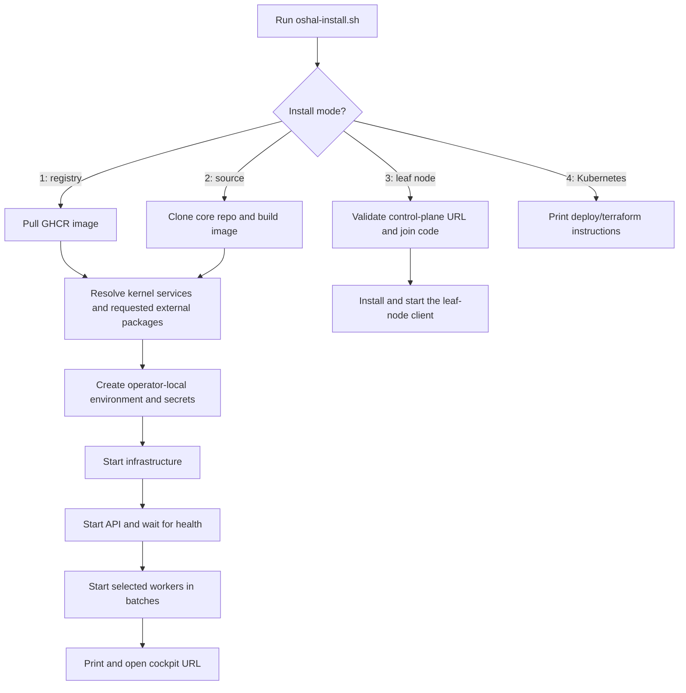
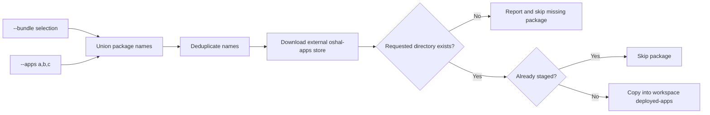
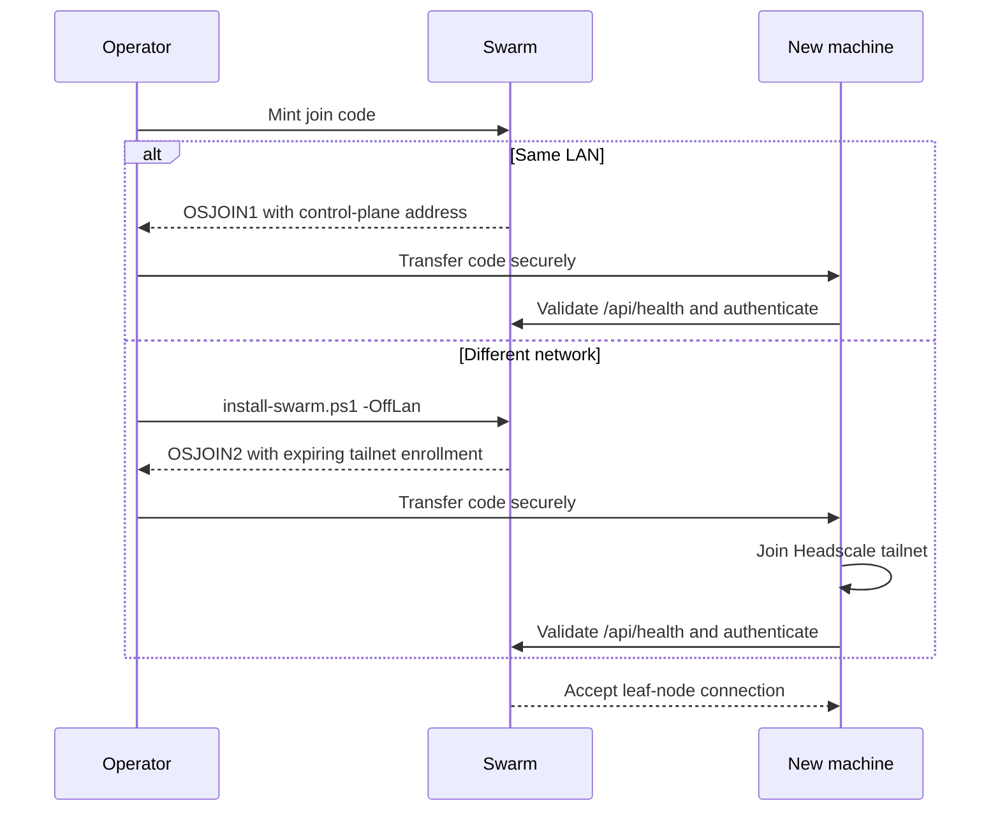
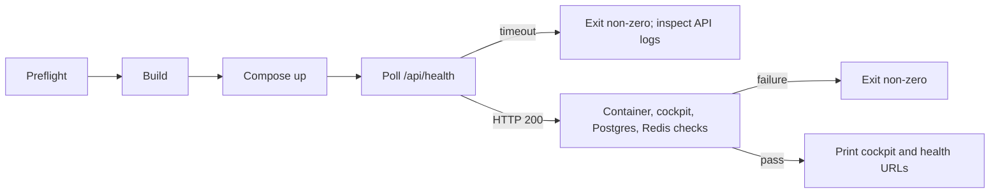

# Installing OSHAL

One command installs and health-checks an OSHAL stack — controller, worker bots,
Postgres, Redis, and ChromaDB — with **no API keys and no identity provider required**.
The platform and its kernel manifests live in this repository. Optional application
packages are staged from the separate public app-store repository when the selected
bundle or `--apps` requests them.

## One-click install

```bash
curl -fsSLO https://raw.githubusercontent.com/emeraldcoastsystemsgroup/oshal/main/scripts/oshal-install.sh
bash oshal-install.sh
```

The installer presents four modes and does the rest. Non-interactive runs select a
mode and its options with flags.

**Windows, no terminal:** [download `Install-OSHAL.bat`](https://oshal.ai/Install-OSHAL.bat) and
double-click it — the same installer as native PowerShell (`scripts/oshal-install.ps1`), no Git
Bash needed. It offers to install Docker Desktop via winget when missing. Unsigned-download note:
SmartScreen may ask for "More info → Run anyway" until the binary is code-signed.

**Fully offline — the swarm snapshot:** `bash scripts/build-offline-bundle.sh` packages the three
images (`docker save`) plus both installers into one archive; on the target machine the installers
detect `oshal-images.tar` beside them (or take `--from-archive` / `-FromArchive`) and
`docker load` it — no registry, no internet. The compose topology and config seeds are baked
inside the images, so the snapshot IS the whole swarm. Several GB — exceeds GitHub's 2 GB
release-asset cap; host on R2 or any file host.



**Four install modes:**

| Mode | What you get | Prerequisite |
|---|---|---|
| **1 — Swarm, no source** (default) | Pulls `ghcr.io/emeraldcoastsystemsgroup/oshal-bot`, extracts the baked compose + config seeds, generates secrets, brings the swarm up. No repository needed. | Docker |
| **2 — Swarm, from source** | `git clone` + `docker build` + the same bring-up, with live-editable bind mounts. The contributor path. | Docker + git |
| **3 — Leaf-node bot** | Joins **an existing swarm** from this computer (desktop worker / browser driver / edge node). Needs the swarm's control-plane URL + a join code from its operator, and optionally an enrollment token that binds the node to *your* login. | the node app |
| **4 — Kubernetes** | Prints the Terraform path (`deploy/terraform`) and starter command. This mode does not create or validate a cluster. | terraform + a cluster |

**Bundles** (`--bundle`) select kernel services and may request packages from the
external `oshal-apps` store:

| Bundle | What installs |
|---|---|
| `kernel` | The platform only: infra, controller, the baseline bots (general, Jarvis, oshal-dev). Lightest footprint. |
| `full` *(default)* | Every bot container in the stack — today's complete swarm. |
| `little-monsters` | Requests the external `little-monsters` and `presentations` packages and the required deck-builder worker. |
| `gaming` | Requests the external `dnd` and `game-show` packages. |
| `jobs` | Requests the external `career-hunter` and `job-apply` packages. |

Add **individual external packages** with `--apps name1,name2`. The installer
downloads the [public app store](https://github.com/emeraldcoastsystemsgroup/oshal-apps),
checks each requested package directory, and reports and skips a package that is missing.
The resolved package names are deduplicated, and an already-staged package is skipped
on a later run.



**When it finishes** the installer opens your cockpit (`http://localhost:35457/cockpit/` — the
full web application ships inside the image) and prints the **superadmin steps**: sign in with
your email (`MOCK_OIDC=true` accepts any local login), put that email in `.env` as
`OSHAL_OPERATOR_EMAILS`, restart the api — you are the operator of your swarm. Pass
`--admin-email you@example.com` and the installer wires it for you. Databases and app state live
in named volumes; `.env` and `config-seed/` are never overwritten on re-runs.

## Prerequisites

**Docker Desktop** with Compose v2 — macOS, Windows, or Linux. [Get Docker](https://docs.docker.com/get-docker/).
That's it. No Node, no Postgres, no API keys, no identity provider for the default install.

### What it actually costs your machine

Measured on a live default install (44 containers), 2026-07-26 — not estimated:

| | Minimum | Comfortable | Why |
|---|---|---|---|
| **RAM given to Docker** | 6 GB *(8 GB to build)* | **10 GB** | The full swarm idles at **~3.9 GB**. 6 GB runs it with no headroom — but a `docker build` runs in the *same* VM and wants ~2.5–3 GB more, so **building or deploying against a running swarm on 6 GB OOM-kills the API** (`Exited (137)`). Give it **8 GB** if you deploy into a live stack. |
| **Free disk** | 25 GB | **40 GB** | Images total **~12 GB** (`oshal-bot` alone is **6.5 GB** — it bundles the Cline/Codex/Claude/Gemini CLIs). Add Postgres/Chroma/Arango volumes and Docker's build cache. |
| **CPU cores** | 4 | 6 | The image build is the peak. Steady-state idle is <3%. |
| **First build** | — | 3–5 min | Subsequent starts are seconds. |

**Where the memory actually goes:** not the bots. Each worker bot idles at ~43–50 MB (measured
across the running fleet), so ~30 bots cost about 1.4 GB of that 3.9 GB — the floor is
Postgres + Redis + ChromaDB + the API. The single largest consumer is **Redis at ~1.2 GB**, more
than 4x the API, and it *grows with uptime* as the `oshal:mesh:agent.*` streams accumulate — so a
swarm that has been up for weeks idles higher than a fresh boot. Size for the aged case.

That's also the honest comparison to other tools: agent
*libraries* (LangGraph, CrewAI, AutoGen) install as pip packages with no platform attached, and
bundled *platforms* (Dify documents a 2-core / 4 GB minimum) match OSHAL's `--minimal` class.
The default is bigger because it starts a staffed swarm, and because one 6.5 GB image carries
four vendors' agent CLIs so any bot can run any harness.

**Changing the cap on Windows is not the Docker Desktop slider** — on the WSL2 backend it defers to
`C:\Users\<you>\.wslconfig` (`[wsl2]` / `memory=8GB`), and the change needs a `wsl --shutdown` to
take effect. Full procedure, including the graceful-stop step that keeps `restart: unless-stopped`
containers from mass-restarting into another OOM:
**[docs/runbooks/docker-engine-memory-sizing.md](docs/runbooks/docker-engine-memory-sizing.md)**.

Tight on any of those? `--minimal` brings up the controller and infrastructure only — no worker bots — which drops you to about six containers:

```bash
bash scripts/install.sh --minimal        # or: .\installer\lib\install-swarm.ps1 -Minimal
```

The Windows installer checks all four before it touches anything, and tells you which one you're short on.

### Who administers the swarm

Operator access is an **explicit, fail-closed allowlist**: `OSHAL_OPERATOR_EMAILS`, matched
against the `email` claim your identity provider reports ([authz.ts](src/shared/middleware/authz.ts)).
An empty allowlist means there are **no operators at all**, and the only symptom is a bare `403`
from the Security Center and from `/api/join/` — the page that mints join codes for new machines.
Nothing tells you why.

So the installer asks. Type the email your IdP will report; it becomes the operator. Leave it blank
and only the local demo login can administer the swarm.

It always also includes **`alex@demo.local`** — the identity `MOCK_OIDC` signs everyone in as. The
default install has no real identity provider, so without that entry the machine you just installed
on could not open the page that adds the next machine. Re-running the installer never rotates an
existing allowlist; it only fills an empty one.

> Moving to a real identity provider? Put **your** email in `OSHAL_OPERATOR_EMAILS` and drop
> `alex@demo.local`. It only ever mattered while `MOCK_OIDC=true`.

### Get your `.env` right

You do **not** need to. The default install needs no configuration at all.

When you're ready for real models or connectors, [.env.example](.env.example) opens with a **READ THIS FIRST** block explaining the three tiers (try it → real models → real deploy) and, importantly, which secrets have laptop-safe fallbacks that become holes the moment someone else can reach the host — `JWT_SECRET`, `ENCRYPTION_KEY`, and `SWARM_SERVICE_SECRET`. `SWARM_SERVICE_SECRET` is the sharp one: it is fail-closed and *silently* 401s bot→controller calls when unset, and nothing logs that you forgot it.

Copy the template, then edit only what you need:

```bash
cp .env.example .env
```

### Kubernetes mode is a handoff, not a one-click deployment

Mode 4 deliberately stops after pointing to
[deploy/terraform](deploy/terraform/) and its environment-specific instructions.
It does not provision prerequisites, create a cluster, or run an end-to-end health
check. Docker Compose modes 1 and 2 are the automated installer paths.

## Install on Windows (no terminal)

Double-click **`Install-OpenSwarm.bat`** in the folder you downloaded. A window opens and
asks one question — should this computer *run* the swarm, or *join* one?

| Choice | What it does | Needs |
|---|---|---|
| **Run the swarm here** | This machine becomes the brain: cockpit, tickets, memory, dispatch. | Docker Desktop (installed for you if missing) |
| **Join a swarm** | This machine becomes a worker node, running jobs with its own signed-in CLIs. | Node.js (installed for you if missing) |

Everything else — the image build, the `.env`, the firewall rule, the health checks — happens
behind that choice. When the swarm finishes it prints a **join code** (`OSJOIN1.…`) and offers
a *Copy* button. Run the installer on a second machine, choose **Join a swarm**, paste the
code, and that machine is a worker.

> Right-click → **Run as administrator** if you want other computers to reach this swarm.
> Adding the inbound firewall rule needs elevation; without it the install still succeeds,
> but only this machine can use it.

The window is a front end. Both halves are ordinary scripts you can run yourself:

```powershell
.\installer\lib\install-swarm.ps1              # this machine runs the swarm
.\installer\lib\install-swarm.ps1 -Dev         # developer mode: edit src/, no rebuild
.\installer\lib\install-swarm.ps1 -Minimal     # controller + infra, no worker bots
.\installer\lib\install-swarm.ps1 -OffLan      # join code that works from another network
.\installer\lib\install-swarm.ps1 -Down        # stop and remove it
.\installer\lib\install-node.ps1 -JoinCode OSJOIN1.xxxxx
```

## Adding more computers



### Getting a join code

The swarm installer prints one when it finishes. **Lost it?** Go to the swarm and ask for
another: open **`http://<swarm>:35457/api/join/`** in a browser. It mints a fresh code from the
same shared secret, so old codes keep working.

That page is **operator-only** (`OSHAL_OPERATOR_EMAILS`). A join code contains the swarm's
`REMOTE_CLIENT_SHARED_SECRET` in plaintext, and anyone holding one can attach a worker node that
receives dispatched tasks. Treat it like a password.

> Browse the page from the swarm's **LAN address**, not `localhost`. A code minted over
> `localhost` points at `localhost` and only works on the swarm machine itself. The page warns
> you when that happens.

### Same network: no VPN, nothing to configure

The default. The swarm binds `0.0.0.0:35457`, the installer opens the Windows Firewall for it
(run it as Administrator), and the join code carries the swarm's LAN address. Two codes exist:

| Code | Means |
|---|---|
| `OSJOIN1.…` | Same network. The node dials the swarm's LAN address directly. |
| `OSJOIN2.…` | Also carries tailnet credentials, so the node can join from anywhere. |

### Different network: over your own Headscale tailnet

Open Swarm can run its own [Headscale](infra/headscale/) control server — a self-hosted Tailscale
coordinator. Nothing goes through anyone else's cloud.

**On the swarm machine**, once:

```bash
bash scripts/headscale-setup.sh            # starts headscale, creates the 'agentmesh' user
```

Then produce an off-LAN join code:

```powershell
.\installer\lib\install-swarm.ps1 -OffLan   # or tick the checkbox in the installer window
```

That mints a **24-hour** Headscale pre-auth key and packs it, with the tailnet login server and
the swarm's `100.64.x.x` address, into an `OSJOIN2.…` code.

**On the other computer**, run the installer, choose *Join a swarm*, paste the code. It installs
Tailscale if missing, runs `tailscale up --login-server … --authkey …`, waits to get a tailnet
address, and only then contacts the swarm. Nothing to configure by hand.

The key expires after 24 hours. Codes minted past that point fail with a clear message; re-run
`-OffLan` for a fresh one. The `/api/join/` page always emits `OSJOIN1` (LAN) codes, because the
controller runs in a container and does not shell out to the host's Headscale.

> `scripts/headscale-setup.sh` will **not** overwrite a `server_url` that already works — nodes
> that already joined dial the old address. Override deliberately with `FORCE_SERVER_URL=1`.

## Install (one command)

```bash
git clone <repo-url> oshal && cd oshal
bash scripts/install.sh
```

This runs: preflight → build the image → start the stack → wait for health →
**verify** → print URLs. It exits non-zero if any verification check fails, so it's
CI-friendly. On success you'll see a pass/fail report and:



```
━━ OSHAL is installed
  Cockpit:    http://localhost:35457/cockpit/
  Create a bot: http://localhost:35457/cockpit/  → "Create a Bot" (Bot Forge)
  Health:     http://localhost:35457/api/health
```

Open the cockpit. You land on the clean **starter** cockpit: Jarvis up front, **Create
a Bot** (the Bot Forge — describe a bot in plain language and it goes live), and **Explore
Apps** for the full catalog. Want the full operator cockpit with every app surface? Append
`?profile=oshal-framework` to the cockpit URL.

### Windows (PowerShell)

Prefer the double-click installer above. If you'd rather use the bash script, run it from
**Git Bash** (ships with Git for Windows):

```bash
bash scripts/install.sh
```

Note the bash script does *not* generate a `REMOTE_CLIENT_SHARED_SECRET`, so no other machine
can join the swarm it creates. `installer\lib\install-swarm.ps1` does.

## What you get

| URL | What it is |
|---|---|
| `…/cockpit/` | The starter cockpit (Jarvis · Create a Bot · Explore Apps) |
| `…/cockpit/?profile=oshal-framework` | The full operator cockpit, every app surface grouped |
| `…/cockpit/?app=eats` | An example focused app |
| `…/api/health` | Liveness probe |

In the default **zero-keys** mode the `noop` harness stands in for a real LLM (so bots
respond deterministically without a provider) and `MOCK_OIDC` fakes login. Everything is
explorable; to get *real* model output, add a provider (below).

## Options

```bash
bash scripts/install.sh --with-keys    # use real providers from .env instead of noop
bash scripts/install.sh --skip-build   # reuse an already-built image
bash scripts/install.sh --minimal      # controller + infra only (no worker bots)
bash scripts/install.sh --no-verify    # skip the post-install verification
bash scripts/install.sh --down         # stop and remove the stack
```

## Enabling real LLM bots

The default install uses the `noop` harness (no keys). For real model output, pick a provider:

- **Anthropic / Claude** — set `ANTHROPIC_API_KEY` in `.env`, or sign in via the cockpit
  (**Settings → Provider → Claude Code → Sign In**, OAuth — no key needed).
- **OpenAI** — set `OPENAI_API_KEY` in `.env`.
- **Google Gemini** — set `GOOGLE_API_KEY` / `GEMINI_API_KEY`.
- **Local models** — Ollama / LM Studio / LiteLLM are supported providers.

Then re-run with real providers:

```bash
bash scripts/install.sh --with-keys --skip-build
```

## Verifying it works

The installer ends with a **postflight capability verification** (`scripts/oshal-verify.sh`) and
fails loudly, naming the broken leg, if the box cannot do what it advertises — a green container
count is not success. Re-run it any time:

```bash
bash scripts/oshal-verify.sh                      # strict: any broken leg fails
bash scripts/oshal-verify.sh --pre-onboarding     # fresh box: wizard-pending legs warn only
```

It reads `GET /api/readiness` — per-capability status (`llm` / `bots` / `credentials` /
`voice` / `db`, each `ok|off|fail`) that runbooks should use instead of `/api/health`, which is
liveness-only and reports `ok` on a box with no engine. A deliberately model-less box declares
that posture with `--no-ai` at install (writes `OSHAL_NO_AI=true`); undeclared "no model" is a
verification failure, not a quiet default.

**Never copy a credential file (`~/.claude`, `~/.codex`, `~/.gemini`) between machines** — one
OAuth grant serves one machine; the other host's refresh rotates the token and both logins die.
Log in on the box itself.

To re-run the **full 15-point check suite** later
(needs a real provider, since some checks exercise the tutor LLM):

```bash
OSHAL_BASE=http://localhost:35457 bash scripts/oshal-local-checks.sh
```

## Troubleshooting

- **Build is slow / seems stuck the first time** — the first image build runs `npm ci` +
  TypeScript compile (~2–3 min). Subsequent builds are cached.
- **Port 35457 already in use** — set a different port: `OSHAL_API_PORT=35460 bash scripts/install.sh`.
- **`localhost` pages hang but `docker ps` shows healthy** *(Windows Docker Desktop)* — a stale
  `wslrelay.exe` can squat the IPv6 loopback. If `http://127.0.0.1:35457` works but `localhost`
  doesn't, run `Stop-Process -Name wslrelay -Force` in PowerShell. Full diagnosis:
  [docs/runbooks/localhost-wedge-wslrelay.md](docs/runbooks/localhost-wedge-wslrelay.md).
- **A bot says "not logged in" / chat errors** — that bot's harness needs a provider; use
  `--with-keys` after configuring a key, or sign in via Settings → Provider.
- **Logs**: `docker compose -f docker-compose.oshal-local.yml logs -f oshal-api`

## Advanced topologies

`scripts/install.sh` is the single supported on-ramp for everyone — it brings up the
right stack with sane defaults. You do not need to touch the compose files directly.

The other compose files are advanced overlays for non-default deployments. Reach for
them only when you know you need them:

| Compose file | What it adds |
|---|---|
| `docker-compose.yml` | Core stack: API + Keycloak + Postgres |
| `docker-compose.swarm-local.yml` | The worker bot swarm |
| `docker-compose.core.yml` | Minimal infrastructure only |
| `docker-compose.dev.yml` | Developer overrides |
| `docker-compose.monitoring.yml` | Prometheus / cAdvisor / Alertmanager |
| `docker-compose.incident-lab.yml` | Incident / RCA sandbox |
| `docker-compose.override.yml` | Local fallback overrides |

## Uninstall

```bash
bash scripts/install.sh --down            # stop + remove containers
docker volume rm $(docker volume ls -q | grep oshal)   # also drop data volumes (optional)
```

## Next steps

- **Build your own swarm app** in ~15 lines of YAML: [docs/build-your-own-swarm-app.md](docs/build-your-own-swarm-app.md).
- **Architecture + concepts**: [README.md](README.md).
- **Going to production / multi-tenant**: [docs/adr/035-multi-tenant-saas-foundation.md](docs/adr/035-multi-tenant-saas-foundation.md).
