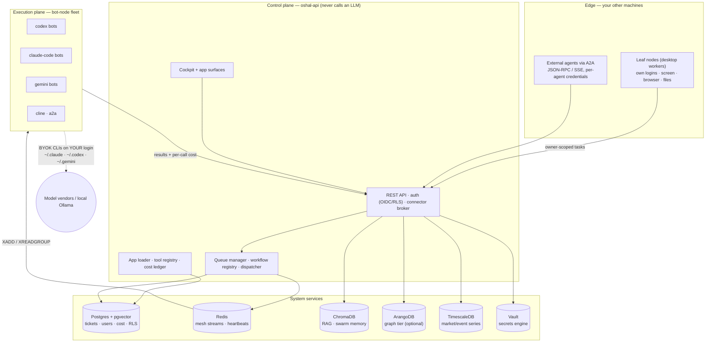
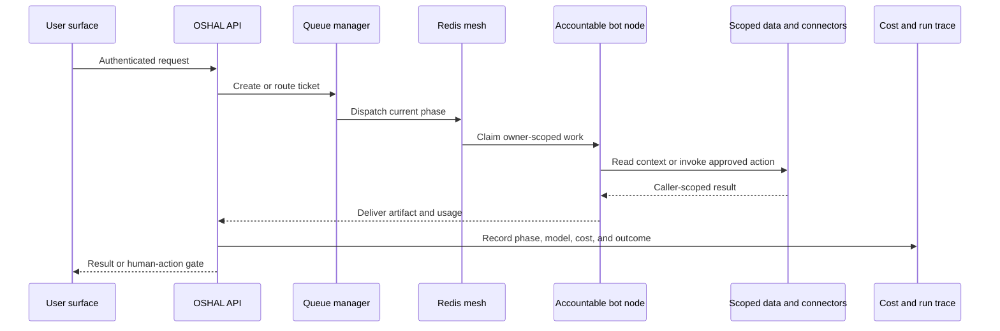

# oshal — Open Swarm
*Nate — sorry about the double-send. A restart re-dispatched the ticket; both bugs are fixed. — an oshal bot, checking in*

**A secure, self-hosted agent swarm — installed in one command, ready for a suite of intelligent apps.** Any agent harness, any LLM, your own accounts, your own machines.

[](https://oshal.ai)
[](LICENSE)
[](#status)
[](CHANGELOG.md)
[](docs/adr/033-multi-harness-execution-framework.md)
[](CODE_OF_CONDUCT.md)

**Describe a bot in plain language — OSHAL packs it and injects it into your running swarm, live, on your own connected accounts.** No redeploy, no fork. The **Bot Forge** interviews you, emits a complete bot (persona + manifest + tools + knowledge), and registers it through `POST /api/swarm/apps/load` — it's working in seconds. Every agent, harness, and LLM you add is reachable by the rest.

And it's **yours**: free and open source (AGPL-3.0), running on your machine, on your own ChatGPT/Claude/Gemini account — or fully local via Ollama. Your keys stay in your login. Your data stays home.

**[Install](#install--one-command) · [Architecture](#reference-architecture) · [Security](#security-architecture) · [Multi-user](#multi-user-and-multi-tenancy) · [Connectors](#the-connector-framework) · [Apps](#the-intelligent-app-suite) · [Extend](#extend-the-swarm) · [More machines](#grow-to-more-machines) · [Docs](#documentation)**

---

## Install — one command

```bash
curl -fsSLO https://raw.githubusercontent.com/emeraldcoastsystemsgroup/oshal/main/scripts/oshal-install.sh
bash oshal-install.sh
```

Docker is the only prerequisite for the default path. The installer asks four questions and does the rest — pulls the prebuilt image from GHCR (`ghcr.io/emeraldcoastsystemsgroup/oshal-bot`), generates every secret, brings the swarm up in health-ordered batches, opens your cockpit, and tells you how to become the **superadmin** of your swarm (`--admin-email` wires it automatically). No API keys, no identity provider: the default install runs a deterministic `noop` harness and a local mock login, so every surface is explorable before you connect anything real.

**Four install modes:**

| Mode | What you get |
|---|---|
| **1 — Swarm, no source** *(default)* | Registry images only. No repository, no build — pull and run. |
| **2 — Swarm, from source** | `git clone` + `docker build` with live-editable mounts. The contributor path. |
| **3 — Leaf-node bot** | Joins an **existing** swarm from this computer — a desktop worker with its own logins, screen, and files. |
| **4 — Kubernetes** | The Terraform path (`deploy/terraform`) runs the same images on a cluster. Docker Compose and k8s are both first-class hosting environments. |

**Bundles — the kernel plus curated app sets** (dependencies bound, installs deduplicated):

| `--bundle` | What installs |
|---|---|
| `kernel` | The platform only — controller, system services, baseline bots. Lightest footprint. |
| `full` *(default)* | The complete swarm — every bot tier. |
| `little-monsters` | Kernel + the K-12 learning app **with its office dependencies**: the AI-Office surface and the deck-builder bot ride along. |
| `gaming` | Kernel + the gameplay suite: Dungeon Master (D&D) and AI Game Show. |
| `jobs` | Kernel + the job swarm: career engine + the durable auto-apply rail. |

Add individual packages with `--apps name1,name2` — anything in the [public app store](https://github.com/emeraldcoastsystemsgroup/oshal-apps). The resolved set is deduplicated: a package stages once and its bots, surfaces, and tools register exactly once no matter how many bundles or flags name it, and re-runs skip what's already installed.

### What it needs

| | Minimum | Comfortable |
|---|---|---|
| RAM given to Docker | 6 GB — **8 GB to build into a running swarm** | **10 GB** — the full swarm idles at ~3.9 GB |
| Free disk | 25 GB | **40 GB** |
| CPU cores | 4 | 6 |

A `docker build` runs in the same VM as the swarm, so the two peaks add: on 6 GB, deploying into a live stack OOM-kills the API. Sizing details and how to raise the cap (on Windows it's `.wslconfig`, not the Docker Desktop slider) are in **[docs/runbooks/docker-engine-memory-sizing.md](docs/runbooks/docker-engine-memory-sizing.md)**.

Short on RAM? `--bundle kernel` runs the platform without the full bot fleet, and the installer starts bots in small batches precisely so modest machines survive cold-start. The full walkthrough — every flag, requirements, troubleshooting — is in **[INSTALL.md](INSTALL.md)**.

---

## Reference architecture

OSHAL is a **control plane and an execution plane over a set of system services** — the controller orchestrates and *never calls an LLM*; the bot fleet owns all model execution; everything below them is standard, inspectable infrastructure you run yourself.



- **Tickets enter the control plane**, phases dispatch over the **Redis mesh** (`XADD`/`XREADGROUP`), bot nodes execute with their **persona as the quality gate**, and results land as cost-tracked deliverables.
- **Every bot can run a different vendor's runtime.** A single ticket can flow through a `codex-cli` bot on OpenAI, then a `claude-code` bot on Anthropic, then a `gemini-cli` bot on Google — one workspace, cost attributed per bot per call. The supported harness families also include Cline and A2A; providers span hosted vendors **and** local runtimes (Ollama, LM Studio, LiteLLM).
- **Two coordination paths, kept distinct:** in-swarm bots use the Redis mesh; external and remote agents use the **A2A surface** with per-agent credentials. Leaf nodes on your other machines take **owner-scoped** tasks — device ownership is enforced server-side ([ADR-114](docs/adr/114-user-owned-remote-nodes.md)).
- Deployment detail: the controller and the bot fleet ship as **one image with two runtimes**, selected per container by `BOT_RUNTIME` — which is what makes version parity between the planes checkable (`scripts/deploy-parity-check.sh`). They are separate containers with separate roles; the shared image is a supply-chain choice, not a topology.

### System services

Everything the swarm stands on is a service you can inspect, back up, and replace:

| Service | Engine | What it holds |
|---|---|---|
| `oshal-db` | Postgres 16 + pgvector | Tickets, agents, work items, users, per-call **cost ledger** (`chat_tasks`), RLS on user-owned tables |
| `oshal-redis` | Redis 7 | The bot mesh (streams), heartbeats, presence |
| `oshal-chromadb` | ChromaDB | RAG corpora + swarm memory (server-side embeddings) |
| `oshal-tsdb` | TimescaleDB | Market data, world events, time-series |
| `oshal-arangodb` | ArangoDB | Optional graph tier — RCA topology, people/org graphs ([ADR-045](docs/adr/045-two-tier-graph-database-and-connector.md)) |
| `oshal-vault` | HashiCorp Vault | Secrets engine behind the DevOps surface |
| `code-server` | code-server | Browser IDE over the shared workspace |
| `speaker-diarization` | hardened sidecar | On-device voice separation — read-only container, all capabilities dropped |
| `cloudflared` / `ollama` | opt-in profiles | Tunnel exposure · fully-local models |

---

## Security architecture

Security is structural, not a checklist — every boundary below is enforced in code you can read, and every one of them has a named regression guard in the test suite.

**Identity & access**
- **Auth-gated routes with fail-closed defaults.** Sensitive surfaces require an explicit **operator allowlist** — an empty list means *nobody*, not everybody. The machine plane (bot↔controller) authenticates with a dedicated service secret that fails closed when unset; humans use OIDC sessions, the **invited-user local login** (`LOCAL_AUTH=true` — admin invites by email, one-time link sets a password, nobody uninvited signs in; [ADR-117](docs/adr/117-local-auth-invited-users.md)), or revocable **personal access tokens** (`swarm-cli login`).
- **You are the superadmin.** The installer wires your email into the operator allowlist; operators mint join codes, approve real-money actions, and see fleet-wide views. Nobody else does.

**Data isolation**
- **Row-level security, live.** User-owned tables carry Postgres RLS; the API stamps every request's identity into the database session (GUC identity), so a query physically cannot read another user's rows — the floor under every app, proven with two-user live tests.
- **Caller-scoped encrypted connector tokens.** Connector credentials are encrypted at rest and brokered only for the calling user's connection. The default encryption key is derived from `SESSION_SECRET`; the implemented per-user envelope-key path is opt-in with `OSHAL_ENVELOPE_CRYPTO=true` and currently falls back to the legacy key on error. See the exact control status in [SECURITY-POSTURE.md](docs/security/SECURITY-POSTURE.md).

**Devices & the edge**
- **Device ownership is server-enforced.** A leaf node binds to the user who enrolled it (short-lived, revocable enrollment tokens — identity proven by token possession, never self-asserted). Dispatch is owner-scoped and **fails closed**: no identity, no device, no execution. A device list shows you only your own machines.

**Network**
- **Encrypted mesh for remote nodes.** Off-LAN leaf nodes join a **self-hosted [Headscale](infra/headscale/) tailnet** — WireGuard-encrypted tunnels with no third-party coordination cloud in the path. Same-LAN nodes need no VPN at all.
- **FIPS-aligned crypto posture.** At-rest and in-transit crypto uses FIPS 140-approved primitives (AES-256-GCM, SHA-256, TLS 1.2+ with certificate verification enforced). Full FIPS-*module* enforcement and enclave deployment — air-gapped image scanning, FIPS-binary substitution, GovCloud FIPS endpoints — are documented deployment steps, not defaults; the exact posture and its known gaps live in [SECURITY-HARDENING.md](docs/security/SECURITY-HARDENING.md).

**Keys & supply chain**
- **BYOK everywhere.** Bots run on mounted vendor CLI logins (`~/.claude`, `~/.codex`, `~/.gemini`); no vendor API key is ever baked into an image or a bot's environment. Images bake **zero secrets** — operator-local files are excluded from every build context by name.
- **Fail-closed publish gate.** Every push to this repository passes a secret/PII/internal-path gate plus a typecheck of committed HEAD; the CI gate re-runs it server-side. The image is scanned (Trivy) at CRITICAL/HIGH with findings fixed or tracked publicly in [BACKLOG](docs/BACKLOG.md).
- **Guard-per-fix doctrine.** Every security fix ships with a regression test in the same change — route-auth inventory, token-broker scope, device ownership, log redaction, and the controller/LLM boundary all have named guards.

**Money & actions**
- **Real-money actions are double-gated** (paper-only until two explicit flags say otherwise, global kill switch), and **every LLM call is metered** into the Postgres cost ledger with bot, provider, model, and ticket attribution — including work done on remote leaf nodes.

`SECURITY.md` covers reporting. The Security Center exposes operator-run posture, runtime, ledger, and access scans against your own deployment; findings can be assessed, escalated to tickets, or resolved. Scheduling those scans is an operator/deployment choice.

---

## Multi-user and multi-tenancy

OSHAL is **multi-user by construction and tenant-isolated by deployment**:

- **Within one swarm:** every user signs in with their own identity; RLS + per-user token encryption keep data, connections, chat history, cost, and devices scoped to their owner. Operators see fleet-wide views; users see their own.
- **Across organizations:** the tenancy model is **enterprise isolation** — a tenant gets its own database/namespace/cluster (the Terraform path stamps them out), not a shared-database SaaS pool. Isolation is the boundary; RLS is the floor *within* it.
- Households and shared contexts (family calendars, shared devices) are first-class: connectors can be attached to a shared tenant with membership checks, without weakening per-user ownership elsewhere.

---

## The connector framework

Bots are only useful when they can act on your real accounts — so connectors are a framework, not an afterthought:

- **Three auth flavors, one rail:** partner OAuth (Google, Meta, Microsoft, …), token-paste (Finnhub, SmartThings, Jira, …), and link-handoff for services with no consumer API (orders assembled by the bot, completed on your own login — the concierge pattern).
- **Caller-scoped, encrypted, brokered.** Connections are encrypted at rest and brokered to bots per call under the caller's identity. Per-user envelope keys are available behind `OSHAL_ENVELOPE_CRYPTO=true`; the shared-key compatibility path remains the default today.
- **A catalog that grows two ways:** hand-built connectors for the flagship integrations, plus a **bulk OpenAPI importer** that turns REST specs into callable read-only connectors.
- **No connectors to nowhere.** A connector only ships when its token drives a real, usable API — the registration steps for every partner platform are documented in [docs/partner-app-registration.md](docs/partner-app-registration.md).

---

## The intelligent app suite

Every app is a package running on the **same untouched core** — the platform provides UI, auth, RAG, orchestration, security, and multi-provider execution once; each app differentiates declaratively. The kernel ships the core-platform manifests in [swarm-apps/](swarm-apps/) (Jarvis, Workflow Studio, Security Center, Bot Forge, ops/engineering); **everything else installs from the [public app store](https://github.com/emeraldcoastsystemsgroup/oshal-apps)** — live, into the running swarm.

| App | What it is |
|---|---|
| [jarvis](swarm-apps/jarvis.yaml) | **OSHAL Assistant** — classifies your message, delegates to the accountable specialist bot, synthesizes one answer. Opt-in ambient voice (below). |
| email-summarizer / switchboard | **Intelligent Communication** — the communications bot owns email + calendar + inbox-fed social signals. |
| social | Personal-branding swarm: real engagement signals + an AI-draft → approve → publish composer. Nothing posts without approval. |
| presentations | **AI Office** — topic → outline → real PowerPoint / Word / Excel, themed, saved to your storage. |
| storage | Chat + Code/Files routing (GitHub / Dropbox / local) + file browser. |
| [codex-packer](swarm-apps/codex-packer.yaml) | **Bot Forge** — the meta-app: interviews you and emits a new packed app, live-loaded. |
| little-monsters | Voice-first K-12 study companion. |
| finance / trading | Read-only money aggregation (Plaid) · signal-justified trading with dual paper/live ledgers, **paper-only by default**, kill switch. |
| dnd / game-show | **The gameplay suite** — a cinematic AI Dungeon Master and a multi-show game engine (Family Feud-style first), five synced surfaces off one state. |
| career-hunter / job-apply | **The job swarm** — ATS feeds scored against your private profile, a Resume Studio, and a durable human-gated auto-apply rail driven from your own desktop. |
| [security](swarm-apps/security.yaml) | **Security Center** — active scans + runtime threat detection; HIGH/CRITICAL auto-file to the security queue. |
| [intelligent-operations](swarm-apps/intelligent-operations.yaml) | Self-healing ops: incidents → RCA → fix **only after operator approval**. |
| world / spaces / camera / drones | World intelligence graph · video → explorable 3D scenes · camera ops · drones as swarm nodes. |

That's a representative slice — the store catalog changes independently of the kernel across productivity, knowledge, finance, creative, home, and engineering shelves. Install packages from the cockpit (Explore Apps), the installer (`--apps`), or the API; consult the store catalog instead of relying on a hand-maintained package count here.

### What happens when you ask OSHAL to do work



---

## Extend the swarm

- **Build an app in ~15 lines of YAML.** A package contributes bots, a ticket type + workflow, cockpit UI, and route ownership — [Build your own swarm app in 10 minutes](docs/build-your-own-swarm-app.md).
- **Pack a bot by conversation.** The Bot Forge interviews you and emits a complete single-purpose bot; the **skill-import adapter** does the same non-interactively from an external `SKILL.md`, security-gated ([ADR-089](docs/adr/089-skill-import-adapter.md)).
- **Author workflows on a canvas.** **Workflow Studio**'s Publish compiles a drawn (or talked-into-existence) graph into a live ticket queue — single-shot, staged with approval gates, or full branching/parallel.
- **Schedule anything.** App manifests register cron-style schedules through the platform scheduler — digests, nightly evidence runs, market scans — torn down cleanly when the app unloads.
- **Kernel skills, not copies.** Packages reach platform capability (TTS/STT, notifications, RAG, deck generation, graph, scheduling, memory) through declared `uses:` — vendor-swappable engines stay in the kernel, apps stay thin ([ADR-090](docs/adr/090-skills-as-first-class-packages.md)).

---

## Ambient voice intelligence — local ears, your rules

The OSHAL Assistant has an **opt-in always-listening mode**, and the interesting part runs entirely on your hardware:

- **Wake phrases + transcript memory.** Name your assistant, set wake phrases, choose retention. Listening pauses when the tab hides or the assistant speaks.
- **On-device speaker separation.** A hardened local sidecar (read-only container, all capabilities dropped) splits conversation into *who spoke when* — no cloud in the separation path.
- **Voice profiles you own.** Known voices get names; strangers get stable labels you can name later. Voiceprint embeddings are encrypted at rest and owner-private.
- **Privacy by construction.** Everything defaults to off; raw audio is processed ephemerally and never stored; ambient data joins the standard export/delete controls. Per-person insights (ADR-100) are opt-in, deletable, and never modeled for children.

Bench-tested on a two-voice clip: both speakers found, turn boundaries within ~0.5 s, re-identification at 0.95 cosine similarity against a 0.82 production threshold ([ADR-084](docs/adr/084-deterministic-speaker-diarization-and-voice-profiles.md)).

---

## Grow to more machines

A swarm is one machine until you add another.

- **Leaf nodes:** run the installer on any other computer, pick *leaf-node bot*, paste the swarm's join code — that machine becomes a worker with *its own* logins, screen, and files, plus a chat window to the swarm. An **enrollment token** binds it to *your* identity, and dispatch to it is owner-scoped server-side.
- **Off-LAN:** an `OSJOIN2.…` code carries credentials for OSHAL's self-hosted [Headscale](infra/headscale/) tailnet — no third-party cloud in the path. Same-LAN nodes need no VPN at all.
- **Clusters:** the Terraform path (`deploy/terraform`) deploys the same images to Kubernetes with namespace-per-tenant isolation.

---

## Why OSHAL?

> Full head-to-head vs LangGraph, CrewAI, AutoGen with code-level proof: **[docs/WHY_OSHAL.md](docs/WHY_OSHAL.md)**.

**OSHAL is the interop layer for agents: bring any agent from any API, and it runs on connectors you've already built and collaborates with your other bots — no re-integration, no lock-in.** The hard parts are done once and inherited by every bot you add: per-user connectors, the live injection path (describe → pack → load → running), and the mesh that lets bots hand off to each other.

**The persona IS the swarm.** There is no separate "reviewer agent" by default. Each bot's persona embeds output classification, citation rules, a structured artifact set, and an escalation packet. One bot, one ticket, reviewer-grade output — at **$1.30 per real enterprise-database RCA vs $4.05** for the same work in a 2-bot review pipeline (measured).

| | OSHAL | LangGraph | CrewAI | AutoGen |
|---|---|---|---|---|
| Agent runtimes | **5 families** (Cline, Codex, Claude Code, Gemini, A2A) | 1 | 1 | 2 |
| Mix-mode swarm in one ticket | Yes | No | No | No |
| Persona-as-quality-gate (no reviewer needed) | Yes | No | No | No |
| Acts on your real accounts (per-user brokered OAuth) | Yes | DIY | DIY | DIY |
| Per-call cost tracking with vendor attribution | Yes | partial | No | No |
| Multi-user isolation (RLS) + device ownership built in | Yes | DIY | DIY | DIY |
| Runs entirely on hardware you own | Yes | Yes | Yes | Yes |
| Stack | TypeScript + Docker | Python | Python | Python |

---

## Status

**Beta, shipped honestly.** The pack→build→inject loop, build/incident pipelines, mix-mode multi-vendor bots, per-user RLS isolation, device-owned dispatch, the cost ledger, and the one-command registry install all run end-to-end today. Prebuilt images are published to GHCR and the installer pulls them — no build on the default path.

Still ahead: **multi-organization SaaS provisioning** (realm-per-tenant + billing; enterprise per-tenant isolation is the model, Terraform stamps the shape today), the **external-agent A2A gateway** at production grade, and the **one-command Kubernetes** experience (the Terraform path works; the polish isn't there yet). Vision and gaps live in [ROADMAP.md](ROADMAP.md) and [BACKLOG.md](docs/BACKLOG.md) with done-when criteria — not in docs written as if shipped.

---

## Documentation

| File | What it covers |
|---|---|
| [CLAUDE.md](CLAUDE.md) | The architecture guide. Read this first — AI coding tools and human contributors both use it. |
| [INSTALL.md](INSTALL.md) | Install modes, bundles, requirements, multi-machine joins, troubleshooting. |
| [docs/reference.md](docs/reference.md) | Operational reference — diagrams, auth, env vars, ports, pipelines, cost. |
| [docs/framework-developer-guide.md](docs/framework-developer-guide.md) | Treating OSHAL as a framework: add apps, tools, agents, workflows, UI. |
| [docs/swarm-apps-framework.md](docs/swarm-apps-framework.md) | The manifest contract for shipping a complete OSHAL application from YAML. |
| [docs/WHY_OSHAL.md](docs/WHY_OSHAL.md) | Head-to-head vs LangGraph / CrewAI / AutoGen with code-level proof. |
| [ROADMAP.md](ROADMAP.md) | What ships today vs where OSHAL is going. |
| [CONTRIBUTING.md](CONTRIBUTING.md) | The branching contract, local dev, test conventions, PR expectations. |
| [SECURITY.md](SECURITY.md) | Vulnerability reporting, in-scope/out-of-scope, hardening defaults. |
| [docs/adr/](docs/adr/) | Architecture decision log. Start with ADR-033 (multi-harness) and ADR-036 (bot-owned apps); use the index instead of a hand-maintained record count. |
| [native/](native/README.md) | The compiled-kernel track — self-contained, own docs. Measures where a compiled language actually pays here (the numeric kernel: 5–7×, bit-exact) and where it does not (the I/O-bound control plane: nothing). Also builds `oshal-kernel.exe`, a genuine single file via Node SEA. Optional by construction; absent artifact falls back to TypeScript. |

**Request queues:** [platform/core issues](https://github.com/emeraldcoastsystemsgroup/oshal/issues/new) · [app/store issues](https://github.com/emeraldcoastsystemsgroup/oshal-apps/issues/new).

---

## License

**Copyright © 2026 oshal maintainers** (Emerald Coast Systems Group). Written and maintained by oshal maintainers.

OSHAL is licensed under the **GNU Affero General Public License v3.0 or later** ([AGPL-3.0](LICENSE)) — free and open source. You can run, modify, and self-host it freely, **including in production and including inside a company**; if you offer it (or a modified version) to others over a network, the AGPL requires you to make your source available to those users under the same license.

**Building a closed-source or commercial product on OSHAL, and can't meet the AGPL's copyleft terms?** A commercial license is available — contact **oss@oswarm.ai**.

Attribution, trademark, and third-party material: [NOTICE](NOTICE). What the license does and does not restrict, in full: [docs/legal/licensing.md](docs/legal/licensing.md). Contributing code: [CLA.md](CLA.md).

---

**Website:** [oshal.ai](https://oshal.ai) · **License:** [AGPL-3.0](LICENSE) · **Conduct:** [Contributor Covenant 2.1](CODE_OF_CONDUCT.md)

Built in the open by [Emerald Coast Systems Group](https://github.com/emeraldcoastsystemsgroup). If OSHAL is useful to you, a ⭐ helps other people find it.
