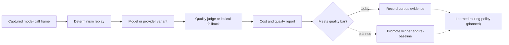

# OSHAL Roadmap

This roadmap separates **what ships today** from **where OSHAL is going**. It exists
so the conceptual vision can be written down honestly without overstating the
current build. Each item lists its *today* state and its *target* state, plus where
the work is tracked.

Status legend: **Shipped** (works today) · **In flight** (partially built) · **Planned** (design/intent only).

For deferred engineering tasks with done-when criteria, see [BACKLOG.md](docs/BACKLOG.md).
For the honest current-state feature matrix, see [docs/framework-developer-guide.md](docs/framework-developer-guide.md) ("Current Truth Matrix").

---

## The one-line vision

OSHAL is a framework where **any harness, any agent, any LLM can join one swarm and
collaborate** — and where adding more agents and workflows makes the swarm
*inherently broader* in capability. You grow the swarm by installing applications
(manifests), packing business processes into bots, and authoring workflows — over
time, increasingly by *describing* them to an agent rather than wiring them by hand.

---

## The differentiator — Token Chase (Partially shipped)

The vendor-neutral swarm is the foundation; **Token Chase is what it's *for*.** Token Chase is
measured token-cost/quality optimization for **any business process × any AI tool × any AI
platform** — capture model-call frames, replay counterfactual variants, compare cost and quality,
and use the evidence to select a cheaper path that still clears the quality bar. Frame capture,
single-call replay, model swapping, savings reports, and shared-judge grading are implemented.
Tail replay, automatic winner promotion, pinned reads, and a learned selection policy remain.

The moat is structural: a single-vendor stack can't optimize you *off* its own models/tools onto a
cheaper competitor — its optimizer is captive. OSHAL is vendor-neutral by architecture (five
harnesses, hosted + local providers), so it can recommend *and prove* "this phase is cheaper on
Llama-via-Ollama under codex at equal quality." **Neutrality is the product.** Mechanism design:
[ADR-046](docs/adr/046-token-chase-checkpoint-replay-optimization.md). Status: **In flight** —
the evidence and grading loop exists, while automatic optimization of future calls is still target
state.

---

## Now (Shipped)

These are real, exercised paths today. They are documented in
[README.md](README.md), [CLAUDE.md](CLAUDE.md), and
[docs/framework-developer-guide.md](docs/framework-developer-guide.md).

- **Mix-mode swarms** — every bot can run a different harness (Cline, Codex CLI,
  Claude Code, Gemini CLI, A2A), a different API provider, and a different model.
  Per-bot override via `harnessType`/`apiType` in the bot registry.
- **Persona-as-quality-gate** — one workerBot per ticket type, whose persona embeds
  the full quality gate. No external reviewer by default.
- **Swarm applications** — install a product as a YAML manifest: bots, UI ribbon entries,
  route ownership, ticket type, and workflow routing. Hot-load via `POST /api/swarm/apps/load`.
  Since the ADR-085 migration (complete 2026-07-19), the kernel ships only the core-platform
  manifests in `swarm-apps/`; every other app installs from the
  [public OSHAL app store](https://github.com/emeraldcoastsystemsgroup/oshal-apps)
  onto the same core. Adding apps is how the swarm grows.
- **Harness packing** — `codex-packer` interviews an operator and emits a complete
  single-purpose bot (persona YAML + manifest + optional KB), registered live. A whole
  business process becomes one self-contained agent (e.g. the `federal-capture` store package).
- **Workflow Studio (author → publish)** — a WYSIWYG canvas to author and validate workflow
  graphs, then **Publish** them live: single-shot, staged (approval gates), or a full
  branching/parallel graph compiled to an executable workflow.
- **Deployment spectrum** — runs on Windows (`oshal.bat`), Docker Compose (primary
  local path), and Kubernetes (`ops/`, `docs/k8/`). Kubernetes is the scalable target.
- **Local & self-hosted models** — Ollama, LM Studio, and LiteLLM are wired as
  providers; Llama and Mistral run fully local via Ollama.
- **Platform shared services (2026-07 gap-list build)** — cross-cutting services every
  app rides on, all auth-gated and caller-scoped: **spend budgets + runaway kill switch**
  (`/api/budgets`, `src/features/cost-governance`), **write-capable connector actions**
  (approval-gated + audited), **global search** over the caller's own data (`/api/search`),
  a **shared LLM-judge** (`/api/judge`, quality-judge concierge bot), **persona regression
  evals**, a **notification preference center**, **per-user data export/delete** (`/api/me`),
  **queue dead-letter/poison-ticket** handling (`/api/queue/dlq`), **bot-node execute auth**
  (`SWARM_SERVICE_SECRET`), and **run tracing** — one ticket → phase → bot → LLM-call → cost
  waterfall (`/api/trace`). As-built: [docs/architecture/platform-shared-services.md](docs/architecture/platform-shared-services.md).
- **Email/social provider breadth** — Outlook/M365 added to the email swarm (a connector +
  `scripts/oshal-outlook.js`, ADR-037 pattern); the **LinkedIn AI Content Assistant** shipped
  as a `linkedin-content` manifest workflow (draft → judge → refine → approve → publish).

---

## Next (In flight)

The table separates the shipped foundation in the **Today** column from the remaining production
or authoring gap in **Target**. A row stays here while that target remains open.

| Item | Today | Target | Tracked in |
|---|---|---|---|
| **Workflow Studio compile-to-runtime** | **Shipped** — the canvas **Publish** action compiles a definition to a caller-scoped manifest and loads it live as a ticket queue (single-shot → `manifest-worker`, multi-stage → the `staged` executor with per-stage approval gates, and a full branching/parallel graph → an executable nodeGraph on the process-definition engine, 2026-07-05). | Natural-language authoring that composes brand-new agents/goals (not just the graph over existing bots) — tracked under **Agentic Workflow Studio** below. | [BACKLOG.md](docs/BACKLOG.md), [docs/architecture/workflow-studio-framework.md](docs/architecture/workflow-studio-framework.md) |
| **Config ownership & sync (ADR-034)** | Shipped + proven on the `any-bot` runtime: OSHAL owns the per-agent param record, push-down via `switchProvider`, broadcast-up via the `swarm.config-change` mesh channel (10/10 local checks). | Same loop on the default `bot-node` worker; per-dispatch param enforcement; bootstrap-pull on boot; one canonical bot runtime. | [BACKLOG.md](docs/BACKLOG.md), [ADR-034](docs/adr/034-bidirectional-config-ownership-sync.md) |
| **A2A external/remote agents** | **Plan F shipped and closed 2026-07-18** ([ADR-109](docs/adr/109-a2a-gateway-external-agents-join-the-swarm.md)): default-off agent card curated by the ADR-087 access-role denylist, per-agent hashed credentials + capability scopes (no global secret), inbound JSON-RPC `message/send` → a real queued ticket under a synthetic `a2a:<agentId>` sub (budgets/DLQ/run-trace inherit), `tasks/get`/`tasks/cancel`, and an outbound `a2a` harnessType. Cost is real-or-honestly-flagged, never a silent `$0`. Live-proven end-to-end against a real standalone (non-OSHAL) foreign agent under `noop`; three vulnerabilities found by adversarial review (RLS identity leak, cost double-count/zero-bill, ADR-087 role-gate bypass) were closed pre-ship. Internal coordination remains the Redis mesh. | Migration `089-a2a-gateway.sql` applied + `A2A_GATEWAY_ENABLED` set on a real deployment (today it is structurally 404 everywhere); proven against a real third-party vendor's A2A agent, not a hand-built standalone one; a TLS/publish posture for exposing `/api/a2a` off-box. | ADR [013](docs/adr/013-headscale-self-hosted-overlay-network.md)/[014](docs/adr/014-any-bot-k8s-headscale-gateway.md)/[109](docs/adr/109-a2a-gateway-external-agents-join-the-swarm.md), [docs/architecture/remote-client-architecture.md](docs/architecture/remote-client-architecture.md) |
| **One-call create-and-start agent** | **Shipped 2026-07-19** — `POST /api/swarm/agents/create-and-start`: create + launch in one call with rollback-on-launch-failure (502 + `rolledBack` on a failed start; compose entry and profile removed). The two-step path remains for callers that want staged control. Guard: `tests/unit/agent-create-and-start.spec.ts`. | — (target met) | [docs/framework-developer-guide.md](docs/framework-developer-guide.md) |
| **AnyBot unified node-runtime** | bot-node execution, per-bot containers, and AnyBot-style wrapper concepts exist. | One canonical "AnyBot is the node runtime" boundary + full parity with OSHAL tool/provider registries. | [docs/framework-developer-guide.md](docs/framework-developer-guide.md) |

---

## Later (Planned)

| Item | Today | Target | Tracked in |
|---|---|---|---|
| **Token Chase optimization** *(flagship)* | Steps 1–3 + 5-as-savings-loop shipped ([src/features/token-chase](src/features/token-chase/)): per-LLM-call frame capture, single-call determinism-gate replay, per-frame model-swap variant, corpus-backed savings report, `/api/token-chase` routes + cockpit Optimizer. **First real (non-demo) baseline graded against a free lane 2026-07-11** — real captured frames replayed vs `gpt-oss-20b:free` at $0 (evidence); earlier `token-chase-demo-*.md` files are the synthetic demo route, not a real grade. **Step 4 (LLM-judge assessor) + 4b (judged savings report) shipped 2026-07-16** via the shared quality-judge service — the report separates llm-judged from lexical-fallback frames and never blends them. | Judged grading now exists (Jaccard remains as the fallback + comparison column); remaining: auto keep-winner → re-baseline loop + a per-run judge cost cap, tail-replay, pinned-read, and a learned selection policy that re-routes future calls from the accumulated corpus. | [BACKLOG.md](docs/BACKLOG.md), [ADR-046](docs/adr/046-token-chase-checkpoint-replay-optimization.md) |
| **Agentic Workflow Studio** | A natural-language **talk-to-build** assist already drafts the canvas graph from a prompt (the `workflow-assistant` bot); `codex-packer` produces whole *bots*. What's missing is an agent that composes brand-new agents, goals, and personas — not just the graph over existing ones. | Describe a workflow in natural language and an agent composes the full app — workflow, **new** agents, gates, and goals. The **canvas is the end-state representation**, reachable via the agentic studio *or* the manual designer. | [BACKLOG.md](docs/BACKLOG.md), [docs/architecture/workflow-studio-framework.md](docs/architecture/workflow-studio-framework.md) |
| **Home persona layer (default entry)** | Login lands on `/chat`. The Haven home-persona layer is scaffolded; ADR-030 is *Proposed*. | A persona-fronted home as the default landing that hides agent routing, phase dispatch, and tool names. | ADR [030](docs/adr/030-home-persona-layer.md) |
| **Embedded LLM tools as a formal tier** | Two tool tiers are modeled: the shared OSHAL tool registry, and each harness's native tools. Provider-native ("embedded") tools are used opaquely. | A managed third tier — embedded LLM tools (e.g. provider web search) — with per-agent enablement alongside the shared and native tiers. | [BACKLOG.md](docs/BACKLOG.md) |
| **Self-hosted local-LLM swarm profile** | Ollama/LM Studio/LiteLLM are wired; `gpt-oss-120b` is offered via the Cerebras API. Historically, `gpt-oss-20b` ran in the ai-lab Kubernetes configuration on AWS as a single-threaded POC swarm; `gpt-oss-120b` was not run there because the AWS spend (~$100k/mo) was not justified for a POC. | A documented, repeatable local-LLM swarm profile (including `gpt-oss` on Ollama) with benchmarks. | [BACKLOG.md](docs/BACKLOG.md) |
| **Generic node-pool hot-loading** | Dynamic bot/tool insertion works; a generic node pool is not the default runtime. | Hot-loaded generic node pool. | [docs/research/generic-node-pool-hot-loading-architecture.md](docs/research/generic-node-pool-hot-loading-architecture.md) |
| **Cluster environment matrix** | Setup docs exist for core and K8s. | One matrix covering local, Docker Desktop, kind/k3d, managed Kubernetes, and Headscale-connected nodes. | [docs/framework-developer-guide.md](docs/framework-developer-guide.md) |
| **Spaces — spatial capture → 3D reconstruction (ADR-111)** | Shipped at `?app=spaces`: film a room → walk the Gaussian-splat scene in a vendored WebGL2 viewer (Sim engine proves the full pipeline with no GPU; the real GPU-box service — ffmpeg→COLMAP→splatfacto — is now in-repo at `scripts/spatial-recon-edge`, wired over `RECON_URL`). Also shipped: the direct **import lane** (iPhone/iPad LiDAR / depth / drone `.ply`/`.splat` → viewer, no GPU); **camera-pose persistence**; the **Wi-Fi/RF coverage overlay** (pose-keyed RSSI → router localization + coverage heat painted on the map, overlay-not-geometry); **guided capture** (deterministic step plan + a live phone HUD with walk/pan arrows + compass/motion telemetry); and a **sim-first drone scan mission**. Room-scale per scan. | Real-drone media ingest (MAVLink follow-up); bot-personalized (vs deterministic) capture plans + live turn-by-turn pose feedback; metric anchoring via an ArUco fiducial; real RSSI walk-survey capture tooling; GoPro ingest; the drone mission-overlay handoff (render the scan in the drone view + express waypoints in its frame). | [BACKLOG.md](docs/BACKLOG.md), [ADR-111](docs/adr/111-spatial-mapping-3d-reconstruction.md), [pose spec](docs/architecture/spatial-mapping-pose-persistence.md), [capture playbook](docs/architecture/spatial-capture-playbook.md) |

---

## Code health

These are governance/hygiene items, tracked in detail in [BACKLOG.md](docs/BACKLOG.md) → "Code governance".

| Item | Today | Target |
|---|---|---|
| **1000-line file cap** | 1 file exceeds the hard cap (`src/app/routes/jarvis-routes.ts`, blocked on in-flight work) after the 2026-07-11 decomposition burn-through of the other 11; 16 files sit in the 800–1000 warn band. | Every source file at or under 1000 code lines, decomposed behind existing interfaces with no behavior change; a lint gate so it can't regress. |
| **Documentation standard** | Backfilled 2026-06-07: Change Log headers + exported-member JSDoc across the files that lacked them. | 100% of tracked source files carry the header and JSDoc; enforced going forward (consider a CI lint). |

## Non-goals (for now)

- Replacing the swarm runtime with the Workflow Studio engine. Workflow Studio is an
  authoring layer on top of the authoritative runtime services, not a second
  orchestration engine.
- A single hardcoded TTS/voice vendor. TTS stays pluggable, parallel to LLM providers.
- Scraping or impersonation paths. External integrations stay first-party and
  honest by construction.
