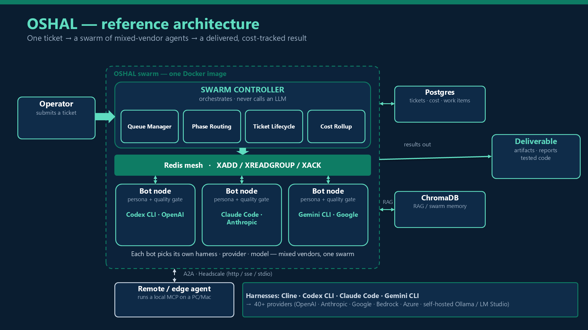

# OSHAL — A Live Framework for Multi‑Vendor Agent Swarms

**Open Swarm Harness Agent LLM**
*White paper · v1 · 2026‑06‑08 · Status: beta*

> **One line:** In OSHAL, every agent in the swarm can run a different vendor's agent runtime —
> routed per bot and coordinated as one swarm, governed by the platform, and expandable at
> runtime without a rebuild.

---

## Abstract

Most "AI agent" systems are a single chatbot with tools, or a brittle pile of scripts that work
in a demo and fall apart in production. The hard part was never the prompt — it was the **runtime**:
multiple specialized agents, per‑agent tool permissions, observability and cost, workflow lifecycle,
containerized execution, repeatable validation, and a way to grow without redeploying.

OSHAL treats agents as **runtime infrastructure**. A swarm controller accepts a ticket, dispatches
phases to bot‑node workers, and each bot node runs a *different* agent harness (Cline, Codex CLI,
Claude Code, Gemini CLI) against a *different* LLM provider, coordinating over a Redis‑Streams
mesh and sharing one workspace — with cost tracked per bot, per call. Applications, tools, agents,
and workflows register **while the swarm is running**.

This paper describes the architecture, the two ways to build on it (author an application, or *pack*
a business process into a single self‑contained bot), the dynamic‑registration model, the deployment
spectrum, and the evidence behind the claims.

---

## 1. The problem: demos die at the runtime boundary

A great agent demo is one prompt against one model. Production needs all of the following **at once**:

- multiple **specialized** agents that hand work between each other
- **per‑agent** tool permissions and auditability
- runtime **observability** and **cost attribution**
- workflow **lifecycle** with gates and approvals
- **containerized**, isolated execution
- **repeatable** validation
- **vendor flexibility** — not a hard dependency on one model family
- a way to **grow** the system without redeploying it

Teams that solve one or two of these still end up with a single chatbot‑with‑tools or an unmaintainable
script pile. The gap is a *platform*.

## 2. Thesis

Three ideas distinguish OSHAL:

1. **Any harness, any provider, any model — per bot.** One ticket can cross OpenAI → Anthropic →
   Google, coordinated as a single swarm. The dispatcher does not know or care which vendor is on the
   other side; the persona file is the contract.
2. **The persona *is* the swarm.** Each bot's persona embeds its own quality gate (output‑mode
   classification, citation rules, required artifacts, an escalation packet), so a single bot produces
   reviewer‑grade output — no separate reviewer agent by default.
3. **The platform is live.** Applications, tools, agents, and workflows register at runtime and appear
   in the swarm immediately — no image rebuild.

## 3. Architecture

OSHAL is four layers shipped as **one Docker image**; `bot-entrypoint.sh` reads `BOT_RUNTIME` to choose
the role at container start.



```
L4 · UI            Cockpit (operator dashboard) + code‑server workspace
L3 · Controller    BOT_RUNTIME=swarm — queue manager, phase routing, ticketing,
                   mesh transport, cost rollup.  NEVER calls an LLM.
L2 · Bot nodes     BOT_RUNTIME=bot-node — own ALL LLM execution; heartbeats; per‑call telemetry
L1 · Harnesses     Cline · Codex CLI · Claude Code · Gemini CLI (+ a no‑op)
L0 · Providers     40+ — Anthropic, OpenAI, Google, Bedrock, Azure, Groq, Mistral,
                   and self‑hosted Ollama / LM Studio / LiteLLM
```

The separation is strict and deliberate: **the controller orchestrates and never calls an LLM; the bot
nodes own all execution.** This keeps the orchestration path cheap, observable, and vendor‑agnostic,
and lets each executor be self‑sufficient.

### 3.1 The envelope lifecycle

```
1  Queue manager polls approved tickets
2  Ticket is decomposed; agents selected per phase
3  meshService.send() → Redis XADD on  oshal:mesh:agent.{id}
4  The bot node's worker reads its channel via XREADGROUP
5  Prompt assembled: persona layers + handovers + swarm awareness
6  Harness spawns the provider; output + tokens + cost captured
7  Worker XACKs; result → work_items; cost → chat_tasks (the canonical $ source)
8  Controller detects completion → advances to the next phase
```

Heartbeats are published to `oshal:runtime-agent:{id}` every 30s (TTL 2h).

## 4. Two coordination paths: mesh and A2A

- **Inside the swarm — Redis Streams mesh.** Channels `oshal:mesh:agent.{id}` carry direct, alias,
  broadcast, and capabilities traffic via `XADD` / `XREADGROUP` / `XACK` with consumer groups
  (`swarm-execution` / `swarm-workers`). Each bot consumes its **own** stream — no proxy bottleneck —
  and a lane scales by adding consumers.
- **Across machines — A2A.** An Agent‑to‑Agent surface (`src/shared/types/a2a.ts`; transports
  `headscale-http` · `http` · `sse` · `stdio`) lets external and remote agents join the swarm, with a
  remote‑client MCP bridge over a private Headscale overlay. *(The A2A gateway is in flight; see the
  roadmap.)*

## 5. The persona model

By default, **one workerBot per ticket type**, and the persona YAML carries the full quality gate:
output‑mode classification (answer / artifact / escalation), citation rules (RAG `doc_id`, `web:`
provenance), a required artifact set (e.g. `HANDOVER.md`, RCA reports, scripts), and a five‑section
escalation packet. There is **no external reviewer bot by default** — the persona self‑gates.
Manifests may still opt into a separate `reviewerBot` + `maxRevisions` when a worker genuinely cannot
self‑gate.

This is the economic core of the platform: reviewer‑grade output from one bot (see §11).

## 6. Workflows

- **Build pipeline** — a 7‑phase, **complexity‑gated** lifecycle:
  `intake → planning → specialist → execution → testing → review → delivery`. Low‑complexity tickets
  run four phases; high‑complexity tickets run all seven plus an optional architecture pre‑round.
- **Incident RCA pipeline** — a 3‑phase single‑bot flow (`worker → review → revision`) producing
  `RCA-REPORT.md`, `IMPACT-ASSESSMENT.md`, `REMEDIATION-STEPS.md`, and `diagnose/remediate/rollback`
  scripts.

Built‑in `build` and `incident` types cannot be overridden; applications **extend**, never clobber.

## 7. Two ways to build on OSHAL

Both produce the same thing — a registered swarm application — but differ in *who authors it*.

### 7.1 Build IN the framework (author a manifest)

A whole product is configuration first: one YAML in `swarm-apps/` declaring `bots`, `tools`,
cockpit `ui` ribbon entries, `routes`, a `ticketType`, and a `workflow`. Hot‑load it with
`POST /api/swarm/apps/load` and the bots, UI, routes, and workflow go live. *Example:* **Little
Monsters** — a six‑bot education app with custom and per‑class ribbon UI and an `education` workflow.

### 7.2 Generate VIA packing (the framework builds the bot)

`codex-packer` is itself a chat agent. It interviews an operator (~8 questions) and **emits** a
complete single‑purpose bot — persona YAML + `swarm-apps/*.yaml` manifest + optional knowledge base —
then registers it live. The business process *becomes* the agent: predefined inputs, baked‑in rules,
correct by construction. *Examples:* **email‑summarizer** (literally emitted by codex‑packer),
**Federal Capture** (an entire capture‑to‑proposal pipeline packed into one bot).

> Hand‑author when you want a multi‑bot product; pack when one business process should become a focused,
> self‑contained agent — fast.

## 8. Dynamic bot registration (the live expansion loop)

New capability enters a **running** swarm with no rebuild:

```
register tool ─▶ create agent ─▶ assign tool ─▶ generate persona
   └─▶ /api/agents/:id/launch ─▶ dynamic compose service (joins the oshal network)
          └─▶ container ─▶ heartbeat ─▶ mesh subscribe ─▶ visible in the registry
```

Static bots live in the registry (26 today) plus a compose service, UUID‑matched across compose ·
registry · Redis · Postgres. This loop is the line between a *starter repo* and a *framework*.

## 9. Tools, RAG, and scheduling

- **Three tool tiers per bot:** (1) the shared OSHAL registry exposed across harnesses, with per‑agent
  authorization (`auto` / `ask` / `off`); (2) the harness's own native tools; (3) — emerging — the
  LLM's embedded tools. The shared tier is governed end‑to‑end: registry metadata → per‑agent switch →
  runtime executor (built‑in · CLI · API · MCP). **31 standard tools across 16 categories** ship today.
- **RAG:** an infra-runbooks ChromaDB collection any bot can query, with provenance‑tagged
  citations.
- **Scheduling & self‑healing:** a cron‑backed scheduling slice (cron‑parser + runner + Redis store),
  surfaced as the `agent-scheduler` tool, plus autonomous timers — heartbeats, hourly re‑register,
  stuck‑agent watchdog, agent‑health monitor, and stale‑channel cleanup.

## 10. Deployment and scalability

- **Runs where you need it:** Windows, Docker Compose (the primary local path — from an 11‑service core
  stack to a ~115‑service full swarm), and Kubernetes (`ops/deployment/kubernetes` + `ops/any-bot-k8s`,
  with a Headscale‑compatible gateway).
- **Models, hosted or local:** 40+ providers, including self‑hosted **Ollama / LM Studio / LiteLLM**;
  Llama and Mistral run fully local.
- **Scale levers:** per‑bot containers (independent workers), Redis‑Streams consumer groups
  (add consumers to a lane), one image with a runtime switch, and Kubernetes for elastic scale.

## 11. Evidence

- **Economics.** A real database‑incident root‑cause analysis costs **~$1.30** with one persona‑gated bot, versus
  **~$4.05** for the same work in a two‑bot worker→reviewer pipeline — a **~68% reduction** —
  while still producing reviewer‑grade output. Cost is read from the canonical `chat_tasks` table, not
  estimated from logs.
- **Live‑insertion benchmark.** An aggressive validation pass registered **18 runtime tools**, created
  **18 dynamic agents**, and launched **18 bot containers** — all healthy, heartbeating, registry‑visible,
  and mesh‑subscribed — in **~52 seconds**, with cleanup leaving zero residue.

## 12. Security and governance

- Routes are auth‑gated where they expose workspaces, persona detail, file content, or LLM execution
  (OIDC / Keycloak in production; a mock mode for local development).
- Bot‑generated code must be real, functional implementation — mock/stub output is allowed only when a
  ticket explicitly asks for a prototype.
- Cost and tokens are recorded per call with vendor attribution.
- Secrets are never logged; credentials are mounted, not embedded.

## 13. How it compares

| Capability | OSHAL | LangGraph | CrewAI | AutoGen |
|---|---|---|---|---|
| Agent runtimes (harnesses) | **4** | 1 | 1 | 2 |
| Mix‑mode swarm in one ticket | **Yes** | No | No | No |
| Runtime app / tool / agent registration | **Yes** | Rebuild | Rebuild | Rebuild |
| Persona‑as‑quality‑gate (no reviewer needed) | **Yes** | No | No | No |
| Per‑bot, per‑call cost with vendor attribution | **Yes** | partial | No | No |
| Pack a business process into one bot | **Yes** | No | No | No |
| Stack | TypeScript + Docker | Python | Python | Python |

## 14. Status and roadmap

OSHAL is **beta**. Shipped: mix‑mode swarms, swarm‑app manifests with hot‑load, harness packing,
dynamic tool/agent/bot insertion on Docker, the Redis mesh with heartbeats and cost telemetry, the
build and incident pipelines, and Windows/Docker/Kubernetes with local models.

In flight / planned: Workflow Studio **compile‑to‑runtime** (today the studio is a design‑time canvas);
an **agentic** Workflow Studio (describe a workflow, an agent composes the canvas); a production **A2A
gateway** for external agents; a one‑call create‑and‑start agent transaction; a persona‑fronted home as
the default entry; and a documented, repeatable self‑hosted local‑LLM swarm profile. Detail lives in
`ROADMAP.md` (today/target per item) and `BACKLOG.md` (done‑when criteria).

## 15. Conclusion

The agent‑framework conversation has been stuck on prompting and single‑model orchestration. OSHAL moves
it to where production actually lives: a governed runtime where any vendor's agent can join one swarm,
where a business process can *become* an agent, and where the system grows while it runs. The direction is
constant — **more agents, more workflows, more vendors, joining one swarm that gets broader as you grow it.**

---

### Appendix A — At a glance

| | |
|---|---|
| Agent harnesses | 5 (+ echo no‑op) |
| LLM providers | 40+ (incl. local Ollama / LM Studio / LiteLLM) |
| Swarm bots / personas | 26 registry bots · 68 persona definitions |
| Standard tools | 31 across 16 categories |
| Built‑in pipelines | build (7‑phase) · incident RCA (3‑phase) |
| Example swarm apps | 7 (engineering, issue‑rca, little‑monsters, capture‑crm, federal‑capture, email‑summarizer, codex‑packer) |
| Incident RCA cost | ~$1.30 (vs ~$4.05 two‑bot) — ~68% lower |
| Live insertion | 18 tools + 18 agents + 18 containers in ~52s |

### Appendix B — Glossary

- **Harness** — a vendor agent runtime (Cline, Codex CLI, Claude Code, Gemini CLI).
- **Bot node** — a worker container that owns LLM execution for one agent.
- **Swarm app** — a YAML manifest contributing bots, tools, UI, a ticket type, and a workflow.
- **Packing** — generating a complete single‑purpose bot from an interview (`codex-packer`).
- **Mesh** — the Redis‑Streams transport for in‑swarm coordination.
- **A2A** — the agent‑to‑agent surface for external/remote agents.
