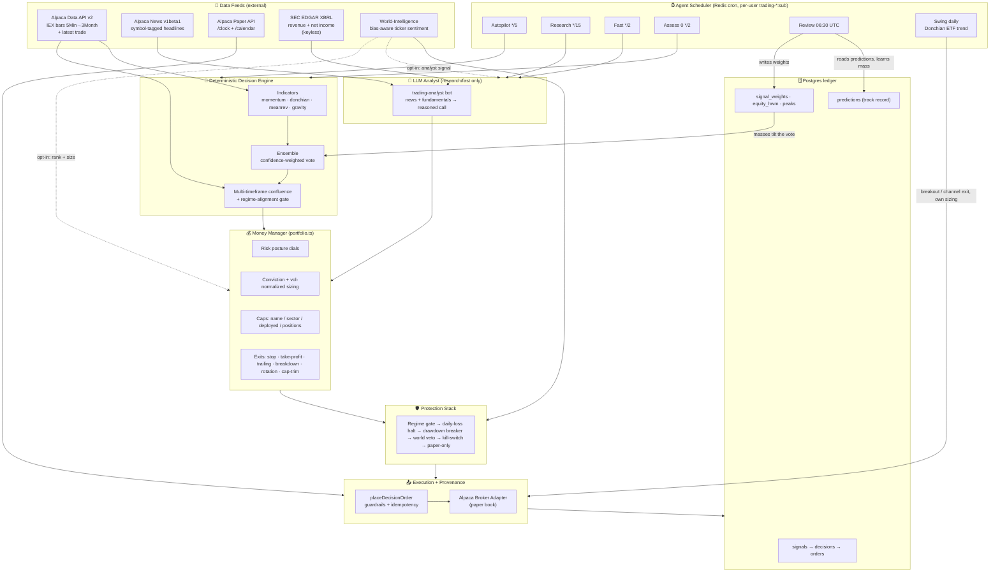
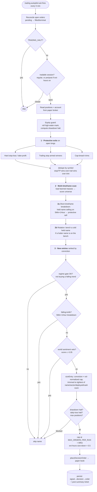
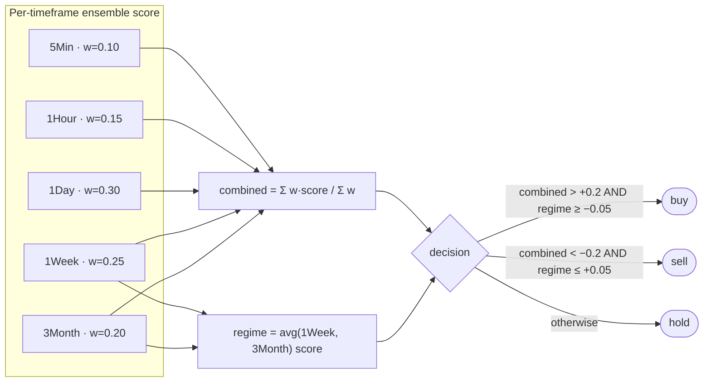
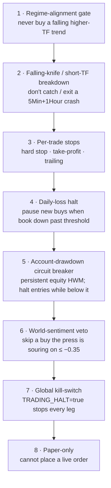
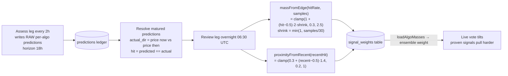
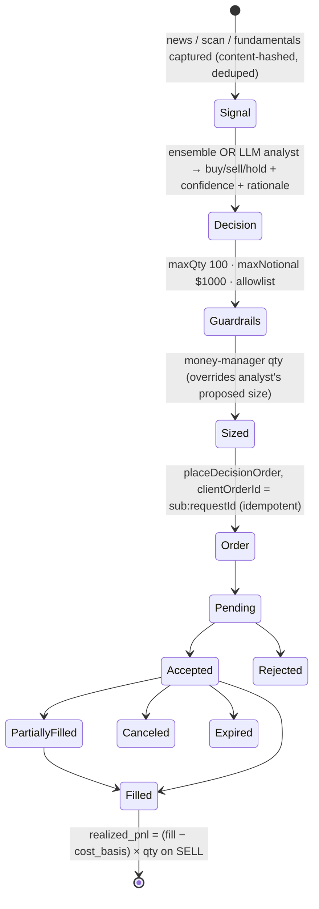

# Trading Advisor — Technical Deep Dive

> **Audience:** an experienced trader evaluating whether this is a sound platform.
> **Scope:** every moving part — data feeds, indicators (including the custom one), the ensemble math,
> the scheduled batch jobs, money management, the protection stack, the self-learning loop, execution,
> and the data model — drawn directly from the code, with an honest soundness assessment at the end.
>
> **Status:** fully built, deployed, running **paper-only**. Autonomous live trading is refused in code
> (ADR-052); a live book stays behind `TRADING_LIVE_ENABLED=true` + an explicit per-order confirm.
> Companion docs: [advisor.md](advisor.md) (as-built reference) and
> [backlog/trading-advisor.md](../../backlog/trading-advisor.md) (tuning backlog).

---

## 1. What it is, in one paragraph

An autonomous equities advisor that reads ~100 large-cap US names across **five timeframes**, scores
each with a **deterministic ensemble of four indicators** (three standard + one custom "gravity"
model), folds the timeframes into one regime-aware call, sizes the trade through a **risk-posture money
manager**, runs a **layered protection stack**, and places paper orders through an accountable
**signal → decision → order** provenance chain. A separate **LLM analyst** leg reads news + SEC
fundamentals for event-driven trades, and a **daily Donchian swing sleeve** runs — on commodity/trend
ETFs — the one edge the team's own walk-forward actually validated (trend held across days). Every night
it scores which signals predicted and **re-weights them**. No randomness on the technical path: same
bars in → same decision out.

---

## 2. System architecture



---

## 3. Data feeds

All market data is **free-tier Alpaca IEX** + **keyless SEC EDGAR**. No paid history feed today — the
single most consequential limitation for validation (see §13).

| Feed | Endpoint | What it provides | Auth | Cadence / limit |
|---|---|---|---|---|
| **Price bars** | `data.alpaca.markets/v2/stocks/bars` | OHLC closes at 5Min/1Hour/1Day/1Week/3Month | API key/secret | Batched: **1 request per timeframe** for the whole universe (`barsBatch`), paginated ≤8 pages |
| **Latest trade** | `…/stocks/{sym}/trades/latest` | Last IEX trade price (entry/exit ref, prediction resolution) | key/secret | per-symbol |
| **News** | `data.alpaca.markets/v1beta1/news` | Symbol-tagged headlines + summaries, newest first | key/secret | freshness window: 20 min (research) / 3 min (fast) |
| **Market clock** | `paper-api.alpaca.markets/v2/clock` | is_open + timestamp | key/secret | session detection |
| **Calendar** | `…/v2/calendar` | day open/close (weekend/holiday aware) | key/secret | cached per day |
| **Fundamentals** | `data.sec.gov/api/xbrl/companyconcept` | Latest-annual (10-K/FY) revenue + net income → YoY growth, net margin | **keyless** (descriptive User-Agent required, else 403) | ticker→CIK map cached for process life |
| **World intelligence** | internal `world:ticker:<sym>` series (TimescaleDB) | per-ticker sentiment, reliability-weighted sentiment, sentiment momentum, **insider** + **congress** buy/sell, short interest, mention velocity, event flags (see §15) | internal | 30-day lookback; richly populated for the trading universe |

**Bar lookback windows** (calendar days requested per timeframe, enough for SMA20/RSI14/Donchian20 to
fire): 5Min → 7d, 1Hour → 45d, 1Day → 220d, 1Week → 1200d, 3Month → 4000d. Bars are
**split/dividend-adjusted** (`adjustment=all`).

> **Note for your buddy:** IEX is a single (≈2–3% of consolidated volume) feed, not SIP. Quotes/last
> can lag and thin names print sparse bars. Fine for a daily/regime strategy; it is **not** a
> microstructure-grade feed, and the doc says so — the "fast" leg explicitly disclaims beating HFT to
> the first tick and only rides continuation.

---

## 4. Scheduled batch jobs (the legs)

All are **per-user Redis cron schedules** (`trading-<leg>:<sub>`) on the shared agent scheduler
(`ENABLE_AGENT_SCHEDULER=true`). They run **in the controller with no user session**. Only the
research/fast legs call an LLM; everything else is pure deterministic code.

| Leg | taskType | Cron | Market-hours? | Trades? | What it does |
|---|---|---|---|---|---|
| **Autopilot** | `trading-autopilot` | `*/5 * * * *` | yes (pre/reg/post) | yes | MTF scan → exits, rotation, conviction-sized entries |
| **Research** | `trading-research` | `*/15 * * * *` | yes | yes | News (≤20 min) + EDGAR → LLM analyst → sized trade; ≤4 LLM calls/fire |
| **Fast** | `trading-fast` | `*/2 * * * *` | yes | yes | Same but only ≤3-min-old headlines; ≤2 LLM calls/fire |
| **Swing** | `trading-swing` | daily, after open | yes | yes | Daily Donchian breakout/exit on commodity-trend ETFs, held across days |
| **Assess** | `trading-assess` | `0 */2 * * *` | **no** (runs overnight too) | **no** | Forecast: writes next-session predictions + raw per-algo predictions; ranked plan ticket |
| **Review** | `trading-review` | `30 6 * * *` | **no** | **no** | Resolves matured predictions → learns per-signal **mass + proximity** |

Each trading run posts one `trading-decision` journal ticket only when it actually traded. Self-skips
quietly when the market is closed or keys are missing.

### The Donchian swing sleeve — the validated-edge leg

This leg is worth a trader's close attention because the codebase positions it as the **honest edge**.
The team's own walk-forward research concluded that the one edge that survives out-of-sample is
**daily trend-following held overnight / multi-day** (a CL Donchian study, +$212k OOS) — and that
*forcing intraday exits throws that edge away*. Alpaca's paper rail can't trade futures, so the sleeve
runs that exact rule on **commodity / trend ETFs** (`USO, BNO, UNG, GLD, SLV, DBC`) as a diversified
proxy that **never overlaps the autopilot's equity universe** (the two sleeves don't fight over a name).

- **Entry:** go long when the latest daily close breaks the prior **20-day** high (`SWING_ENTRY_N`).
- **Exit:** sell the whole position when the close breaks the prior **10-day** low (`SWING_EXIT_N`) — the
  exit is a *trend signal, not the clock*. **Holds across days; no flat-by-close.**
- **Sizing:** fixed **15% of equity** per position (`SWING_ALLOC_PCT`), max **6** simultaneous holds —
  conviction-free, deliberately simple. It **bypasses** the multi-timeframe ensemble, the posture money
  manager, and the autopilot's stop/trail/rotation stack; the channel exit *is* its risk control.
- Paper-only (live refused), runs once daily shortly after the open off completed daily closes, and keeps
  the same `signal → decision → order` provenance via `placeDecisionOrder`.

> **Why this matters for the evaluation:** the autopilot/news legs are the *exploratory* book; this swing
> sleeve is the team's stated *validated* edge. Its existence corroborates the soundness concern in §13
> that the high-turnover `active` autopilot posture churns away return — the developers reached the same
> conclusion and carved the durable trend edge into its own, separate, deliberately low-churn leg.

### One autopilot fire, step by step



---

## 5. The indicators (signals)

Four indicators, all **pure functions of a close series** — `(closes, ctx) → AlgoSignal | null`. An
indicator returns `null` when it has no opinion, so it only votes when it fires. Each emits a
**direction** (`up`/`down`), a **confidence** (0–1), and a human-readable **basis** string.

| Indicator | Type | Fires when | Direction | Confidence formula | Notes |
|---|---|---|---|---|---|
| **momentum** | trend | always (needs ≥20 bars) | close ≥ SMA20 → up | `min(1, abs(gap) × 12)` — saturates ≈ 8.3% gap; gap = (close − SMA20)/SMA20 | the always-on trend vote |
| **donchian** | breakout | close breaks prior-20-bar high/low | breakout → up, breakdown → down | flat **0.7** | classic channel breakout; **no volume filter** |
| **meanrev** | mean-reversion | RSI-14 < 35 or > 65 | oversold → up, overbought → down | `min(1, dist/35)` from the 35/65 band | RSI uses **simple** avg gain/loss (not Wilder's) |
| **gravity** | custom (see §6) | net displacement abs(d) ≥ 0.01 | d > 0 → up, d < 0 → down | `min(1, abs(d) × 2)` | the proprietary signal |

> **The "several indicators + a custom one":** momentum, donchian and mean-reversion are the textbook
> three; **gravity is the custom one.** Note momentum (always on, fast-scaling) and donchian (rare, flat
> 0.7) are not on a common confidence scale — see the soundness notes (§13) — and mean-reversion
> structurally opposes the two trend signals in a strong move.

### The ensemble (folding signals → one call)

A single, reproducible confidence-weighted vote:

```
score = Σ  (dir == up ? +1 : −1) × confidenceᵢ × weightᵢ
w     = Σ  confidenceᵢ × weightᵢ
norm  = score / w                       # signed agreement in [−1, +1]
action = norm > +0.15 → buy
         norm < −0.15 → sell
         else          → hold
```

`weightᵢ` is the **overnight-learned mass** for that indicator (default 1.0 = raw engine). The dead-band
(abs(norm) ≤ 0.15) resolves weak/ambiguous agreement to **hold**.

---

## 6. The custom signal — "gravity" (ADR-054)

The gravity model treats each market force as a **mass** that pulls price, with a **polarity**
(up/down), a **proximity** (coupling strength), and a **half-life** (how fast its pull decays). Net
**displacement** is the damped sum of all pulls, clamped to ±0.6. It is fully deterministic.

**Masses derived from a symbol's own closes (+ SPY as the index):**

| Mass | Condition to add | Magnitude | Polarity | Half-life |
|---|---|---|---|---|
| **trend** | always (≥25 bars) | `min(1, abs(trend) × 6)`; trend = (last − SMA50)/SMA50 | sign(trend) | 30 d |
| **vol-shock** | abs(z) > 1.5 on 21-day return z-score | `min(1, abs(z) / 4)` | sign(z) | 5 d |
| **correlated-index** | abs(corr) > 0.2 vs SPY **and** abs(SPY vs SMA20) > 0.5% | `abs(corr) × min(1, abs(imove) × 8)` | sign(imove)·sign(corr) | 20 d |
| **mean-reversion** | abs(gap) > 8%; gap = (last − SMA20)/SMA20 | `min(1, abs(gap) × 3)` | **opposite** of gap | 10 d |

**Displacement** at day *t*:

```
for each mass m:
    decay = 0.5 ^ ((t − t0) / halfLife)            # exponential time-decay
    c     = polarity × mass × proximity × decay
    pull += c          (or, if antigravity, damp += |c|)
displacement = clamp(pull × (1 − damp), −0.6, +0.6)
```

So gravity is a **multi-factor composite**: trend-following (trend + index pull) blended with a
contrarian mean-reversion pull and a volatility-shock kicker, each fading on its own clock. It mirrors
the research CLIs `scripts/oshal-gravity.js` / `oshal-monitor.js`; this is the in-app production copy.

> **Gravity 1 vs Gravity 2 (deployed 2026-06-26, eval-only).** The live `gravity` above derives its
> masses from **price only** — a shadow of the ADR-054 design, which intended the masses to be
> *real-world events* (news/insider/congress). **Gravity 2** (`gravity-world.ts`) fuses the
> world-intelligence layer in as those masses, with a **calculated proximity** ("a big force far away
> barely moves price; a small force close by moves it a lot") and per-source half-life. It runs
> head-to-head against Gravity 1 in the predictions ledger (eval-only — it trades nothing yet) so the
> overnight review can show whether the world masses add edge. Full spec + status:
> [gravity2-design.md](gravity2-design.md).

---

## 7. Multi-timeframe confluence + regime gate

Each name is scored by the **same ensemble** at five timeframes; the timeframes are combined with fixed
weights that favour the longer, higher-conviction trends.



- **Regime-alignment gate is the primary risk control:** a buy is allowed only when the weekly/quarterly
  regime is **not** bearish (and a sell only when not bullish). The bot never fights the higher
  timeframe. Tolerance is tight (±0.05).
- **Action band:** combined abs(score) must clear **0.2** or it's a hold.
- **Short-timeframe breakdown override:** even when the regime is still up, if a *held* name is decisively
  selling on **both** 5Min and 1Hour (each ≤ −0.34), the autopilot protectively sells it — catching a
  fast news-driven intraday crash the regime-weighted score is too slow to flag.

---

## 8. Money management (portfolio.ts)

A pure, deterministic layer **above** signal generation. The **risk posture**
(`TRADING_RISK_POSTURE`) sets every dial; all cap %s are of account **equity**.

| Posture | per-name | per-sector | deployed | max names | stop | take-profit | trail (arm/give) | daily-loss halt | max drawdown |
|---|---|---|---|---|---|---|---|---|---|
| conservative | 3% | 12% | 30% | 12 | 5% | 12% | 6% / 3% | 2% | 8% |
| balanced *(code default)* | 5% | 22% | 60% | 16 | 9% | 20% | 8% / 4% | 4% | 12% |
| aggressive | 10% | 40% | 95% | 12 | 15% | 35% | 12% / 7% | 7% | 25% |
| **active** *(deployed)* | 3% | 25% | 85% | **32** | 5% | 8% | 5% / 3% | 3% | 10% |

The deployed **`active`** posture is the operator's "many small positions, minimize downside, lots of
turnover" mandate: 32 names × 3% so no single name can hurt the book, an 8% take-profit that frees the
slot so capital **rotates** to the next-best name, a trailing stop (arm +5%, exit on 3% giveback), and a
5% hard stop as a backstop, behind a tight 3% daily-loss halt.

### Position sizing

```
volScale     = clamp(baselineVol / nameVol, 0.25, 1)      # high-vol names sized DOWN (≥25% floor)
perNameRoom  = maxPerNamePct% × equity × volScale
target       = perNameRoom × clamp(confidence, 0.2, 1)    # conviction scales size
notionalCap  = min(target, sectorRoom, totalRoom, cashRoom)
qty          = floor(notionalCap / price)
```

Blocks (returns qty 0 + reason): already holding, max positions reached, **daily-loss halt** (open book
down past the posture's threshold), sector/deployed/cash room < 1 share.

> **Important inconsistency:** the **autopilot** computes 14-day realized vol and passes it (vol-scaling
> active), but the **research/fast (news) legs size without it** — the most volatile entries skip the
> downside normalization. Tracked as backlog item #3.

### Exits, in priority order each fire

1. **Hard stop-loss** / **take-profit** (`exitsToRun`) — stop widened ×1.4 in thin pre/post sessions.
2. **Trailing stop** (`trailingExits`) — armed winners only; sell on giveback from a persisted peak.
3. **Cap-breach trim** (`rebalanceTrims`) — partial-sell a name that ran past its per-name cap.
4. **Short-timeframe breakdown** — protective full exit (§7).
5. **Rotation bench** (`rotationBenches`) — "coach the team": bench a cold held name (strength < 0.15)
   when a hotter name (≥ 0.30, beating it by ≥ 0.25) sits on the bench; churn-capped per fire.

A high-water-mark **peak store** (per symbol) gives the trailing stop memory across fires.

---

## 9. Protection stack

In escalation order — eight independent layers:



Layers 4 and 5 are distinct: the **daily-loss halt** is intraday open-P&L (resets), the **drawdown
breaker** is a persistent high-water-mark in its own table (`oshal_trading_equity_hwm`). Both halt *new
entries only* — exits always run.

Layer 6 (world-sentiment) is the only *information* gate here, and in the baseline it is purely
**defensive** — a veto/tilt off a single `sentiment` metric on the autopilot only. An opt-in path turns
the much richer world layer into a *positive* signal as well; see **§15**.

---

## 10. The self-learning loop (mass + proximity)

The system tunes its own indicator weights nightly. This is what makes "gravity" adaptive rather than
static.



- **MIN_SAMPLES = 10** before an indicator is learned from at all (don't learn from noise).
- **Mass** is the overall predictive edge, **shrunk toward 1.0** by sample size so a lucky handful can't
  over-tilt. >50% hit → mass >1 (pull harder); <50% → mass <1. Clamped to [0.3, 2.5].
- **Proximity** is the *recent* (30-day) edge — meant as the recency correction.
- Additive and self-tuning: **no data → mass 1.0 → raw engine.** Sharpens over the first several days as
  18-hour predictions mature. Posts a "🧠 Overnight signal review" ticket each run.

> **Two findings your buddy should know (both in the backlog):**
> 1. **Proximity is computed, stored, and reported but never reaches a live trade** — `loadAlgoMasses`
>    selects only `mass`. The system's only recency mechanism is currently disconnected (backlog #1).
> 2. **Learning optimizes direction hit-rate, not P&L/expectancy.** An indicator right 55% of the time
>    whose 45% wrong calls are the big losers still gets mass > 1. Resolution is purely `price now >
>    price then` over the horizon — magnitude is ignored (backlog #2).

---

## 11. Execution + provenance

Every order is required by the route to carry a persisted **decision**, which references a **signal** —
the `signal → decision → order` invariant (ADR-052/053). The broker adapter only executes; justification
is enforced upstream.



- **Dual book:** paper and live are *separate adapter instances* pointed at physically different
  accounts (distinct URLs + keys), not a flag. A paper bug cannot touch a live account. Live is gated.
- **Idempotency:** `clientOrderId = sub:requestId` — the same id never places a second order. The autopilot
  buckets requestIds per minute.
- **Extended hours:** Alpaca rejects market orders off-RTH, so in pre/post sessions `placeDecisionOrder`
  converts to a **marketable limit (day, extended_hours)** with a slippage buffer (0.3% default) to
  cross the wider spread; entries are also size-halved off-hours.
- **In-flight accounting:** working pre/post limit orders that `getPositions()` can't see are read from
  the ledger (`loadInFlight`) so the bot doesn't re-buy the same name every fire and drive cash negative
  (a fixed pyramiding bug).
- **Realized P&L:** on a SELL the position's avg entry is snapshotted as `cost_basis` *before* it fills,
  so per-sale realized P&L is computable on fill.
- **Reconciliation:** every autopilot fire first reconciles open orders (pending → filled/terminal) so
  the ledger doesn't freeze at `pending` while Alpaca has moved on.

---

## 12. Data model

Self-healing schema (`CREATE TABLE IF NOT EXISTS`, mirrors migration 034). Seven tables:

| Table | Holds | Key columns |
|---|---|---|
| `oshal_trading_signals` | every captured signal (news/scan/fundamentals/algo) | source, symbols, indicators JSONB, **content_hash** (unique → dedup) |
| `oshal_trading_decisions` | reasoned calls | signal_ids[] (≥1 enforced), action, side, qty, confidence, rationale, guardrails |
| `oshal_trading_orders` | placed orders | decision_id (FK), **client_order_id** (unique → idempotent), status, filled_qty, cost_basis, realized_pnl |
| `oshal_trading_predictions` | per-algo + ensemble forecasts | algo, pred_dir, horizon_hrs, resolved, actual_dir, **hit** |
| `oshal_trading_signal_weights` | learned weights | algo (PK), mass, proximity, hit_rate, samples |
| `oshal_trading_equity_hwm` | drawdown breaker state | (user_sub, mode) PK, high_water_mark, last_equity |
| `oshal_trading_peaks` | trailing-stop memory | per-symbol high-water price |

Observability: `GET /api/trading/recommendations` (live ranked plan), `GET /api/trading/algo-stats`
(per-signal hit-rate), the `trading-decision` tickets (journal), and the raw tables.

---

## 13. Soundness assessment (the honest part)

**What is genuinely sound:**

- **Deterministic, reproducible, auditable.** No randomness on the technical path; every order chains
  back to a logged signal + rationale. This is rare and good — a trader can reconstruct exactly *why*
  any trade happened.
- **Risk architecture is real, not cosmetic.** Regime gate + multi-layer stops + two distinct halts
  (daily + drawdown HWM) + per-name/sector/deployed caps + vol-normalized sizing + a hard kill-switch.
  The protection stack is more thought-through than most retail bots.
- **Provenance + dual-book separation + idempotency** are production-grade engineering. Paper genuinely
  cannot place a live order.
- **Self-tuning weights** with sample-shrinkage is a sensible design.
- **Intellectual honesty about edge.** The team separated the *validated* trend edge into its own
  low-churn **Donchian swing sleeve** (§4) rather than pretending the intraday autopilot is the proven
  money-maker. That self-awareness is a good sign about how the platform is reasoned about.

**Where a trader should be skeptical:**

| # | Concern | Why it matters |
|---|---|---|
| 1 | **Validated only on ~149 daily bars, one regime** | Free IEX history ≈ 7 months, daily-only, fills at close, **no slippage/commission**. The backtest is a logic/risk sanity check, **not** an edge claim. |
| 2 | **The deployed `active` posture is the *worst* in-sample** | Backtest: active +5.6% vs balanced +10.5% / aggressive +19.7% / SPY +8.2%. The live posture underperformed buy-and-hold in the only test window — turnover is eating the edge. |
| 3 | **Learning targets hit-rate, not expectancy** | High win-rate with fat-tailed losers can still be net-negative; the weights would reward it. |
| 4 | **Proximity (recency) is disconnected** | The only mechanism to fade a signal that *stopped* working never reaches a trade. |
| 5 | **Uncalibrated confidence scales** | momentum dominates the vote and drives position size; donchian's flat 0.7 and the cross-indicator scales aren't normalized to historical reliability. |
| 6 | **Mean-reversion fights the trend signals** | RSI-buy-the-dip vs momentum/donchian/regime in a downtrend; dilutes signal, and mean-reversion in trends is a classic loser. No ADX/regime filter decides which regime each indicator should speak in. |
| 7 | **No volume confirmation on breakouts; non-standard RSI** | Donchian fakeouts pass; RSI thresholds are bespoke (simple-average, not Wilder's). |
| 8 | **IEX, not SIP; daily-dominant decision core** | Intraday timeframes are underweighted (5Min = 0.10) yet the deployed posture is high-turnover — a tension between the strategy's intent and its decision weights. |

> **Update (2026-06-26):** concerns **#3, #4** and the world-data gap now have **opt-in fixes** wired and
> deployed, all **off by default** (so the baseline above is unchanged until enabled): P&L-expectancy
> learning (`TRADING_LEARN_EXPECTANCY`), proximity-weighted ensemble (`TRADING_USE_PROXIMITY`), and the
> world-intelligence inputs (`TRADING_WORLD_SIGNALS`/`TRADING_WORLD_RANK`, plus the eval-only **Gravity 2**
> world-mass model, §6). They are **live-forward paper experiments** — concern #1 (no multi-regime
> history) still blocks proving any of them. See [backlog/trading-advisor.md](../../backlog/trading-advisor.md)
> and [gravity2-design.md](gravity2-design.md).

**Bottom line for evaluation:** the *engineering* is sound and the *risk framework* is genuinely
defensive. The *alpha* is unproven — it has never been tested across multiple regimes, with realistic
costs, or against an expectancy (not hit-rate) objective, and the currently-deployed posture is the one
that performed worst in the limited test available. Treat it as a well-built, well-guarded **paper
research platform**, not a validated money-maker. The concrete next steps to change that verdict are in
[backlog/trading-advisor.md](../../backlog/trading-advisor.md) (a paid multi-regime history feed, item #18, is
the unlock for honestly deciding items #2, #5, #6).

---

## 14. Tunable knobs (env)

| Var | Default | Effect |
|---|---|---|
| `TRADING_RISK_POSTURE` | `balanced` (deployed `active`) | conservative / balanced / aggressive / active |
| `TRADING_EXTENDED_HOURS` | **off** (2026-07-12) | trade pre/post-market. **Off because it cannot be priced:** the free Alpaca plan is IEX-only and IEX operates 08:00–17:00 ET, printing *zero* trades 04:00–07:59 and 17:00–19:59, so an ext-hours limit (priced off `latestTrade()`) has nothing to price against. Measured in the order ledger: 529 of 593 extended-hours orders never filled (17:00–20:00 = **0.0%**) vs **97%** regular-session. Re-enable only with real-time SIP — see the [strategy log](./strategy-log.md). |
| `TRADING_EXT_LIMIT_SLIPPAGE_PCT` | 0.3 | how hard ext-hours limits cross the spread |
| `TRADING_EXT_STOP_MULT` | 1.4 | widen stop/trail in thin sessions |
| `TRADING_EXT_SIZE_MULT` | 0.5 | size-down factor off-hours |
| `TRADING_BASELINE_VOL_PCT` | 2 | baseline for volatility-normalized sizing |
| `TRADING_HALT` | off | **kill-switch** — stop every trade leg |
| `TRADING_MAX_QTY` / `TRADING_MAX_NOTIONAL_USD` | 100 / 1000 | hard per-order guardrails |
| `TRADING_SYMBOL_ALLOWLIST` | (all) | restrict to a symbol set |
| `TRADING_ALGO_QTY` | 1 | fixed qty for the deterministic algo path |
| `TRADING_LIVE_ENABLED` | off | the (separately-gated) live book |
| `TRADING_WORLD_SIGNALS` | off | feed the world basket (sentiment, insider, congress, momentum) to the news-cycle analyst (§15) |
| `TRADING_WORLD_RANK` | off | blend the world score into autopilot entry ranking + sizing (§15) |
| `TRADING_WORLD_RANK_WEIGHT` | 0.25 | how hard the world score moves entry rank (added to the 0–1 confidence) |
| `TRADING_LEARN_EXPECTANCY` | off | overnight review learns signal weights from realized P&L expectancy, not hit-rate (concern #3) |
| `TRADING_USE_PROXIMITY` | off | live ensemble weights by mass × proximity (recency), not mass alone (concern #4) |
| `TRADING_EXPECTANCY_REF_PCT` | 1.0 | avg return % that maps to a full weight tilt |
| `BROKER_PROVIDER` | alpaca | execution rail (schwab/snaptrade/ibkr declared, not implemented) |
| `ENABLE_AGENT_SCHEDULER` | — | must be true for the legs to fire |

## 15. World-intelligence integration (baseline + opt-in)

The platform runs a separate **world-intelligence** layer that computes a deep per-ticker series in
TimescaleDB (`world_metrics`): news sentiment, reliability-weighted sentiment, sentiment momentum,
**insider** and **congressional** buy/sell, short interest, mention velocity, and event flags
(earnings / M&A / guidance / legal). For the ~100-name universe this is live and rich — hundreds of
thousands of sentiment points, refreshed continuously.

### How much of it drives trades in the baseline

Honestly, very little — and a trader should know this:

- The **autopilot** reads exactly one metric (`sentiment`) and uses it only **defensively** — a veto
  on a buy when 30-day sentiment ≤ −0.35, plus a small ±40% size tilt. It never originates a trade and
  never gates a sell.
- The **research/fast (news-cycle) legs read none of it** — those decisions are Alpaca headlines +
  EDGAR fundamentals + the LLM analyst only.
- The smart-money signals (insider, congress, short interest) and the sentiment-momentum/event flags
  drive **zero** trades. So the deepest data asset on the platform is its most under-used.

### Opt-in wiring (off by default, A/B-ready)

Two flags make the world layer a first-class input without changing the baseline until enabled:

| Flag | Default | Effect |
|---|---|---|
| `TRADING_WORLD_SIGNALS` | off | The research/fast analyst is handed a `world` signal row (the blended score + the insider/congress/sentiment-momentum basket) to reason over alongside the headline. |
| `TRADING_WORLD_RANK` | off | The autopilot blends the world score into entry **ranking** and **sizing** — a positive conviction input, not just the existing veto. |
| `TRADING_WORLD_RANK_WEIGHT` | 0.25 | How hard the world score moves the entry rank (added to the 0–1 confidence). |

The **blended score** is a weighted fold of whatever components have data — news sentiment (0.35),
reliability-weighted sentiment (0.20), sentiment momentum (0.15), insider (0.20), congress (0.10) —
renormalized over the present components and clamped to minus-one-to-plus-one. Both paths preserve the
`signal → decision → order` provenance chain (the world read is captured as a real signal row).

### Efficiency

A naive per-candidate read would issue eight metric queries per name per 5-minute fire, each
re-scanning the 30-day window (~44–67 ms apiece even after indexing, because popular names carry tens
of thousands of points). The implementation instead does **one batched query** for the whole candidate
set (a single `GROUP BY entity, metric`), backed by a new composite index on `(entity, metric, ts)`.
That is roughly a **20× reduction** in database work versus the naive path and one round-trip instead
of dozens. If the signals prove out and run permanently, a Timescale **continuous aggregate** would
make these reads effectively free by pre-aggregating at ingest time.

## 16. Source map

- **Engine:** [src/features/trading/services/](../../../src/features/trading/services/) — `algorithms.ts`
  (indicators + ensemble + gravity), `multi-timeframe.ts` (confluence + regime gate),
  `portfolio.ts` (money manager), `market-data.ts` (Alpaca feeds), `fundamentals.ts` (EDGAR),
  `broker-adapter.ts` / `alpaca-broker-adapter.ts` / `broker-provider.ts` (execution).
- **Legs (batch jobs):** [src/app/](../../../src/app/) — `trading-schedule-dispatch.ts` (autopilot),
  `trading-research-dispatch.ts` (research/fast LLM), `trading-swing-dispatch.ts` (Donchian swing sleeve),
  `trading-assess-dispatch.ts` (forecast), `trading-review-dispatch.ts` (learning), plus
  `trading-equity-guard.ts`, `trading-signal-weights.ts`, `trading-peaks-store.ts`, `trading-reconcile.ts`.
- **World-intelligence wiring:** `trading-world-signals.ts` (basket read + blended score + the two A/B
  flags) → consumed by `trading-research-dispatch.ts` (analyst) and `trading-schedule-dispatch.ts`
  (autopilot ranking); batched read + index live in
  [world-intelligence-service.ts](../../../src/features/world-data/world-intelligence-service.ts).
- **Gravity 2 (world-mass model):** `gravity-world.ts` (deriveWorldMasses + calculated proximity + config),
  `algorithms.ts` `gravity2Signal`, `trading-world-masses.ts` (batched snapshot), recorded head-to-head by
  `trading-assess-dispatch.ts`; diagnostics `scripts/oshal-gravity2-today.ts` / `oshal-gravity2-backtest.ts`.
  Spec: [gravity2-design.md](gravity2-design.md).
- **Routes/provenance** (carved to the store package per ADR-085): [trading-routes.ts](https://github.com/emeraldcoastsystemsgroup/oshal-applications/blob/main/trading/src-routes/trading-routes.ts),
  [trading-autopilot-routes.ts](https://github.com/emeraldcoastsystemsgroup/oshal-applications/blob/main/trading/src-routes/trading-autopilot-routes.ts).
- **ADRs:** [052 — stock trading swarm](../../adr/052-stock-trading-swarm.md),
  [053 — trading decision workflow](../../adr/053-trading-decision-workflow.md), 054 — gravity model.
```
