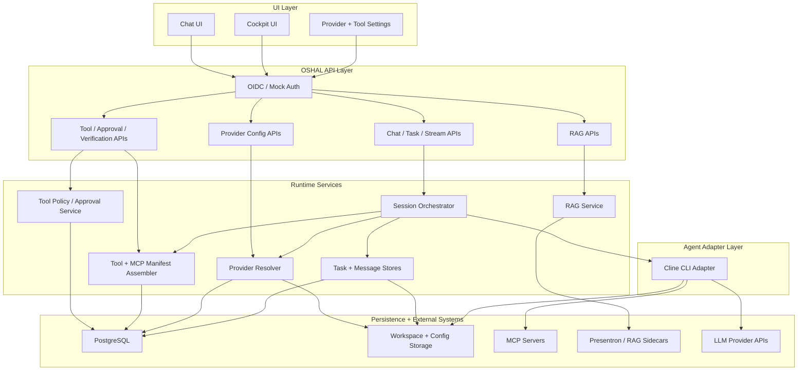
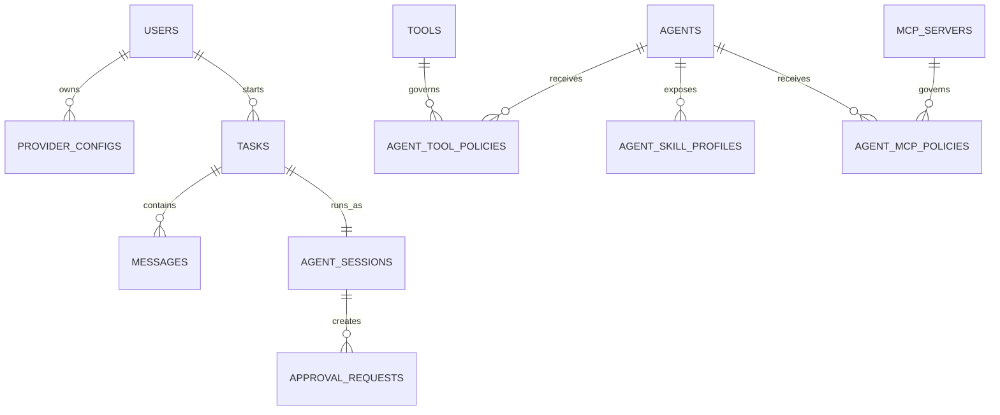
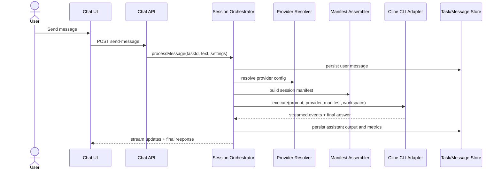
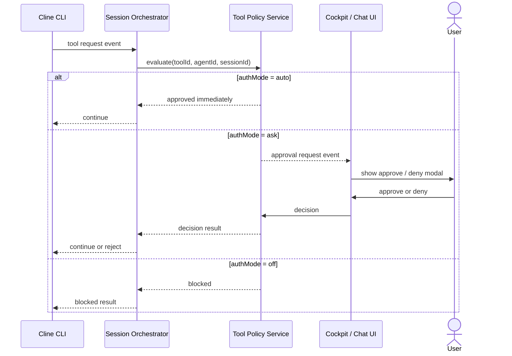
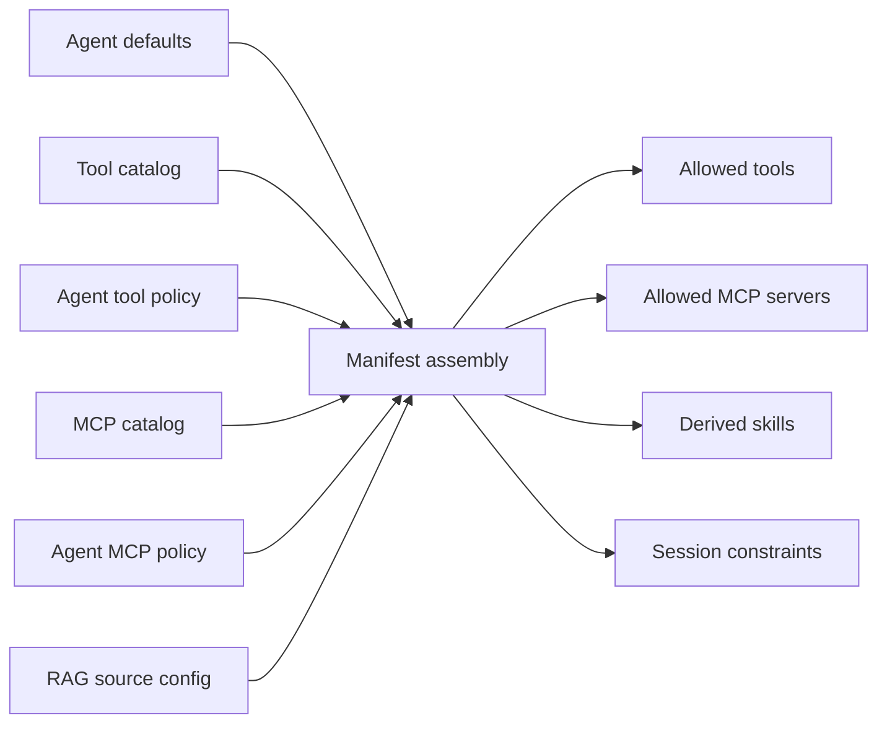
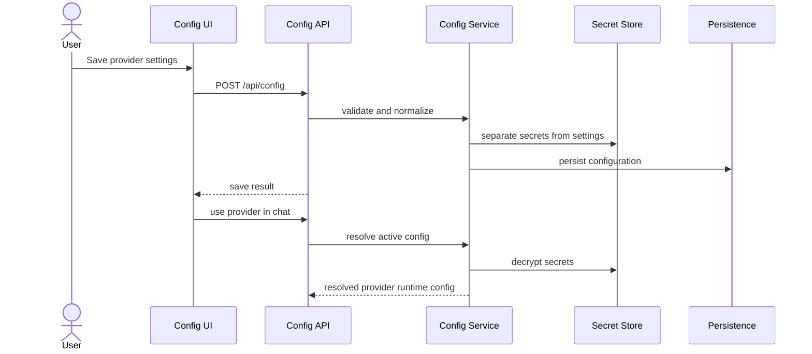
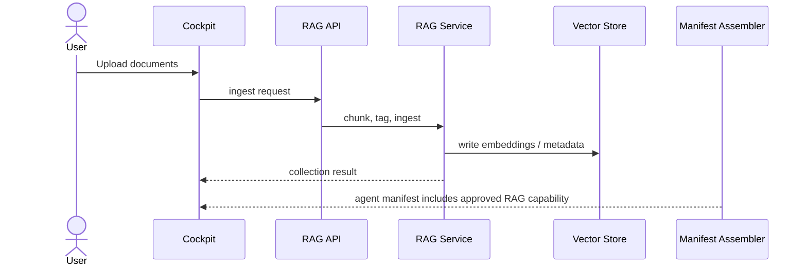

# OSHAL Agent Runtime Design And Implementation Plan

## Purpose

This document defines the **actual target architecture** for OSHAL based on:

- the current TypeScript control-plane codebase
- the existing any-bot runtime behavior
- the accepted ADR set
- the clarified requirement that **Cline CLI owns tool selection inside the agent loop**

The central correction is:

> OSHAL should not build its own independent tool-selection brain.
> OSHAL should build the framework around the agent:
> provider configuration, task/session lifecycle, workspace policy, tool and MCP catalog, authorization rules, manifest assembly, RAG integration, chat APIs, and cockpit UX.

## Executive Summary

The target system is a **single-agent-first runtime framework** that can later expand to multi-agent orchestration without rewriting the core contracts.

In the target design:

- **Cline CLI** is the execution engine for the primary agent.
- **OSHAL** is the control plane and runtime shell around that engine.
- **Tool selection** is performed by Cline CLI from the manifest it receives.
- **OSHAL** determines which tools and MCP endpoints are allowed, configured, visible, and auditable.
- **Chat, settings, theme, login/logout, history, provider config, tool config, agent skills, RAG ingestion, and real model responses** are all first-class framework responsibilities.

The implementation should prioritize a working vertical slice:

1. Provider config resolves correctly.
2. A chat session can invoke Cline CLI.
3. The session passes an approved tool and MCP manifest.
4. Tool approvals and policy are enforced by OSHAL.
5. Cockpit and chat UI expose settings, history, and configuration cleanly.

## Goals

- Deliver a normalized runtime shell around Cline CLI.
- Preserve plug-and-play provider, tool, and MCP configuration.
- Make agent capabilities understandable in the UI through skills and metadata.
- Keep the system locally testable with mock authentication.
- Leave a clean migration path for additional agent adapters later.

## Non-Goals

- Building a second tool-planning engine outside Cline CLI.
- Recreating legacy swarm routing before single-agent runtime is stable.
- Implementing advanced multi-agent orchestration in the first pass.
- Treating UI placeholders as completed runtime integration.

## Corrected Responsibility Boundary

| Area | Owned By | Notes |
|------|----------|-------|
| LLM/tool reasoning loop | Cline CLI | Chooses when and how to use tools from the supplied manifest |
| Provider credentials and model selection | OSHAL | Per-user or per-agent configuration, secret handling, runtime resolution |
| Task/session lifecycle | OSHAL | Task IDs, status, history, streams, persistence |
| Workspace policy and isolation | OSHAL | Decides workspace path and safety boundary passed to the agent |
| Tool catalog | OSHAL | Registry, metadata, categories, auth groups, verification state |
| Tool authorization | OSHAL | `auto` / `ask` / `off`, approval UX, audit trail |
| MCP availability | OSHAL | Registers allowed MCP servers/endpoints and exposes them to agent sessions |
| RAG ingestion and retrieval plumbing | OSHAL | Indexing, collection metadata, retrieval policy, UI |
| Tool execution choice | Cline CLI | Executes from allowed tools and MCPs |
| Skills and capability badges | OSHAL | Derived from enabled tools and configuration for UX and policy |
| Theme/settings/login/history UX | OSHAL | Cockpit and chat application responsibilities |

## User-Facing Functional Scope

The target feature set for the first real runtime release is:

1. A user can log in locally with mock auth or through real OIDC.
2. A user can select or save provider/model settings.
3. A user can open chat and send messages to the primary agent.
4. The runtime resolves the correct provider configuration and agent workspace.
5. The runtime assembles an allowed tool and MCP manifest.
6. Cline CLI receives that manifest and performs the agentic loop.
7. Tool requests in `ask` mode generate approval UX and audit events.
8. Chat history, session state, and stream events are visible in the UI.
9. RAG ingestion and retrieval are available as approved capabilities.
10. The cockpit exposes theme, logout, settings, provider config, tool config, history, and health.
11. Skills shown for the agent are derived from enabled tools and configured integrations.

## Layer Model

The current language of "Layer 0" and "Layer 1" still works if it is simplified.

### Layer 0: Provider And Runtime Substrate

This layer answers:

> How does OSHAL resolve provider credentials, models, prompts, and request contracts for an agent session?

Responsibilities:

- provider metadata registry
- provider configuration persistence
- secret storage and redaction
- runtime provider resolution
- prompt and model metadata
- token and cost reporting
- provider health and test connection

### Layer 1: Agent Runtime Governance

This layer answers:

> What can the agent do in this session, in this workspace, for this user, with which tools and MCPs?

Responsibilities:

- session and task orchestration
- workspace assignment
- tool catalog and auth policy
- MCP registry exposure
- tool manifest assembly
- approval workflow
- skill derivation
- streaming and chat session state
- RAG and sidecar capability wiring

### Layer 2: Agent Adapter Layer

This layer answers:

> How do we run a specific agent engine behind a stable framework contract?

Responsibilities:

- Cline CLI adapter
- future agent adapters
- input/output normalization
- execution telemetry
- workspace handoff

### Layer 3: Cockpit And Configuration UX

This layer answers:

> How does a human configure, monitor, and interact with the runtime?

Responsibilities:

- chat page
- cockpit page
- provider configuration screens
- tool configuration screens
- settings, theme, history, logout
- approval modals

## High-Level Architecture



## Canonical Runtime Model

The runtime should be organized around a small set of stable contracts.

### 1. Agent Session

```ts
interface AgentSession {
  sessionId: string;
  taskId: string;
  userId: string;
  agentId: string;
  workspacePath: string;
  providerConfigId: string;
  settings: SessionSettings;
  skillProfile: SkillProfile;
  manifest: AgentManifest;
}
```

### 2. Agent Manifest

```ts
interface AgentManifest {
  tools: ToolManifestEntry[];
  mcpServers: MCPManifestEntry[];
  ragSources: RAGSourceEntry[];
  capabilities: string[];
  constraints: SessionConstraints;
}
```

### 3. Tool Manifest Entry

```ts
interface ToolManifestEntry {
  toolId: string;
  name: string;
  description: string;
  source: 'cli' | 'api' | 'mcp';
  authMode: 'auto' | 'ask' | 'off';
  enabled: boolean;
  skills: string[];
  executionContract: Record<string, unknown>;
}
```

### 4. Cline Adapter Contract

```ts
interface AgentAdapter {
  execute(input: AgentExecutionInput): Promise<AgentExecutionResult>;
}

interface AgentExecutionInput {
  workspacePath: string;
  prompt: string;
  systemPrompt: string;
  providerConfig: ResolvedProviderConfig;
  manifest: AgentManifest;
  settings: SessionSettings;
}
```

## Key Design Principle

The manifest is the **framework-to-agent contract**.

OSHAL should not decide:

- which tool the model should call first
- whether the model should use CLI or MCP first
- what internal step plan the model should generate

OSHAL should decide:

- which tools are present
- which MCPs are present
- which tools require approval
- which tools are hidden or blocked
- which skills and capabilities can be advertised

## Core Components

### Provider Configuration Service

Responsibilities:

- save provider settings and secrets
- resolve active provider for a session
- test provider connectivity
- support user-level and optional agent-level overrides

Design note:

- The current filesystem-backed config routes can remain as an interim store.
- The target contract should be storage-agnostic so persistence can move to PostgreSQL cleanly.

### Tool Catalog Service

Responsibilities:

- register all available tools and sidecar integrations
- store categories, auth groups, descriptions, skills, verification state
- expose searchable metadata to the UI

Design note:

- This is still required even if Cline CLI handles tool selection.
- The catalog is the source of truth for **what may be exposed** to the agent.

### Tool Policy And Approval Service

Responsibilities:

- resolve `auto`, `ask`, and `off`
- create approval requests
- store audit events
- bridge approval responses back to the active session

### Manifest Assembly Service

Responsibilities:

- replace the current notion of "selector composition" as the main runtime value
- build the allowed tool and MCP manifest for a specific session
- derive skills from the enabled manifest

Design note:

- The existing selector-composition service should be reframed as **manifest assembly + skill derivation**.
- Skills remain useful for UI and future routing, but not as a substitute for agent-side tool planning.

### Cline CLI Adapter

Responsibilities:

- normalize prompt, workspace, provider, and manifest into the shape Cline CLI needs
- capture tool use events, stdout/stderr, token/cost metrics, and final answer
- enforce workspace path constraints from OSHAL

### Session Orchestrator

Responsibilities:

- create or resume task/session
- gather provider config
- gather tool/MCP manifest
- invoke the adapter
- persist messages and stream events
- handle approval pauses and resumptions

## Target Data Model



Recommended entities:

| Entity | Purpose |
|--------|---------|
| `provider_configs` | Saved provider/model/secret config |
| `agents` | Runtime agent definitions and defaults |
| `tools` | Tool catalog |
| `mcp_servers` | MCP catalog |
| `agent_tool_policies` | Per-agent tool policy |
| `agent_mcp_policies` | Per-agent MCP policy |
| `tasks` | Chat task/session records |
| `messages` | User and assistant history |
| `approval_requests` | Approval workflow records |
| `agent_skill_profiles` | Cached derived skills and capability badges |

## API Surface

### Chat And Session APIs

| Method | Endpoint | Purpose |
|--------|----------|---------|
| `POST` | `/api/tasks` | Create or resume a chat task |
| `POST` | `/api/messages/send-message` | Send message into a session |
| `GET` | `/api/tasks/:taskId` | Task status and metadata |
| `GET` | `/api/:taskId/messages` | Message history |
| `GET` | `/api/stream/:taskId` | SSE stream for task events |

### Provider APIs

| Method | Endpoint | Purpose |
|--------|----------|---------|
| `GET` | `/api/providers` | Provider metadata registry |
| `GET` | `/api/config` | Current saved config |
| `POST` | `/api/config` | Save provider config |
| `POST` | `/api/config/test` | Test provider connection |

### Tool And Capability APIs

| Method | Endpoint | Purpose |
|--------|----------|---------|
| `GET` | `/api/tools` | Tool catalog |
| `PUT` | `/api/agents/:agentId/tools/:toolId` | Tool auth mode |
| `GET` | `/api/agents/:agentId/manifest` | Effective tool and MCP manifest |
| `GET` | `/api/agents/:agentId/skills` | Derived skills and capability badges |
| `POST` | `/api/approvals/:requestId/approve` | Approve tool action |
| `POST` | `/api/approvals/:requestId/deny` | Deny tool action |

### RAG And Sidecar APIs

| Method | Endpoint | Purpose |
|--------|----------|---------|
| `POST` | `/api/rag/ingest` | Upload knowledge assets |
| `GET` | `/api/rag/search` | Search or inspect collections |
| `GET` | `/api/presentations/health` | Sidecar health |
| `POST` | `/api/presentations/generate` | Presentation generation |

## Process Flows

### 1. Chat Message Processing



### 2. Tool Approval Flow



### 3. Manifest Assembly Flow



### 4. Provider Config Save And Resolve Flow



### 5. RAG Capability Flow



## Current Codebase Mapping

### Keep

- provider registry and provider metadata
- OIDC plus mock auth
- task/message/stream routes
- cockpit UI shell
- RAG service and presentation integration
- tool catalog and verification foundations

### Refactor

- `selector-composition` into **manifest assembly + skill derivation**
- provider config persistence behind a formal service contract
- `composition-root` so chat uses real manifest assembly instead of stubs
- voice frontend services so browser-only code does not leak into server compilation

### Replace Or Retire

- the idea of a framework-owned tool selector
- any code path that treats tool policy as disconnected from live chat execution
- duplicate or placeholder runtime abstractions that never reach Cline CLI

## Gap Analysis Against Current State

| Area | Current State | Required State |
|------|---------------|----------------|
| Provider metadata | Present | Keep |
| Provider runtime resolution | Partial | Formal service with stable session contract |
| Provider persistence | File-backed and route-centric | Service-backed, storage-agnostic |
| Chat orchestration | Present | Wire to real manifest + adapter |
| Tool catalog | Present | Keep and normalize |
| Tool policy | Present in API layer | Must affect live chat sessions |
| Manifest assembly | Partial and selector-oriented | Runtime manifest-oriented |
| Cline adapter boundary | Partial | Formal adapter contract |
| Skills | Metadata only | Derived from enabled manifest and surfaced in UI |
| RAG | Present as sidecar integration | Integrate into manifest and session policy |
| Cockpit configuration UX | Mostly present | Connect to final runtime contracts |

## Recommended Implementation Phases

### Phase 1: Architecture Alignment

Deliverables:

- formalize the corrected boundary in docs and ADRs if needed
- rename the runtime concept from selector framework to manifest assembly where appropriate
- define canonical session, manifest, approval, and adapter contracts

Acceptance:

- no ambiguity remains about who selects tools
- design doc accepted as source of truth

### Phase 2: Provider Configuration Foundation

Deliverables:

- `ProviderConfigService`
- `ResolvedProviderConfig` contract
- support for save, load, test, and resolve
- persistence abstraction over current file-backed storage

Acceptance:

- chat can resolve one active provider configuration deterministically
- secrets remain redacted in logs and API responses

### Phase 3: Cline CLI Adapter

Deliverables:

- `ClineAgentAdapter`
- normalized execution input/output model
- workspace path handoff
- event capture for tokens, tool events, errors, and final output

Acceptance:

- one chat request can run end to end through the adapter
- task history and stream events persist correctly

### Phase 4: Tool Policy And Manifest Assembly

Deliverables:

- manifest assembly service for tools, MCPs, RAG sources, and constraints
- approval policy service
- skills derivation service
- session manifest endpoint for inspection

Acceptance:

- enabled tools appear in manifest
- disabled tools do not appear
- `ask` mode produces approval requests in the UI

### Phase 5: Chat Runtime Integration

Deliverables:

- replace `getTools: () => []`
- replace stub executor paths with adapter-driven session execution
- connect approvals to active sessions

Acceptance:

- live chat uses real provider config and real manifest
- at least one approved tool path works in a real chat flow

### Phase 6: Cockpit And Configuration UX Hardening

Deliverables:

- provider config screen aligned to final config contract
- tool config and skill visibility in cockpit
- history, theme, logout, and session settings completion
- auth boundary fixes for cockpit static assets

Acceptance:

- user can configure provider, inspect tools, chat, and approve tool actions from localhost

### Phase 7: RAG And Sidecar Capability Integration

Deliverables:

- RAG collections exposed as session capabilities
- presentron and RAG represented consistently in the tool catalog
- UI affordances for ingestion and status

Acceptance:

- RAG and presentation capabilities appear in the same policy and manifest model as other tools

### Phase 8: Testing And Stabilization

Deliverables:

- Playwright coverage for chat, cockpit, approval flow, provider config, and tool configuration
- compile-clean separation between browser and server code
- runtime logging audit

Acceptance:

- required Playwright suites pass
- TypeScript compile passes for the server and browser targets
- local mock-auth workflow is fully testable

## Workstream Breakdown

| Workstream | Primary Outcome | Blocking Dependencies |
|-----------|------------------|------------------------|
| Provider config | Resolved provider for sessions | None |
| Agent adapter | Real Cline execution boundary | Provider config |
| Manifest assembly | Allowed tools and MCPs per session | Tool catalog and policies |
| Approval flow | `ask` mode UX and session control | Manifest assembly |
| Chat integration | End-to-end runtime | Adapter + manifest + provider config |
| Cockpit integration | Human-operable runtime | Chat integration + auth |
| RAG integration | Approved retrieval capabilities | Manifest assembly |

## Risks And Mitigations

| Risk | Impact | Mitigation |
|------|--------|------------|
| Framework and agent boundary stays fuzzy | Rework and duplicated logic | Freeze the adapter contract early |
| Tool policy does not reach live chat | Tool UI becomes cosmetic | Make manifest assembly a hard chat dependency |
| Provider config remains route-centric | Session bugs and inconsistent behavior | Introduce service layer before expanding providers |
| Browser-only code leaks into server build | CI instability | Split browser services from backend feature exports |
| Cockpit auth remains bypassable | Security and design contradiction | Fix route protection before claiming production readiness |

## Definition Of Done For The First Real Runtime Release

The first real runtime release is complete when all of the following are true:

1. A user can authenticate locally with mock auth and open cockpit and chat.
2. A user can configure and save provider/model settings.
3. A chat session invokes Cline CLI through a formal adapter.
4. The session uses a real manifest assembled from policy, tools, MCPs, and RAG capabilities.
5. Tool auth modes affect live execution behavior.
6. Approval requests can be handled in the UI.
7. History, theme, logout, and settings work end to end.
8. The core Playwright suites pass.
9. The runtime is locally testable from localhost without unavailable external dependencies.

## Immediate Next Actions

1. Align terminology in code and docs from selector-first language to manifest-first language.
2. Implement `ProviderConfigService` and `ClineAgentAdapter` as the first hard runtime contracts.
3. Wire the task orchestrator to provider resolution and manifest assembly so chat stops running through placeholders.
