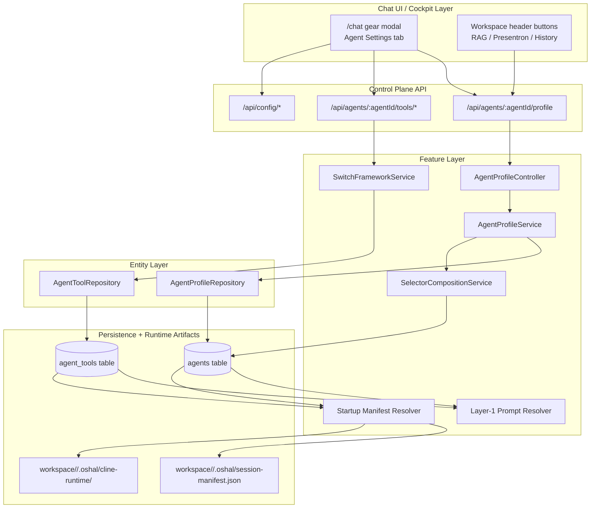
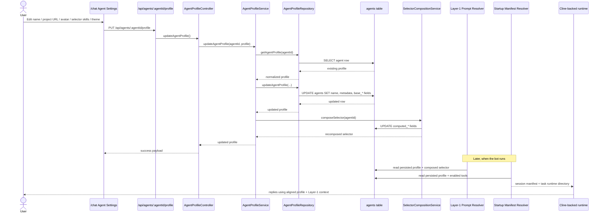
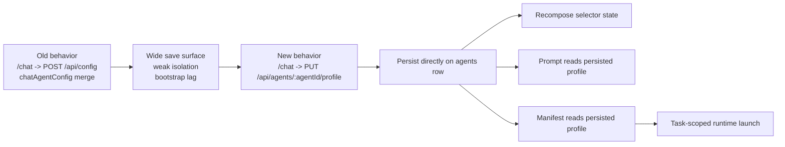

# Chat-Agent Profile Runtime Architecture

## Purpose

This document explains the exact runtime update that replaced broad standalone-chat profile saves through `/api/config` with a dedicated persisted agent-profile path.

It is intentionally written in the same framing as the old any-bot architecture:
- control plane owns policy and persistence
- runtime adapter consumes the assembled session contract
- UI writes configuration into framework-owned state
- RAG, MCP, memory, and tools remain framework capabilities that enrich the bot

## Why This Change Was Needed

Before this change, standalone chat bot personalization lived inside the broad global config document:
- name
- avatar URL
- project URL
- selector skills
- theme preference

That had three problems:
1. bot identity was coupled to unrelated provider/runtime config
2. saves used wide config merges, so the write surface was too large
3. multi-tenant isolation was weak because profile state was effectively global from the UI point of view

The new design moves bot personalization into a dedicated control-plane path scoped by `agentId`.

## Design Principle

The persistence boundary is now:

> one bot instance = one `agentId` = one persisted profile state

That means four tenants running “the same bot” on one server can still act independently, as long as each tenant instance has its own row in the `agents` table.

## Architecture Summary

## Feature Flow

This is the exact runtime feature flow after the update.

## Stored Data Model

The dedicated profile endpoint persists to the existing `agents` row.

### Directly updated fields
- `agents.name`
- `agents.metadata.projectUrl`
- `agents.metadata.avatarUrl`
- `agents.metadata.selectorSkillsText`
- `agents.metadata.themePreference`

### Derived selector base fields
- `agents.base_capabilities`
- `agents.base_selector_descriptor`
- `agents.base_routing_keywords`

### Derived computed fields after recomposition
- `agents.computed_capabilities`
- `agents.computed_selector_descriptor`
- `agents.computed_routing_keywords`

This keeps bot personalization and Layer-1 routing state aligned.

## Relationship To Any-Bot Feature Flow

This update follows the same any-bot control-plane pattern:

1. UI writes configuration into framework-owned persisted state
2. control-plane services normalize and validate the write
3. derived routing/capability state is recomputed
4. runtime prompt and manifest assembly read the persisted state
5. runtime adapter executes using that assembled contract

The only difference is that OSHAL expresses the same pattern through FSD slices and explicit session artifacts.

## Multi-Tenant Model

### What is now correct
- profile state is isolated by `agentId`
- prompt/profile context is isolated by `agentId`
- manifest/profile context is isolated by `agentId`

### What is not done yet
- `/chat` still points to the default shared chat agent
- there is not yet a tenant-aware bot selector or provisioner in the UI

So the architecture now supports multi-tenant isolation, but the UI still needs a tenant-aware agent picker to exercise it.

## Runtime Context Impact

The new endpoint changes four runtime surfaces.

### 1. Standalone Chat Settings
The gear modal now reads and writes bot personalization through the dedicated profile route.

### 2. Workspace Button Gating
Workspace buttons such as Presentron and RAG use the same persisted agent-profile data when checking whether related tools are configured enough to show.

### 3. Layer-1 Prompt Composition
Prompt assembly now reads bot identity, project URL, selector skills, and avatar reference from the persisted agent profile instead of depending on the broad global config blob.

### 4. Startup Manifest Assembly
The session manifest now reads the persisted bot profile from the same agent-profile source, so the runtime launch contract matches what the UI saved.

## Exact Update Diagram

## Remaining Gaps

1. multi-tenant agent selection is still missing in the standalone chat UI
2. provider config is still partly route-centric and file-backed
3. tool credentials still live in plain `agent_tools.tool_config`
4. Presentron API config and Presentron MCP config may still need clean separation

## Recommended Next Step

The next architecture-consistent step is:

1. add explicit chat-agent provisioning/selection
2. bind `/chat` to a selected `agentId`
3. let each tenant bot instance carry its own:
   - profile
   - tools
   - MCP policy
   - memory
   - history
   - workspace context

That completes the move from a default shared bot to true tenant-isolated bot instances.
