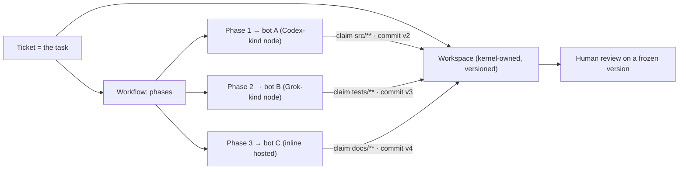

# Clean kernel — the task workspace, any-harness collaboration, and the assistant

**Status:** DRAFT 2026-09-18, for operator review. This document adds the concept the earlier drafts
got wrong: **the task is the common thread and the workspace is shared.** Requirement families: **WS**
workspace, **HA** harness contract, **AS** assistant. Spec: [01](./01-high-level-spec.md); part 1
subsystems [05](./05-subsystem-specs.md); part 2 [07](./07-subsystem-specs-2.md).

**Correction of record.** [07 §S8](./07-subsystem-specs-2.md#s-node-network-overlay-and-enrollment) and
[diagram 06](./diagrams/06-harness-node.md) said the kernel exchanges artifacts and a node keeps its own
workspace. That is right about the *node* and wrong about the *task*: it left heterogeneous bots with no
shared ground. The workspace is not the node's. **It belongs to the task, the kernel owns it, and a node
only ever holds a materialized copy.** Both documents now point here.

---

## 1. The idea in one paragraph

A ticket is a task. A task has one workspace. Any number of bots may be assigned to that task, and they
may sit on different harnesses — a Grok CLI on one machine, a Codex CLI on another, an inline hosted
reasoner in the kernel process. They collaborate because they share the workspace and the ticket, not
because they share a machine, a mount or a model. The any-bot framework is the wrapper that lets each
harness do its own kind of work against that common ground, and the kernel is what makes the ground
safe: versioned, scoped, claimed, attributed and auditable.

---

## 2. What this must not become

This project has already paid for the naive version of this idea. The repo's own working rule is that
one tree with one index and many agents is a constraint to engineer around, and the incidents behind it
are on record: a rejected commit retried after another session cleared the index shipped one file of a
set and left the trunk uncompilable for forty minutes; a branch created from a borrowed head put fifteen
unreviewed files into someone else's pull request; a stale index reported hundreds of phantom changes on
a tree with nothing unpushed.

Every one of those is the same shape: **a shared mutable directory with an implicit index and no
ownership of paths.** The design below is that shape's negation, and the rules are not stylistic.

| Failure shape | Design answer |
|---|---|
| Two writers, one index | no shared index; each bot works in its own materialization |
| A write that silently included someone else's staged file | commits are scoped to an explicit path claim |
| A stale base producing a phantom or lost change | every commit names its base version; a stale base is refused |
| Nobody can tell who wrote what | every file version carries bot, harness, envelope and node |
| Work that exists only on one machine | the workspace of record is kernel-side; a node copy is disposable |

---

## 2a. What exists today, measured

A read of the tree on 2026-09-18 found that most of the operator's description of today's system is
accurate, and that the gaps are specific rather than general. This matters because it narrows what the
design has to fix.

### Confirmed as-built

| Claim | Verdict | Evidence |
|---|---|---|
| Every bot runs in its own container | true | 39 services inherit the shared bot anchor, one persona each via an entrypoint |
| There is a shared folder | true | one volume mounted read-write into 40 services, including the controller and the code browser |
| Every bot works inside the task's shared workspace | true | the workspace id travels end to end as a field on every dispatch hop, and the path is stated in the prompt |
| The workspace follows the ticket | true, with a nuance: it follows the **root** ticket | child tickets reuse the root's folder by design, so a decomposed build has one workspace, not many |
| The workspace is created, enriched and retained | true | created at dispatch, enriched after the pipeline with deliverables and handover stubs, deleted only when the ticket is deleted |

### The two claims the tree does not support

**"Scalable" is an aspiration, not an implementation.** There is no replica or scale setting anywhere in
the compose file, every bot service pins a fixed container name, which makes scaling that service
impossible by construction, and the Kubernetes path fixes one replica per bot. The only elasticity
primitive that exists is on and off: start or stop the service, or scale the Deployment between zero and
one. The per-bot concurrency knob that does exist is inside the container, from the persona's own limit.
Independent scaling is listed as a positive consequence in the per-bot-container ADR; no code implements
it, and the packaged-runtime ADR explicitly withholds authorization for the node pool that would.

**"Secure" is not true today, and the project already knows it.** ADR-060 attempted per-user workspace
isolation, was **reverted in implementation**, and its own amendment states the reason plainly: every bot
container mounts the same workspace volume read-write, so a bot with a shell reaches a sibling path, and
*a directory layout on a shared read-write mount is attribution, not enforcement.* What does exist is
real but narrower than isolation: path containment to the shared root with symlink rejection and hashed
logical ids, restrictive directory modes, an owner check that prevents **reusing** another owner's task
directory, leased per-workspace credential files removed in a finally block, and a file-tool escape guard
that the same ADR notes never covered the shell tool or a spawned harness. None of that stops one
ticket's bot from reading another ticket's workspace, because that is a sibling inside the trusted root.
The ADR names what would be required and leaves it as backlog: per-owner subpath mounts, per-owner
volumes, or a filesystem jail per bot container.

### Three smaller findings that shape the design

- **Handover artifacts have three competing naming conventions** in one directory: a platform-written
  stub per bot, a per-round file named by agent, phase and round, and a role-named file the prompt asks
  for. Readers cope with all three. A literal `HANDOVER.md` is never written by any code despite being
  referred to as if it were. This is why [W8](#3-the-workspace-object) makes artifacts **typed
  declarations rather than filename conventions**: a convention only works when every writer knows it.
- **A missing handover is logged and then accepted.** The round validator reports that the agent did not
  write one and the output is still taken, flagged. A gate that does not gate trains everyone to ignore
  it, which is why gates in this design produce a refusal rather than a flag.
- **Two workspace-root resolvers disagree on precedence** and agree today only because the compose file
  sets both variables to the same value. That is configuration holding a code invariant together, which
  is exactly the class of latent fault the single key-derivation rule removes.

### What this changes about the design below

Nothing in the target model changes, but its justification gets sharper and narrower:

| Today | Target | Why |
|---|---|---|
| One shared read-write directory for all tickets and all bots | kernel-owned workspace, per-claim materialization | cross-ticket reach becomes impossible by construction rather than by convention, which is the isolation ADR-060 tried to get from a path layout and had to revert |
| Filename prefixes distinguish bots | commits carry author, harness, node and envelope | attribution stops depending on writers choosing the right filename |
| Three handover conventions plus a flagged-but-accepted gate | typed artifacts, refusals not flags | a second bot can find the first bot's output by kind |
| One container per bot, fixed, no replicas | bots are addressed by identity; nodes are the unit that scales | scaling stops requiring a hand-declared service per worker |
| Two root resolvers reconciled by configuration | one key derivation | the invariant lives in code |

The per-bot output volumes are worth keeping as a lesson rather than a mechanism. They exist because
fourteen services shared one output volume and the entrypoint wrote every persona to the same fixed path,
which a parallel boot turned into a last-writer-wins race that was measured putting seven of fourteen
bots under another bot's persona. One writer per mutable location is the same rule the commit model
below enforces for the workspace.

## 3. The workspace object

```
Workspace
  id            WorkspaceId
  ticket        TicketId              // the task is the thread
  owner         PrincipalId           // the person the work is for
  tenant        TenantId
  base          VersionId             // current head of the commit log
  policy        WorkspacePolicy       // size, retention, merge policies per path glob
  state         Open | Frozen | Archived
```

### Decisions

| # | Decision | Why |
|---|---|---|
| W1 | **One workspace per ticket, created with the ticket, archived with it.** Sub-tasks get a scoped subtree, not a second workspace. | the task is the thread; two workspaces for one task recreates the coordination problem |
| W2 | **The kernel holds the workspace of record.** It is a content-addressed store with an append-only commit log. Nodes hold materializations. | a node is disposable ([07 §S8](./07-subsystem-specs-2.md#s-node-network-overlay-and-enrollment)); the work is not |
| W3 | **Every commit names its base version, its author bot, its envelope, its harness and its node.** | provenance is what makes multi-harness work reviewable |
| W4 | **A write requires a claim on a path scope**, granted for the life of the envelope and released on completion or lease expiry. | the negation of the shared index |
| W5 | **A commit outside the claim is refused.** Not trimmed, not merged: refused, with the offending paths named. | a partial silent commit is the forty-minute outage |
| W6 | **A commit on a stale base is refused unless the path has a declared merge policy.** | prevents lost updates; makes the exception explicit and per path |
| W7 | **Merge policies are declared per path glob**, and the vocabulary is closed: `exclusive` (default), `append-only`, `last-writer-wins`, `three-way` (text only). | an automatic merge nobody declared is how a change disappears |
| W8 | **Artifacts are typed declarations, not conventions.** A handover note, a report, a build output or a patch is an artifact kind with a schema, discoverable by the next bot. | a convention file only works if every harness happens to know it |
| W9 | **No credential ever enters a workspace.** Connector data arrives as intent results and is redacted on commit; a commit that matches a secret pattern is refused. | the publish-gate lesson, applied at the write boundary |
| W10 | **A workspace is scoped and retained like every other store**: derived from (subject, tenant), declared retention, exportable and deletable by its owner. | [05 §B](./05-subsystem-specs.md#b-user-management), [05 §I](./05-subsystem-specs.md#i-time-series-framework) |
| W11 | **Freeze on review.** A workspace can be frozen so a human can read a stable state while bots are still assigned; writes queue or refuse by policy. | reviewing a moving tree is how a reviewer approves something that no longer exists |
| W12 | **A workspace may be projected to git, and git is a projection, not the store.** Export produces a branch or a bundle; import seeds a workspace. | the repo already knows what shared git state costs |

### Requirements

| ID | Requirement | Acceptance |
|---|---|---|
| WS-01 | A ticket MUST have exactly one workspace, created and archived with it. | lifecycle test |
| WS-02 | Every commit MUST carry base version, author bot, envelope, harness kind and node. | provenance test; a commit missing any field is refused |
| WS-03 | A write MUST require an active claim, and a commit touching paths outside it MUST be refused with those paths named. | out-of-claim test |
| WS-04 | A commit on a stale base MUST be refused unless the path declares a merge policy. | lost-update test |
| WS-05 | Merge policies MUST come from the closed vocabulary and MUST be declared per path glob. | unknown policy refused at declaration |
| WS-06 | A claim MUST expire with its envelope lease and MUST release on completion. | node-death test releases the claim |
| WS-07 | A commit matching a secret pattern MUST be refused. | secret-in-workspace test |
| WS-08 | Artifacts MUST be typed and discoverable by other bots on the same task. | a second bot lists the first bot's artifacts by kind |
| WS-09 | Freeze MUST produce a stable readable state while the task is still assigned. | freeze test |
| WS-10 | A workspace MUST be exportable, deletable and scoped by the single key function. | export, delete and cross-tenant tests |

---

## 4. The harness contract: any harness, one workspace

A harness is a node ([07 §S](./07-subsystem-specs-2.md#s-node-network-overlay-and-enrollment)). The
adapter is thin by design, because the point is that a harness does *its own* kind of work.

```
materialize(workspace, base, scope) -> local directory
run(envelope, directory)            -> the harness does whatever it does
collect(directory)                  -> change set, relative to base, within scope
commit(change set)                  -> new version, attributed
release(claim)
```

### Decisions

| # | Decision | Why |
|---|---|---|
| H1 | **The adapter's job is materialize, collect, commit. It is not to control the harness.** A Codex CLI plans and edits the way Codex does; a Grok CLI does it its way. | the wrapper unifies the ground, not the work |
| H2 | **Materialization is partial by claim.** A bot receives the subtree it claimed plus declared read-only context, not the whole workspace, unless policy says otherwise. | smaller blast radius, smaller prompts, fewer accidental writes |
| H3 | **Collection is a diff against the declared base**, computed by the adapter and verified by the kernel. A harness that cannot produce a clean diff is still usable: the kernel diffs the materialization itself. | a harness must not need to understand the protocol |
| H4 | **The harness never authenticates to the kernel as itself.** The node holds the leased token; the work is attributed to the bot principal. | [07 §S](./07-subsystem-specs-2.md#s-node-network-overlay-and-enrollment) |
| H5 | **Capability parity is declared, not assumed.** A node declares what its harness can do (edit files, run commands, browse, use a GPU, use a display). Routing uses the declaration; a phase that needs a capability no assigned node has waits or refuses. | heterogeneous harnesses are only interchangeable where they actually are |
| H6 | **Harness output is untrusted input.** A change set is data. It passes secret scanning, size limits and policy before it becomes a version. | P4 |
| H7 | **Two bots may hold claims on one workspace at the same time if their scopes are disjoint.** Overlapping claims are serialized by the kernel, not by the harnesses. | concurrency without a shared index |
| H8 | **A handover between harnesses is a workspace state plus a typed artifact, not a prompt.** The next bot reads what is there. | prompts do not survive a transport change; artifacts do |

### Requirements

| ID | Requirement | Acceptance |
|---|---|---|
| HA-01 | Two different harness kinds MUST complete consecutive phases on one workspace, each attributed. | a Codex-kind and a Grok-kind node complete phases on one ticket |
| HA-02 | Overlapping claims MUST be serialized by the kernel; disjoint claims MUST run in parallel. | concurrency tests for both cases |
| HA-03 | A harness that cannot emit a diff MUST still be supported by kernel-side diffing. | adapter-without-diff test |
| HA-04 | A node MUST declare harness capabilities, and routing MUST honor them. | a phase needing a display refuses on a headless node |
| HA-05 | A change set MUST pass secret scanning and size policy before becoming a version. | oversized and secret-bearing change sets refused |
| HA-06 | Handover MUST work through workspace state and typed artifacts alone. | the second bot receives no prompt-carried context and still proceeds |

---

## 5. Assignment: many bots, one task



- Assignment is by phase, and a phase names a bot, not a machine. The transport follows the bot's
  posture; the workspace follows the task.
- Parallel phases with disjoint claims run at once. Overlapping ones serialize.
- The review surface reads a frozen version, so a reviewer sees a state that does not move under them.

---

## 6. The assistant: the human's integration with the swarm

The main assistant is how a person reaches all of this. It is a **package**, because the kernel stays
small, but it depends on three rails the kernel must provide, and those rails are the specification.

### Decisions

| # | Decision | Why |
|---|---|---|
| A1 | **Rail one: a grant-filtered capability catalog.** The kernel can answer, for this principal: which bots, tools, workflows, apps, surfaces and connectors are available, with their declared inputs and what they are for. | an assistant cannot route to what it cannot enumerate, and it must never enumerate what the person may not use |
| A2 | **Rail two: data-driven routing.** Which capability handles a request comes from declarations (ownership, skills, routing rules), never from pattern matching in the assistant. | the regex-routing lesson; routing by string matching becomes unmaintainable and wrong |
| A3 | **Rail three: session continuity with receipts.** A conversation is a thread with a principal, a history and a record of what was recalled and what was done. | [07 §P](./07-subsystem-specs-2.md#p-person-model-learning-and-history) |
| A4 | **Surfaces declare their affordances**, so the assistant can hand off to a surface rather than describe it: what it renders, what it can do, what it needs. | this is what makes it aware of the user experience rather than only of APIs |
| A5 | **The assistant is never a required chokepoint.** Every surface and API remains directly usable without it. | a single conversational front door is a single point of failure, and it went down for three days once |
| A6 | **The assistant holds no authority of its own.** It acts as the person, through the door, with their grants. It cannot see or do more than they can. | P4, and it is the most prompt-exposed component in the platform |
| A7 | **Errors surface truthfully.** A failed action reports the real refusal or error; a generic apology that hides the cause is a defect. A refused request must not leave a task half-created. | a generic catch-all masked a real ownership bug for three days, with nothing logged |
| A8 | **Proposals over actions for anything consequential.** The assistant may create a ticket, call a bot or run a read; a confirmed write requires the person's explicit confirmation in the same turn. | [05 §G](./05-subsystem-specs.md#g-connector-framework) G4 |

### Requirements

| ID | Requirement | Acceptance |
|---|---|---|
| AS-01 | The capability catalog MUST be grant-filtered per principal. | two people see different catalogs; an ungranted bot is absent, not hidden-but-callable |
| AS-02 | Routing MUST come from declarations; adding a capability MUST NOT require assistant code changes. | a new package becomes routable by manifest alone |
| AS-03 | The assistant MUST act as the person, never with elevated authority. | an action the person cannot perform is refused when asked of the assistant |
| AS-04 | A failure MUST surface the real cause to the person and the audit. | a forced failure shows a specific reason, not a generic apology |
| AS-05 | A refused or failed request MUST NOT leave a partially created task. | no orphaned records after a refusal |
| AS-06 | Surfaces MUST declare affordances the assistant can hand off to. | the assistant opens the right surface for a request it should not answer in text |
| AS-07 | Every surface MUST remain usable with the assistant disabled. | assistant-off test across the cockpit |

---

## 7. Why this scales both ways

The same objects serve a laptop and an enterprise; only the counts change.

| | laptop, Docker, one subscription | enterprise |
|---|---|---|
| Kernel | one artifact, embedded stores | controller plus replicas, external stores |
| Nodes | one, on the same machine, enrolled like any other | many, user-owned and fleet, several harness kinds |
| Workspace | kernel-owned, materialized in a local directory | kernel-owned, materialized per node, synced by claim |
| Harness | the subscription the person already has | any mix; capability declarations decide routing |
| Assistant | same package, same rails | same package, same rails |
| What changes | node count, store implementations | nothing structural |

The reason this holds is the rule from [06](./06-deployment-postures.md): a posture selects an
implementation behind a trait and never adds a branch. A single-node workspace is the same object with
one materialization. A person with one Codex subscription is a fleet of one.

---

## 8. Open questions for the operator

| # | Question | Why it matters |
|---|---|---|
| Q1 | Default merge policy for text files: `exclusive` (refuse concurrent edits) or `three-way`? | exclusive is safer and slower; three-way is faster and can produce a state neither bot intended |
| Q2 | Should a workspace be projectable to a real git repository per ticket, or only exportable as a bundle at the end? | a live projection is friendlier to humans and reintroduces the shared-index hazard at the boundary |
| Q3 | Materialization default: claimed subtree only, or whole workspace read-only with a writable claim? | subtree-only is tighter; whole-workspace lets a harness reason about the project |
| Q4 | Does a human reviewer edit the workspace directly, as a principal with a claim, or only through comments and a new phase? | direct edit is natural and makes the human another writer to serialize |
| Q5 | Size and retention defaults per workspace, and what happens when a build output exceeds them. | unbounded workspaces are the same outage-on-a-delay as unbounded series |
