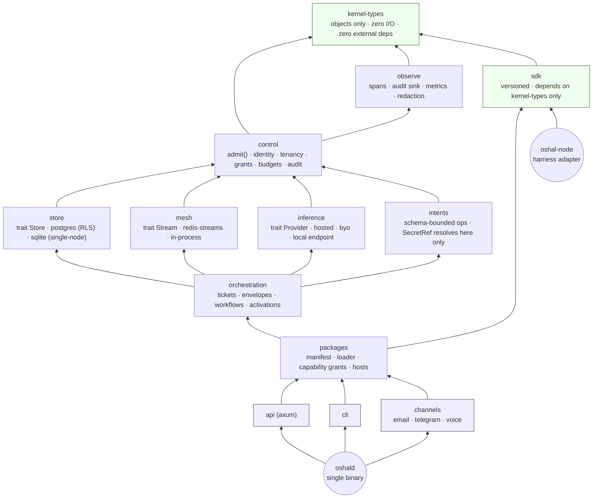

# 01 — Crate dependency graph

The build-enforced layering. An arrow means "depends on". Cargo rejects a cycle, so the direction of
every edge is a property of the build, not a lint. Spec: [01 §4.4](../01-high-level-spec.md#44-dependency-structure).

## Rules the graph encodes

| Rule | Enforced by |
|---|---|
| Edges point upward only; no cycles | Cargo workspace resolution |
| `api`, `cli`, `channels` cannot name `store`, `mesh`, `inference` or `intents` | they are not in those crates' `Cargo.toml`; a deep import does not resolve |
| Packages compile against `sdk` and nothing else | `sdk` is the only crate published for package builds; the loader refuses an SDK range the kernel does not satisfy |
| `kernel-types` never gains an I/O dependency | a workspace test asserts its dependency list is empty |
| `SecretRef` can be created in `control` and resolved only in `intents` | the resolving function is `pub(crate)`; no other crate can call it |

## Forbidden edges (examples the build rejects)

- `api → store` (a handler reaching a raw connection)
- `orchestration → api` (the runtime depending on a transport)
- `sdk → control` (a package seeing the door's internals)
- `inference → intents` (a provider touching a credential)
