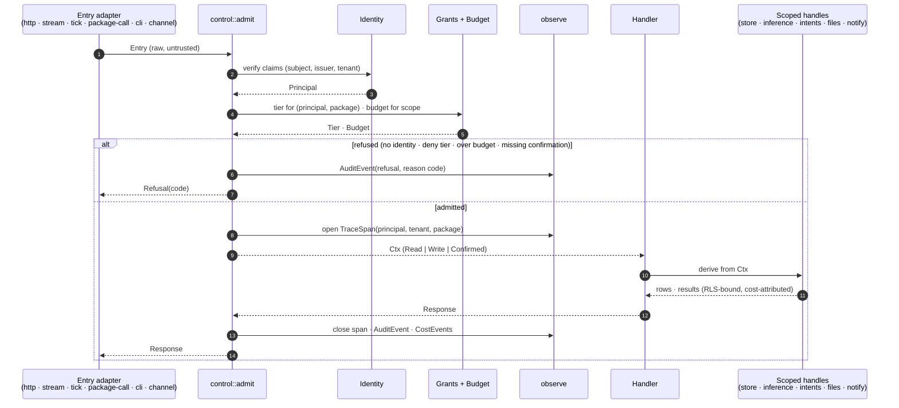

# 02 — The one door: admission sequence

Every entry kind goes through `control::admit()`. The handler never sees the raw entry; it receives a
`Ctx` and derives scoped handles from it. Spec: [01 §4.2](../01-high-level-spec.md#42-the-one-door),
requirements C-01 to C-08.

## What the door guarantees

| Guarantee | Mechanism |
|---|---|
| No handler runs without a `Ctx` | handler signature requires one; only `control` can construct it |
| Identity is derived once | `Principal` is built from verified claims including issuer at step 2 and never re-read |
| Write needs a grant, confirmed write needs the token | `Ctx<Write>` requires tier ≥ editor; `Ctx<Confirmed>` requires the confirmation (ADR-105) |
| One span, one audit event, cost events | emitted at steps 7 and 12 by the door, never by handlers |
| Refusals are typed and recorded | step 5 to 6; no silent fallback (P9) |

## Entry kinds and what they carry

| Entry | Identity source | Notes |
|---|---|---|
| http | OIDC session, local-auth session, node token, service token | multipart and streaming bodies carry the same identity as JSON |
| stream message | envelope's bot principal | a bot re-enters the door as itself (P4) |
| schedule tick | the activation's principal (ADR-157) | an unactivated schedule is refused at step 5 |
| package call | the calling package's granted capability set | a capability not granted is not linked, so it never reaches the door |
| cli | local operator session or root | root is a database row, not a flag |
| channel | verified channel link → principal | unlinked channel input is refused |
