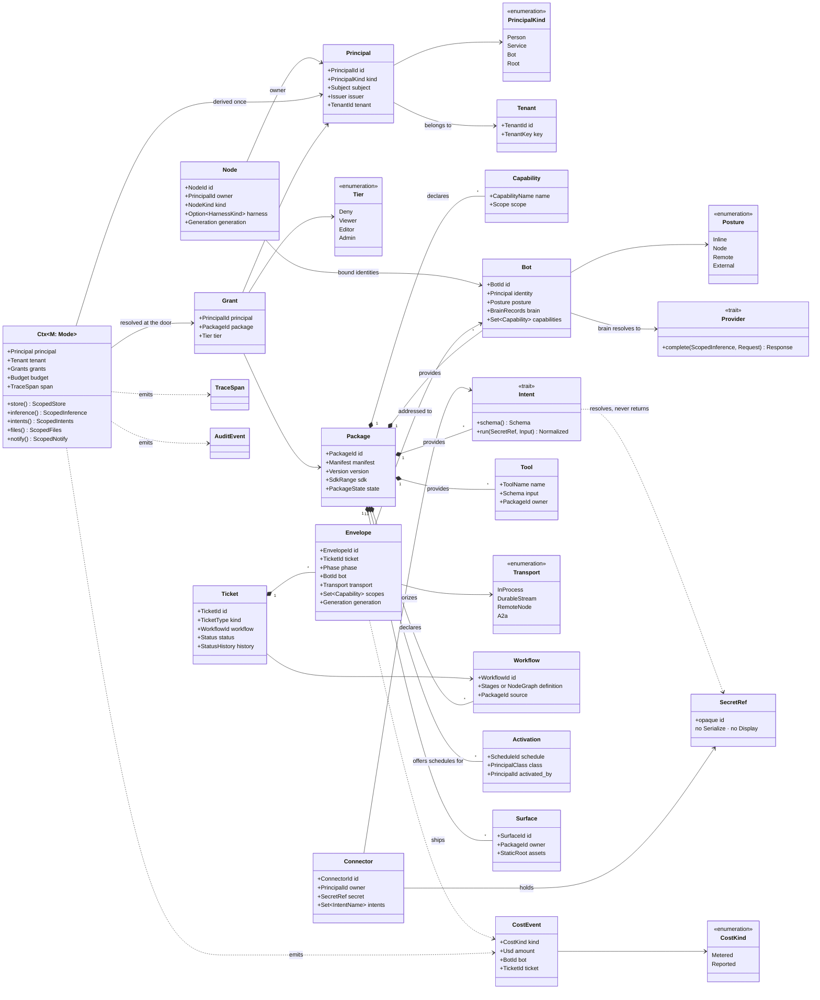

# 03 — Kernel object model

The complete set of kernel objects. Anything not here is a package's domain. Spec:
[01 §4.3](../01-high-level-spec.md#43-kernel-object-model); Rust sketches in
[02 — Rust object model](../02-rust-object-model.md).

## Ownership and construction summary

| Object | Constructed only by | Tenant-scoped |
|---|---|---|
| Principal, Ctx | `control` | yes |
| Grant, Tenant, Activation | `control` on an admin or person action | yes |
| Package, Capability, Surface | `packages` loader | per install |
| Bot, Tool, Intent, Workflow | registries, from a manifest | per package |
| Connector, SecretRef | `control` on a person's authorization | yes (owner) |
| Ticket, Envelope | `orchestration` | yes |
| Workspace, Claim, Commit, Artifact | `orchestration`, store-backed | yes (owner + tenant) |
| Node | enrollment | yes (owner) |
| CostEvent, TraceSpan, AuditEvent | the door | yes |
