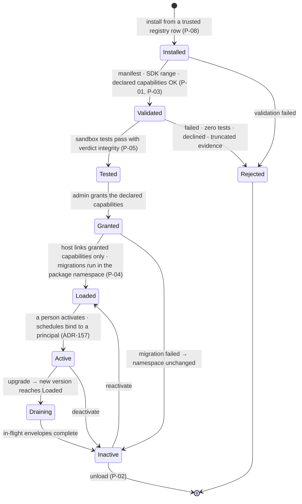
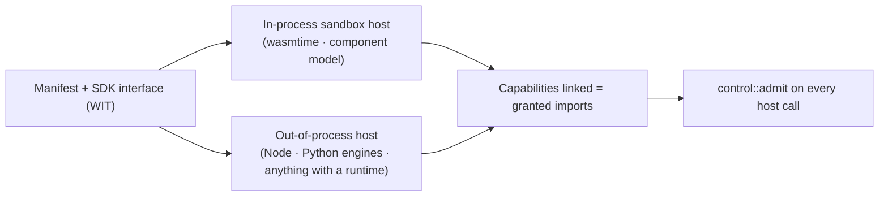

# 04 — Package lifecycle (hot-load, no kernel restart)

Every transition is a kernel action on a running kernel. Spec:
[01 §4.5](../01-high-level-spec.md#45-package-contract), requirements P-01 to P-08.

## Who may cause each transition

| Transition | Actor | Recorded as |
|---|---|---|
| install | admin (registry-gated) or a self-writing producer (S-01) | AuditEvent with source registry and version |
| validate, test | kernel | test verdict with evidence hash |
| grant | admin | Grant rows per capability |
| load | kernel | linked capability set, migration ledger |
| activate | a person, or a portal admin for a system service (ADR-157) | Activation naming the principal |
| upgrade | admin | old version drains; rollback = re-activate the previous Loaded version |
| deactivate, unload | admin | AuditEvent |

## Two hosts, one contract

A capability a package did not declare is not linked in either host, so it cannot be called. The
out-of-process host exists for today's JavaScript packages and for Python engines; it speaks the same
interface over local IPC and is admitted identically.
