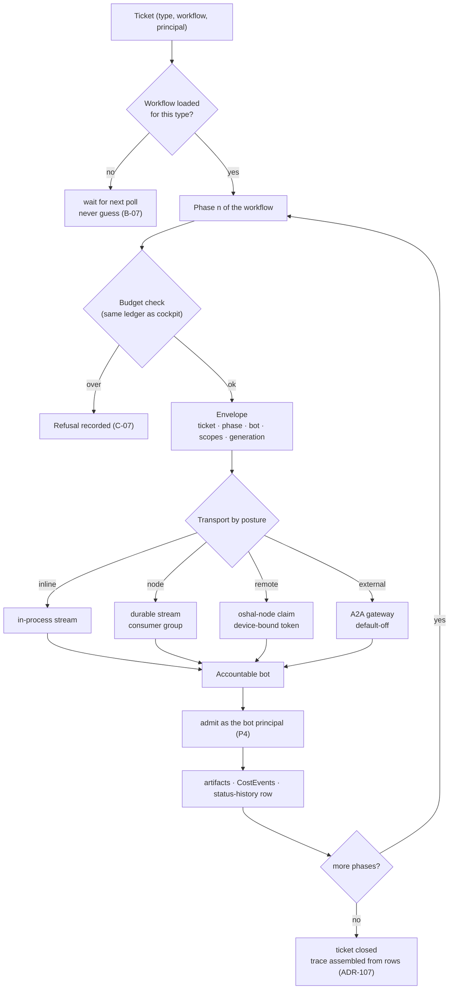
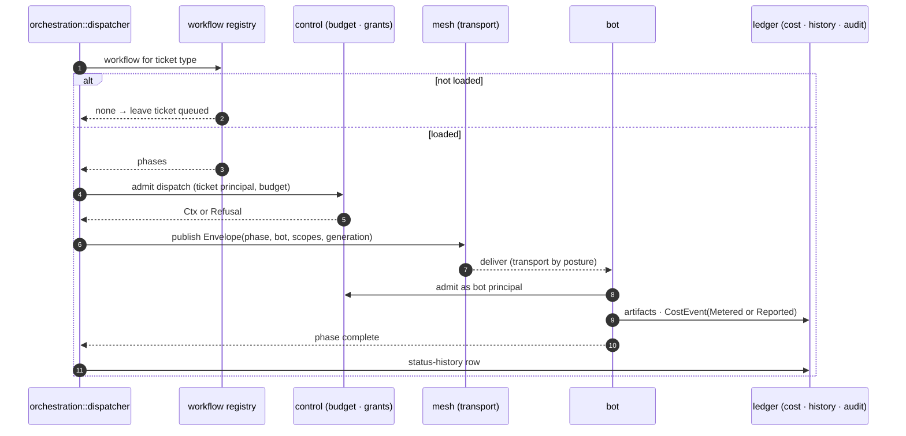

# 05 — Ticket → envelope → accountable bot

The swarm loop. One envelope type, four transports chosen by the bot's posture. Spec:
[01 §4.7](../01-high-level-spec.md#47-swarm-integration), requirements B-01, B-06, B-07, C-06.

## Phase dispatch as a sequence

## Invariants

- The envelope carries capabilities for this phase only, never a credential value (B-11).
- Transport is chosen after admission; admission never depends on transport (ADR-161).
- Every phase transition is a row; a trace is never fabricated from nothing (ADR-107).
- A bot's output re-enters the door as the bot itself; it can propose a write but only a confirmed
  context performs one (ADR-122, ADR-105).
