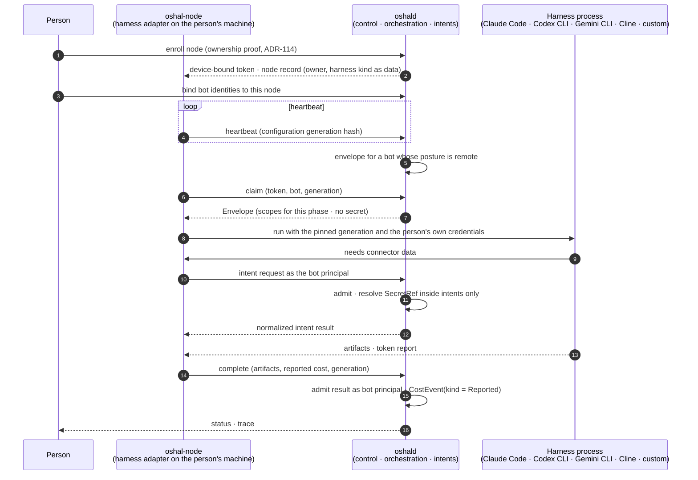
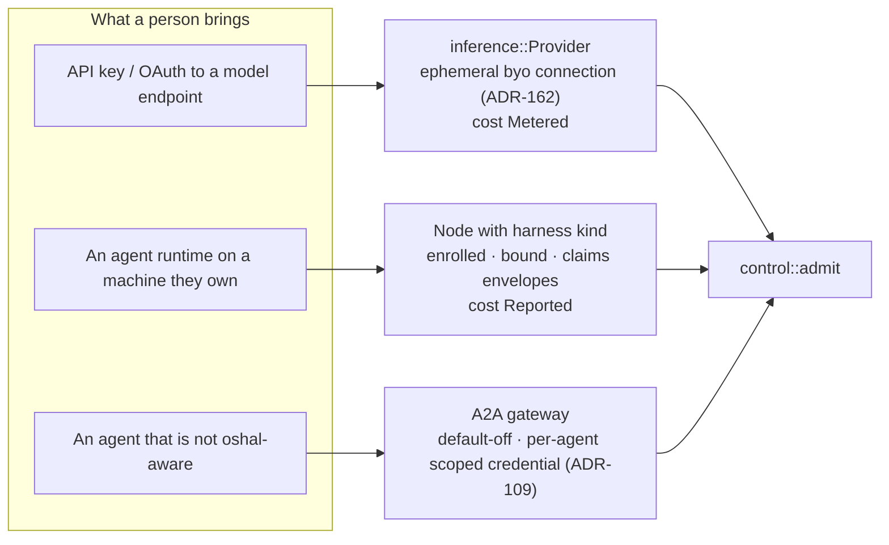

# 06 — Bring your own harness: a harness is a node

Enrollment, envelope claim, and connector access for a user-owned harness. The kernel never spawns the
harness and never holds its credential. Spec: [01 §4.6](../01-high-level-spec.md#46-bot-model-any-bot),
requirements B-05, B-09 to B-12.

## The three bring-your-own shapes

## Requirements this diagram satisfies

| ID | Where in the sequence |
|---|---|
| B-05 no kernel spawn | there is no arrow from K to H |
| B-09 enrolled node only, local included | steps 1 to 3; a local harness enrolls the same way |
| B-10 immutable generation | steps 4, 6, 8, 14; mismatch fails the run |
| B-11 intents only, no secret in an envelope | steps 7, 10 to 12 |
| B-12 reported cost labelled | step 15 |
