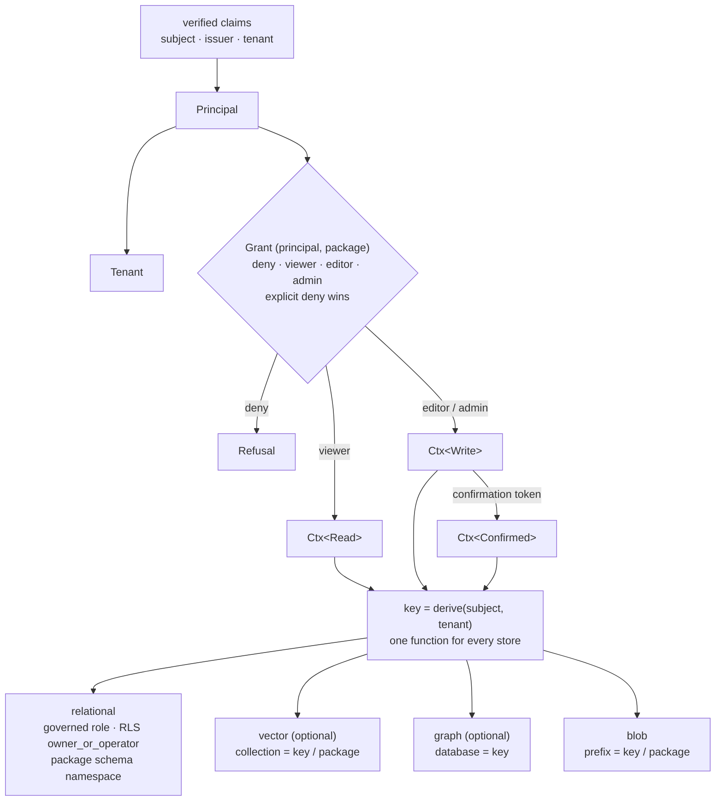
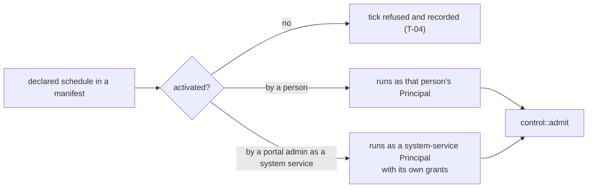

# 07 — Tenancy and scoping

How one identity value scopes every store. Spec: [01 §4.8](../01-high-level-spec.md#48-multi-user-multi-tenant),
requirements T-01 to T-05.

## Principal classes for non-interactive work (ADR-157)

## Invariants

- Nothing derives a key from anything but (subject, tenant). The derivation function is the isolation
  boundary and is guarded like the token broker (T-01).
- The governed database role's grants are converged from one declared contract at boot; a migration
  cannot widen them (T-02).
- Guest access is a seeded principal with a declared capability matrix, admitted like any other (T-05).
- Enterprise authorization (ADR-149) and app access tiers (ADR-118) are the only grant vocabulary.
