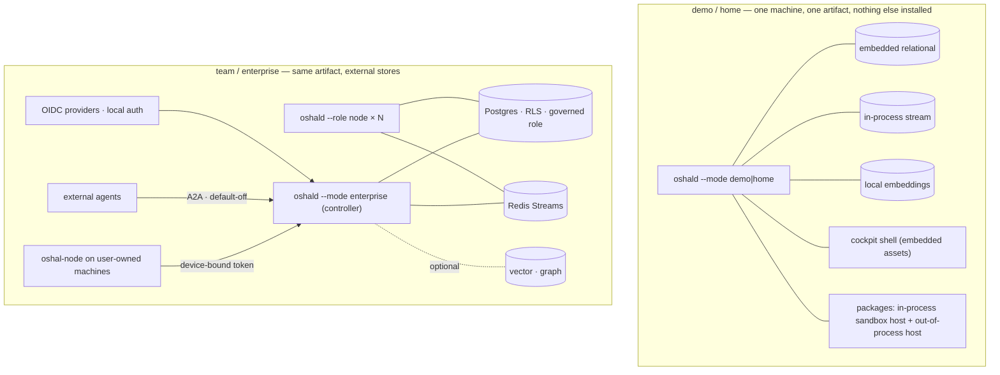
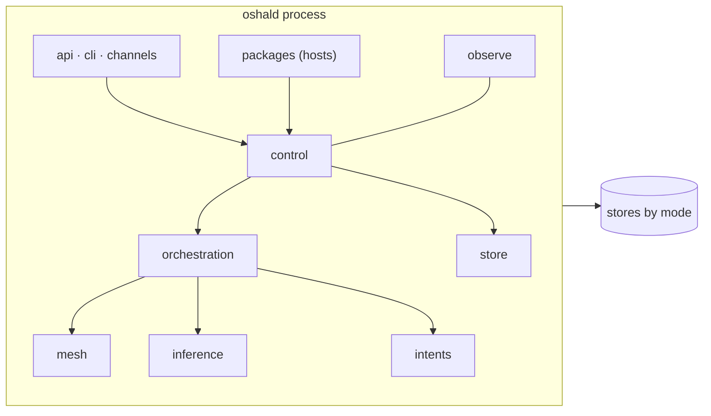

# 08 — Deployment topology by mode

One artifact, declared modes (ADR-137). Spec: [01 §4.11](../01-high-level-spec.md#411-deployment-modes-and-portability),
requirements D-01 to D-05.

## Process anatomy of `oshald`

## Mode table

| Mode | Stores | Auth | Remote nodes | Packages |
|---|---|---|---|---|
| demo | embedded relational, in-process stream, local embeddings | open on loopback | refused | hot-load |
| home | embedded or external | invited users (local auth), device-bound tokens | allowed | hot-load |
| team / enterprise | Postgres + Redis; optional vector and graph | OIDC, multi-provider | allowed | hot-load, registry-gated |

## Startup and upgrade invariants

- Startup is order-independent: an unreachable store is a health state, never a crash (D-02).
- Kernel migrations are embedded and run on start; package migrations run at activation in the package
  namespace (P-04).
- Upgrade is an artifact swap; rollback is the previous artifact; a migration that cannot roll back is
  refused at review (D-03).
- Monitoring targets are inherited from package declarations, never hand-registered (D-05).
