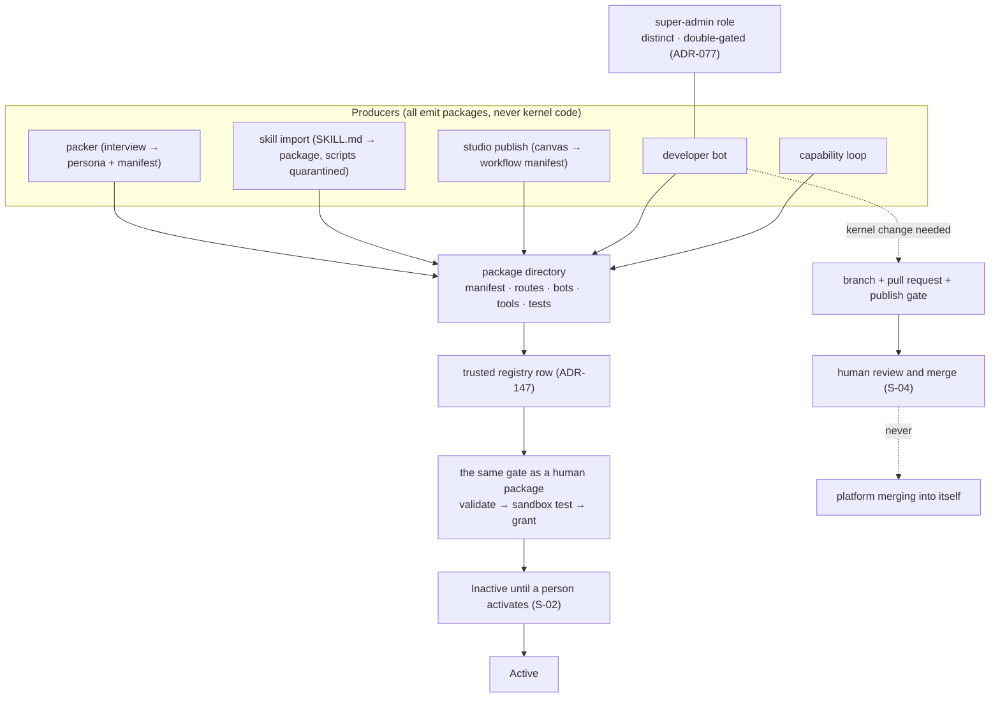

# 09 — The self-writing loop

The platform authors packages through the same gate a human uses, and proposes kernel changes it
cannot merge itself. Spec: [01 §4.9](../01-high-level-spec.md#49-self-writing-loop), requirements S-01 to S-04.

## Trust ladder for the developer bot (ADR-077 carried forward)

| Level | May do | Gate |
|---|---|---|
| L0 | read the tree, propose a plan | super-admin enabled |
| L1 | author a package into a registry | S-01, S-02 |
| L2 | open a kernel pull request | S-04; publish gate |
| L3 | none: the platform never merges into itself | by construction |

## Verdict integrity in the sandbox (P-05)

- zero tests executed → not a pass
- a declined or skipped run → `pending`, never green
- truncated or lost evidence → `pending`
- the verdict names the evidence hash it was computed from
