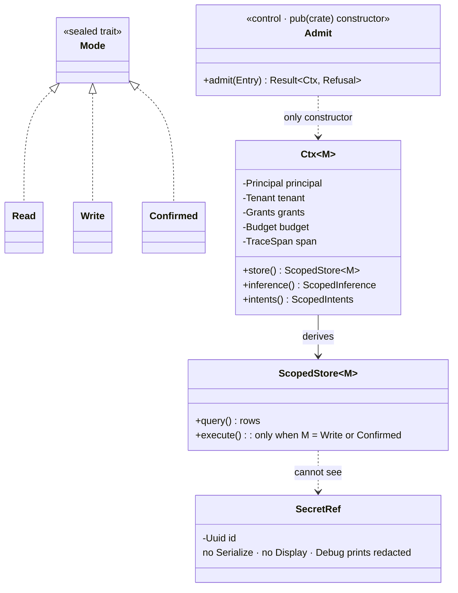
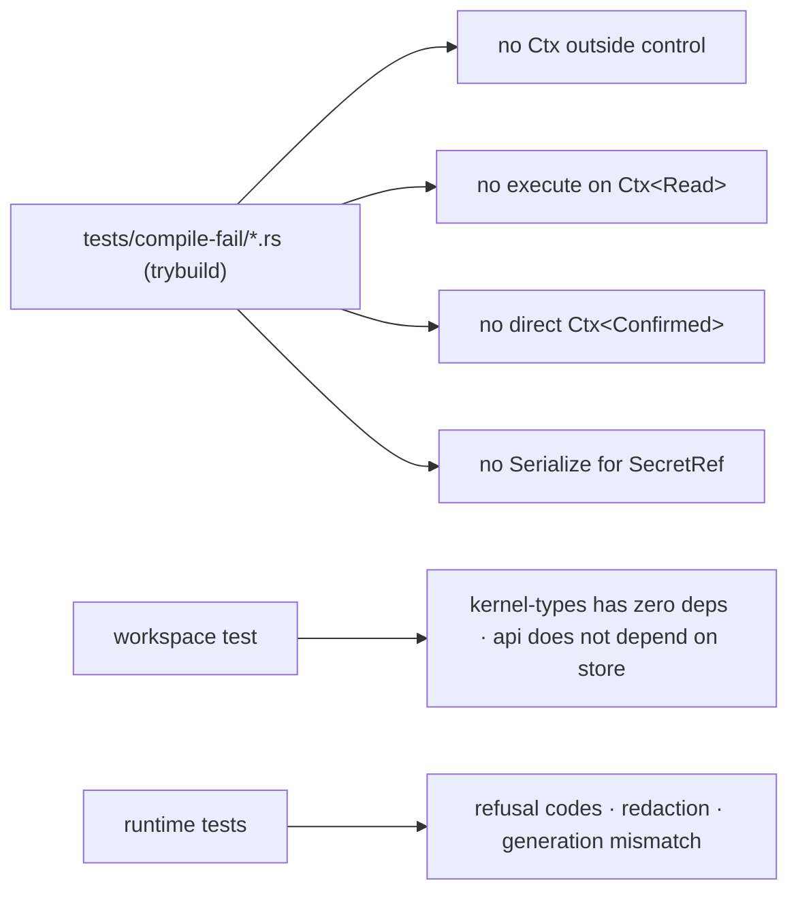

# 10 — Type-level guards

How the Rust type system carries the security rules so they cannot be forgotten. Spec:
[01 §4.2](../01-high-level-spec.md#42-the-one-door), requirements C-01 to C-05; sketches in
[02 — Rust object model](../02-rust-object-model.md).

## The five guards and how each is proven

| Guard | Type mechanism | Proof |
|---|---|---|
| A handler cannot run without admission | handler signature takes `Ctx<M>`; the constructor is `pub(crate)` in `control` | a `trybuild` negative test that constructs `Ctx` outside `control` fails to compile |
| A viewer cannot write | `ScopedStore::execute` is implemented only for `M: Writable`, a sealed marker on `Write` and `Confirmed` | negative compile test calling `execute` on `Ctx<Read>` |
| A confirmed write needs the token | `Ctx<Write>::confirm(token) -> Result<Ctx<Confirmed>, Refusal>` is the only path | negative compile test constructing `Ctx<Confirmed>` directly; runtime refusal test for a bad token |
| A secret cannot leak | `SecretRef` implements neither `Serialize` nor `Display`; `Debug` is redacted; resolution is `pub(crate)` in `intents` | negative compile test serializing a struct containing `SecretRef`; redaction test on every log sink |
| A raw connection is unreachable from handlers | `store::Pool` is not exported; only `ScopedStore` is, and it is created from `Ctx` | `api` does not depend on `store` (diagram 01), so the type is not even nameable there |

## Where the guards live

These are the guards the current platform polices with inventory specs and code review. Here they are
properties of the build.
