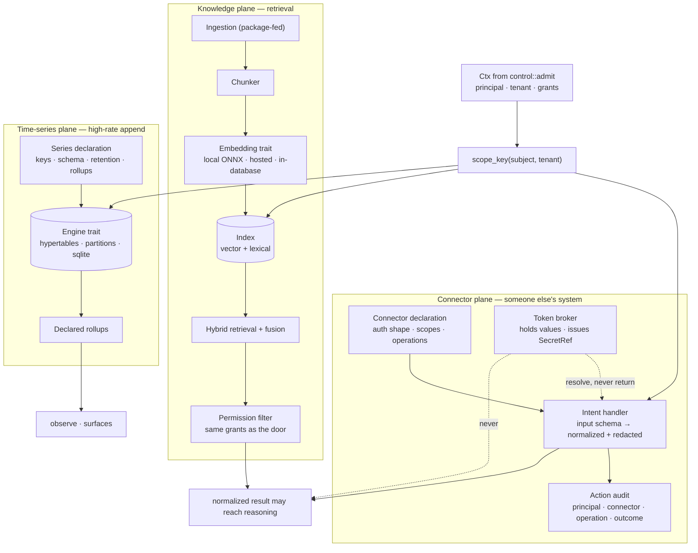

# 11 — Data planes: connectors, knowledge, time series

Three data rails that share one key function and one admission door. Spec:
[05 §G, §H, §I](../05-subsystem-specs.md#g-connector-framework).

## The three invariants this picture encodes

| Invariant | Where |
|---|---|
| A credential value never reaches reasoning | the dashed "never" edge from the broker to the model |
| A retrieval returns only what the principal could read directly | the permission filter sits between the index and any consumer |
| Every plane derives its namespace from one key function | the three edges out of `scope_key` |

## Why time series is its own plane

Retention, rollups and late-point behavior are declared per series and enforced by the engine. An
append-only table without them becomes an outage on a delay, which is why an undeclared retention is a
load-time refusal (M-01).
