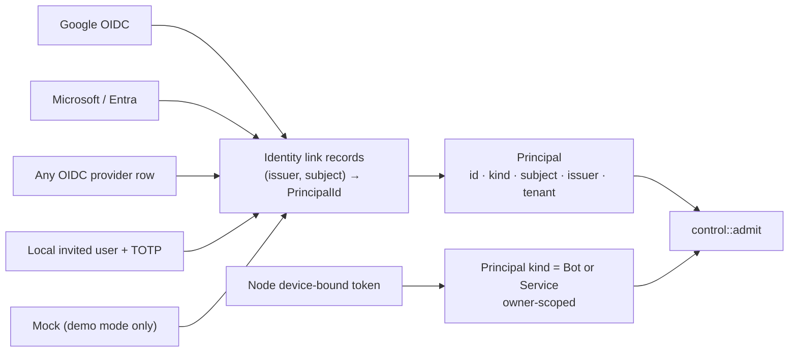
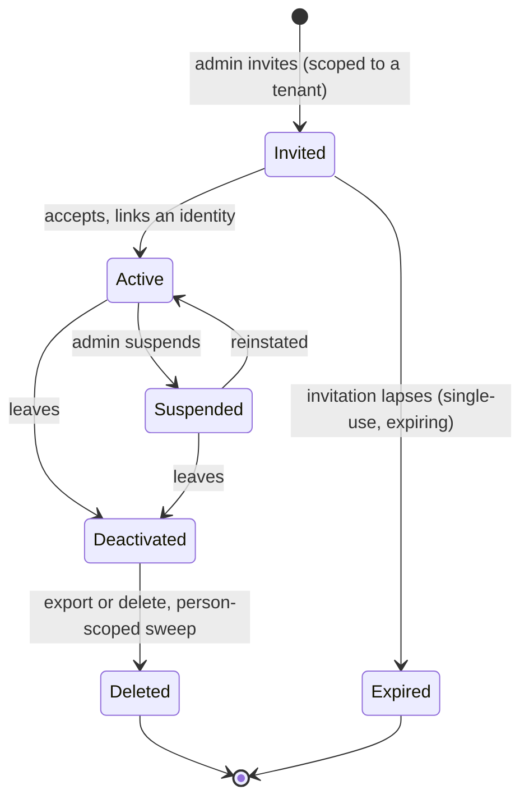
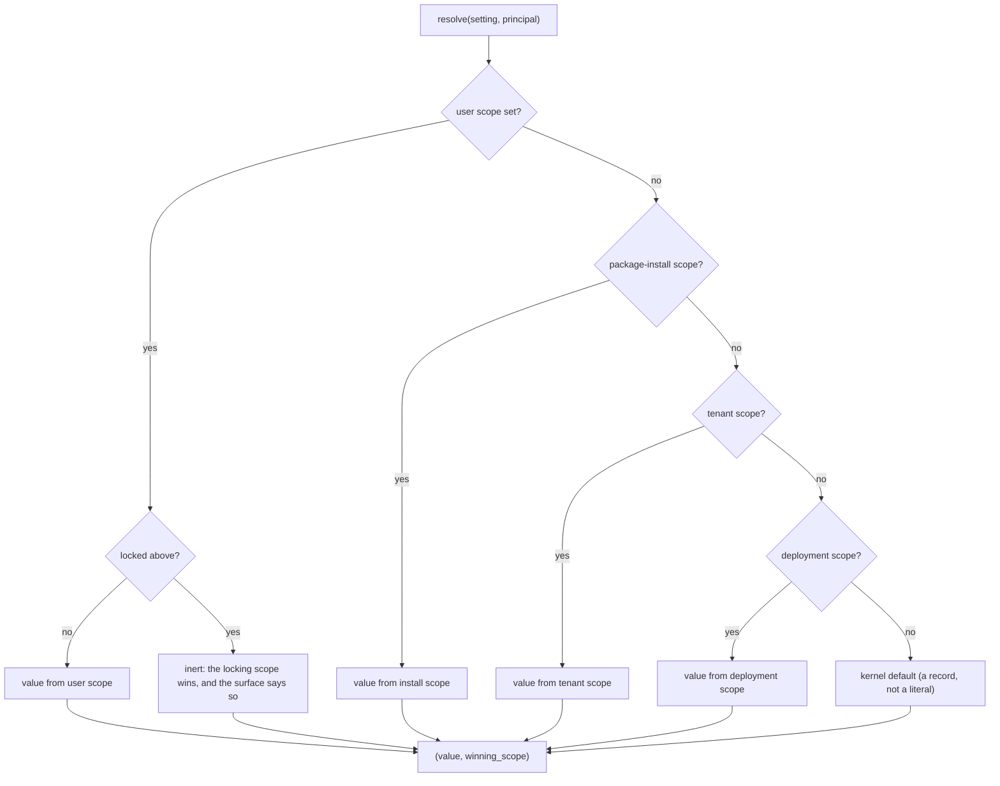

# 12 — Identity, user lifecycle and settings precedence

Spec: [05 §A, §B, §C](../05-subsystem-specs.md#a-identity-sso-and-oidc).

## Identity: many providers, one canonical person

- A provider is a row: issuer, client, discovery URL, enabled, auto-provision (A3, A4).
- `(issuer, subject)` is the key; subject alone is never a key (A1, I-01).
- Linking is explicit and audited; an unlinked identity inherits nothing (A2, I-03).

## Person lifecycle

Deactivation revokes sessions, node tokens and activations in one action (B5, U-02). State is evaluated
at the door on every entry kind (U-01).

## Settings precedence

| Rule | Requirement |
|---|---|
| One resolver, returning the value and which scope won | N-01 |
| Write permission is declared per scope | N-02 |
| A locked scope makes lower scopes inert and visible | N-03 |
| Unknown or ill-typed keys refused at write | N-04 |
| No literal where a setting exists | N-05 |

A bot's brain (ADR-162) is one instance of this resolver, not a separate mechanism.
