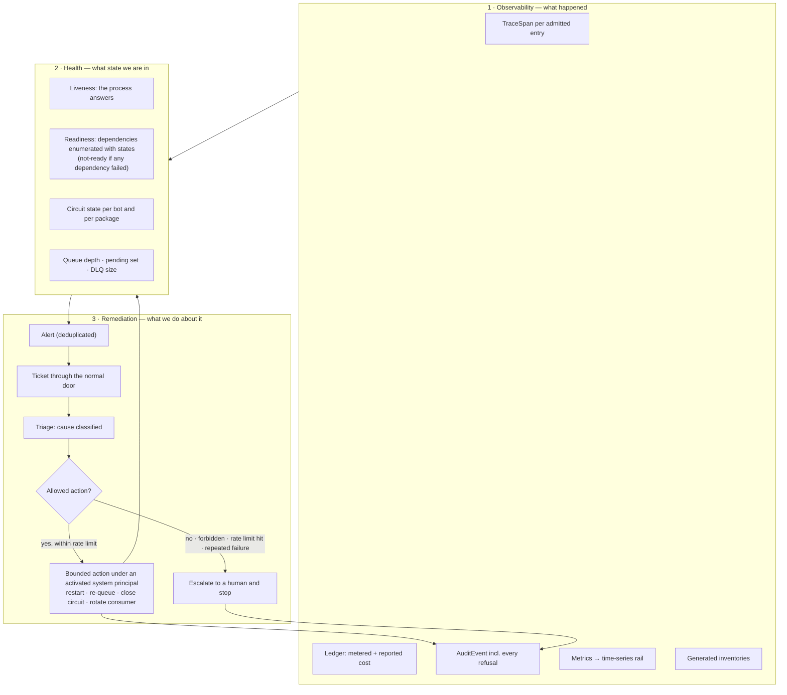

# 13 — Monitoring, health and self-healing

Three layers kept distinct, and the bounded loop between them. Spec:
[05 §J](../05-subsystem-specs.md#j-monitoring-health-and-self-healing).

## The forbidden set (J6)

A self-healing action may never, without a human: delete data, change grants, write a setting above
user scope, install or upgrade a package, or force any git operation. These are not policy text; the
remediation action is a closed enum and those are not in it.

## Why the layers stay separate (J1)

The api once reported healthy with no database, because the check was a shallow HTTP probe. Liveness
answered, readiness was never asked, and remediation had nothing to act on. Readiness that enumerates
its dependencies is what makes the loop honest (H-01).

## Single-node has the same loop

Metrics write to the time-series rail and render from the artifact, so `demo` mode observes itself with
no scraper installed (H-02). `enterprise` exposes the same series for Prometheus; the loop does not
change shape.
