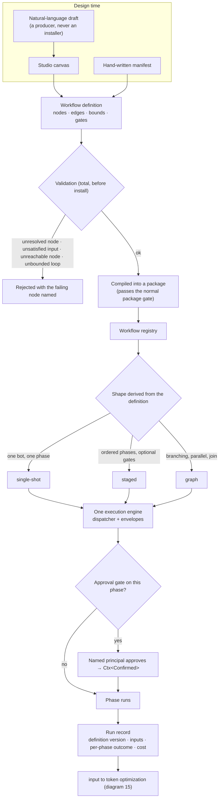

# 14 — Workflow authoring to runtime

Design time compiles into the runtime. There is no second execution engine. Spec:
[07 §L](../07-subsystem-specs-2.md#l-workflow-authoring-and-execution).

## What the picture forbids

| Forbidden | Requirement |
|---|---|
| A published workflow that lives outside the package model | F-01 |
| A definition that installs without total validation | F-02 |
| A second engine per shape | F-03 |
| A gate a model can satisfy | F-04 |
| An unbounded loop or fan-out | F-06 |

## Why run records matter twice

They make a run explainable now and comparable later. Counterfactual optimization (diagram 15) replays
them; without a complete record there is nothing to replay and no baseline to beat.
