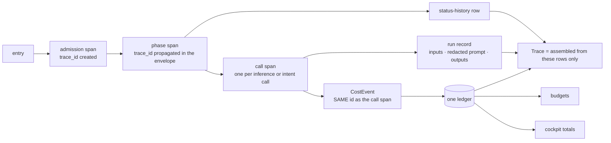
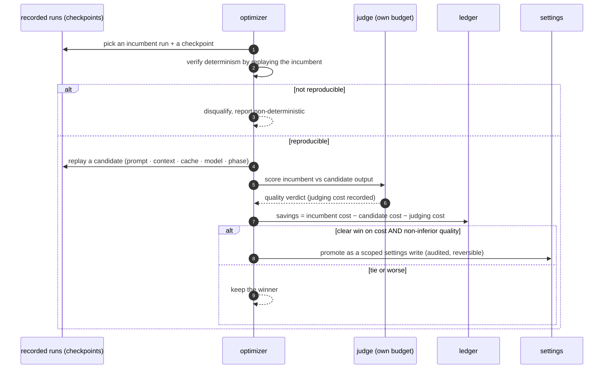

# 15 — The trace and cost spine, and counterfactual optimization

One set of records answers three questions: what happened, what it cost, and whether it could cost
less. Spec: [07 §M, §N](../07-subsystem-specs-2.md#m-token-optimization-and-cost-efficiency).

## The spine

Three span kinds and nothing else: admission, phase, call (N3). A missing row is a visible gap, never
a synthesized span (N1, G-02). Call spans and cost events share an id, so totals reconcile by
construction rather than by a hand-written join (N4, G-03).

## Counterfactual optimization

| Rule | Requirement |
|---|---|
| Never experiment on live person work | K-01 |
| Savings net of judging cost, quality non-inferior | K-02 |
| Non-reproducible replay disqualified | K-03 |
| Promotion is an audited, reversible settings write | K-04 |
| Claimed savings reconcile against the ledger | K-05 |
| Eliding a phase needs human approval | K-06 |

The lever order by blast radius is prompt shape, context selection, cache reuse, model choice, phase
elision. The first four are reversible by a settings write; the last changes the product, which is why
it is gated.
