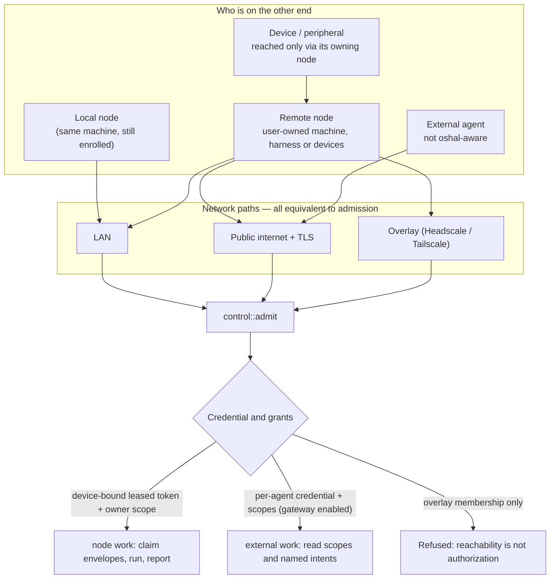
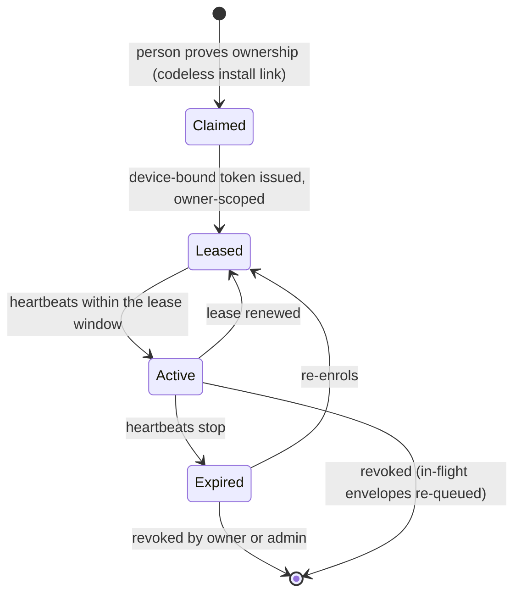

# 16 — Node network, overlay and external agents

Four ways something outside the kernel process participates, and the one rule they share. Spec:
[07 §R, §S](../07-subsystem-specs-2.md#r-external-agents-and-a2a).

## The rule the diagram exists to state

**Being reachable is not being authorized (S3, Z-03).** An overlay is a transport convenience. A node
on the overlay with no valid lease is refused exactly like a stranger on the internet.

## Enrollment and lease

An expired lease releases in-flight envelopes for re-queue with an attempt count (S4, Z-04). A node is
disposable: it holds no authority beyond its lease and no state that cannot be re-created (S8).

## External agents sit lower

| | node | external agent |
|---|---|---|
| Identity | device-bound leased token, owner-scoped | per-agent credential with scopes |
| Default ceiling | may run bot work its owner holds | read scopes and named intents only |
| Confirmed context | possible, through the door as the bot | never by default (R4, Y-03) |
| Discovery | not discoverable | curated card, absent unless enabled (R1, R2) |
| Outbound | claims envelopes | called as a schema-bounded, budgeted, audited intent (R5) |
