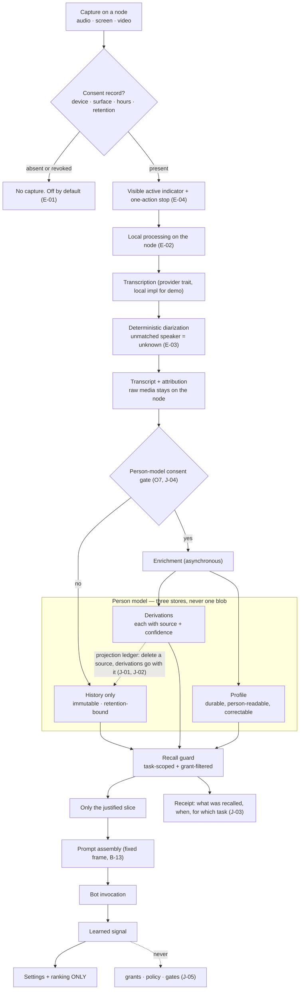

# 17 — Ambient capture, the person model, and recall

The most consent-sensitive path in the platform, from a microphone to a prompt. Spec:
[07 §O, §P](../07-subsystem-specs-2.md#o-ambient-capture-listening-transcription-diarization).

## The four rules this path exists to enforce

| Rule | Why |
|---|---|
| Capture off by default, consent scoped and revocable | a listening default-on is indefensible |
| Raw media stays on the node | the kernel receives transcripts, not streams |
| Recall is a guarded slice with a receipt | dumping a profile into every prompt is an exfiltration channel |
| Learning moves settings and ranking, never authority | a learned signal is as untrusted as the model (P4) |

## Proactivity

Unsolicited action is rate-limited, budgeted and switchable off (J-06). An assistant that can act on
its own without a bound is both a cost incident and a trust incident.
