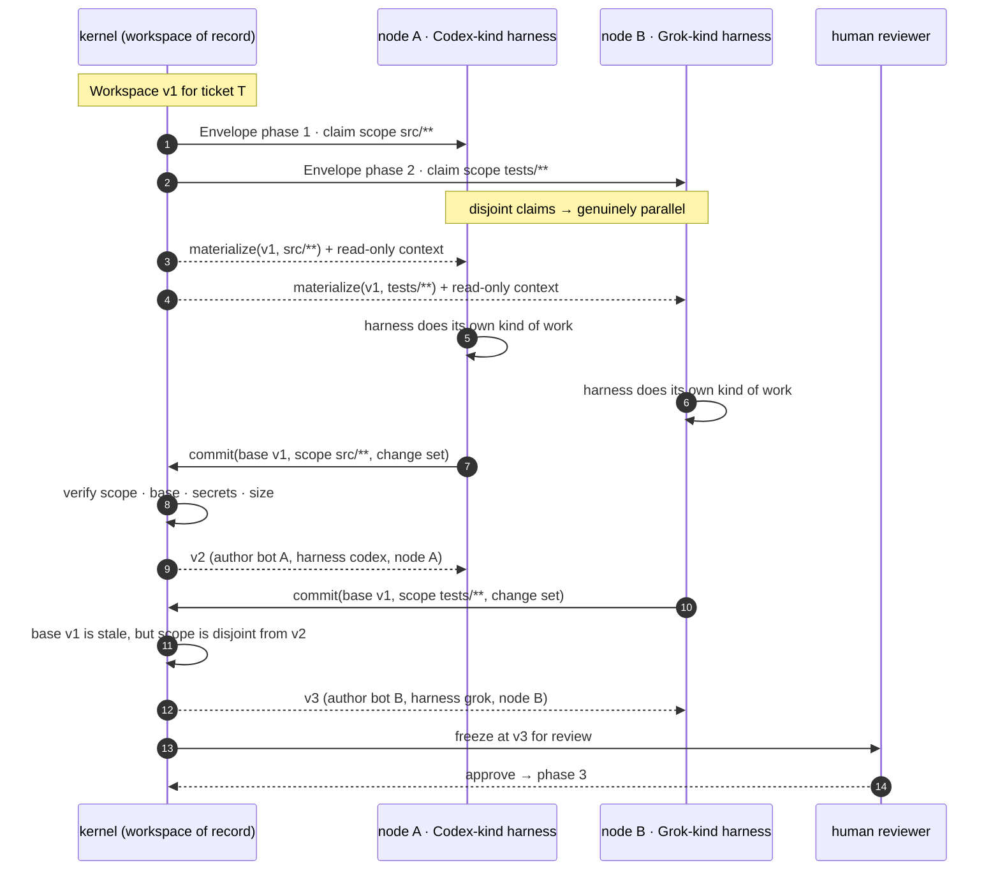
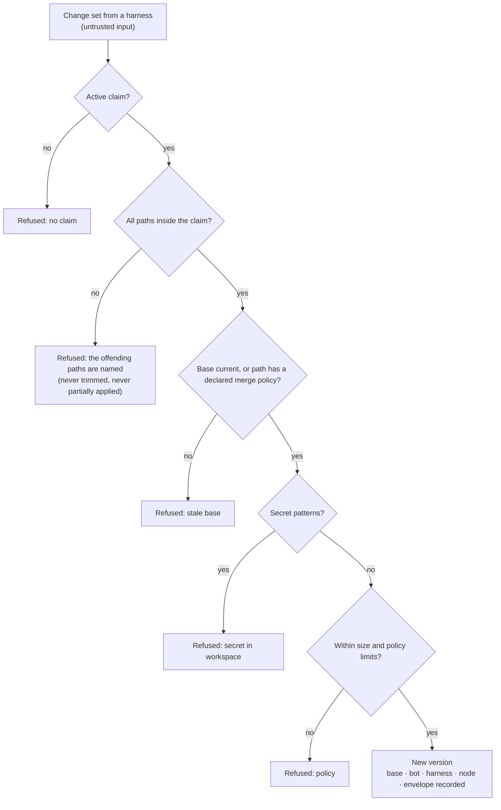

# 18 — The task workspace: claims, commits and any-harness collaboration

The task is the common thread, the workspace is the shared ground, and no two writers ever share an
index. Spec: [08](../08-workspace-and-assistant.md).

## Claim, work, commit

Disjoint scopes make a stale base harmless: the kernel is rebasing a scoped change set, not merging two
views of one tree. Overlapping scopes take the other path.

## What a commit must survive

## Merge policy vocabulary, closed by design

| Policy | Behavior | Typical path |
|---|---|---|
| `exclusive` (default) | concurrent writers serialize; stale base refused | source files |
| `append-only` | appends merge, rewrites refused | logs, journals, ledgers |
| `last-writer-wins` | newest commit wins, older recorded | generated outputs |
| `three-way` | textual merge, conflict markers refused | text a team genuinely co-edits |

An automatic merge nobody declared is how a change disappears, so there is no fifth option and no
default that merges silently.

## The rule underneath

Each harness gets its own materialization. There is no shared working directory and no shared index.
That is the direct negation of the failure shape this project already paid for: a rejected commit
retried against an index another session had cleared, shipping one file of a set.
