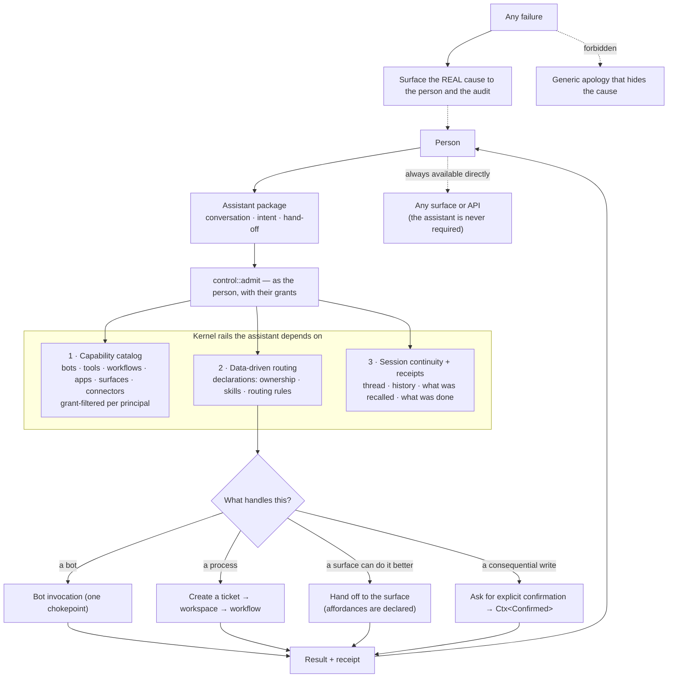

# 19 — The assistant as the human's integration with the swarm

The assistant is a package. The three rails under it are kernel. Spec:
[08 §6](../08-workspace-and-assistant.md#6-the-assistant-the-humans-integration-with-the-swarm).

## The rails, and why each is kernel rather than package

| Rail | Why it cannot live in the assistant |
|---|---|
| Capability catalog | it must be grant-filtered by the same authority as the door, or it becomes a discovery leak |
| Routing declarations | routing by pattern matching in the assistant is the drift this platform already removed once |
| Session continuity and receipts | receipts are a person-model obligation, not a convenience of one surface |

## Four rules with scars behind them

| Rule | Origin |
|---|---|
| Never a required chokepoint (A5) | the assistant was down for three days; everything else had to keep working |
| Surface the real error, never a generic apology (A7) | a catch-all hid an ownership bug with nothing logged |
| A refusal must not strand a half-created task (A7) | refused threads left records stuck in a created state |
| Acts as the person, never with more authority (A6) | it is the most prompt-exposed component in the platform |
