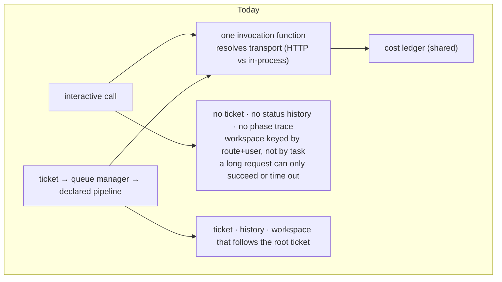
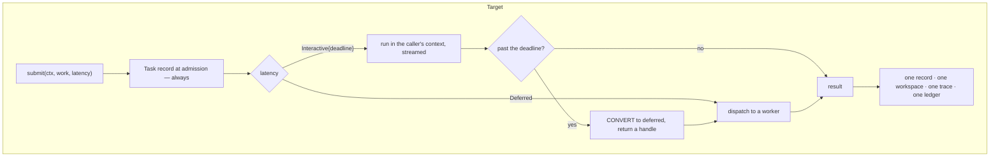
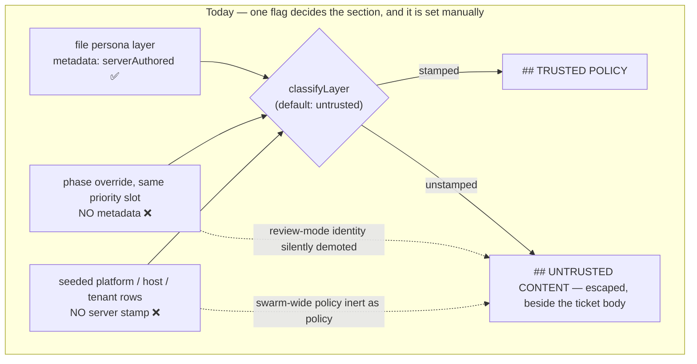
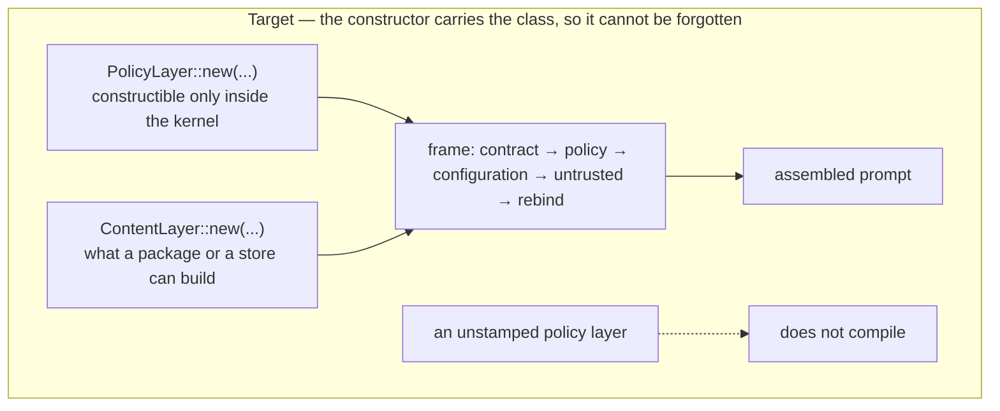

# 20 — One way to do things: submission, and provenance by type

Rewritten 2026-09-18 after reading the code. The earlier version of this page claimed prompt assembly
was accretive concatenation and that an authority rebind existed to patch it. Both were wrong; the
corrected reading is in [10 §0](../10-what-we-are-improving.md#0-corrections-of-record) and [10
§4](../10-what-we-are-improving.md#4-persona-layers-and-tools).

## Starting work: one record, latency as a parameter

Today the interactive and queued modes already share one invocation function and one cost ledger. What
they do not share is a **record**, and that is the whole gap.

The conversion arrow is the payoff. It is unreachable while only one of the two modes has a record.

## Prompt assembly: the frame is already right

The kernel-owned frame exists today and is good. Trust class is derived by the server and defaults to
untrusted; role layers are always untrusted because user-reachable surfaces persist them; untrusted
content is escaped and capped; and tool availability is not prompt text at all but an immutable binding
resolved from durable authorization modes.

The defect is narrower: **provenance is stamped by hand.**

The fail-closed default is already correct, which is why the two mis-stamped layers are silently
demoted rather than dangerous. Making the class a type removes the silence.

## The counts that are real

Only the rows the audit confirmed.

| Count | Today | Target |
|---|---|---|
| Declarations nothing reads | 3 (phases, stages, extends) | 0, refused at load |
| Workflow shapes bridged by hand | 2 | 1 |
| Prompt assembly implementations | 3 | 1 |
| Provenance stamped by hand | 3 sites, 2 wrong today | 0, carried by type |
| Meanings of one approval status | 3 | 1 |
| Task records for interactive work | none | same as queued |

Dispatch path count, bot selection mechanism count and prompt contributor count are deliberately absent:
the audit found the first two coherent and showed the third was a count of producers, not mechanisms.
