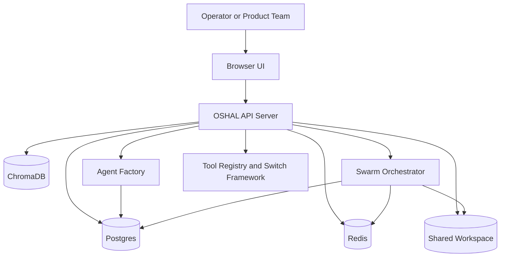
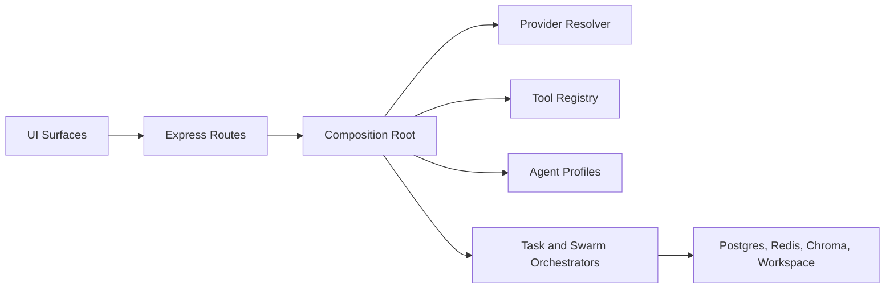
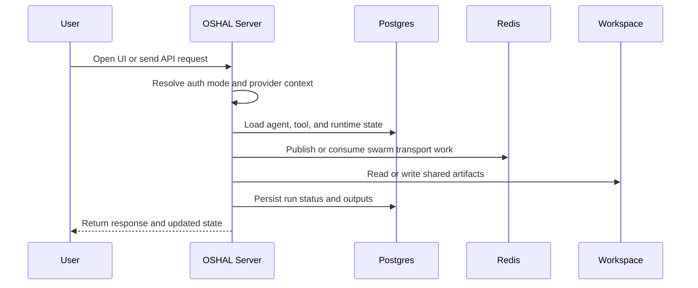

# Core Runtime Overview

This document describes the core OSHAL runtime that we actually want new reviewers to understand first.

It leaves out the secondary screens and historical migration clutter on purpose.

## System Context

## Runtime Layers

## Core Request Flow

## Deployment Modes

### Docker-first core mode

This is the primary path for evaluation and onboarding.

- `docker-compose.core.yml`
- mock auth enabled by default
- self-contained Postgres, Redis, and Chroma
- no external Docker network requirement

### Localhost dev mode

This runs the server on the host while reusing the same backing services from Docker.

- `bash scripts/start-localhost.sh`
- useful for TypeScript iteration
- same core runtime dependencies as Docker mode

### Kubernetes mode

This is the packaging path, not the first-time onboarding path.

- `bash scripts/install-k8s.sh`
- wraps `scripts/setup-oshal-k8s.sh`
- renders bundle output under `output/k8/oshal/`

## Current Product Truth

The core control plane is real and runnable.

The biggest missing product loop is still autonomous self-registration and self-learning for new bots. Bot creation and provisioning are in place, but the final closed-loop growth path is still pending.
