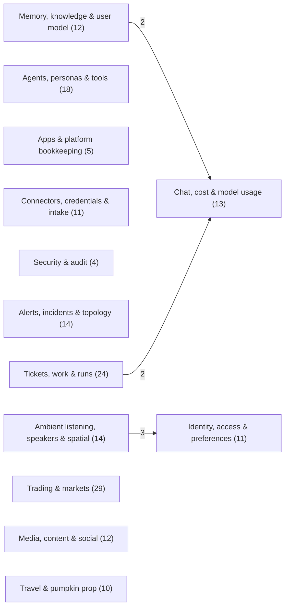

# Data model

Schema diagrams for every database oshal runs. Each page pairs an entity-relationship diagram with
the full column list and the row-level-security rule that scopes each table.

The pages are **generated** from the catalog of a running reference database plus a scan of the
source that creates each table (`scripts/generate-schema-docs.js`). Don't edit the pages by hand.
Everything outside the `schema-docs` markers in this README is hand-written and survives
regeneration. The committed pages were read from the local development stack.

## Stores at a glance

<!-- schema-docs:begin:inventory -->
| Store | Engine | Holds | Documented in |
|---|---|---|---|
| `oshal` | Postgres + pgvector | 354 tables and 14 views in schema `public`. Tables: 177 declared by core, 184 by application packages (8 by both), 1 by no scanned source | [core domain pages](#core-postgres-domains) · each package's `SCHEMA.md` |
| `oshal_ts` | TimescaleDB (Postgres) | 6 core tables (world data, trading signal labels) | [timeseries.md](timeseries.md) |
| SQLite files | SQLite | 11 core tables declared in 7 source files | [sqlite.md](sqlite.md) |
| ArangoDB | graph | one database per person and per tenant, `nodes` + `edges` collections | [below](#graph-vector-and-cache-stores) |
| ChromaDB | vector | named collections, server-side embeddings | [below](#graph-vector-and-cache-stores) |
| Redis | streams / keys | mesh transport, heartbeats, subtask registry, replay guards | [below](#graph-vector-and-cache-stores) |
<!-- schema-docs:end:inventory -->

## How the schema is built

Three mechanisms create tables in the platform database. A table's page names the files that
declare it ("Defined in").

1. **Core migrations.** `scripts/migrations/*.sql` are applied at API boot in filename order by
   `DatabaseBootstrapService`
   ([database-bootstrap-service.ts](../../../src/features/tool-registry/services/database-bootstrap-service.ts)),
   but only when `RUN_MIGRATIONS=true` and the schema bootstrap is not validate-only. Each file and
   its `app_migrations` history row commit in one transaction, so a file is never applied without
   being recorded.
2. **Runtime DDL in core stores.** Many stores create their own tables with
   `CREATE TABLE IF NOT EXISTS` the first time they run (for example the
   `src/shared/services/database/*-schema.ts` modules and the `src/app/trading-*` stores).
   `buildOwnerRlsPolicyStatements`
   ([owner-rls-policy.ts](../../../src/shared/services/database/owner-rls-policy.ts)) gives a
   table created this way the canonical owner policy at the same moment. Because this DDL runs
   on first use, a table can exist in source but not yet in a given database. Those tables are
   listed under *Declared in source, not present in the reference database*, with columns parsed
   from the statement.
3. **Package migrations and package code.** An application package lists package-relative SQL
   files under `migrations:` in its `oshal-app.yaml`. They are applied when the package activates,
   each file in one transaction, and recorded per `(app_name, file_name)` in
   `app_package_migrations`
   ([swarm-app-service.ts](../../../src/features/swarm-apps/services/swarm-app-service.ts)).
   This is gated by `APP_PACKAGE_MIGRATIONS`, which is off in code and set to `1` in
   `docker-compose.oshal-local.yml`. Packages also create tables from their route code at runtime.

`docker/postgres/migrations/` is not applied by any runner. Tables declared only there show up as
declared but not present.

## The contract every table follows

- **One database, one schema.** Core and every installed package share database `oshal`, schema
  `public`. There is no per-package Postgres schema. A package's tables are the ones its own
  migrations and code declare, and they are documented in that package's `SCHEMA.md`.
- **Rows are owned, and RLS enforces it.** The canonical policy is `<table>_owner_or_operator`:
  a row is visible and writable when its owner column equals
  `current_setting('oshal.current_sub')`, or when `oshal.is_operator` is `on`. The shape is built
  by `buildOwnerRlsPolicyStatements` and mirrored in
  [rls-policies-enforce.sql](../../governance/rls-policies-enforce.sql), which is the reviewed
  source of truth. Child tables without an owner column are scoped through their parent, either
  by a helper such as `oshal_owns_task(task_id)` or by an `EXISTS` on the parent row. Postgres
  exempts superuser and `BYPASSRLS` roles, so the policies enforce under the `oshal_app` runtime
  role. See the [RLS runbook](../../governance/RLS-RUNBOOK.md).
- **Each page states the rule as the database has it.** "RLS **forced** - owner `user_sub`" is
  read from the table's `pg_policies` expressions, not inferred from column names.
  `forced` / `enabled` / `off` are the table's `FORCE` and `ENABLE ROW LEVEL SECURITY` flags.

## Core Postgres domains

The core tables are split into reading-order domains. Grouping is presentation only. The
domain rules are in
[domains.js](../../../scripts/schema-docs/domains.js).

<!-- schema-docs:begin:domains -->
| Domain | Tables | RLS forced | What it holds |
|---|---|---|---|
| [Tickets, work & runs](tickets-and-work.md) | 24 (+1) | 16 | The ticket queue, work items, workspaces, swarm and workflow runs, subtask lifecycle, Jarvis tasks and brief deliveries, the remote-task journal and apply runs. |
| [Agents, personas & tools](agents-and-tools.md) | 18 | 4 | Bot identities and their configuration, persona layers, roles and presets, the tool registry and its approvals, routing audit, A2A agents and shared node leases. |
| [Apps & platform bookkeeping](apps-and-platform.md) | 5 | 2 | Installed applications, app registries and access tiers, and the two migration ledgers (core and package). |
| [Identity, access & preferences](identity-and-access.md) | 11 (+2) | 11 | Tenants and memberships, local and federated identities, CLI and TV tokens, channel links, and per-user preferences. |
| [Connectors, credentials & intake](connectors.md) | 11 | 9 | Connector accounts and their encrypted credentials, per-user enablement, action audit, webhook deliveries, and the inbox / feed / intake cursors that pull external data in. |
| [Chat, cost & model usage](cost-and-usage.md) | 13 | 8 | Chat tasks and messages (the canonical per-call cost ledger), cost events, budgets, free-tier state, remote cost receipts, Token Chase, optimisation and evaluation records. |
| [Security & audit](security-and-audit.md) | 4 | 4 | The append-only access audit log, data-lifecycle audit, and security-center scans and findings. |
| [Alerts, incidents & topology](alerts-and-incidents.md) | 14 | 14 | Alert-pipeline events, envelopes, dispatches and dead letters; incidents with their members and snapshots; the service topology graph; RCA reservations and batch-job telemetry. |
| [Memory, knowledge & user model](memory-and-knowledge.md) | 12 (+7) | 12 | Agent and swarm memory, knowledge documents, pgvector RAG chunks, the personal graph, the user model and person model, and visual response artifacts. |
| [Ambient listening, speakers & spatial](ambient-and-spatial.md) | 14 | 14 | Ambient transcript capture, speaker diarization and consent, per-person enrichment, and spatial scans. |
| [Trading & markets](trading.md) | 29 | 20 | Trading accounts and books, orders, signals, decisions and predictions, risk guards, the strategy lab, market bars and the Kalshi forward test. |
| [Media, content & social](media-and-content.md) | 12 | 12 | Content studio articles and drafts, social and LinkedIn drafts, and the video series / pump / vids job tables. |
| [Travel & pumpkin prop](travel-and-props.md) | 10 | 7 | Tables for the travel experience (migration 050) and the pumpkin prop (migration 084) that core migrations create. |

"(+N)" counts tables declared in source but not present in the reference database; each page lists them last. In the map below, arrows point from the domain holding a foreign key to the domain it references; the label is the number of foreign keys.


<!-- schema-docs:end:domains -->

## Graph, vector and cache stores

These stores have no relational catalog, so this section is hand-written from the code that
defines their layout.

- **ArangoDB** ([ADR-045](../../adr/045-two-tier-graph-database-and-connector.md)). This tier is optional: it is
  absent when `ARANGO_URL` is unset. There is one database per person, `g_p_<24-hex SHA-256 of
  the sub>`, and one per tenant, `g_t_<24-hex SHA-256 of the tenant>`
  ([graph-keys.ts](../../../src/features/graph/services/graph-keys.ts)). Each database holds a
  `nodes` document collection and an `edges` edge collection
  ([arango-graph-adapter.ts](../../../src/features/graph/services/arango-graph-adapter.ts)). The
  graph is schemaless: a node's `_key` is derived from the caller's node id.
- **ChromaDB.** Swarm memory uses `swarm-tickets`, `swarm-messages`, `swarm-knowledge` and
  `swarm-memory`, which are pre-ensured at startup
  ([swarm-memory-service.ts](../../../src/features/agent-management/services/swarm-memory-service.ts)).
  The RAG corpus is `infra-runbooks`. The per-user long-tail memory is `user-model`
  ([haven-context-service.ts](../../../src/features/user-model/services/haven-context-service.ts)).
- **Redis** holds transient coordination state, not a schema. The key prefixes are:
  - `oshal:mesh:<channel>` streams
    ([redis-mesh-transport.ts](../../../src/features/agent-management/services/redis-mesh-transport.ts))
  - `oshal:runtime-agent:<agentId>` heartbeats
    ([agent-runtime-registry-service.ts](../../../src/features/agent-management/services/agent-runtime-registry-service.ts))
  - `oshal:subtask-registry:<parentUnitId>`
    ([redis-subtask-lifecycle-store.ts](../../../src/features/swarm-orchestration/services/redis-subtask-lifecycle-store.ts))
  - `oshal:delegation:used`
    ([delegation-replay-store.ts](../../../src/shared/security/delegation-replay-store.ts))

## Application packages

Every package that owns tables carries a `SCHEMA.md` beside its `oshal-app.yaml`, with its
diagram, columns, how its tables are created, and the core tables it references. The store repo
indexes them in `SCHEMAS.md` at its root. Foreign keys from a package into core link back to
these pages.

## Regenerating

```bash
node scripts/generate-schema-docs.js --store-root <store repo> --private-root <private package repo>
```

- **Reads the running stack.** It reads `oshal-local-db` and `oshal-local-tsdb` through
  `docker exec … psql` using catalog `SELECT`s only. Use `--pg-url` / `--ts-url` for any other
  Postgres. `--help` lists every option.
- **Scans three repos.** The core tree, plus each package repo you pass.
- **Writes only what changed.** An unchanged schema regenerates to a zero diff.
- **Warns and never guesses.** It reports:
  - live tables that no scanned source declares; these are not documented
  - core tables no domain rule matches; these land on an "Other" page
  - declarations it could not parse
