<!-- GENERATED by scripts/generate-schema-docs.js - do not edit by hand; regenerate instead. -->

# Agents, personas & tools

[Data model index](README.md) · database `oshal` · schema `public` · 18 tables

Bot identities and their configuration, persona layers, roles and presets, the tool registry and its approvals, routing audit, A2A agents and shared node leases.

The diagram shows key columns only: primary keys (PK), foreign keys (FK), single-column unique keys (UK) and the column an RLS policy scopes rows by ("owner"). A box with no columns is a table documented on another page. Every column is listed under Tables.

## Diagram

```mermaid
erDiagram
  a2a_agents {
    uuid id PK
    text token_hash UK
  }
  agent_config {
    uuid config_id PK
    uuid agent_id FK, UK
  }
  agent_tools {
    uuid agent_id PK, FK
    uuid tool_id PK, FK
  }
  agents {
    uuid agent_id PK
  }
  config_snapshots {
    uuid snapshot_id PK
    uuid agent_id FK
  }
  config_sync_log {
    uuid sync_id PK
    uuid agent_id FK
  }
  oshal_node_resource_leases {
    text resource_key PK
    uuid lease_id UK
  }
  oshal_user_delegations {
    text jti PK
    text workload_id FK
  }
  oshal_workload_identities {
    text workload_id PK
  }
  persona_layers {
    uuid layer_id PK
  }
  routing_audit_log {
    integer id PK
  }
  runtime_tool_executors {
    varchar tool_name PK, FK
  }
  swarm_presets {
    uuid id PK
    text user_id "owner"
  }
  swarm_roles {
    text user_sub PK
  }
  tool_approval_requests {
    uuid request_id PK
    uuid tool_id FK
  }
  tool_install_log {
    uuid install_id PK
    uuid agent_id FK
    uuid tool_id FK
  }
  tool_verification_results {
    uuid id PK
    uuid tool_id FK
  }
  tools {
    uuid tool_id PK
    varchar name UK
  }
  agents ||--o| agent_config : "agent_id"
  agents ||--o{ agent_tools : "agent_id"
  tools ||--o{ agent_tools : "tool_id"
  agents ||--o{ config_snapshots : "agent_id"
  agents ||--o{ config_sync_log : "agent_id"
  oshal_workload_identities ||--o{ oshal_user_delegations : "workload_id"
  tools ||--o| runtime_tool_executors : "tool_name"
  tools ||--o{ tool_approval_requests : "tool_id"
  agents ||--o{ tool_install_log : "agent_id"
  tools ||--o{ tool_install_log : "tool_id"
  tools ||--o{ tool_verification_results : "tool_id"
```

## Tables

### `a2a_agents`

Defined in `scripts/migrations/089-a2a-gateway.sql`, `src/features/a2a-gateway/services/a2a-credentials-service.ts` · RLS **off**

| Column | Type | Null | Default | Notes |
|---|---|---|---|---|
| `id` | uuid | no |  | PK |
| `name` | text | no |  |  |
| `token_hash` | text | no |  | UK |
| `scopes` | text[] | no | '{}' |  |
| `enabled` | boolean | no | true |  |
| `owner_note` | text | yes |  |  |
| `created_at` | timestamp with time zone | yes | now() |  |
| `last_seen_at` | timestamp with time zone | yes |  |  |
| `revoked_at` | timestamp with time zone | yes |  |  |

### `agent_config`

> Per-agent configuration store for external service credentials and tool settings. Ported from lm-3 AgentConfigManager (Redis) to Postgres.

Defined in `scripts/migrations/011-agent-config.sql` · RLS **off**

| Column | Type | Null | Default | Notes |
|---|---|---|---|---|
| `config_id` | uuid | no | gen_random_uuid() | PK |
| `agent_id` | uuid | no |  | UK · FK → [`agents.agent_id`](agents-and-tools.md#agents) |
| `config_schema` | jsonb | no | '[]' | JSON array of field definitions: [{name, type, label, required, defaultValue?, options?, placeholder?}] |
| `config_values` | jsonb | no | '{}' | JSON object of actual config values keyed by field name |
| `created_at` | timestamp with time zone | no | now() |  |
| `updated_at` | timestamp with time zone | no | now() |  |

### `agent_tools`

Defined in `scripts/migrations/001-multi-agent-foundation.sql`, `scripts/migrations/002-layer1-tools-framework.sql` · RLS **off**

| Column | Type | Null | Default | Notes |
|---|---|---|---|---|
| `agent_id` | uuid | no |  | PK · FK → [`agents.agent_id`](agents-and-tools.md#agents) |
| `tool_id` | uuid | no |  | PK · FK → [`tools.tool_id`](agents-and-tools.md#tools) |
| `auth_mode` | character varying(10) | no | 'off' |  |
| `installed` | boolean | no | false |  |
| `installed_at` | timestamp with time zone | yes |  |  |
| `install_verified` | boolean | no | false |  |
| `tool_config` | jsonb | no | '{}' |  |
| `created_at` | timestamp with time zone | no | now() |  |
| `updated_at` | timestamp with time zone | no | now() |  |

### `agents`

Defined in `scripts/migrations/001-multi-agent-foundation.sql` · RLS **off**

| Column | Type | Null | Default | Notes |
|---|---|---|---|---|
| `agent_id` | uuid | no | gen_random_uuid() | PK |
| `name` | character varying(255) | no |  |  |
| `status` | character varying(20) | no | 'active' |  |
| `api_provider_id` | character varying(100) | no |  |  |
| `model_id` | character varying(255) | yes |  |  |
| `provider_overrides` | jsonb | no | '{}' |  |
| `persona` | jsonb | no | '{}' |  |
| `tools` | uuid[] | no | '{}' |  |
| `metadata` | jsonb | no | '{}' |  |
| `config_version` | integer | no | 1 |  |
| `config_source` | character varying(20) | no | 'central' |  |
| `last_sync_at` | timestamp with time zone | yes |  |  |
| `created_at` | timestamp with time zone | no | now() |  |
| `updated_at` | timestamp with time zone | no | now() |  |
| `base_capabilities` | text[] | no | '{}' |  |
| `base_selector_descriptor` | text | no | '' |  |
| `base_routing_keywords` | text[] | no | '{}' |  |
| `computed_capabilities` | text[] | no | '{}' |  |
| `computed_selector_descriptor` | text | no | '' |  |
| `computed_routing_keywords` | text[] | no | '{}' |  |
| `selector_last_computed_at` | timestamp with time zone | yes |  |  |

### `config_snapshots`

Defined in `scripts/migrations/001-multi-agent-foundation.sql` · RLS **off**

| Column | Type | Null | Default | Notes |
|---|---|---|---|---|
| `snapshot_id` | uuid | no | gen_random_uuid() | PK |
| `agent_id` | uuid | no |  | FK → [`agents.agent_id`](agents-and-tools.md#agents) |
| `config_version` | integer | no |  |  |
| `snapshot_data` | jsonb | no |  |  |
| `reason` | character varying(255) | yes |  |  |
| `created_at` | timestamp with time zone | no | now() |  |

### `config_sync_log`

Defined in `scripts/migrations/001-multi-agent-foundation.sql` · RLS **off**

| Column | Type | Null | Default | Notes |
|---|---|---|---|---|
| `sync_id` | uuid | no | gen_random_uuid() | PK |
| `agent_id` | uuid | no |  | FK → [`agents.agent_id`](agents-and-tools.md#agents) |
| `direction` | character varying(10) | no |  |  |
| `config_version_before` | integer | no |  |  |
| `config_version_after` | integer | no |  |  |
| `changes` | jsonb | no | '{}' |  |
| `status` | character varying(20) | no | 'pending' |  |
| `conflict_resolution` | character varying(20) | yes |  |  |
| `synced_at` | timestamp with time zone | no | now() |  |

### `oshal_node_resource_leases`

Defined in `scripts/migrations/120-shared-node-resource-leases.sql` · RLS **forced** - all commands: operator only

| Column | Type | Null | Default | Notes |
|---|---|---|---|---|
| `resource_key` | text | no |  | PK |
| `lease_id` | uuid | no |  | UK |
| `holder` | text | no |  |  |
| `purpose` | text | no |  |  |
| `acquired_at` | timestamp with time zone | no | now() |  |
| `heartbeat_at` | timestamp with time zone | no | now() |  |
| `expires_at` | timestamp with time zone | no |  |  |
| `metadata` | jsonb | no | '{}' |  |
| `created_at` | timestamp with time zone | no | now() |  |
| `updated_at` | timestamp with time zone | no | now() |  |

### `oshal_user_delegations`

Defined in `scripts/migrations/119-workload-delegation-authority.sql` · RLS **forced** - custom policy `oshal_user_delegations_broker`

| Column | Type | Null | Default | Notes |
|---|---|---|---|---|
| `jti` | text | no |  | PK |
| `workload_id` | text | no |  | FK → [`oshal_workload_identities.workload_id`](agents-and-tools.md#oshal_workload_identities) |
| `user_sub` | text | no |  |  |
| `principal_issuer` | text | no |  |  |
| `ticket_id` | text | yes |  |  |
| `run_id` | text | yes |  |  |
| `route_method` | text | no |  |  |
| `route_path` | text | no |  |  |
| `body_sha256` | text | no |  |  |
| `scopes` | text[] | no |  |  |
| `issued_at` | timestamp with time zone | no |  |  |
| `not_before` | timestamp with time zone | no |  |  |
| `expires_at` | timestamp with time zone | no |  |  |
| `revoked_at` | timestamp with time zone | yes |  |  |
| `consumed_at` | timestamp with time zone | yes |  |  |
| `created_at` | timestamp with time zone | no | now() |  |

### `oshal_workload_identities`

Defined in `scripts/migrations/119-workload-delegation-authority.sql` · RLS **forced** - custom policy `oshal_workload_identities_broker`

| Column | Type | Null | Default | Notes |
|---|---|---|---|---|
| `workload_id` | text | no |  | PK |
| `workload_kind` | text | no |  |  |
| `credential_hash` | text | no |  |  |
| `allowed_scopes` | text[] | no |  |  |
| `status` | text | no | 'active' |  |
| `expires_at` | timestamp with time zone | yes |  |  |
| `current_key_id` | text | no |  |  |
| `rotated_at` | timestamp with time zone | yes |  |  |
| `previous_credential_hash` | text | yes |  |  |
| `previous_key_id` | text | yes |  |  |
| `previous_valid_until` | timestamp with time zone | yes |  |  |
| `created_at` | timestamp with time zone | no | now() |  |
| `updated_at` | timestamp with time zone | no | now() |  |

### `persona_layers`

Defined in `scripts/migrations/009-persona-layers.sql`, `src/shared/services/database/persona-layer-schema.ts` · RLS **off**

| Column | Type | Null | Default | Notes |
|---|---|---|---|---|
| `layer_id` | uuid | no | gen_random_uuid() | PK |
| `layer_type` | text | no |  |  |
| `scope` | text | no |  |  |
| `agent_id` | uuid | yes |  |  |
| `priority` | integer | no | 50 |  |
| `prompt_fragment` | text | no |  |  |
| `metadata` | jsonb | no | '{}' |  |
| `enabled` | boolean | no | true |  |
| `created_at` | timestamp with time zone | no | now() |  |
| `updated_at` | timestamp with time zone | no | now() |  |

### `routing_audit_log`

Defined in `scripts/migrations/012-routing-audit-log.sql` · RLS **off**

| Column | Type | Null | Default | Notes |
|---|---|---|---|---|
| `id` | integer | no | nextval('routing_audit_log_id_seq') | PK |
| `task_id` | text | no |  |  |
| `ticket_external_id` | text | yes |  |  |
| `swarm_run_id` | text | yes |  |  |
| `winner_agent_id` | text | no |  |  |
| `strategy` | text | no |  |  |
| `winner_score` | double precision | no | 0 |  |
| `winner_confidence` | double precision | yes |  |  |
| `candidate_count` | integer | no | 0 |  |
| `candidates` | jsonb | no | '[]' |  |
| `tiers_attempted` | text[] | no | '{}' |  |
| `required_capabilities` | text[] | yes |  |  |
| `ticket_title` | text | yes |  |  |
| `duration_ms` | integer | no | 0 |  |
| `created_at` | timestamp with time zone | no | now() |  |

### `runtime_tool_executors`

Defined in `scripts/migrations/023-runtime-tool-executors.sql` · RLS **off**

| Column | Type | Null | Default | Notes |
|---|---|---|---|---|
| `tool_name` | character varying(255) | no |  | PK · FK → [`tools.name`](agents-and-tools.md#tools) |
| `executor_type` | character varying(20) | no |  |  |
| `cli_command` | text | yes |  |  |
| `api_endpoint` | text | yes |  |  |
| `mcp_server_name` | character varying(255) | yes |  |  |
| `builtin_key` | character varying(255) | yes |  |  |
| `runtime_registered` | boolean | no | true |  |
| `registered_by` | character varying(255) | no | 'runtime-api' |  |
| `registered_at` | timestamp with time zone | no | now() |  |
| `updated_at` | timestamp with time zone | no | now() |  |

### `swarm_presets`

Defined in `docker/postgres/migrations/001_add_onboarding_and_presets.sql`, `scripts/migrations/053-onboarding-and-presets.sql` · RLS **forced** - owner `user_id`

| Column | Type | Null | Default | Notes |
|---|---|---|---|---|
| `id` | uuid | no | gen_random_uuid() | PK |
| `user_id` | text | no |  | owner |
| `name` | text | no |  |  |
| `description` | text | yes |  |  |
| `bot_ids` | uuid[] | no | '{}' |  |
| `phase_config` | jsonb | no | '{}' |  |
| `created_at` | timestamp with time zone | yes | now() |  |
| `updated_at` | timestamp with time zone | yes | now() |  |

### `swarm_roles`

Defined in `src/features/swarm-roles/services/swarm-role-store.ts` · RLS **off**

| Column | Type | Null | Default | Notes |
|---|---|---|---|---|
| `user_sub` | text | no |  | PK |
| `email` | text | yes |  |  |
| `display_name` | text | yes |  |  |
| `role` | text | no |  |  |
| `granted_by_sub` | text | yes |  |  |
| `granted_at` | timestamp with time zone | no | now() |  |
| `note` | text | yes |  |  |

### `tool_approval_requests`

Defined in `scripts/migrations/003-tool-approval-requests.sql` · RLS **off**

| Column | Type | Null | Default | Notes |
|---|---|---|---|---|
| `request_id` | uuid | no | gen_random_uuid() | PK |
| `task_id` | text | no |  |  |
| `agent_id` | text | no |  |  |
| `tool_id` | uuid | no |  | FK → [`tools.tool_id`](agents-and-tools.md#tools) |
| `tool_name` | text | no |  |  |
| `tool_input` | jsonb | no | '{}' |  |
| `status` | text | no | 'pending' |  |
| `requested_at` | timestamp with time zone | no | now() |  |
| `resolved_at` | timestamp with time zone | yes |  |  |
| `resolved_by` | text | yes |  |  |
| `timeout_ms` | integer | no | 60000 |  |
| `context` | jsonb | yes | '{}' |  |
| `created_at` | timestamp with time zone | no | now() |  |
| `updated_at` | timestamp with time zone | no | now() |  |

### `tool_install_log`

Defined in `scripts/migrations/002-layer1-tools-framework.sql` · RLS **off**

| Column | Type | Null | Default | Notes |
|---|---|---|---|---|
| `install_id` | uuid | no | gen_random_uuid() | PK |
| `agent_id` | uuid | no |  | FK → [`agents.agent_id`](agents-and-tools.md#agents) |
| `tool_id` | uuid | no |  | FK → [`tools.tool_id`](agents-and-tools.md#tools) |
| `action` | character varying(20) | no |  |  |
| `status` | character varying(20) | no |  |  |
| `install_method` | character varying(20) | yes |  |  |
| `duration_ms` | integer | yes |  |  |
| `error_message` | text | yes |  |  |
| `verification_output` | text | yes |  |  |
| `triggered_by` | character varying(255) | yes |  |  |
| `created_at` | timestamp with time zone | no | now() |  |

### `tool_verification_results`

Defined in `scripts/migrations/004-tool-verification.sql` · RLS **off**

| Column | Type | Null | Default | Notes |
|---|---|---|---|---|
| `id` | uuid | no | gen_random_uuid() | PK |
| `tool_id` | uuid | no |  | FK → [`tools.tool_id`](agents-and-tools.md#tools) |
| `tool_name` | character varying(100) | no |  |  |
| `verify_command` | text | yes |  |  |
| `status` | character varying(20) | no |  |  |
| `exit_code` | integer | yes |  |  |
| `stdout` | text | yes |  |  |
| `stderr` | text | yes |  |  |
| `duration_ms` | integer | yes |  |  |
| `verified_at` | timestamp with time zone | no | now() |  |
| `verified_by` | character varying(100) | yes | 'system' |  |
| `error_message` | text | yes |  |  |
| `created_at` | timestamp with time zone | yes | now() |  |

### `tools`

Defined in `scripts/migrations/001-multi-agent-foundation.sql`, `scripts/migrations/002-layer1-tools-framework.sql` · RLS **off**

| Column | Type | Null | Default | Notes |
|---|---|---|---|---|
| `tool_id` | uuid | no | gen_random_uuid() | PK |
| `name` | character varying(255) | no |  | UK |
| `display_name` | character varying(255) | no |  |  |
| `type` | character varying(10) | no |  |  |
| `category` | character varying(100) | no |  |  |
| `version` | character varying(50) | no | '1.0.0' |  |
| `mcp_server` | jsonb | yes |  |  |
| `api_endpoint` | jsonb | yes |  |  |
| `cli_command` | jsonb | yes |  |  |
| `input_schema` | jsonb | no | '{}' |  |
| `output_schema` | jsonb | yes |  |  |
| `description` | text | no |  |  |
| `usage_instructions` | text | yes |  |  |
| `examples` | jsonb | no | '[]' |  |
| `requires_approval` | boolean | no | false |  |
| `timeout_ms` | integer | no | 30000 |  |
| `tags` | text[] | no | '{}' |  |
| `enabled` | boolean | no | true |  |
| `registered_by` | character varying(255) | no |  |  |
| `registered_at` | timestamp with time zone | no | now() |  |
| `install_spec` | jsonb | no | '{}' |  |
| `skills` | text[] | no | '{}' |  |
| `selector_fragment` | text | no | '' |  |
| `routing_tags` | text[] | no | '{}' |  |
| `auth_group` | character varying(100) | no | '' |  |
| `default_auth_mode` | character varying(10) | no | 'off' |  |
| `created_at` | timestamp with time zone | no | now() |  |
| `updated_at` | timestamp with time zone | no | now() |  |
| `last_verified_at` | timestamp with time zone | yes |  |  |
| `last_verification_status` | character varying(20) | yes |  |  |
