<!-- GENERATED by scripts/generate-schema-docs.js - do not edit by hand; regenerate instead. -->

# Alerts, incidents & topology

[Data model index](README.md) · database `oshal` · schema `public` · 14 tables

Alert-pipeline events, envelopes, dispatches and dead letters; incidents with their members and snapshots; the service topology graph; RCA reservations and batch-job telemetry.

The diagram shows key columns only: primary keys (PK), foreign keys (FK), single-column unique keys (UK) and the column an RLS policy scopes rows by ("owner"). A box with no columns is a table documented on another page. Every column is listed under Tables.

## Diagram

```mermaid
erDiagram
  oshal_alert_claim_rule {
    text rule_id PK
  }
  oshal_alert_deadletter {
    bigint deadletter_id PK
    text owner_sub "owner"
  }
  oshal_alert_dispatch {
    bigint dispatch_id PK
    uuid incident_id FK
    text owner_sub "owner"
  }
  oshal_alert_envelope {
    uuid envelope_id PK
    uuid replayed_from FK
    text owner_sub "owner"
  }
  oshal_alert_event {
    uuid event_id PK
    uuid envelope_id FK
    uuid incident_id FK
    text owner_sub "owner"
  }
  oshal_alert_funnel_snapshot {
    bigint snapshot_id PK
  }
  oshal_batch_job_runs {
    text job_id PK
    text owner_sub "owner"
  }
  oshal_incident {
    uuid incident_id PK
    uuid recurrence_of FK
    text owner_sub "owner"
  }
  oshal_incident_member {
    uuid incident_id PK, FK
    text member_key PK
  }
  oshal_incident_snapshot {
    bigint snapshot_id PK
    uuid incident_id FK
    text owner_sub "owner"
  }
  oshal_rca_reservation {
    uuid reservation_id PK
    uuid incident_id FK
    text owner_sub "owner"
  }
  oshal_topology_edge {
    bigint edge_id PK
    text src_key FK
    text dst_key FK
  }
  oshal_topology_loader_run {
    bigint run_id PK
  }
  oshal_topology_node {
    text node_key PK
  }
  oshal_incident |o--o{ oshal_alert_dispatch : "incident_id"
  oshal_alert_envelope |o--o{ oshal_alert_envelope : "replayed_from"
  oshal_incident |o--o{ oshal_alert_event : "incident_id"
  oshal_alert_envelope |o--o{ oshal_alert_event : "envelope_id"
  oshal_incident |o--o{ oshal_incident : "recurrence_of"
  oshal_incident ||--o{ oshal_incident_member : "incident_id"
  oshal_incident ||--o{ oshal_incident_snapshot : "incident_id"
  oshal_incident |o--o{ oshal_rca_reservation : "incident_id"
  oshal_topology_node ||--o{ oshal_topology_edge : "dst_key"
  oshal_topology_node ||--o{ oshal_topology_edge : "src_key"
```

## Tables

### `oshal_alert_claim_rule`

> Subscriptions as data. RETENTION: permanent (configuration). An EMPTY table means UNCONFIGURED and accepts everything — the admin screen says so in words rather than showing an empty list that looks like a working deny-all.

Defined in `scripts/migrations/107-alert-config-topology.sql`, `src/features/alert-pipeline/services/alert-pipeline-schema.ts` · RLS **forced** - SELECT: unrestricted; custom policy `oshal_alert_claim_rule_write`

| Column | Type | Null | Default | Notes |
|---|---|---|---|---|
| `rule_id` | text | no |  | PK |
| `enabled` | boolean | no | true |  |
| `priority` | integer | no | 100 |  |
| `match_predicate` | jsonb | no | '{}' |  |
| `identity_fields` | text[] | no | ARRAY['target'::text, 'alertname'::text] |  |
| `dedup_ttl_seconds` | integer | yes |  |  |
| `reopen_window_seconds` | integer | yes |  |  |
| `intake` | text | no | 'inherit' |  |
| `autonomy_level` | text | no | 'A0' |  |
| `root_filter` | text[] | yes |  |  |
| `correlation_depth` | smallint | yes |  |  |
| `predicate_hash` | text | no | '' |  |
| `notes` | text | yes |  |  |
| `updated_at` | timestamp with time zone | no | now() |  |
| `updated_by` | text | no | 'system' |  |

### `oshal_alert_deadletter`

> Unparseable or unprocessable intake. RETENTION: 30 days — long enough to notice and diagnose a broken producer, short enough that it cannot fill the disk.

Defined in `scripts/migrations/104-alert-pipeline-core.sql`, `src/features/alert-pipeline/services/alert-pipeline-schema.ts` · RLS **forced** - owner `owner_sub`

| Column | Type | Null | Default | Notes |
|---|---|---|---|---|
| `deadletter_id` | bigint | no | nextval('oshal_alert_deadletter_deadletter_id_seq') | PK |
| `at` | timestamp with time zone | no | now() |  |
| `stage` | text | no |  |  |
| `envelope_id` | uuid | yes |  |  |
| `event_id` | uuid | yes |  |  |
| `failure_reason` | text | no |  |  |
| `error` | text | yes |  |  |
| `raw` | jsonb | yes |  |  |
| `attempts` | smallint | no | 0 |  |
| `replayed_at` | timestamp with time zone | yes |  |  |
| `owner_sub` | text | no | 'alert:prometheus' | owner |

### `oshal_alert_dispatch`

> Append-only outbound audit. RETENTION: 180 days. The hourly apply cap and the once-per-identity refusal are COMPUTED from these rows, so both survive a restart and hold across replicas.

Defined in `scripts/migrations/106-alert-evidence.sql`, `src/features/alert-pipeline/services/alert-pipeline-schema.ts` · RLS **forced** - owner `owner_sub`

| Column | Type | Null | Default | Notes |
|---|---|---|---|---|
| `dispatch_id` | bigint | no | nextval('oshal_alert_dispatch_dispatch_id_seq') | PK |
| `at` | timestamp with time zone | no | now() |  |
| `incident_id` | uuid | yes |  | FK → [`oshal_incident.incident_id`](alerts-and-incidents.md#oshal_incident) |
| `dedup_key` | text | no | '' |  |
| `target_channel` | text | no |  |  |
| `action` | text | no |  |  |
| `attempted` | boolean | no | true |  |
| `suppressed` | boolean | no | false |  |
| `success` | boolean | yes |  |  |
| `status_code` | integer | yes |  |  |
| `error` | text | yes |  |  |
| `ticket_id` | text | yes |  |  |
| `ttl_seconds` | integer | yes |  |  |
| `payload` | jsonb | yes |  |  |
| `owner_sub` | text | no | 'alert:prometheus' | owner |

### `oshal_alert_envelope`

> Verbatim webhook deliveries. RETENTION: 7 days. Above ~50k/day switch to daily RANGE partitions on received_at and DROP PARTITION instead of DELETE.

Defined in `scripts/migrations/104-alert-pipeline-core.sql`, `src/features/alert-pipeline/services/alert-pipeline-schema.ts` · RLS **forced** - owner `owner_sub`

| Column | Type | Null | Default | Notes |
|---|---|---|---|---|
| `envelope_id` | uuid | no | gen_random_uuid() | PK |
| `received_at` | timestamp with time zone | no | now() |  |
| `source` | text | no | 'alertmanager' |  |
| `receiver` | text | yes |  |  |
| `envelope_status` | text | yes |  |  |
| `group_key` | text | yes |  |  |
| `external_url` | text | yes |  |  |
| `alert_count` | integer | no | 0 |  |
| `truncated_alerts` | integer | no | 0 |  |
| `body` | jsonb | no |  |  |
| `remote_addr` | text | yes |  |  |
| `signature_verified` | boolean | no | false |  |
| `expanded_count` | integer | no | 0 |  |
| `normalize_error` | text | yes |  |  |
| `replayed_from` | uuid | yes |  | FK → [`oshal_alert_envelope.envelope_id`](alerts-and-incidents.md#oshal_alert_envelope) |
| `owner_sub` | text | no | 'alert:prometheus' | owner |

### `oshal_alert_event`

> Normalized alerts, one row per alert. RETENTION: 30 days — the analysis horizon. Anything longer lives in oshal_incident_snapshot and oshal_alert_funnel_snapshot, never in the event firehose.

Defined in `scripts/migrations/104-alert-pipeline-core.sql`, `src/features/alert-pipeline/services/alert-pipeline-schema.ts` · RLS **forced** - owner `owner_sub`

| Column | Type | Null | Default | Notes |
|---|---|---|---|---|
| `event_id` | uuid | no | gen_random_uuid() | PK |
| `envelope_id` | uuid | yes |  | FK → [`oshal_alert_envelope.envelope_id`](alerts-and-incidents.md#oshal_alert_envelope) |
| `received_at` | timestamp with time zone | no | now() |  |
| `source` | text | no | 'alertmanager' |  |
| `fingerprint` | text | no | '' |  |
| `alertname` | text | no | '' |  |
| `target` | text | no | '' |  |
| `target_kind` | text | yes |  |  |
| `severity` | text | no | 'warning' |  |
| `severity_num` | smallint | no | 3 |  |
| `status` | text | no | 'firing' |  |
| `started_at` | timestamp with time zone | yes |  |  |
| `ended_at` | timestamp with time zone | yes |  |  |
| `generator_url` | text | yes |  |  |
| `labels` | jsonb | no | '{}' |  |
| `annotations` | jsonb | no | '{}' |  |
| `summary` | text | yes |  |  |
| `namespace` | text | yes |  |  |
| `container` | text | yes |  |  |
| `instance` | text | yes |  |  |
| `job` | text | yes |  |  |
| `envelope_group_key` | text | yes |  |  |
| `receiver` | text | yes |  |  |
| `dedup_key` | text | yes |  |  |
| `identity_source` | text | yes |  |  |
| `used_fingerprint_fallback` | boolean | no | false |  |
| `claim_decision` | text | no | 'pending' |  |
| `claimed_by_rule` | text | yes |  |  |
| `unclaimed_reason` | text | yes |  |  |
| `incident_id` | uuid | yes |  | FK → [`oshal_incident.incident_id`](alerts-and-incidents.md#oshal_incident) |
| `attempts` | smallint | no | 0 |  |
| `last_error` | text | yes |  |  |
| `processed_at` | timestamp with time zone | yes |  |  |
| `owner_sub` | text | no | 'alert:prometheus' | owner |

### `oshal_alert_funnel_snapshot`

> Per-stage per-lane volume. RETENTION: 90 days. Stage vocabulary: envelopes, events, identity_dropped, noise, claimed, incidents_opened, incidents_reopened, incidents_bundled, tickets_created, dispatch_attempted, dispatch_suppressed, dispatch_failed, actions_applied.

Defined in `scripts/migrations/108-alert-metering.sql`, `src/features/alert-pipeline/services/alert-pipeline-schema.ts` · RLS **forced** - SELECT: unrestricted; custom policy `oshal_alert_funnel_write`

| Column | Type | Null | Default | Notes |
|---|---|---|---|---|
| `snapshot_id` | bigint | no | nextval('oshal_alert_funnel_snapshot_snapshot_id_seq') | PK |
| `ts` | timestamp with time zone | no | now() |  |
| `source` | text | no | 'alertmanager' |  |
| `stage` | text | no |  |  |
| `count` | bigint | no | 0 |  |
| `window_minutes` | integer | no | 60 |  |

### `oshal_batch_job_runs`

Defined in `scripts/migrations/088-batch-job-telemetry.sql`, `src/features/batch-job-telemetry/services/batch-job-telemetry-store.ts` · RLS **forced** - owner `owner_sub`

| Column | Type | Null | Default | Notes |
|---|---|---|---|---|
| `job_id` | text | no |  | PK |
| `ticket_id` | text | no |  |  |
| `owner_sub` | text | yes |  | owner |
| `agent_id` | text | no |  |  |
| `phase` | text | no |  |  |
| `queue_name` | text | no |  |  |
| `worker_id` | text | no |  |  |
| `status` | text | no |  |  |
| `started_at` | timestamp with time zone | no |  |  |
| `ended_at` | timestamp with time zone | yes |  |  |
| `duration_ms` | integer | yes |  |  |
| `processor_count` | integer | yes |  |  |
| `cpu_request_cores` | numeric | yes |  |  |
| `cpu_limit_cores` | numeric | yes |  |  |
| `cpu_usage_user_micros` | bigint | yes |  |  |
| `cpu_usage_system_micros` | bigint | yes |  |  |
| `memory_usage_bytes` | bigint | yes |  |  |
| `memory_rss_bytes` | bigint | yes |  |  |
| `backend_error` | text | yes |  |  |
| `provider` | text | yes |  |  |
| `model` | text | yes |  |  |
| `cost_usd` | numeric | yes |  |  |
| `metadata` | jsonb | no | '{}' |  |
| `created_at` | timestamp with time zone | no | now() |  |
| `updated_at` | timestamp with time zone | no | now() |  |

### `oshal_incident`

> One row per live incident identity. RETENTION: indefinite while open/resolved; closed or archived rows older than 180 days are deleted only AFTER their snapshot rows are confirmed present.

Defined in `scripts/migrations/105-alert-incident.sql`, `src/features/alert-pipeline/services/alert-pipeline-schema.ts` · RLS **forced** - owner `owner_sub`

| Column | Type | Null | Default | Notes |
|---|---|---|---|---|
| `incident_id` | uuid | no | gen_random_uuid() | PK |
| `dedup_key` | text | no |  |  |
| `identity_source` | text | no | '' |  |
| `incident_label` | text | no | '' |  |
| `instance_seq` | integer | no | 1 |  |
| `state` | text | no | 'open' |  |
| `primary_alertname` | text | no | '' |  |
| `primary_target` | text | no | '' |  |
| `claim_rule_id` | text | yes |  |  |
| `severity` | text | no | 'warning' |  |
| `severity_num` | smallint | no | 3 |  |
| `priority` | text | no | 'medium' |  |
| `first_seen` | timestamp with time zone | no | now() |  |
| `last_seen` | timestamp with time zone | no | now() |  |
| `occurrence_count` | bigint | no | 1 |  |
| `member_count` | integer | no | 1 |  |
| `members_overflow` | integer | no | 0 |  |
| `reopen_count` | integer | no | 0 |  |
| `reopened_at` | timestamp with time zone | yes |  |  |
| `resolved_at` | timestamp with time zone | yes |  |  |
| `closed_at` | timestamp with time zone | yes |  |  |
| `closed_by` | text | yes |  |  |
| `recurrence_of` | uuid | yes |  | FK → [`oshal_incident.incident_id`](alerts-and-incidents.md#oshal_incident) |
| `correlation_group_id` | uuid | no | gen_random_uuid() |  |
| `correlation_engine` | text | no | 'none' |  |
| `correlation_depth` | smallint | yes |  |  |
| `correlation_version` | text | yes |  |  |
| `root_candidate_target` | text | yes |  |  |
| `root_candidate_reason` | text | yes |  |  |
| `root_candidate_ambiguous` | boolean | no | false |  |
| `intake_status` | text | no | 'backlog' |  |
| `flags` | text[] | no | '{}' |  |
| `flap_recent` | timestamp with time zone[] | no | '{}' |  |
| `flap_parked` | boolean | no | false |  |
| `ticket_id` | text | yes |  |  |
| `revision` | bigint | no | 0 |  |
| `owner_sub` | text | no | 'alert:prometheus' | owner |
| `created_at` | timestamp with time zone | no | now() |  |
| `updated_at` | timestamp with time zone | no | now() |  |

### `oshal_incident_member`

Defined in `scripts/migrations/105-alert-incident.sql`, `src/features/alert-pipeline/services/alert-pipeline-schema.ts` · RLS **forced** - owner `owner_sub`; via parent `oshal_incident`

| Column | Type | Null | Default | Notes |
|---|---|---|---|---|
| `incident_id` | uuid | no |  | PK · FK → [`oshal_incident.incident_id`](alerts-and-incidents.md#oshal_incident) |
| `member_key` | text | no |  | PK |
| `alertname` | text | no | '' |  |
| `target` | text | no | '' |  |
| `severity` | text | no | 'warning' |  |
| `severity_num` | smallint | no | 3 |  |
| `fingerprint` | text | yes |  |  |
| `first_seen` | timestamp with time zone | no | now() |  |
| `last_seen` | timestamp with time zone | no | now() |  |
| `occurrence_count` | bigint | no | 1 |  |
| `attach_reason` | text | no |  |  |
| `dependency_hops` | smallint | yes |  |  |
| `resolved_at` | timestamp with time zone | yes |  |  |

### `oshal_incident_snapshot`

> Frozen incident evidence. RETENTION: 365 days — deliberately outlives both the events (30d) and the incident row (180d closed).

Defined in `scripts/migrations/106-alert-evidence.sql`, `src/features/alert-pipeline/services/alert-pipeline-schema.ts` · RLS **forced** - owner `owner_sub`

| Column | Type | Null | Default | Notes |
|---|---|---|---|---|
| `snapshot_id` | bigint | no | nextval('oshal_incident_snapshot_snapshot_id_seq') | PK |
| `incident_id` | uuid | no |  | FK → [`oshal_incident.incident_id`](alerts-and-incidents.md#oshal_incident) |
| `taken_at` | timestamp with time zone | no | now() |  |
| `reason` | text | no |  |  |
| `correlation_engine` | text | no | 'none' |  |
| `correlation_depth` | smallint | yes |  |  |
| `correlation_version` | text | no | '' |  |
| `members` | jsonb | no | '[]' |  |
| `topology` | jsonb | no | '{}' |  |
| `root_candidate` | jsonb | yes |  |  |
| `counters` | jsonb | no | '{}' |  |
| `event_ids` | uuid[] | no | '{}' |  |
| `ticket_id` | text | yes |  |  |
| `owner_sub` | text | no | 'alert:prometheus' | owner |

### `oshal_rca_reservation`

> Durable budget holds. RETENTION: released or expired rows deleted after 7 days. An expired reservation stops counting immediately via the expires_at predicate — it does not wait for a sweep to run.

Defined in `scripts/migrations/108-alert-metering.sql`, `src/features/alert-pipeline/services/alert-pipeline-schema.ts` · RLS **forced** - owner `owner_sub`

| Column | Type | Null | Default | Notes |
|---|---|---|---|---|
| `reservation_id` | uuid | no | gen_random_uuid() | PK |
| `incident_id` | uuid | yes |  | FK → [`oshal_incident.incident_id`](alerts-and-incidents.md#oshal_incident) |
| `dedup_key` | text | no | '' |  |
| `usd` | numeric(12,4) | no | 0 |  |
| `reserved_at` | timestamp with time zone | no | now() |  |
| `expires_at` | timestamp with time zone | no | (now() + '01:00:00'::interval) |  |
| `released_at` | timestamp with time zone | yes |  |  |
| `released_reason` | text | yes |  |  |
| `owner_sub` | text | no | 'alert:prometheus' | owner |

### `oshal_topology_edge`

Defined in `scripts/migrations/107-alert-config-topology.sql`, `src/features/alert-pipeline/services/alert-pipeline-schema.ts` · RLS **forced** - SELECT: unrestricted; custom policy `oshal_topology_edge_write`

| Column | Type | Null | Default | Notes |
|---|---|---|---|---|
| `edge_id` | bigint | no | nextval('oshal_topology_edge_edge_id_seq') | PK |
| `src_key` | text | no |  | FK → [`oshal_topology_node.node_key`](alerts-and-incidents.md#oshal_topology_node) |
| `dst_key` | text | no |  | FK → [`oshal_topology_node.node_key`](alerts-and-incidents.md#oshal_topology_node) |
| `edge_type` | text | no | 'depends_on' |  |
| `direction_certified` | boolean | no | false |  |
| `attrs` | jsonb | no | '{}' |  |
| `loader_tag` | text | no | 'operator' |  |
| `loader_scope` | text | no | '' |  |
| `refreshed_at` | timestamp with time zone | no | now() |  |
| `last_seen_at` | timestamp with time zone | no | now() |  |

### `oshal_topology_loader_run`

Defined in `scripts/migrations/107-alert-config-topology.sql`, `src/features/alert-pipeline/services/alert-pipeline-schema.ts` · RLS **forced** - SELECT: unrestricted; custom policy `oshal_topology_loader_run_write`

| Column | Type | Null | Default | Notes |
|---|---|---|---|---|
| `run_id` | bigint | no | nextval('oshal_topology_loader_run_run_id_seq') | PK |
| `loader_tag` | text | no |  |  |
| `loader_scope` | text | no | '' |  |
| `ran_at` | timestamp with time zone | no | now() |  |
| `duration_ms` | integer | no | 0 |  |
| `success` | boolean | no | false |  |
| `nodes_upserted` | integer | no | 0 |  |
| `edges_upserted` | integer | no | 0 |  |
| `nodes_swept` | integer | no | 0 |  |
| `edges_swept` | integer | no | 0 |  |
| `sweep_refused` | boolean | no | false |  |
| `error` | text | yes |  |  |
| `counts` | jsonb | no | '{}' |  |

### `oshal_topology_node`

> Infrastructure topology mirror. RETENTION: swept only by its own loader, scoped to its own loader_tag, and REFUSED when the sweep would delete 50% or more of that slice. That proportional brake is the only thing between a truncated discovery feed and total topology deletion, after which correlation silently finds nothing forever.

Defined in `scripts/migrations/107-alert-config-topology.sql`, `src/features/alert-pipeline/services/alert-pipeline-schema.ts` · RLS **forced** - SELECT: unrestricted; custom policy `oshal_topology_node_write`

| Column | Type | Null | Default | Notes |
|---|---|---|---|---|
| `node_key` | text | no |  | PK |
| `display_name` | text | yes |  |  |
| `kinds` | text[] | no | '{}' |  |
| `traverse_via` | text[] | yes |  |  |
| `status` | text | no | 'active' |  |
| `props` | jsonb | no | '{}' |  |
| `loader_tag` | text | no | 'operator' |  |
| `loader_scope` | text | no | '' |  |
| `refreshed_at` | timestamp with time zone | no | now() |  |
| `last_seen_at` | timestamp with time zone | no | now() |  |
| `transit_allowed` | boolean | no | true | False marks a hub: the node is still reachable and still reported at its true hop count, but the traversal does not expand through it. Use for shared dependencies (a control plane, a message bus, a shared datastore) that would otherwise bridge every peer that depends on them into one component. |
