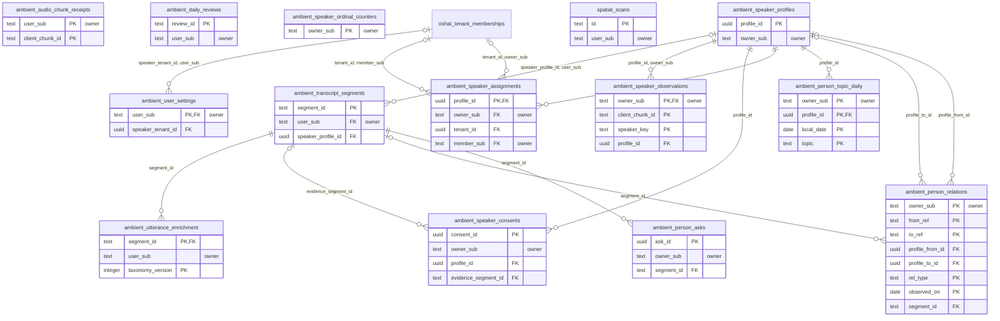

<!-- GENERATED by scripts/generate-schema-docs.js - do not edit by hand; regenerate instead. -->

# Ambient listening, speakers & spatial

[Data model index](README.md) · database `oshal` · schema `public` · 14 tables

Ambient transcript capture, speaker diarization and consent, per-person enrichment, and spatial scans.

The diagram shows key columns only: primary keys (PK), foreign keys (FK), single-column unique keys (UK) and the column an RLS policy scopes rows by ("owner"). A box with no columns is a table documented on another page. Every column is listed under Tables.

## Diagram

## Tables

### `ambient_audio_chunk_receipts`

Defined in `scripts/migrations/069-ambient-speakers.sql`, `src/features/ambient-listening/services/ambient-listening-service.ts` · RLS **forced** - owner `user_sub`

| Column | Type | Null | Default | Notes |
|---|---|---|---|---|
| `user_sub` | text | no |  | PK · owner |
| `client_chunk_id` | text | no |  | PK |
| `status` | text | no | 'processing' |  |
| `claim_token` | uuid | no | gen_random_uuid() |  |
| `created_at` | timestamp with time zone | no | now() |  |
| `updated_at` | timestamp with time zone | no | now() |  |
| `completed_at` | timestamp with time zone | yes |  |  |

### `ambient_daily_reviews`

Defined in `scripts/migrations/068-ambient-listening.sql`, `src/features/ambient-listening/services/ambient-listening-service.ts` · RLS **forced** - owner `user_sub`

| Column | Type | Null | Default | Notes |
|---|---|---|---|---|
| `review_id` | text | no |  | PK |
| `user_sub` | text | no |  | owner |
| `local_date` | date | no |  |  |
| `time_zone` | text | no |  |  |
| `summary` | text | no |  |  |
| `suggestions` | jsonb | no | '[]' |  |
| `source_segment_count` | integer | no | 0 |  |
| `created_at` | timestamp with time zone | no | now() |  |
| `updated_at` | timestamp with time zone | no | now() |  |

### `ambient_person_asks`

Defined in `src/features/person-model/services/person-model-schema.ts` · RLS **forced** - owner `owner_sub`

| Column | Type | Null | Default | Notes |
|---|---|---|---|---|
| `ask_id` | uuid | no | gen_random_uuid() | PK |
| `owner_sub` | text | no |  | owner |
| `profile_id` | uuid | no |  |  |
| `segment_id` | text | no |  | FK → [`ambient_transcript_segments.segment_id`](ambient-and-spatial.md#ambient_transcript_segments) |
| `kind` | text | no |  |  |
| `text` | text | no |  |  |
| `source_quote` | text | no |  |  |
| `model` | text | yes |  |  |
| `confidence` | double precision | yes |  |  |
| `is_inference` | boolean | no | true |  |
| `dedupe_key` | text | no |  |  |
| `status` | text | no | 'open' |  |
| `created_at` | timestamp with time zone | no | now() |  |
| `resolved_at` | timestamp with time zone | yes |  |  |

### `ambient_person_relations`

Defined in `src/features/person-model/services/person-model-schema.ts` · RLS **forced** - owner `owner_sub`

| Column | Type | Null | Default | Notes |
|---|---|---|---|---|
| `owner_sub` | text | no |  | PK · owner |
| `from_ref` | text | no |  | PK |
| `to_ref` | text | no |  | PK |
| `profile_from_id` | uuid | yes |  | FK → [`ambient_speaker_profiles.profile_id`](ambient-and-spatial.md#ambient_speaker_profiles) |
| `profile_to_id` | uuid | yes |  | FK → [`ambient_speaker_profiles.profile_id`](ambient-and-spatial.md#ambient_speaker_profiles) |
| `rel_type` | text | no |  | PK |
| `observed_on` | date | no |  | PK |
| `session_id` | text | yes |  |  |
| `segment_id` | text | yes |  | FK → [`ambient_transcript_segments.segment_id`](ambient-and-spatial.md#ambient_transcript_segments) |
| `weight` | double precision | no | 1 |  |

### `ambient_person_topic_daily`

Defined in `src/features/person-model/services/person-model-schema.ts` · RLS **forced** - owner `owner_sub`

| Column | Type | Null | Default | Notes |
|---|---|---|---|---|
| `owner_sub` | text | no |  | PK · owner |
| `profile_id` | uuid | no |  | PK · FK → [`ambient_speaker_profiles.profile_id`](ambient-and-spatial.md#ambient_speaker_profiles) |
| `local_date` | date | no |  | PK |
| `topic` | text | no |  | PK |
| `mention_count` | integer | no | 0 |  |

### `ambient_speaker_assignments`

Defined in `scripts/migrations/069-ambient-speakers.sql`, `src/features/speaker-diarization/speaker-schema.ts` · RLS **forced** - owner `owner_sub`; owner `member_sub`

| Column | Type | Null | Default | Notes |
|---|---|---|---|---|
| `profile_id` | uuid | no |  | PK · FK → [`ambient_speaker_profiles.profile_id`](ambient-and-spatial.md#ambient_speaker_profiles) |
| `owner_sub` | text | no |  | owner · FK → [`oshal_tenant_memberships.user_sub`](identity-and-access.md#oshal_tenant_memberships) · FK → [`ambient_speaker_profiles.owner_sub`](ambient-and-spatial.md#ambient_speaker_profiles) |
| `assignment_kind` | text | no |  |  |
| `custom_name` | text | yes |  |  |
| `tenant_id` | uuid | yes |  | FK → [`oshal_tenant_memberships.tenant_id`](identity-and-access.md#oshal_tenant_memberships) · FK → [`oshal_tenant_memberships.tenant_id`](identity-and-access.md#oshal_tenant_memberships) |
| `member_sub` | text | yes |  | owner · FK → [`oshal_tenant_memberships.user_sub`](identity-and-access.md#oshal_tenant_memberships) |
| `assigned_by_sub` | text | no |  |  |
| `assigned_at` | timestamp with time zone | no | now() |  |

### `ambient_speaker_consents`

Defined in `src/features/person-model/services/person-model-schema.ts` · RLS **forced** - owner `owner_sub`

| Column | Type | Null | Default | Notes |
|---|---|---|---|---|
| `consent_id` | uuid | no | gen_random_uuid() | PK |
| `owner_sub` | text | no |  | owner |
| `profile_id` | uuid | no |  | FK → [`ambient_speaker_profiles.profile_id`](ambient-and-spatial.md#ambient_speaker_profiles) |
| `scope` | text | no |  |  |
| `status` | text | no |  |  |
| `is_minor` | boolean | no | false |  |
| `method` | text | no |  |  |
| `evidence_segment_id` | text | yes |  | FK → [`ambient_transcript_segments.segment_id`](ambient-and-spatial.md#ambient_transcript_segments) |
| `recorded_at` | timestamp with time zone | no | now() |  |

### `ambient_speaker_observations`

Defined in `scripts/migrations/069-ambient-speakers.sql`, `src/features/speaker-diarization/speaker-schema.ts` · RLS **forced** - owner `owner_sub`

| Column | Type | Null | Default | Notes |
|---|---|---|---|---|
| `owner_sub` | text | no |  | PK · owner · FK → [`ambient_speaker_profiles.owner_sub`](ambient-and-spatial.md#ambient_speaker_profiles) |
| `client_chunk_id` | text | no |  | PK |
| `speaker_key` | text | no |  | PK |
| `profile_id` | uuid | no |  | FK → [`ambient_speaker_profiles.profile_id`](ambient-and-spatial.md#ambient_speaker_profiles) |
| `similarity` | double precision | no |  |  |
| `created_profile` | boolean | no |  |  |
| `observed_at` | timestamp with time zone | no | now() |  |

### `ambient_speaker_ordinal_counters`

Defined in `scripts/migrations/069-ambient-speakers.sql`, `src/features/speaker-diarization/speaker-schema.ts` · RLS **forced** - owner `owner_sub`

| Column | Type | Null | Default | Notes |
|---|---|---|---|---|
| `owner_sub` | text | no |  | PK · owner |
| `next_ordinal` | integer | no |  |  |
| `updated_at` | timestamp with time zone | no | now() |  |

### `ambient_speaker_profiles`

Defined in `scripts/migrations/069-ambient-speakers.sql`, `src/features/speaker-diarization/speaker-schema.ts` · RLS **forced** - owner `owner_sub`

| Column | Type | Null | Default | Notes |
|---|---|---|---|---|
| `profile_id` | uuid | no | gen_random_uuid() | PK |
| `owner_sub` | text | no |  | owner |
| `unidentified_ordinal` | integer | no |  |  |
| `embedding_ciphertext` | text | no |  |  |
| `embedding_model` | text | no |  |  |
| `embedding_dimensions` | integer | no |  |  |
| `sample_count` | integer | no | 1 |  |
| `first_seen_at` | timestamp with time zone | no | now() |  |
| `last_seen_at` | timestamp with time zone | no | now() |  |
| `updated_at` | timestamp with time zone | no | now() |  |

### `ambient_transcript_segments`

Defined in `scripts/migrations/068-ambient-listening.sql`, `src/features/ambient-listening/services/ambient-listening-service.ts` · RLS **forced** - owner `user_sub`

| Column | Type | Null | Default | Notes |
|---|---|---|---|---|
| `segment_id` | text | no |  | PK |
| `user_sub` | text | no |  | owner · FK → [`ambient_speaker_profiles.owner_sub`](ambient-and-spatial.md#ambient_speaker_profiles) |
| `transcript_text` | text | no |  |  |
| `captured_at` | timestamp with time zone | no |  |  |
| `ended_at` | timestamp with time zone | yes |  |  |
| `speaker_label` | text | yes |  |  |
| `wake_phrase_detected` | boolean | no | false |  |
| `matched_wake_phrase` | text | yes |  |  |
| `session_id` | text | yes |  |  |
| `client_segment_id` | text | yes |  |  |
| `created_at` | timestamp with time zone | no | now() |  |
| `speaker_profile_id` | uuid | yes |  | FK → [`ambient_speaker_profiles.profile_id`](ambient-and-spatial.md#ambient_speaker_profiles) |
| `fts` | tsvector | yes | to_tsvector('english'::regconfig, transcript_text) |  |

### `ambient_user_settings`

Defined in `scripts/migrations/068-ambient-listening.sql`, `src/features/ambient-listening/services/ambient-listening-service.ts` · RLS **forced** - owner `user_sub`

| Column | Type | Null | Default | Notes |
|---|---|---|---|---|
| `user_sub` | text | no |  | PK · owner · FK → [`oshal_tenant_memberships.user_sub`](identity-and-access.md#oshal_tenant_memberships) |
| `assistant_name` | text | no | 'Jarvis' |  |
| `wake_phrases` | jsonb | no | '["hey jarvis"]' |  |
| `ambient_enabled` | boolean | no | false |  |
| `transcript_retention_days` | integer | no | 30 |  |
| `time_zone` | text | no | 'UTC' |  |
| `daily_review_enabled` | boolean | no | false |  |
| `daily_review_time` | time without time zone | no | '21:00:00' |  |
| `suggest_follow_ups` | boolean | no | true |  |
| `created_at` | timestamp with time zone | no | now() |  |
| `updated_at` | timestamp with time zone | no | now() |  |
| `speaker_diarization_enabled` | boolean | no | false |  |
| `remember_speakers` | boolean | no | false |  |
| `speaker_tenant_id` | uuid | yes |  | FK → [`oshal_tenant_memberships.tenant_id`](identity-and-access.md#oshal_tenant_memberships) |

### `ambient_utterance_enrichment`

Defined in `src/features/person-model/services/person-model-schema.ts` · RLS **forced** - owner `user_sub`

| Column | Type | Null | Default | Notes |
|---|---|---|---|---|
| `segment_id` | text | no |  | PK · FK → [`ambient_transcript_segments.segment_id`](ambient-and-spatial.md#ambient_transcript_segments) |
| `user_sub` | text | no |  | owner |
| `topics` | jsonb | no | '[]' |  |
| `tone` | text | yes |  |  |
| `intent` | text | yes |  |  |
| `ask_text` | text | yes |  |  |
| `commitment_text` | text | yes |  |  |
| `confidence` | double precision | yes |  |  |
| `model` | text | yes |  |  |
| `taxonomy_version` | integer | no | 1 | PK |
| `is_inference` | boolean | no | true |  |
| `enriched_at` | timestamp with time zone | no | now() |  |

### `spatial_scans`

Defined in `scripts/migrations/093-spatial-scans.sql`, `src/features/spatial-mapping/services/spatial-scan-store.ts` · RLS **forced** - owner `user_sub`

| Column | Type | Null | Default | Notes |
|---|---|---|---|---|
| `id` | text | no |  | PK |
| `user_sub` | text | no |  | owner |
| `title` | text | no |  |  |
| `status` | text | no | 'queued' |  |
| `source_kind` | text | no | 'video' |  |
| `source_name` | text | yes |  |  |
| `source_ref` | text | yes |  |  |
| `source_bytes` | bigint | yes |  |  |
| `provider` | text | yes |  |  |
| `artifact_ref` | text | yes |  |  |
| `gaussian_count` | integer | yes |  |  |
| `error` | text | yes |  |  |
| `created_at` | timestamp with time zone | no | now() |  |
| `updated_at` | timestamp with time zone | no | now() |  |
