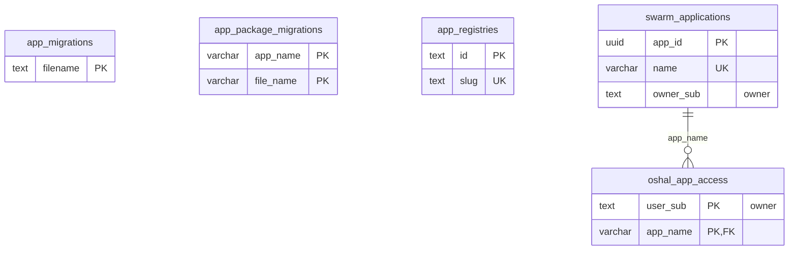

<!-- GENERATED by scripts/generate-schema-docs.js - do not edit by hand; regenerate instead. -->

# Apps & platform bookkeeping

[Data model index](README.md) · database `oshal` · schema `public` · 5 tables

Installed applications, app registries and access tiers, and the two migration ledgers (core and package).

The diagram shows key columns only: primary keys (PK), foreign keys (FK), single-column unique keys (UK) and the column an RLS policy scopes rows by ("owner"). A box with no columns is a table documented on another page. Every column is listed under Tables.

## Diagram

## Tables

### `app_migrations`

Defined in `src/features/tool-registry/services/database-bootstrap-service.ts` · RLS **off**

| Column | Type | Null | Default | Notes |
|---|---|---|---|---|
| `filename` | text | no |  | PK |
| `applied_at` | timestamp with time zone | no | now() |  |

### `app_package_migrations`

Defined in `src/features/swarm-apps/services/swarm-app-service.ts` · RLS **off**

| Column | Type | Null | Default | Notes |
|---|---|---|---|---|
| `app_name` | character varying(100) | no |  | PK |
| `file_name` | character varying(500) | no |  | PK |
| `applied_at` | timestamp with time zone | no | now() |  |

### `app_registries`

Defined in `src/features/app-registries/services/app-registry-store.ts` · RLS **off**

| Column | Type | Null | Default | Notes |
|---|---|---|---|---|
| `id` | text | no |  | PK |
| `slug` | text | no |  | UK |
| `display_name` | text | no |  |  |
| `url` | text | no |  |  |
| `ref` | text | no | 'main' |  |
| `host_kind` | text | no | 'generic-git' |  |
| `builtin` | boolean | no | false |  |
| `enabled` | boolean | no | true |  |
| `trust_state` | text | no | 'trusted' |  |
| `allow_unsigned` | boolean | no | false |  |
| `allow_private_host` | boolean | no | false |  |
| `secret_backend` | text | no | 'none' |  |
| `token_ciphertext` | text | yes |  |  |
| `trusted_by_sub` | text | yes |  |  |
| `trusted_at` | timestamp with time zone | yes |  |  |
| `trust_note` | text | yes |  |  |
| `last_fetch_at` | timestamp with time zone | yes |  |  |
| `last_fetch_ok` | boolean | yes |  |  |
| `last_fetch_error` | text | yes |  |  |
| `package_count` | integer | yes |  |  |
| `created_at` | timestamp with time zone | no | now() |  |

### `oshal_app_access`

Defined in `scripts/migrations/121-app-access-tiers.sql` · RLS **forced** - all commands: operator only; owner `user_sub`

| Column | Type | Null | Default | Notes |
|---|---|---|---|---|
| `user_sub` | text | no |  | PK · owner |
| `app_name` | character varying(100) | no |  | PK · FK → [`swarm_applications.name`](apps-and-platform.md#swarm_applications) |
| `tier` | text | no |  |  |
| `assigned_by_sub` | text | no |  |  |
| `reason` | text | no |  |  |
| `created_at` | timestamp with time zone | no | now() |  |
| `updated_at` | timestamp with time zone | no | now() |  |

### `swarm_applications`

Defined in `scripts/migrations/022-swarm-applications.sql` · RLS **forced** - owner `owner_sub`; custom policy `swarm_applications_public_read`

| Column | Type | Null | Default | Notes |
|---|---|---|---|---|
| `app_id` | uuid | no | gen_random_uuid() | PK |
| `name` | character varying(100) | no |  | UK |
| `display_name` | character varying(255) | no |  |  |
| `description` | text | yes | '' |  |
| `version` | character varying(50) | no | '0.0.0' |  |
| `status` | character varying(20) | no | 'active' |  |
| `manifest_path` | character varying(500) | no |  |  |
| `agent_ids` | uuid[] | no | '{}' |  |
| `tool_names` | text[] | no | '{}' |  |
| `manifest` | jsonb | no | '{}' |  |
| `loaded_at` | timestamp with time zone | no | now() |  |
| `updated_at` | timestamp with time zone | no | now() |  |
| `scope` | character varying(20) | no | 'public' |  |
| `owner_sub` | text | yes |  | owner |
| `tenant_id` | uuid | yes |  |  |
| `guest_tier_approved` | text | yes |  | ADR-085 D4: the guest tier an OPERATOR approved for this app. NULL = not approved = Tier-B default (guests read, mutations blocked). The manifest's guestTier is only a request. |
