<!-- GENERATED by scripts/generate-schema-docs.js - do not edit by hand; regenerate instead. -->

# Connectors, credentials & intake

[Data model index](README.md) · database `oshal` · schema `public` · 11 tables

Connector accounts and their encrypted credentials, per-user enablement, action audit, webhook deliveries, and the inbox / feed / intake cursors that pull external data in.

The diagram shows key columns only: primary keys (PK), foreign keys (FK), single-column unique keys (UK) and the column an RLS policy scopes rows by ("owner"). A box with no columns is a table documented on another page. Every column is listed under Tables.

## Diagram

```mermaid
erDiagram
  ats_site_credentials {
    uuid credential_id PK
    text user_sub "owner"
  }
  connector_action_audit {
    uuid audit_id PK
    text user_sub "owner"
  }
  feed_messages {
    varchar user_sub PK "owner"
    varchar source PK
    varchar channel_id PK
    varchar ts PK
  }
  feed_settings {
    varchar user_sub PK "owner"
  }
  oshal_connections {
    uuid connection_id PK
    text user_sub "owner"
  }
  oshal_connector_user_enablement {
    text user_sub PK "owner"
    text provider PK
  }
  oshal_inbox_cursor {
    text user_sub PK "owner"
  }
  oshal_inbox_messages {
    text user_sub PK "owner"
    text msg_id PK
  }
  oshal_intake_cursors {
    text provider PK
  }
  oshal_user_deks {
    text user_sub PK "owner"
  }
  oshal_webhook_deliveries {
    text delivery_id PK
  }
```

## Tables

### `ats_site_credentials`

Defined in `scripts/migrations/086-ats-site-credentials.sql` · RLS **forced** - owner `user_sub`

| Column | Type | Null | Default | Notes |
|---|---|---|---|---|
| `credential_id` | uuid | no | gen_random_uuid() | PK |
| `user_sub` | text | no |  | owner |
| `site` | text | no |  |  |
| `ats_family` | character varying(24) | yes |  |  |
| `username` | text | no |  |  |
| `password_enc` | text | no |  |  |
| `status` | character varying(16) | no | 'active' |  |
| `last_used_at` | timestamp with time zone | yes |  |  |
| `created_at` | timestamp with time zone | no | now() |  |
| `updated_at` | timestamp with time zone | no | now() |  |

### `connector_action_audit`

Defined in `scripts/migrations/083-connector-action-audit.sql`, `src/app/connectors/runtime/action-executor.ts` · RLS **forced** - owner `user_sub`

| Column | Type | Null | Default | Notes |
|---|---|---|---|---|
| `audit_id` | uuid | no | gen_random_uuid() | PK |
| `user_sub` | text | no |  | owner |
| `connector_id` | text | no |  |  |
| `action` | text | no |  |  |
| `params_hash` | text | no |  |  |
| `risk_level` | text | yes |  |  |
| `status` | text | no |  |  |
| `http_status` | integer | yes |  |  |
| `error` | text | yes |  |  |
| `ts` | timestamp with time zone | no | now() |  |

### `feed_messages`

Defined in `scripts/migrations/045-feeds-platform.sql`, `src/app/routes/feeds-indexing.ts` · RLS **forced** - owner `user_sub`

| Column | Type | Null | Default | Notes |
|---|---|---|---|---|
| `user_sub` | character varying(255) | no |  | PK · owner |
| `source` | character varying(32) | no | 'slack' | PK |
| `channel_id` | character varying(64) | no |  | PK |
| `channel_name` | text | yes |  |  |
| `channel_type` | character varying(16) | yes |  |  |
| `author_id` | character varying(64) | yes |  |  |
| `author_name` | text | yes |  |  |
| `text` | text | yes |  |  |
| `ts` | character varying(64) | no |  | PK |
| `posted_at` | timestamp with time zone | no |  |  |
| `sentiment` | numeric(4,3) | yes |  |  |
| `sentiment_label` | character varying(16) | yes |  |  |
| `sentiment_at` | timestamp with time zone | yes |  |  |
| `indexed_at` | timestamp with time zone | no | now() |  |

### `feed_settings`

Defined in `scripts/migrations/045-feeds-platform.sql`, `src/app/routes/feeds-indexing.ts` · RLS **forced** - owner `user_sub`

| Column | Type | Null | Default | Notes |
|---|---|---|---|---|
| `user_sub` | character varying(255) | no |  | PK · owner |
| `poll_enabled` | boolean | no | true |  |
| `poll_interval_minutes` | integer | no | 30 |  |
| `max_channels` | integer | no | 25 |  |
| `per_channel` | integer | no | 15 |  |
| `sentiment_enabled` | boolean | no | false |  |
| `last_synced_at` | timestamp with time zone | yes |  |  |
| `created_at` | timestamp with time zone | no | now() |  |
| `updated_at` | timestamp with time zone | no | now() |  |

### `oshal_connections`

Defined in `scripts/migrations/100-connector-base-schema.sql`, `src/app/routes/connector-account-operations.ts` · RLS **forced** - owner `user_sub`

| Column | Type | Null | Default | Notes |
|---|---|---|---|---|
| `connection_id` | uuid | no | gen_random_uuid() | PK |
| `user_sub` | text | no |  | owner |
| `user_email` | text | yes |  |  |
| `provider` | character varying(40) | no |  |  |
| `account_email` | text | yes |  |  |
| `scopes` | text | yes |  |  |
| `access_token` | text | yes |  |  |
| `refresh_token` | text | yes |  |  |
| `expiry` | timestamp with time zone | yes |  |  |
| `status` | character varying(20) | no | 'connected' |  |
| `created_at` | timestamp with time zone | no | now() |  |
| `updated_at` | timestamp with time zone | no | now() |  |
| `account_id` | text | yes |  |  |
| `tenant_id` | uuid | yes |  |  |
| `connected_by_sub` | text | yes |  |  |
| `label` | text | yes |  |  |
| `account_key` | text | yes |  |  |
| `is_default` | boolean | no | false |  |

### `oshal_connector_user_enablement`

Defined in `scripts/migrations/091-connector-user-enablement.sql`, `src/app/connectors/runtime/user-enablement-store.ts` · RLS **forced** - owner `user_sub`

| Column | Type | Null | Default | Notes |
|---|---|---|---|---|
| `user_sub` | text | no |  | PK · owner |
| `provider` | text | no |  | PK |
| `enabled` | boolean | no |  |  |
| `updated_at` | timestamp with time zone | no | now() |  |

### `oshal_inbox_cursor`

Defined in `src/app/routes/inbox-ingest.ts` · RLS **forced** - owner `user_sub`

| Column | Type | Null | Default | Notes |
|---|---|---|---|---|
| `user_sub` | text | no |  | PK · owner |
| `last_received_at` | timestamp with time zone | yes |  |  |
| `last_run` | timestamp with time zone | yes |  |  |

### `oshal_inbox_messages`

Defined in `src/app/routes/inbox-ingest.ts` · RLS **forced** - owner `user_sub`

| Column | Type | Null | Default | Notes |
|---|---|---|---|---|
| `user_sub` | text | no |  | PK · owner |
| `msg_id` | text | no |  | PK |
| `thread_id` | text | yes |  |  |
| `from_addr` | text | yes |  |  |
| `subject` | text | yes |  |  |
| `snippet` | text | yes |  |  |
| `category` | text | no | 'primary' |  |
| `received_at` | timestamp with time zone | no |  |  |
| `ingested_at` | timestamp with time zone | no | now() |  |
| `source` | text | no | 'gmail' |  |
| `assessed` | boolean | no | false |  |

### `oshal_intake_cursors`

> Controller-owned opaque checkpoints for external intake provider reconciliation.

Defined in `scripts/migrations/092-intake-cursors.sql` · RLS **off**

| Column | Type | Null | Default | Notes |
|---|---|---|---|---|
| `provider` | text | no |  | PK |
| `cursor_value` | text | no |  |  |
| `updated_at` | timestamp with time zone | no | now() |  |

### `oshal_user_deks`

Defined in `scripts/migrations/100-connector-base-schema.sql`, `src/app/routes/connector-token-crypto.ts` · RLS **forced** - owner `user_sub`

| Column | Type | Null | Default | Notes |
|---|---|---|---|---|
| `user_sub` | text | no |  | PK · owner |
| `wrapped_dek` | text | no |  |  |
| `created_at` | timestamp with time zone | no | now() |  |

### `oshal_webhook_deliveries`

Defined in `scripts/migrations/056-webhook-deliveries.sql`, `src/app/connectors/webhooks/webhook-handlers.ts` · RLS **off**

| Column | Type | Null | Default | Notes |
|---|---|---|---|---|
| `delivery_id` | text | no |  | PK |
| `seen_at` | timestamp with time zone | no | now() |  |
