<!-- GENERATED by scripts/generate-schema-docs.js - do not edit by hand; regenerate instead. -->

# Chat, cost & model usage

[Data model index](README.md) · database `oshal` · schema `public` · 13 tables

Chat tasks and messages (the canonical per-call cost ledger), cost events, budgets, free-tier state, remote cost receipts, Token Chase, optimisation and evaluation records.

The diagram shows key columns only: primary keys (PK), foreign keys (FK), single-column unique keys (UK) and the column an RLS policy scopes rows by ("owner"). A box with no columns is a table documented on another page. Every column is listed under Tables.

## Diagram

```mermaid
erDiagram
  chat_messages {
    uuid message_id PK
    text task_id FK
  }
  chat_tasks {
    text task_id PK
    text owner_sub "owner"
  }
  eval_runs {
    uuid id PK
  }
  human_feedback {
    text feedback_id PK
  }
  optimize_configs {
    uuid id PK
    text user_sub "owner"
  }
  oshal_budget_events {
    bigint id PK
  }
  oshal_budgets {
    bigint id PK
  }
  oshal_cost_events {
    bigint id PK
    text owner_sub "owner"
  }
  oshal_free_tier_state {
    uuid connection_id PK
  }
  remote_task_cost_receipts {
    uuid outbox_id PK
    text owner_sub "owner"
  }
  token_chase_optimizer_corpus {
    uuid id PK
    text user_sub "owner"
  }
  token_chase_promotion_audit {
    uuid id PK
    text user_sub "owner"
  }
  token_chase_promotions {
    uuid id PK
    text user_sub "owner"
  }
  chat_tasks ||--o{ chat_messages : "task_id"
```

## Tables

### `chat_messages`

Defined in `scripts/migrations/005-conversation-history-and-usage.sql`, `src/shared/services/database/conversation-schema.ts` · RLS **forced** - `oshal_owns_task(task_id)`

| Column | Type | Null | Default | Notes |
|---|---|---|---|---|
| `message_id` | uuid | no |  | PK |
| `task_id` | text | no |  | FK → [`chat_tasks.task_id`](cost-and-usage.md#chat_tasks) |
| `role` | text | no |  |  |
| `type` | text | no |  |  |
| `text` | text | no |  |  |
| `content_blocks` | jsonb | no | '[]' |  |
| `metadata` | jsonb | no | '{}' |  |
| `created_at` | timestamp with time zone | no | now() |  |

### `chat_tasks`

Defined in `scripts/migrations/005-conversation-history-and-usage.sql`, `src/shared/services/database/conversation-schema.ts` · RLS **forced** - owner `owner_sub`

| Column | Type | Null | Default | Notes |
|---|---|---|---|---|
| `task_id` | text | no |  | PK |
| `title` | text | no | '' |  |
| `status` | text | no | 'created' |  |
| `processing_mode` | text | no | 'agentic' |  |
| `agent_id` | text | yes |  |  |
| `provider_id` | text | yes |  |  |
| `message_count` | integer | no | 0 |  |
| `turn_count` | integer | no | 0 |  |
| `total_input_tokens` | bigint | no | 0 |  |
| `total_output_tokens` | bigint | no | 0 |  |
| `total_input_cost` | double precision | no | 0 |  |
| `total_output_cost` | double precision | no | 0 |  |
| `total_cost` | double precision | no | 0 |  |
| `total_requests` | integer | no | 0 |  |
| `cost_currency` | text | no | 'USD' |  |
| `usage_by_model` | jsonb | no | '{}' |  |
| `metadata` | jsonb | no | '{}' |  |
| `created_at` | timestamp with time zone | no | now() |  |
| `updated_at` | timestamp with time zone | no | now() |  |
| `owner_sub` | text | yes |  | owner |

### `eval_runs`

Defined in `scripts/eval-wall-seed.mjs`, `src/features/operational-intelligence/eval-results-store.ts` · RLS **off**

| Column | Type | Null | Default | Notes |
|---|---|---|---|---|
| `id` | uuid | no | gen_random_uuid() | PK |
| `run_at` | timestamp with time zone | no | now() |  |
| `scenario` | text | no |  |  |
| `state` | character varying(16) | no | 'fail' |  |
| `heuristic_score` | integer | yes |  |  |
| `judge_score` | integer | yes |  |  |
| `final_score` | integer | yes |  |  |
| `passed` | boolean | no | false |  |
| `latency_ms` | integer | yes |  |  |
| `retries` | integer | yes |  |  |
| `input_tokens` | integer | yes |  |  |
| `output_tokens` | integer | yes |  |  |
| `cost_usd` | double precision | yes |  |  |
| `security_findings` | integer | yes |  |  |
| `notes` | text | yes |  |  |

### `human_feedback`

Defined in `src/features/operational-intelligence/services/feedback-loop-service.ts` · RLS **off**

| Column | Type | Null | Default | Notes |
|---|---|---|---|---|
| `feedback_id` | text | no |  | PK |
| `ticket_external_id` | text | no |  |  |
| `agent_id` | text | no |  |  |
| `swarm_run_id` | text | yes |  |  |
| `verdict` | text | no |  |  |
| `comment` | text | yes |  |  |
| `reviewer_name` | text | yes |  |  |
| `created_at` | timestamp with time zone | no | now() |  |

### `optimize_configs`

Defined in `scripts/migrations/032-optimize.sql` · RLS **forced** - owner `user_sub`; `oshal_is_tenant_member(tenant_id)`

| Column | Type | Null | Default | Notes |
|---|---|---|---|---|
| `id` | uuid | no | gen_random_uuid() | PK |
| `tenant_id` | text | no | 'default' |  |
| `user_sub` | text | no |  | owner |
| `provider` | text | no |  |  |
| `model` | text | no |  |  |
| `harness` | text | no |  |  |
| `label` | text | yes |  |  |
| `args` | text | yes |  |  |
| `enabled` | boolean | no | true |  |
| `sort_order` | integer | no | 0 |  |
| `created_at` | timestamp with time zone | no | now() |  |
| `updated_at` | timestamp with time zone | no | now() |  |

### `oshal_budget_events`

Defined in `scripts/migrations/078-cost-governance.sql` · RLS **off**

| Column | Type | Null | Default | Notes |
|---|---|---|---|---|
| `id` | bigint | no | nextval('oshal_budget_events_id_seq') | PK |
| `ts` | timestamp with time zone | no | now() |  |
| `scope_type` | character varying(16) | no |  |  |
| `scope_key` | text | no |  |  |
| `spend_usd` | numeric(12,4) | no |  |  |
| `cap_usd` | numeric(12,4) | no |  |  |
| `action` | character varying(16) | no |  |  |
| `detail` | jsonb | no | '{}' |  |

### `oshal_budgets`

Defined in `scripts/migrations/078-cost-governance.sql` · RLS **off**

| Column | Type | Null | Default | Notes |
|---|---|---|---|---|
| `id` | bigint | no | nextval('oshal_budgets_id_seq') | PK |
| `scope_type` | character varying(16) | no |  |  |
| `scope_key` | text | no |  |  |
| `daily_usd` | numeric(12,4) | no |  |  |
| `hard` | boolean | no | false |  |
| `enabled` | boolean | no | true |  |
| `set_by_operator` | boolean | no | false |  |
| `created_at` | timestamp with time zone | no | now() |  |
| `updated_at` | timestamp with time zone | no | now() |  |

### `oshal_cost_events`

Defined in `scripts/migrations/078-cost-governance.sql` · RLS **forced** - owner `owner_sub`

| Column | Type | Null | Default | Notes |
|---|---|---|---|---|
| `id` | bigint | no | nextval('oshal_cost_events_id_seq') | PK |
| `ts` | timestamp with time zone | no | now() |  |
| `task_id` | text | no |  |  |
| `owner_sub` | text | yes |  | owner |
| `agent_id` | text | yes |  |  |
| `provider_id` | text | yes |  |  |
| `model_id` | text | yes |  |  |
| `cost_usd` | numeric(12,6) | no | 0 |  |
| `input_tokens` | bigint | yes |  |  |
| `output_tokens` | bigint | yes |  |  |
| `duration_ms` | integer | yes |  |  |

### `oshal_free_tier_state`

Defined in `src/app/routes/free-tier-rotation.ts` · RLS **off**

| Column | Type | Null | Default | Notes |
|---|---|---|---|---|
| `connection_id` | uuid | no |  | PK |
| `cooldown_until` | bigint | no | 0 |  |
| `last_used_at` | bigint | no | 0 |  |
| `last_status` | text | yes |  |  |
| `updated_at` | timestamp with time zone | no | now() |  |

### `remote_task_cost_receipts`

Defined in `scripts/migrations/115-durable-remote-task-journal.sql`, `src/shared/services/database/remote-task-journal-schema.ts` · RLS **forced** - owner `owner_sub`

| Column | Type | Null | Default | Notes |
|---|---|---|---|---|
| `outbox_id` | uuid | no |  | PK |
| `task_id` | text | no |  |  |
| `owner_sub` | text | yes |  | owner |
| `created_at` | timestamp with time zone | no | now() |  |

### `token_chase_optimizer_corpus`

Defined in `scripts/migrations/033-token-chase-optimizer-corpus.sql`, `src/features/token-chase/services/token-chase-corpus-service.ts` · RLS **forced** - owner `user_sub`; `oshal_is_tenant_member(tenant_id)`

| Column | Type | Null | Default | Notes |
|---|---|---|---|---|
| `id` | uuid | no | gen_random_uuid() | PK |
| `tenant_id` | text | yes |  |  |
| `user_sub` | text | no |  | owner |
| `run_id` | text | no |  |  |
| `seq` | integer | no |  |  |
| `query_type` | text | yes |  |  |
| `harness` | text | yes |  |  |
| `baseline_provider` | text | yes |  |  |
| `baseline_model` | text | yes |  |  |
| `baseline_cost_usd` | numeric(12,6) | yes |  |  |
| `variant_provider` | text | yes |  |  |
| `variant_model` | text | no |  |  |
| `cost_usd` | numeric(12,6) | yes |  |  |
| `cost_delta_usd` | numeric(12,6) | yes |  |  |
| `latency_ms` | integer | yes |  |  |
| `accuracy` | numeric(6,4) | yes |  |  |
| `equivalent` | boolean | yes |  |  |
| `tier` | text | yes |  |  |
| `complexity` | text | yes |  |  |
| `tools_used` | text[] | yes |  |  |
| `status` | text | yes |  |  |
| `created_at` | timestamp with time zone | no | now() |  |
| `judge_score` | integer | yes |  |  |
| `judge_dimensions` | jsonb | yes |  |  |
| `judge_mode` | text | yes |  |  |

### `token_chase_promotion_audit`

Defined in `scripts/migrations/095-token-chase-promotions.sql`, `src/features/token-chase/services/token-chase-promotion-service.ts` · RLS **forced** - owner `user_sub`

| Column | Type | Null | Default | Notes |
|---|---|---|---|---|
| `id` | uuid | no | gen_random_uuid() | PK |
| `user_sub` | text | no |  | owner |
| `promotion_id` | uuid | yes |  |  |
| `run_id` | text | no |  |  |
| `seq` | integer | no |  |  |
| `action` | text | no |  |  |
| `detail` | jsonb | yes |  |  |
| `created_at` | timestamp with time zone | no | now() |  |

### `token_chase_promotions`

Defined in `scripts/migrations/095-token-chase-promotions.sql`, `src/features/token-chase/services/token-chase-promotion-service.ts` · RLS **forced** - owner `user_sub`

| Column | Type | Null | Default | Notes |
|---|---|---|---|---|
| `id` | uuid | no | gen_random_uuid() | PK |
| `user_sub` | text | no |  | owner |
| `run_id` | text | no |  |  |
| `seq` | integer | no |  |  |
| `provider` | text | yes |  |  |
| `model` | text | no |  |  |
| `label` | text | yes |  |  |
| `baseline_provider` | text | yes |  |  |
| `baseline_model` | text | yes |  |  |
| `baseline_cost_usd` | numeric(12,6) | yes |  |  |
| `variant_cost_usd` | numeric(12,6) | yes |  |  |
| `saved_usd` | numeric(12,6) | yes |  |  |
| `judge_score` | integer | no |  |  |
| `judge_mode` | text | no |  |  |
| `source` | text | no |  |  |
| `status` | text | no | 'active' |  |
| `created_at` | timestamp with time zone | no | now() |  |
| `reverted_at` | timestamp with time zone | yes |  |  |
