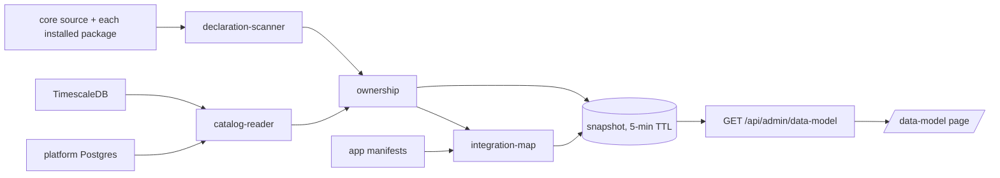

# Data-model explorer — as built, and how to continue it

The explorer is the live counterpart to the generated pages in this folder. The pages are a
committed snapshot of one reference database; the explorer reads whatever deployment it runs in.

- **Page:** `/data-model` (Admin console → Data model). Signed-in users only.
- **API:** `GET /api/admin/data-model`, `GET /api/admin/data-model/stores` and
  `GET /api/admin/data-model/drift`, all
  **operator-only** (`requiresAuth` + `requiresOperator` on the mount in `src/app/server.ts`).
  Read-only: catalog `SELECT`s, a source scan, and read calls to the other stores.
- **Landed:** commit `18edcbf4`, merged to `main` through PR #431 (merge `b8de2099`, 2026-09-14).
- **Deployed 2026-09-14.** `src/app` is not bind-mounted, so the route only exists after a core
  deploy; `scripts/oshal-deploy.sh` deployed `b8de2099` (image `1fe73566ae87`), whose
  `src/app/server.ts` mounts `/api/admin/data-model`. What remains is the operator walk-through in
  [Deploying](#deploying-it), steps 3-4.

## What it shows

| View | Reads | Shows |
|---|---|---|
| Apps & integrations | manifests + ownership | one node per installed app plus `@core`; edges for context offers, artifact Send-to flows (matched by MIME type), dependencies, group members, shared tables and cross-owner foreign keys |
| Tables | catalog + ownership | an owner's tables and views, or one table's FK neighbourhood 1–3 hops; per table: every column, keys, declaring files, RLS state and row scope |
| Shared objects | ownership | tables more than one owner declares; foreign keys that cross an owner boundary |
| Other stores | store ports | TimescaleDB relations, SQLite tables parsed from source, declared-but-absent tables, unowned live relations, ArangoDB databases/collections, ChromaDB collections, Redis key families |

Every view is a URL: `?view=apps|tables|shared|stores&app=&table=&focus=&depth=&q=`.

## Exporting the view on screen

**Export** in the header takes the current scope somewhere else. It is entirely client-side - the
snapshot is already in the page, so nothing new is asked of the server and no scope can escape the
operator gate that fetched it.

| Format | Tables view | Apps / Shared views | Other stores |
|---|---|---|---|
| Copy Mermaid | `erDiagram` of the relations drawn, in the shape `scripts/schema-docs/render.js` writes into the committed pages - key columns only, FK cardinality from real nullability, `"owner"` from the snapshot's own RLS summary | `flowchart LR` of the owners drawn and their labelled links | refuses: nothing is drawn |
| Download SVG | the drawn graph as a standalone document: fitted viewBox, opaque ground, graph CSS inlined | same | refuses |
| Download JSON | the drawn relations with their full records, their foreign keys, and the state that drew them | the drawn apps and integration edges | the store inventory cards |

The Mermaid block is copied to the clipboard **and** shown in the menu, so a browser that blocks
clipboard access still leaves it selectable. An empty or diagram-less scope refuses by name rather
than writing a file that will not parse.

There is no second renderer to keep in step. `toErDiagram()` and the generator's
`mermaidDiagram()` are the same module — `src/pages/data-model/js/er-diagram.mjs`, which the page
imports and `scripts/schema-docs/render.js` requires. The one thing the two callers read
differently arrives injected: the generator hands in its own RLS classifier, the page takes the
module default and uses the summary the server already computed.

`tests/unit/data-model-export.spec.ts` holds that neither consumer writes an `erDiagram` of its
own, and `tests/unit/data-model-explorer-browser.spec.ts` hands a block Chromium copied out of the
real page to mermaid@11's own parser, which must read it as an `er` diagram and must refuse a
mangled one. The catalog SQL, the RLS classifier and the DDL parser have since made the same
collapse: one implementation in `src/features/data-model/services/`, which the generator loads
through `scripts/schema-docs/kernel.js`.

## What changed since: schema drift

Every snapshot is current-state, so on its own it can only be *looked at*. `GET /drift` gives it a
memory:

1. **Digest** - `buildDigest()` reduces the snapshot to structure only: per relation the owners,
   the RLS state, the policy **names**, the key columns (primary key plus every foreign-key
   column) and the foreign-key targets, plus the `app_migrations` count and a sha256 fingerprint.
   No column defaults, no non-key columns, no policy expressions - a digest is persisted and
   inherits the explorer's operator sensitivity.
2. **Compare** - `diffDigests()` reads the stored baseline for the same database and classifies
   the result. Only one state is an alarm:

   | state | means | `alarm` |
   |---|---|---|
   | `first-run` | no digest recorded yet; this reading becomes the baseline | no |
   | `unchanged` | identical fingerprint | no |
   | `explained` | the migration ledger advanced between the two readings, so the change was migrated | no |
   | `settling` | the baseline is inside the 15-minute quiet window; the shape is still moving | no |
   | `drift` | an **unexplained** difference against a settled baseline | **yes** |

3. **Refuse rather than cry wolf** - a reading holding less than half the baseline's relations is
   a failed catalog read, not a dropped schema: it answers **409** with `SCHEMA_DIGEST_PARTIAL`.
   A digest written by another `digestVersion`, or with no fingerprint, is refused the same way.
4. **Record** - `?capture=1` writes the digest to `oshal_schema_digest` (migration 139: one row
   per distinct shape per database, forced RLS, operator-only). A plain read **never** advances
   the baseline, so opening the page does not silently acknowledge a change.

A deployment that has not applied migration 139 gets `{ available: false }` with a reason naming
the migration, not a 500 - the explorer keeps rendering.

### Internal alarm producer boundary

`src/app/data-model-alert.ts` converts only a settled, unexplained diff into a normalized
`schema-drift` event. It includes every changed relation and its before/after state, never policy
expressions. The occurrence key covers the database, baseline fingerprint and capture time, and
current fingerprint. A later scan timestamp alone does not create a new occurrence. Constructing
the event neither captures a baseline nor writes an alert.

`EnvelopeStore.landInternalEvent()` accepts that normalized event directly, without an Alertmanager
body, receiver or signature claim. Migration 164 adds `oshal_alert_producer_receipt`: the receipt
and pending event commit together; concurrent and restarted producers return the existing receipt.
Reusing a key with different content fails explicitly. Receipts survive event retention, returning
`eventId: null` for an already-delivered, expired event rather than recreating it. Do not purge
receipts while a producer can replay those keys. Both tables retain the pipeline owner/operator
RLS boundary. Missing migration 164 fails the write; there is no in-memory fallback.

**This boundary is not yet an automatic alarm.** No detector timer calls it, and the receiver's
internal-source claim/ticket handling and explorer diff panel still need wiring. The isolated
policy-drop proof stops at one durable pending event, not a ticket or live deployment acceptance.
The schema-drift backlog item remains open.

## How a snapshot is built



1. **Catalog** — one JSON query per database over `pg_class` / `pg_attribute` / `pg_constraint` /
   `pg_policies` (+ TimescaleDB dimensions). It is the same SQL the schema-docs generator sends,
   because the generator loads it from here.
2. **Declarations** — an async, bounded walk of core source (`scripts/migrations`, `src`,
   `any-bot/server`, `docker/postgres`) and every installed package directory, matching
   `CREATE TABLE` / `CREATE VIEW`, resolving `${CONST}` names, and tagging each site with its
   owner and engine.
3. **Ownership** — a live relation belongs to every owner that declares it. A relation nobody
   declares stays visible and is listed as unowned; it is never guessed at.
4. **Integration map** — nodes and edges from what manifests declare, plus the database links.
5. **Cache** — 5-minute TTL; concurrent callers share one build; `?refresh=1` forces a rebuild.

## Files

| Path | Role |
|---|---|
| `src/features/data-model/types.ts` | the model's types, `CORE_OWNER`, `noDatabaseError()` |
| `src/features/data-model/services/catalog-reader.ts` | catalog SQL + fold — THE copy; the schema-docs generator loads it |
| `src/features/data-model/services/row-access.ts` | RLS row scope from real policy expressions — THE copy; the generator loads it |
| `src/features/data-model/services/ddl-parser.ts` | static `CREATE TABLE` parser (SQLite, absent tables) — THE copy; the generator loads it |
| `scripts/schema-docs/kernel.js` | the one bridge the CommonJS generator reaches those three through |
| `src/features/data-model/services/declaration-scanner.ts` | who declares what, and for which engine |
| `src/features/data-model/services/ownership.ts` | attribution, declared-but-absent, database links |
| `src/features/data-model/services/integration-map.ts` | app nodes and edges from manifests |
| `src/features/data-model/services/key-families.ts` | Redis key families with identifier masking |
| `src/features/data-model/services/data-model-service.ts` | snapshot assembly, TTL cache, store cards |
| `src/app/data-model-ports.ts` | the adapters: pool, TSDB, ArangoDB, ChromaDB, Redis, app records |
| `src/features/data-model/services/schema-digest.ts` | the structure-only digest and the classifying differ (pure) |
| `src/features/data-model/services/drift-store.ts` | `oshal_schema_digest` reads/writes, degrading by name when migration 139 is absent |
| `src/app/routes/data-model-routes.ts` | the three read routes |
| `src/app/routes/test-lab-data-model-scenarios.ts` | the Test Lab card |
| `src/pages/data-model/` | the page: `model-index.js` (pure), `layout.js`, `graph-view.js`, `detail-panel.js`, `lists-view.js`, `export-view.js` (pure + download mechanics), `app.js` |

The slice imports **no other feature**: everything arrives through `DataModelPorts`, which the app
layer fills in. That is what makes every store doubleable in tests.

## Extending it

- **Another store.** Add a port to `DataModelPorts`, implement it in `src/app/data-model-ports.ts`
  (bound by `withTimeout`, client closed in `finally`), and add it to the `stores()` list in
  `data-model-service.ts`. The page renders any `StoreInventory` card without further change.
- **Another integration edge.** Add the kind to `IntegrationKind`, derive it in
  `integration-map.ts` (read the manifest, never infer from names), then add its colour token and
  legend checkbox in `data-model.css` / `index.html` and the kind list in `model-index.js`.
- **Another view.** Add it to `VIEWS` in `model-index.js`, a tab button in `index.html`, and a
  branch in `currentGraph()` / `renderSide()` in `app.js`.
- **More per-table detail.** The snapshot carries the whole relation record; extend
  `renderRelation()` in `detail-panel.js`. Adding a *catalog* field means changing the SQL in
  `catalog-reader.ts` only — the generator sends whatever that file says, and the
  one-implementation spec fails if a second copy appears.

## Tests

```bash
npm run test:data-model     # 11 spec files; needs Docker (disposable Postgres), Playwright Chromium and mermaid installed
node scripts/test-schema-alert-producer.cjs  # normalized producer + disposable policy-drop/durable receipt proofs
```

| Spec | Proves |
|---|---|
| `data-model-catalog.spec.ts` | the fold, and that the SQL, the RLS classifier and the DDL parser have ONE definition site the generator reaches through its bridge |
| `data-model-ownership.spec.ts` | scanner + attribution over a real temp source tree |
| `data-model-integration-map.spec.ts` | MIME overlap, every edge kind, aggregation |
| `data-model-service.spec.ts` | cache/TTL/in-flight sharing, degraded stores, key masking |
| `data-model-page-model.spec.ts` | graphs, neighbourhood, search, URL state, deterministic layout |
| `data-model-drift.spec.ts` | the digest carries structure and no data; all five drift states; the four refusals; the store's degrade-by-name; a read never captures |
| `internal-alert-producer.spec.ts` | bounded normalized input, detached maps/dates and refusal before a database connection |
| `data-model-alert-postgres.spec.ts` | actual policy removal to one pending event, parallel/restarted producers, rollback/retry, retention, migration replay and enforcing-role RLS; not ticket/browser acceptance |
| `data-model-export.spec.ts` | the Mermaid block byte-identical to the generator, naming exactly the relations drawn; the owner flowchart; scoped JSON; the standalone SVG document; filenames; every refusal |
| `data-model-catalog-postgres.spec.ts` | a real catalog read from a disposable PostgreSQL 16 container |
| `data-model-routes.spec.ts` | the real operator gate over real HTTP (401 / 403 / 200 / 503 / 500) |
| `data-model-explorer-browser.spec.ts` | the page in real Chromium, including the non-operator path and the three real exports (clipboard, two downloads) |
| `data-model-test-lab-registration.spec.ts` | the Lab card, its suites, and its live step |

## Deploying it

The page files are bind-mounted, but the route is not: **a core deploy is required.** Steps 1-2
are done — PR #431 merged as `b8de2099` and `scripts/oshal-deploy.sh` deployed it on 2026-09-14
(image `1fe73566ae87`, api + 34 bots, parity clean). Steps 3-4 are the open work. They are kept
below for a fresh deployment.

1. ~~Merge PR #431, or preview-deploy the branch~~ — done: PR #431 merged. On another deployment,
   deploy a `main` that contains `18edcbf4` with `bash scripts/oshal-deploy.sh`.
2. Check the box first: no deploy lock, the api healthy, and the Docker VM not starved —
   a build under memory pressure fails and rolls back.
3. Verify: open `/data-model` as an operator; the Apps view draws; the Tables view lists core's
   tables; the Stores view shows ArangoDB, ChromaDB and Redis cards.
4. Run the **Data model explorer** Test Lab card; it should report `pass` with the live counts.

## Limits as built

- **The scan is bounded:** 25,000 files, 1 MB per file, 12 KB of DDL text per statement. A larger
  tree silently stops at the cap (the log records the file count).
- **Declared-but-absent and SQLite tables are parsed, not read.** Later `ALTER TABLE` changes are
  not replayed, so those column lists are the statement as written.
- **Ownership sees installed packages only.** A package that is not installed on the deployment
  contributes nothing, and its tables (if present) show as unowned.
- **Redis shows key families and value types, never values**; families mask segments that look like
  an email, id or long number.
- **Drift is detected, not announced.** `GET /drift` classifies and the explorer can render it,
  but nothing is raised into the Operations Stream yet - see the backlog entry for the three
  things the ladder needs first. There is also no scheduler: a digest is recorded only when a
  caller asks for `?capture=1`.
- **The page has no "what changed since" panel yet.** `src/pages` is bind-mounted and `/drift` is
  not, so the panel waits for the core deploy that ships the route.

## Troubleshooting

| Symptom | Meaning |
|---|---|
| "operator-only" banner | the caller is signed in but not an operator (`requiresOperator`) |
| 401 / "session has ended" | not signed in |
| 503 | the process has no platform database (`ctx.pool` absent) |
| first load slow | the source scan runs once per TTL; subsequent loads are cached |
| a table shows no owners | no scanned source declares it — expected for genuinely orphan tables, and listed under Other stores → Unowned |
