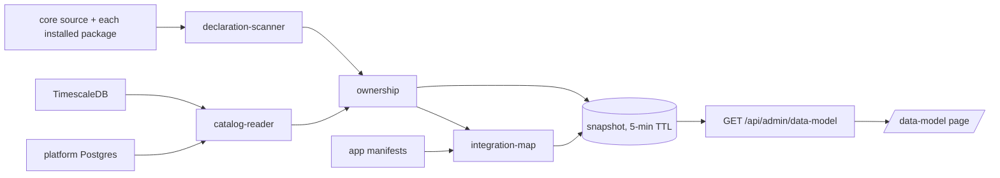

# Data-model explorer — as built, and how to continue it

The explorer is the live counterpart to the generated pages in this folder. The pages are a
committed snapshot of one reference database; the explorer reads whatever deployment it runs in.

- **Page:** `/data-model` (Admin console → Data model). Signed-in users only.
- **API:** `GET /api/admin/data-model` and `GET /api/admin/data-model/stores`, both
  **operator-only** (`requiresAuth` + `requiresOperator` on the mount in `src/app/server.ts`).
  Read-only: catalog `SELECT`s, a source scan, and read calls to the other stores.
- **Landed:** PR #431 (`feat/store-compatibility-gate`), commit `18edcbf4`.
- **Not yet deployed.** `src/app` is not bind-mounted, so the route only exists after a core
  deploy. See [Deploying](#deploying-it).

## What it shows

| View | Reads | Shows |
|---|---|---|
| Apps & integrations | manifests + ownership | one node per installed app plus `@core`; edges for context offers, artifact Send-to flows (matched by MIME type), dependencies, group members, shared tables and cross-owner foreign keys |
| Tables | catalog + ownership | an owner's tables and views, or one table's FK neighbourhood 1–3 hops; per table: every column, keys, declaring files, RLS state and row scope |
| Shared objects | ownership | tables more than one owner declares; foreign keys that cross an owner boundary |
| Other stores | store ports | TimescaleDB relations, SQLite tables parsed from source, declared-but-absent tables, unowned live relations, ArangoDB databases/collections, ChromaDB collections, Redis key families |

Every view is a URL: `?view=apps|tables|shared|stores&app=&table=&focus=&depth=&q=`.

## How a snapshot is built



1. **Catalog** — one JSON query per database over `pg_class` / `pg_attribute` / `pg_constraint` /
   `pg_policies` (+ TimescaleDB dimensions). The SQL is byte-identical to the schema-docs
   generator's.
2. **Declarations** — an async, bounded walk of core source (`scripts/migrations`, `src`,
   `any-bot/server`, `docker/postgres`) and every installed package directory, matching
   `CREATE TABLE` / `CREATE VIEW`, resolving `${CONST}` names, and tagging each site with its
   owner and engine.
3. **Ownership** — a live relation belongs to every owner that declares it. A relation nobody
   declares stays visible and is listed as unowned; it is never guessed at.
4. **Integration map** — nodes and edges from what manifests declare, plus the database links.
5. **Cache** — 5-minute TTL; concurrent callers share one build; `?refresh=1` forces a rebuild.

## Files

| Path | Role |
|---|---|
| `src/features/data-model/types.ts` | the model's types, `CORE_OWNER`, `noDatabaseError()` |
| `src/features/data-model/services/catalog-reader.ts` | catalog SQL + fold (parity with the generator) |
| `src/features/data-model/services/row-access.ts` | RLS row scope from real policy expressions |
| `src/features/data-model/services/ddl-parser.ts` | static `CREATE TABLE` parser (SQLite, absent tables) |
| `src/features/data-model/services/declaration-scanner.ts` | who declares what, and for which engine |
| `src/features/data-model/services/ownership.ts` | attribution, declared-but-absent, database links |
| `src/features/data-model/services/integration-map.ts` | app nodes and edges from manifests |
| `src/features/data-model/services/key-families.ts` | Redis key families with identifier masking |
| `src/features/data-model/services/data-model-service.ts` | snapshot assembly, TTL cache, store cards |
| `src/app/data-model-ports.ts` | the adapters: pool, TSDB, ArangoDB, ChromaDB, Redis, app records |
| `src/app/routes/data-model-routes.ts` | the two read routes |
| `src/app/routes/test-lab-data-model-scenarios.ts` | the Test Lab card |
| `src/pages/data-model/` | the page: `model-index.js` (pure), `layout.js`, `graph-view.js`, `detail-panel.js`, `lists-view.js`, `app.js` |

The slice imports **no other feature**: everything arrives through `DataModelPorts`, which the app
layer fills in. That is what makes every store doubleable in tests.

## Extending it

- **Another store.** Add a port to `DataModelPorts`, implement it in `src/app/data-model-ports.ts`
  (bound by `withTimeout`, client closed in `finally`), and add it to the `stores()` list in
  `data-model-service.ts`. The page renders any `StoreInventory` card without further change.
- **Another integration edge.** Add the kind to `IntegrationKind`, derive it in
  `integration-map.ts` (read the manifest, never infer from names), then add its colour token and
  legend checkbox in `data-model.css` / `index.html` and the kind list in `model-index.js`.
- **Another view.** Add it to `VIEWS` in `model-index.js`, a tab button in `index.html`, and a
  branch in `currentGraph()` / `renderSide()` in `app.js`.
- **More per-table detail.** The snapshot carries the whole relation record; extend
  `renderRelation()` in `detail-panel.js`. Adding a *catalog* field means changing the SQL in both
  the reader and the generator — the parity spec fails otherwise, on purpose.

## Tests

```bash
npm run test:data-model     # 51 tests; needs Docker (disposable Postgres) and Playwright Chromium
```

| Spec | Proves |
|---|---|
| `data-model-catalog.spec.ts` | the fold, and parity with the schema-docs generator (SQL, fold, RLS classifier, DDL parser) |
| `data-model-ownership.spec.ts` | scanner + attribution over a real temp source tree |
| `data-model-integration-map.spec.ts` | MIME overlap, every edge kind, aggregation |
| `data-model-service.spec.ts` | cache/TTL/in-flight sharing, degraded stores, key masking |
| `data-model-page-model.spec.ts` | graphs, neighbourhood, search, URL state, deterministic layout |
| `data-model-catalog-postgres.spec.ts` | a real catalog read from a disposable PostgreSQL 16 container |
| `data-model-routes.spec.ts` | the real operator gate over real HTTP (401 / 403 / 200 / 503 / 500) |
| `data-model-explorer-browser.spec.ts` | the page in real Chromium, including the non-operator path |
| `data-model-test-lab-registration.spec.ts` | the Lab card, its suites, and its live step |

## Deploying it

The page files are bind-mounted, but the route is not: **a core deploy is required.**

1. Merge PR #431, or preview-deploy the branch: `bash scripts/oshal-deploy.sh --preview`
   (the branch must track origin and match its fetched tip).
2. Check the box first: no deploy lock, the api healthy, and the Docker VM not starved —
   a build under memory pressure fails and rolls back.
3. Verify: open `/data-model` as an operator; the Apps view draws; the Tables view lists core's
   tables; the Stores view shows ArangoDB, ChromaDB and Redis cards.
4. Run the **Data model explorer** Test Lab card; it should report `pass` with the live counts.

## Limits as built

- **The scan is bounded:** 25,000 files, 1 MB per file, 12 KB of DDL text per statement. A larger
  tree silently stops at the cap (the log records the file count).
- **Declared-but-absent and SQLite tables are parsed, not read.** Later `ALTER TABLE` changes are
  not replayed, so those column lists are the statement as written.
- **Ownership sees installed packages only.** A package that is not installed on the deployment
  contributes nothing, and its tables (if present) show as unowned.
- **Redis shows key families and value types, never values**; families mask segments that look like
  an email, id or long number.
- **No history.** Each snapshot is current-state; nothing is stored or diffed (see the backlog).

## Troubleshooting

| Symptom | Meaning |
|---|---|
| "operator-only" banner | the caller is signed in but not an operator (`requiresOperator`) |
| 401 / "session has ended" | not signed in |
| 503 | the process has no platform database (`ctx.pool` absent) |
| first load slow | the source scan runs once per TTL; subsequent loads are cached |
| a table shows no owners | no scanned source declares it — expected for genuinely orphan tables, and listed under Other stores → Unowned |
