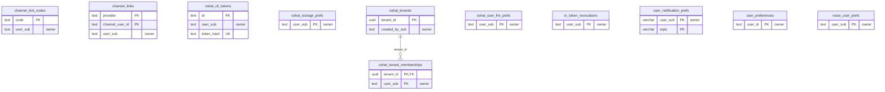

<!-- GENERATED by scripts/generate-schema-docs.js - do not edit by hand; regenerate instead. -->

# Identity, access & preferences

[Data model index](README.md) · database `oshal` · schema `public` · 11 tables (+2 declared, not present)

Tenants and memberships, local and federated identities, CLI and TV tokens, channel links, and per-user preferences.

The diagram shows key columns only: primary keys (PK), foreign keys (FK), single-column unique keys (UK) and the column an RLS policy scopes rows by ("owner"). A box with no columns is a table documented on another page. Every column is listed under Tables.

## Diagram

## Tables

### `channel_link_codes`

Defined in `src/features/chat-channels/services/channel-link-service.ts` · RLS **forced** - owner `user_sub`

| Column | Type | Null | Default | Notes |
|---|---|---|---|---|
| `code` | text | no |  | PK |
| `user_sub` | text | no |  | owner |
| `provider` | text | no |  |  |
| `expires_at` | timestamp with time zone | no |  |  |
| `consumed_at` | timestamp with time zone | yes |  |  |

### `channel_links`

Defined in `src/features/chat-channels/services/channel-link-service.ts` · RLS **forced** - owner `user_sub`

| Column | Type | Null | Default | Notes |
|---|---|---|---|---|
| `provider` | text | no |  | PK |
| `channel_user_id` | text | no |  | PK |
| `chat_id` | text | no |  |  |
| `user_sub` | text | no |  | owner |
| `display_name` | text | yes |  |  |
| `linked_at` | timestamp with time zone | no | now() |  |

### `oshal_cli_tokens`

Defined in `scripts/migrations/100-cli-token-base-schema.sql`, `src/app/routes/cli-token-routes.ts` · RLS **forced** - owner `user_sub`

| Column | Type | Null | Default | Notes |
|---|---|---|---|---|
| `id` | text | no |  | PK |
| `user_sub` | text | no |  | owner |
| `email` | text | yes |  |  |
| `label` | text | yes |  |  |
| `token_hash` | text | no |  | UK |
| `created_at` | timestamp with time zone | yes | now() |  |
| `last_used_at` | timestamp with time zone | yes |  |  |
| `revoked_at` | timestamp with time zone | yes |  |  |
| `expires_at` | timestamp with time zone | yes |  |  |
| `node_client_id` | text | yes |  | Remote-client device this token is confined to (hardening #7). NULL = ordinary account PAT. A bound token authenticates ONLY on /api/remote-clients/<node_client_id>/** plus the enrollment handshake paths - see features/remote-client/services/node-token-scope.ts. |
| `principal_issuer` | text | yes |  | Verified issuer namespace delegated by the authenticated session that minted this credential. NULL means unknown/legacy and must never be inferred from current OIDC configuration. |

### `oshal_storage_prefs`

Defined in `src/app/routes/storage-target.ts` · RLS **forced** - owner `user_sub`

| Column | Type | Null | Default | Notes |
|---|---|---|---|---|
| `user_sub` | text | no |  | PK · owner |
| `code_provider` | text | yes |  |  |
| `code_repo` | text | yes |  |  |
| `code_folder` | text | yes |  |  |
| `files_provider` | text | yes |  |  |
| `files_folder` | text | yes |  |  |
| `files_repo` | text | yes |  |  |
| `updated_at` | timestamp with time zone | no | now() |  |

### `oshal_tenant_memberships`

Defined in `scripts/migrations/060-platform-rls-tenancy.sql`, `src/app/routes/connector-tenancy.ts` · RLS **forced** - owner `user_sub`

| Column | Type | Null | Default | Notes |
|---|---|---|---|---|
| `tenant_id` | uuid | no |  | PK · FK → [`oshal_tenants.tenant_id`](identity-and-access.md#oshal_tenants) |
| `user_sub` | text | no |  | PK · owner |
| `role` | character varying(16) | no | 'member' |  |
| `created_at` | timestamp with time zone | no | now() |  |
| `display_name` | text | yes |  |  |

### `oshal_tenants`

Defined in `scripts/migrations/060-platform-rls-tenancy.sql`, `src/app/routes/connector-tenancy.ts` · RLS **forced** - owner `created_by_sub`

| Column | Type | Null | Default | Notes |
|---|---|---|---|---|
| `tenant_id` | uuid | no | gen_random_uuid() | PK |
| `kind` | character varying(16) | no | 'space' |  |
| `name` | text | yes |  |  |
| `created_by_sub` | text | yes |  | owner |
| `created_at` | timestamp with time zone | no | now() |  |

### `oshal_user_llm_prefs`

Defined in `scripts/migrations/122-user-llm-preference.sql`, `src/app/routes/user-brain-resolution.ts` · RLS **forced** - owner `user_sub`

| Column | Type | Null | Default | Notes |
|---|---|---|---|---|
| `user_sub` | text | no |  | PK · owner |
| `preferred_provider` | text | no |  |  |
| `preferred_model` | text | yes |  |  |
| `created_at` | timestamp with time zone | no | now() |  |
| `updated_at` | timestamp with time zone | no | now() |  |

### `tv_token_revocations`

Defined in `docker/postgres/migrations/003_tv_token_revocations.sql`, `src/app/routes/tv-pairing-routes.ts` · RLS **forced** - owner `user_sub`

| Column | Type | Null | Default | Notes |
|---|---|---|---|---|
| `user_sub` | text | no |  | PK · owner |
| `min_iat` | bigint | no |  |  |
| `updated_at` | timestamp with time zone | yes | now() |  |

### `user_notification_prefs`

Defined in `scripts/migrations/079-notification-prefs.sql` · RLS **forced** - owner `user_sub`

| Column | Type | Null | Default | Notes |
|---|---|---|---|---|
| `user_sub` | character varying(255) | no |  | PK · owner |
| `topic` | character varying(64) | no |  | PK |
| `channel` | character varying(16) | no | 'email' |  |
| `enabled` | boolean | no | true |  |
| `quiet_hours_start` | smallint | yes |  |  |
| `quiet_hours_end` | smallint | yes |  |  |
| `phone` | text | yes |  |  |
| `telegram_chat_id` | text | yes |  |  |
| `created_at` | timestamp with time zone | no | now() |  |
| `updated_at` | timestamp with time zone | no | now() |  |

### `user_preferences`

Defined in `docker/postgres/migrations/001_add_onboarding_and_presets.sql`, `scripts/migrations/053-onboarding-and-presets.sql` · RLS **forced** - owner `user_id`

| Column | Type | Null | Default | Notes |
|---|---|---|---|---|
| `user_id` | text | no |  | PK · owner |
| `created_at` | timestamp with time zone | yes | now() |  |
| `updated_at` | timestamp with time zone | yes | now() |  |
| `onboarding_completed` | boolean | yes | false |  |
| `onboarding_step` | integer | yes | 0 |  |
| `onboarding_data` | jsonb | yes | '{}' |  |
| `home_dashboard` | jsonb | no | '{"version": 1}' |  |
| `home_revision` | integer | no | 0 |  |

### `voice_user_prefs`

Defined in `src/features/voice-providers/services/voice-prefs-store.ts` · RLS **forced** - owner `user_sub`

| Column | Type | Null | Default | Notes |
|---|---|---|---|---|
| `user_sub` | text | no |  | PK · owner |
| `tts_provider` | text | no |  |  |
| `tts_voice` | text | yes |  |  |
| `updated_at` | timestamp with time zone | no | now() |  |

## Declared in source, not present in the reference database

These tables have a `CREATE TABLE` in source but are not in the reference database. Columns are parsed from the statement as written; later `ALTER TABLE` changes are not applied.

### `oshal_external_identity_links`

Defined in `src/app/middleware/entra-local-identity-bridge.ts`

| Column | Type | Null | Default | Notes |
|---|---|---|---|---|
| `issuer` | TEXT | no |  | PK |
| `external_sub` | TEXT | no |  | PK |
| `entra_tenant_id` | TEXT | no |  |  |
| `entra_object_id` | TEXT | no |  |  |
| `local_user_sub` | TEXT | no |  | FK → [`oshal_local_users.user_sub`](identity-and-access.md#oshal_local_users) |
| `email_at_link` | TEXT | no |  |  |
| `created_at` | TIMESTAMPTZ | no | NOW() |  |
| `last_seen_at` | TIMESTAMPTZ | no | NOW() |  |

### `oshal_local_users`

Defined in `src/features/local-auth/services/local-user-store.ts`

| Column | Type | Null | Default | Notes |
|---|---|---|---|---|
| `id` | TEXT | no |  | PK |
| `email` | TEXT | no |  | UK |
| `display_name` | TEXT | yes |  |  |
| `user_sub` | TEXT | no |  | UK |
| `password_hash` | TEXT | yes |  |  |
| `status` | TEXT | no | 'invited' |  |
| `token_version` | INTEGER | no | 1 |  |
| `invite_token_hash` | TEXT | yes |  |  |
| `invite_expires_at` | TIMESTAMPTZ | yes |  |  |
| `invited_by_sub` | TEXT | yes |  |  |
| `created_at` | TIMESTAMPTZ | yes | NOW() |  |
| `activated_at` | TIMESTAMPTZ | yes |  |  |
| `last_login_at` | TIMESTAMPTZ | yes |  |  |
