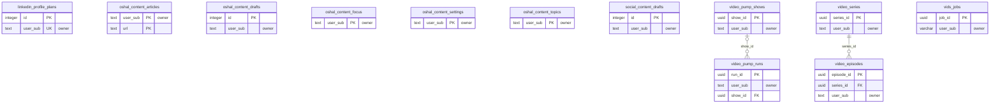

<!-- GENERATED by scripts/generate-schema-docs.js - do not edit by hand; regenerate instead. -->

# Media, content & social

[Data model index](README.md) · database `oshal` · schema `public` · 12 tables

Content studio articles and drafts, social and LinkedIn drafts, and the video series / pump / vids job tables.

The diagram shows key columns only: primary keys (PK), foreign keys (FK), single-column unique keys (UK) and the column an RLS policy scopes rows by ("owner"). A box with no columns is a table documented on another page. Every column is listed under Tables.

## Diagram

## Tables

### `linkedin_profile_plans`

Defined in `scripts/migrations/087-linkedin-profile-plans.sql`, `src/features/profile-studio/services/profile-plan-store.ts` · RLS **forced** - owner `user_sub`

| Column | Type | Null | Default | Notes |
|---|---|---|---|---|
| `id` | integer | no | nextval('linkedin_profile_plans_id_seq') | PK |
| `user_sub` | text | no |  | UK · owner |
| `headline` | text | no | '' |  |
| `about` | text | no | '' |  |
| `skills` | jsonb | no | '[]' |  |
| `custom_url` | text | no | '' |  |
| `background_image_path` | text | yes |  |  |
| `resume_path` | text | yes |  |  |
| `state` | text | no | 'draft' |  |
| `dispatch_task_id` | text | yes |  |  |
| `dispatch_client_id` | text | yes |  |  |
| `result_note` | text | yes |  |  |
| `created_at` | timestamp with time zone | no | now() |  |
| `updated_at` | timestamp with time zone | no | now() |  |
| `photo_path` | text | yes |  |  |
| `dispatch_generation` | bigint | no | 0 |  |
| `callback_capability_hash` | text | yes |  |  |
| `callback_capability_expires_at` | timestamp with time zone | yes |  |  |
| `callback_capability_operation` | text | yes |  |  |
| `callback_capability_used_at` | timestamp with time zone | yes |  |  |

### `oshal_content_articles`

Defined in `src/app/routes/content-routes.ts` · RLS **forced** - owner `user_sub`

| Column | Type | Null | Default | Notes |
|---|---|---|---|---|
| `user_sub` | text | no |  | PK · owner |
| `url` | text | no |  | PK |
| `title` | text | yes |  |  |
| `source` | text | yes |  |  |
| `matched` | jsonb | yes |  |  |
| `score` | integer | yes |  |  |
| `published_at` | timestamp with time zone | yes |  |  |
| `first_seen` | timestamp with time zone | no | now() |  |
| `last_seen` | timestamp with time zone | no | now() |  |
| `dismissed` | boolean | no | false |  |
| `dismissed_at` | timestamp with time zone | yes |  |  |

### `oshal_content_drafts`

Defined in `src/app/routes/content-routes.ts` · RLS **forced** - owner `user_sub`

| Column | Type | Null | Default | Notes |
|---|---|---|---|---|
| `id` | integer | no | nextval('oshal_content_drafts_id_seq') | PK |
| `user_sub` | text | no |  | owner |
| `topic` | text | yes |  |  |
| `take` | text | yes |  |  |
| `draft` | text | yes |  |  |
| `created_at` | timestamp with time zone | no | now() |  |

### `oshal_content_focus`

Defined in `src/app/routes/content-routes.ts` · RLS **forced** - owner `user_sub`

| Column | Type | Null | Default | Notes |
|---|---|---|---|---|
| `user_sub` | text | no |  | PK · owner |
| `focus` | text | yes |  |  |
| `updated_at` | timestamp with time zone | no | now() |  |

### `oshal_content_settings`

Defined in `src/app/routes/content-routes.ts` · RLS **forced** - owner `user_sub`

| Column | Type | Null | Default | Notes |
|---|---|---|---|---|
| `user_sub` | text | no |  | PK · owner |
| `email_social_scan` | boolean | no | false |  |
| `updated_at` | timestamp with time zone | no | now() |  |

### `oshal_content_topics`

Defined in `src/app/routes/content-routes.ts` · RLS **forced** - owner `user_sub`

| Column | Type | Null | Default | Notes |
|---|---|---|---|---|
| `user_sub` | text | no |  | PK · owner |
| `cards` | jsonb | yes |  |  |
| `focus` | text | yes |  |  |
| `generated_at` | timestamp with time zone | no | now() |  |

### `social_content_drafts`

Defined in `scripts/migrations/085-social-content-drafts.sql`, `src/features/linkedin-assistant/services/content-draft-store.ts` · RLS **forced** - owner `user_sub`

| Column | Type | Null | Default | Notes |
|---|---|---|---|---|
| `id` | integer | no | nextval('social_content_drafts_id_seq') | PK |
| `user_sub` | text | no |  | owner |
| `topic` | text | no |  |  |
| `goal` | text | yes |  |  |
| `tone` | text | yes |  |  |
| `source_url` | text | yes |  |  |
| `body` | text | no | '' |  |
| `score` | integer | yes |  |  |
| `dimensions` | jsonb | no | '{}' |  |
| `judge_mode` | text | yes |  |  |
| `rationale` | text | yes |  |  |
| `refined` | boolean | no | false |  |
| `state` | text | no | 'draft' |  |
| `scheduled_for` | timestamp with time zone | yes |  |  |
| `publish_error` | text | yes |  |  |
| `created_at` | timestamp with time zone | no | now() |  |
| `updated_at` | timestamp with time zone | no | now() |  |

### `video_episodes`

Defined in `scripts/migrations/066-video-series.sql` · RLS **forced** - owner `user_sub`

| Column | Type | Null | Default | Notes |
|---|---|---|---|---|
| `episode_id` | uuid | no | gen_random_uuid() | PK |
| `series_id` | uuid | no |  | FK → [`video_series.series_id`](media-and-content.md#video_series) |
| `user_sub` | text | no |  | owner |
| `ordinal` | integer | no |  |  |
| `title` | text | no |  |  |
| `logline` | text | yes |  |  |
| `script_md` | text | yes |  |  |
| `animation_md` | text | yes |  |  |
| `image_prompts_md` | text | yes |  |  |
| `vids_job_id` | text | yes |  |  |
| `clip_paths` | jsonb | no | '[]' |  |
| `mp4_path` | text | yes |  |  |
| `drive_url` | text | yes |  |  |
| `assembled_path` | text | yes |  |  |
| `status` | text | no | 'planned' |  |
| `error` | text | yes |  |  |
| `created_at` | timestamp with time zone | no | now() |  |
| `updated_at` | timestamp with time zone | no | now() |  |
| `scenes` | jsonb | no | '[]' | Ordered scenes from the screenplay-writer: [{n, camera, motion, dialogue:[{who,line}], reaction}] |
| `frame_ids` | jsonb | no | '[]' | Drive file ids of the storyboard stills, in scene order. The node fetches by id. |

### `video_pump_runs`

Defined in `scripts/migrations/097-video-pump.sql` · RLS **forced** - owner `user_sub`

| Column | Type | Null | Default | Notes |
|---|---|---|---|---|
| `run_id` | uuid | no | gen_random_uuid() | PK |
| `user_sub` | text | no |  | owner |
| `show_id` | uuid | yes |  | FK → [`video_pump_shows.show_id`](media-and-content.md#video_pump_shows) |
| `show_slug` | text | yes |  |  |
| `series_id` | uuid | yes |  |  |
| `ticket_id` | text | yes |  |  |
| `episode_title` | text | yes |  |  |
| `joke_seed` | text | yes |  |  |
| `outcome` | text | no |  |  |
| `outcome_stage` | text | yes |  |  |
| `outcome_reason` | text | yes |  |  |
| `drive_url` | text | yes |  |  |
| `duration_ms` | integer | yes |  |  |
| `created_at` | timestamp with time zone | no | now() |  |
| `updated_at` | timestamp with time zone | no | now() |  |
| `node_resource_key` | text | yes |  |  |
| `node_client_id` | text | yes |  |  |
| `node_lease_id` | uuid | yes |  |  |
| `node_lease_holder` | text | yes |  |  |

### `video_pump_shows`

Defined in `scripts/migrations/097-video-pump.sql` · RLS **forced** - owner `user_sub`

| Column | Type | Null | Default | Notes |
|---|---|---|---|---|
| `show_id` | uuid | no | gen_random_uuid() | PK |
| `user_sub` | text | no |  | owner |
| `slug` | text | no |  |  |
| `title` | text | no |  |  |
| `premise` | text | no |  |  |
| `style_lock` | text | yes |  |  |
| `cast_bible` | jsonb | no | '[]' |  |
| `joke_seeds` | jsonb | no | '[]' |  |
| `seed_cursor` | integer | no | 0 |  |
| `scenes_per_episode` | integer | no | 4 |  |
| `orientation` | text | no | 'Landscape' |  |
| `intro_clip` | text | yes |  |  |
| `enabled` | boolean | no | false |  |
| `standing_authorization` | boolean | no | false |  |
| `daily_cap` | integer | no | 1 |  |
| `min_interval_minutes` | integer | no | 240 |  |
| `episodes_made` | integer | no | 0 |  |
| `consecutive_failures` | integer | no | 0 |  |
| `paused_reason` | text | yes |  |  |
| `last_started_at` | timestamp with time zone | yes |  |  |
| `last_success_at` | timestamp with time zone | yes |  |  |
| `created_at` | timestamp with time zone | no | now() |  |
| `updated_at` | timestamp with time zone | no | now() |  |

### `video_series`

Defined in `scripts/migrations/066-video-series.sql` · RLS **forced** - owner `user_sub`

| Column | Type | Null | Default | Notes |
|---|---|---|---|---|
| `series_id` | uuid | no | gen_random_uuid() | PK |
| `user_sub` | text | no |  | owner |
| `ticket_id` | text | yes |  |  |
| `title` | text | no |  |  |
| `premise` | text | no |  |  |
| `style_lock` | text | yes |  |  |
| `cast_bible` | jsonb | no | '[]' |  |
| `episode_count` | integer | no | 1 |  |
| `scenes_per_episode` | integer | no | 4 |  |
| `orientation` | text | no | 'Landscape' |  |
| `character_image_path` | text | yes |  |  |
| `status` | text | no | 'scripting' |  |
| `error` | text | yes |  |  |
| `created_at` | timestamp with time zone | no | now() |  |
| `updated_at` | timestamp with time zone | no | now() |  |
| `intro_clip` | text | yes |  | Filename of the cached intro clip in the render node's stage dir, prepended to every episode of this series at assembly. NULL = no intro. |

### `vids_jobs`

Defined in `scripts/migrations/059-vids-platform.sql` · RLS **forced** - owner `user_sub`

| Column | Type | Null | Default | Notes |
|---|---|---|---|---|
| `job_id` | uuid | no | gen_random_uuid() | PK |
| `tenant_id` | uuid | yes |  |  |
| `user_sub` | character varying(255) | no |  | owner |
| `client_id` | character varying(255) | yes |  |  |
| `status` | character varying(20) | no | 'queued' |  |
| `idea` | text | no |  |  |
| `final_prompt` | text | yes |  |  |
| `orientation` | character varying(20) | yes |  |  |
| `insert_mode` | character varying(20) | yes |  |  |
| `ingredient` | text | yes |  |  |
| `outcome` | jsonb | no | '{}' |  |
| `rating` | smallint | yes |  |  |
| `created_at` | timestamp with time zone | no | now() |  |
| `updated_at` | timestamp with time zone | no | now() |  |
