<!-- GENERATED by scripts/generate-schema-docs.js - do not edit by hand; regenerate instead. -->

# Memory, knowledge & user model

[Data model index](README.md) · database `oshal` · schema `public` · 12 tables (+7 declared, not present)

Agent and swarm memory, knowledge documents, pgvector RAG chunks, the personal graph, the user model and person model, and visual response artifacts.

The diagram shows key columns only: primary keys (PK), foreign keys (FK), single-column unique keys (UK) and the column an RLS policy scopes rows by ("owner"). A box with no columns is a table documented on another page. Every column is listed under Tables.

## Diagram

```mermaid
erDiagram
  agent_memories {
    uuid memory_id PK
    text task_id FK
  }
  haven_push_deliveries {
    text user_sub PK "owner"
    text suggestion_id PK
  }
  knowledge_memory_documents {
    uuid knowledge_id PK
    text task_id FK
    text owner_sub "owner"
  }
  oshal_swarm_memory {
    text work_item_id PK
  }
  person_model_projections {
    text owner_sub PK "owner"
    text store PK
  }
  personal_graph_edges {
    text id PK
    text user_sub PK "owner"
  }
  personal_graph_nodes {
    text id PK
    text user_sub PK "owner"
  }
  rag_chunks {
    text chunk_id PK
    text owner_sub "owner"
  }
  user_model_facts {
    text fact_id PK
    text user_sub "owner"
  }
  user_model_state {
    text user_sub PK "owner"
  }
  user_model_suggestions {
    text suggestion_id PK
    text user_sub "owner"
  }
  visual_response_artifacts {
    uuid artifact_id PK
    text user_sub "owner"
  }
  chat_tasks ||--o{ agent_memories : "task_id"
  chat_tasks |o--o{ knowledge_memory_documents : "task_id"
```

## Tables

### `agent_memories`

Defined in `scripts/migrations/006-non-swarm-memory-layers.sql`, `src/shared/services/database/conversation-schema.ts` · RLS **forced** - `oshal_owns_task(task_id)`

| Column | Type | Null | Default | Notes |
|---|---|---|---|---|
| `memory_id` | uuid | no |  | PK |
| `agent_id` | text | no |  |  |
| `task_id` | text | no |  | FK → [`chat_tasks.task_id`](cost-and-usage.md#chat_tasks) |
| `title` | text | no |  |  |
| `summary` | text | no |  |  |
| `last_user_message` | text | yes |  |  |
| `last_assistant_message` | text | yes |  |  |
| `tool_names` | text[] | no | '{}' |  |
| `keywords` | text[] | no | '{}' |  |
| `message_count` | integer | no | 0 |  |
| `turn_count` | integer | no | 0 |  |
| `total_tokens` | bigint | no | 0 |  |
| `total_cost` | double precision | no | 0 |  |
| `cost_currency` | text | no | 'USD' |  |
| `source` | text | no | 'task_result' |  |
| `metadata` | jsonb | no | '{}' |  |
| `created_at` | timestamp with time zone | no | now() |  |
| `updated_at` | timestamp with time zone | no | now() |  |

### `haven_push_deliveries`

Defined in `src/features/user-model/services/user-model-service.ts` · RLS **forced** - owner `user_sub`

| Column | Type | Null | Default | Notes |
|---|---|---|---|---|
| `user_sub` | text | no |  | PK · owner |
| `suggestion_id` | text | no |  | PK |
| `channel` | text | yes |  |  |
| `sent_at` | timestamp with time zone | no | now() |  |

### `knowledge_memory_documents`

Defined in `scripts/migrations/006-non-swarm-memory-layers.sql`, `src/shared/services/database/conversation-schema.ts` · RLS **forced** - owner `owner_sub`

| Column | Type | Null | Default | Notes |
|---|---|---|---|---|
| `knowledge_id` | uuid | no |  | PK |
| `agent_id` | text | yes |  |  |
| `task_id` | text | yes |  | FK → [`chat_tasks.task_id`](cost-and-usage.md#chat_tasks) |
| `collection_name` | text | no | 'default' |  |
| `title` | text | no |  |  |
| `source` | text | no |  |  |
| `format` | text | yes |  |  |
| `chunk_count` | integer | no | 0 |  |
| `document_count` | integer | no | 0 |  |
| `embedding_provider_id` | text | yes |  |  |
| `embedding_model_id` | text | yes |  |  |
| `metadata` | jsonb | no | '{}' |  |
| `created_at` | timestamp with time zone | no | now() |  |
| `updated_at` | timestamp with time zone | no | now() |  |
| `owner_sub` | text | yes |  | owner |

### `oshal_swarm_memory`

Defined in `scripts/migrations/117-swarm-memory-provenance.sql` · RLS **forced** - custom policy `oshal_swarm_memory_ledger_broker`

| Column | Type | Null | Default | Notes |
|---|---|---|---|---|
| `work_item_id` | text | no |  | PK |
| `title` | text | no |  |  |
| `document` | text | no |  |  |
| `content_sha256` | text | no |  |  |
| `owner_sub` | text | yes |  |  |
| `tenant_id` | text | yes |  |  |
| `workspace_id` | text | yes |  |  |
| `visibility` | text | no | 'private' |  |
| `trust_level` | text | no | 'untrusted' |  |
| `source` | text | no |  |  |
| `created_by_workload` | text | no |  |  |
| `approved_by_sub` | text | yes |  |  |
| `approval_content_sha256` | text | yes |  |  |
| `validation_method` | text | yes |  |  |
| `validation_evidence_sha256` | text | yes |  |  |
| `metadata` | jsonb | no | '{}' |  |
| `indexed_at` | timestamp with time zone | yes |  |  |
| `created_at` | timestamp with time zone | no | now() |  |
| `updated_at` | timestamp with time zone | no | now() |  |

### `person_model_projections`

Defined in `src/features/person-model/services/person-model-schema.ts` · RLS **forced** - owner `owner_sub`

| Column | Type | Null | Default | Notes |
|---|---|---|---|---|
| `owner_sub` | text | no |  | PK · owner |
| `store` | text | no |  | PK |
| `watermark_captured_at` | timestamp with time zone | yes |  |  |
| `canon_rows` | integer | yes |  |  |
| `projected_rows` | integer | yes |  |  |
| `last_rebuild_at` | timestamp with time zone | yes |  |  |
| `status` | text | yes |  |  |

### `personal_graph_edges`

Defined in `scripts/migrations/057-personal-graph.sql` · RLS **forced** - owner `user_sub`

| Column | Type | Null | Default | Notes |
|---|---|---|---|---|
| `id` | text | no |  | PK |
| `type` | text | no |  |  |
| `from_id` | text | no |  |  |
| `to_id` | text | no |  |  |
| `sources` | jsonb | no | '[]' |  |
| `props` | jsonb | no | '{}' |  |
| `updated_at` | timestamp with time zone | no | now() |  |
| `user_sub` | text | no | '' | PK · owner |

### `personal_graph_nodes`

Defined in `scripts/migrations/057-personal-graph.sql` · RLS **forced** - owner `user_sub`

| Column | Type | Null | Default | Notes |
|---|---|---|---|---|
| `id` | text | no |  | PK |
| `type` | text | no |  |  |
| `label` | text | no | '' |  |
| `sources` | jsonb | no | '[]' |  |
| `props` | jsonb | no | '{}' |  |
| `updated_at` | timestamp with time zone | no | now() |  |
| `user_sub` | text | no | '' | PK · owner |

### `rag_chunks`

Defined in `scripts/migrations/070-rag-chunks-pgvector.sql` · RLS **forced** - owner `owner_sub`

| Column | Type | Null | Default | Notes |
|---|---|---|---|---|
| `chunk_id` | text | no |  | PK |
| `collection` | text | no |  |  |
| `document` | text | no |  |  |
| `embedding` | vector(384) | yes |  |  |
| `fts` | tsvector | yes | to_tsvector('english'::regconfig, document) |  |
| `metadata` | jsonb | no | '{}' |  |
| `owner_sub` | text | yes |  | owner |
| `tenant_id` | uuid | yes |  |  |
| `created_at` | timestamp with time zone | no | now() |  |

### `user_model_facts`

Defined in `src/features/user-model/services/user-model-service.ts` · RLS **forced** - owner `user_sub`

| Column | Type | Null | Default | Notes |
|---|---|---|---|---|
| `fact_id` | text | no |  | PK |
| `user_sub` | text | no |  | owner |
| `facet` | text | no |  |  |
| `fact_key` | text | no |  |  |
| `fact_value` | text | no |  |  |
| `confidence` | double precision | no |  |  |
| `source` | text | no |  |  |
| `evidence` | text | yes |  |  |
| `times_seen` | integer | no | 1 |  |
| `active` | boolean | no | true |  |
| `first_seen` | timestamp with time zone | no | now() |  |
| `last_seen` | timestamp with time zone | no | now() |  |

### `user_model_state`

Defined in `src/features/user-model/services/user-model-service.ts` · RLS **forced** - owner `user_sub`

| Column | Type | Null | Default | Notes |
|---|---|---|---|---|
| `user_sub` | text | no |  | PK · owner |
| `last_learned_at` | timestamp with time zone | yes |  |  |
| `last_sweep_at` | timestamp with time zone | yes |  |  |

### `user_model_suggestions`

Defined in `src/features/user-model/services/user-model-service.ts` · RLS **forced** - owner `user_sub`

| Column | Type | Null | Default | Notes |
|---|---|---|---|---|
| `suggestion_id` | text | no |  | PK |
| `user_sub` | text | no |  | owner |
| `kind` | text | no |  |  |
| `message` | text | no |  |  |
| `status` | text | no | 'new' |  |
| `created_at` | timestamp with time zone | no | now() |  |

### `visual_response_artifacts`

Defined in `scripts/migrations/068-visual-response-artifacts.sql`, `src/features/visual-response/services/visual-response-service.ts` · RLS **forced** - owner `user_sub`

| Column | Type | Null | Default | Notes |
|---|---|---|---|---|
| `artifact_id` | uuid | no |  | PK |
| `user_sub` | text | no |  | owner |
| `source_surface` | text | no |  |  |
| `source_session_id` | text | no |  |  |
| `source_job_id` | text | no |  |  |
| `mime_type` | text | no |  |  |
| `width` | integer | no |  |  |
| `height` | integer | no |  |  |
| `alt_text` | text | no |  |  |
| `content` | bytea | no |  |  |
| `content_sha256` | text | no |  |  |
| `provenance` | jsonb | no |  |  |
| `created_at` | timestamp with time zone | no | now() |  |

## Declared in source, not present in the reference database

These tables have a `CREATE TABLE` in source but are not in the reference database. Columns are parsed from the statement as written; later `ALTER TABLE` changes are not applied.

### `connected_devices`

Defined in `docker/postgres/migrations/002_haven_home_context.sql`

| Column | Type | Null | Default | Notes |
|---|---|---|---|---|
| `id` | UUID | no | gen_random_uuid() | PK |
| `household_id` | UUID | yes |  | FK → [`home_context.household_id`](memory-and-knowledge.md#home_context) |
| `name` | TEXT | no |  |  |
| `platform` | TEXT | no |  |  |
| `platform_id` | TEXT | yes |  |  |
| `device_type` | TEXT | yes |  |  |
| `location` | TEXT | yes |  |  |
| `status` | TEXT | yes | 'online' |  |
| `last_seen` | TIMESTAMPTZ | yes |  |  |
| `properties` | JSONB | yes | '{}' |  |
| `notes` | TEXT | yes |  |  |
| `connected_at` | TIMESTAMPTZ | yes | NOW() |  |
| `updated_at` | TIMESTAMPTZ | yes | NOW() |  |

### `haven_memory`

Defined in `docker/postgres/migrations/002_haven_home_context.sql`

| Column | Type | Null | Default | Notes |
|---|---|---|---|---|
| `id` | UUID | no | gen_random_uuid() | PK |
| `household_id` | UUID | yes |  | FK → [`home_context.household_id`](memory-and-knowledge.md#home_context) |
| `subject` | TEXT | no |  |  |
| `content` | TEXT | no |  |  |
| `tags` | TEXT[] | yes |  |  |
| `created_at` | TIMESTAMPTZ | yes | NOW() |  |

### `home_context`

Defined in `docker/postgres/migrations/002_haven_home_context.sql`

| Column | Type | Null | Default | Notes |
|---|---|---|---|---|
| `id` | UUID | no | gen_random_uuid() | PK |
| `household_id` | UUID | no |  | UK |
| `name` | TEXT | yes |  |  |
| `timezone` | TEXT | yes | 'America/Chicago' |  |
| `created_at` | TIMESTAMPTZ | yes | NOW() |  |
| `updated_at` | TIMESTAMPTZ | yes | NOW() |  |

### `household_members`

Defined in `docker/postgres/migrations/002_haven_home_context.sql`

| Column | Type | Null | Default | Notes |
|---|---|---|---|---|
| `id` | UUID | no | gen_random_uuid() | PK |
| `household_id` | UUID | yes |  | FK → [`home_context.household_id`](memory-and-knowledge.md#home_context) |
| `name` | TEXT | no |  |  |
| `role` | TEXT | yes |  |  |
| `preferences` | JSONB | yes | '{}' |  |
| `created_at` | TIMESTAMPTZ | yes | NOW() |  |

### `household_preferences`

Defined in `docker/postgres/migrations/002_haven_home_context.sql`

| Column | Type | Null | Default | Notes |
|---|---|---|---|---|
| `id` | UUID | no | gen_random_uuid() | PK |
| `household_id` | UUID | yes |  | FK → [`home_context.household_id`](memory-and-knowledge.md#home_context) |
| `category` | TEXT | no |  |  |
| `key` | TEXT | no |  |  |
| `value` | TEXT | no |  |  |
| `source` | TEXT | yes | 'user' |  |
| `set_at` | TIMESTAMPTZ | yes | NOW() |  |

### `linked_integrations`

Defined in `docker/postgres/migrations/002_haven_home_context.sql`

| Column | Type | Null | Default | Notes |
|---|---|---|---|---|
| `id` | UUID | no | gen_random_uuid() | PK |
| `household_id` | UUID | yes |  | FK → [`home_context.household_id`](memory-and-knowledge.md#home_context) |
| `service` | TEXT | no |  |  |
| `category` | TEXT | no |  |  |
| `display_name` | TEXT | yes |  |  |
| `auth_status` | TEXT | yes | 'active' |  |
| `token_expires` | TIMESTAMPTZ | yes |  |  |
| `preferences` | JSONB | yes | '{}' |  |
| `linked_at` | TIMESTAMPTZ | yes | NOW() |  |
| `updated_at` | TIMESTAMPTZ | yes | NOW() |  |

### `open_threads`

Defined in `docker/postgres/migrations/002_haven_home_context.sql`

| Column | Type | Null | Default | Notes |
|---|---|---|---|---|
| `id` | UUID | no | gen_random_uuid() | PK |
| `household_id` | UUID | yes |  | FK → [`home_context.household_id`](memory-and-knowledge.md#home_context) |
| `description` | TEXT | no |  |  |
| `context` | JSONB | yes | '{}' |  |
| `status` | TEXT | yes | 'open' |  |
| `created_at` | TIMESTAMPTZ | yes | NOW() |  |
| `last_active` | TIMESTAMPTZ | yes | NOW() |  |
| `closes_at` | TIMESTAMPTZ | yes |  |  |
