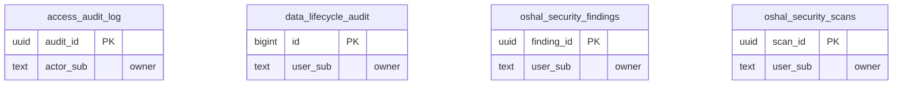

<!-- GENERATED by scripts/generate-schema-docs.js - do not edit by hand; regenerate instead. -->

# Security & audit

[Data model index](README.md) · database `oshal` · schema `public` · 4 tables

The append-only access audit log, data-lifecycle audit, and security-center scans and findings.

The diagram shows key columns only: primary keys (PK), foreign keys (FK), single-column unique keys (UK) and the column an RLS policy scopes rows by ("owner"). A box with no columns is a table documented on another page. Every column is listed under Tables.

## Diagram

## Tables

### `access_audit_log`

Defined in `scripts/migrations/061-audit-append-only.sql`, `scripts/governance/apply-rls.mjs`, `src/features/governance/audit/audit-emit.ts` · RLS **forced** - INSERT: unrestricted; owner `actor_sub`

| Column | Type | Null | Default | Notes |
|---|---|---|---|---|
| `audit_id` | uuid | no | gen_random_uuid() | PK |
| `actor_sub` | text | yes |  | owner |
| `action` | text | no |  |  |
| `resource_type` | text | no |  |  |
| `resource_id` | text | yes |  |  |
| `decision` | text | no | 'info' |  |
| `metadata` | jsonb | yes |  |  |
| `created_at` | timestamp with time zone | no | now() |  |

### `data_lifecycle_audit`

Defined in `scripts/migrations/080-data-lifecycle.sql` · RLS **forced** - owner `user_sub`

| Column | Type | Null | Default | Notes |
|---|---|---|---|---|
| `id` | bigint | no | nextval('data_lifecycle_audit_id_seq') | PK |
| `user_sub` | text | no |  | owner |
| `user_email` | text | yes |  |  |
| `action` | character varying(16) | no |  |  |
| `outcomes` | jsonb | no | '[]' |  |
| `stores_deleted` | integer | no | 0 |  |
| `stores_skipped` | integer | no | 0 |  |
| `stores_failed` | integer | no | 0 |  |
| `created_at` | timestamp with time zone | no | now() |  |

### `oshal_security_findings`

Defined in `scripts/migrations/039-security-center.sql`, `src/app/routes/security-routes.ts` · RLS **forced** - owner `user_sub`

| Column | Type | Null | Default | Notes |
|---|---|---|---|---|
| `finding_id` | uuid | no | gen_random_uuid() | PK |
| `user_sub` | text | no |  | owner |
| `category` | text | no |  |  |
| `severity` | text | no |  |  |
| `title` | text | no |  |  |
| `detail` | text | no | '' |  |
| `source` | text | yes |  |  |
| `evidence` | jsonb | yes |  |  |
| `fingerprint` | text | no |  |  |
| `status` | text | no | 'open' |  |
| `assessment` | jsonb | yes |  |  |
| `assessed_at` | timestamp with time zone | yes |  |  |
| `ticket_id` | uuid | yes |  |  |
| `first_seen` | timestamp with time zone | no | now() |  |
| `last_seen` | timestamp with time zone | no | now() |  |

### `oshal_security_scans`

Defined in `scripts/migrations/039-security-center.sql`, `src/app/routes/security-routes.ts` · RLS **forced** - owner `user_sub`

| Column | Type | Null | Default | Notes |
|---|---|---|---|---|
| `scan_id` | uuid | no | gen_random_uuid() | PK |
| `user_sub` | text | no |  | owner |
| `kinds` | text[] | no |  |  |
| `status` | text | no | 'running' |  |
| `finding_count` | integer | no | 0 |  |
| `new_count` | integer | no | 0 |  |
| `summary` | jsonb | yes |  |  |
| `error` | text | yes |  |  |
| `started_at` | timestamp with time zone | no | now() |  |
| `finished_at` | timestamp with time zone | yes |  |  |
