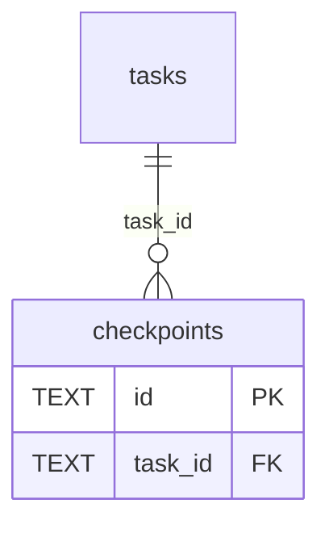
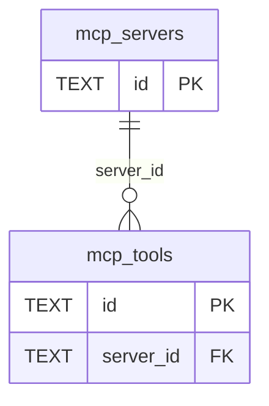
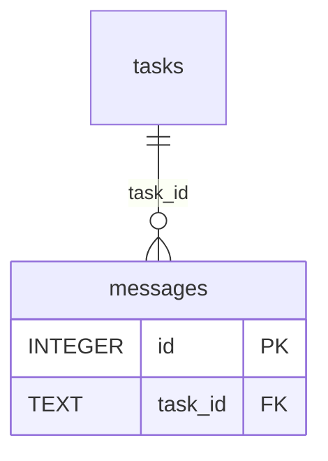
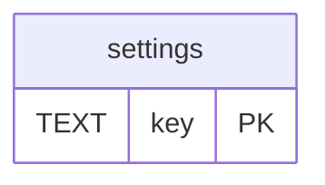
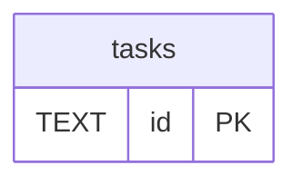
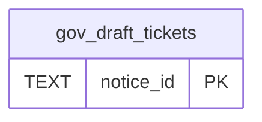
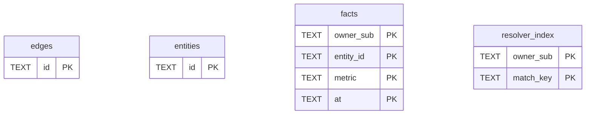

<!-- GENERATED by scripts/generate-schema-docs.js - do not edit by hand; regenerate instead. -->

# SQLite stores (core)

[Data model index](README.md)

Each file below opens its own SQLite database, so relationships never cross files. There is no catalog to read, so columns are parsed from each `CREATE TABLE` as written; later `ALTER TABLE` changes are not applied.

## `any-bot/server/stores/CheckpointStore.js`

### `checkpoints`

| Column | Type | Null | Default | Notes |
|---|---|---|---|---|
| `id` | TEXT | no |  | PK |
| `task_id` | TEXT | no |  | FK → `tasks.id` |
| `created_at` | INTEGER | no |  |  |
| `message_count` | INTEGER | no |  |  |
| `data` | TEXT | no |  |  |

## `any-bot/server/stores/MCPStore.js`

### `mcp_servers`

| Column | Type | Null | Default | Notes |
|---|---|---|---|---|
| `id` | TEXT | no |  | PK |
| `name` | TEXT | no |  |  |
| `port` | INTEGER | yes |  |  |
| `host` | TEXT | yes | 'localhost' |  |
| `enabled` | INTEGER | yes | 1 |  |
| `status` | TEXT | yes | 'unknown' |  |
| `last_health_check` | INTEGER | yes |  |  |
| `tools_discovered` | INTEGER | yes | 0 |  |
| `created_at` | INTEGER | yes | (strftime('%s', 'now') |  |
| `updated_at` | INTEGER | yes | (strftime('%s', 'now') |  |

### `mcp_tools`

| Column | Type | Null | Default | Notes |
|---|---|---|---|---|
| `id` | TEXT | no |  | PK |
| `server_id` | TEXT | no |  | FK → `mcp_servers.id` |
| `name` | TEXT | no |  |  |
| `description` | TEXT | yes |  |  |
| `category` | TEXT | yes | 'general' |  |
| `input_schema` | TEXT | yes |  |  |
| `requires_approval` | INTEGER | yes | 1 |  |
| `execution_count` | INTEGER | yes | 0 |  |
| `last_executed` | INTEGER | yes |  |  |
| `created_at` | INTEGER | yes | (strftime('%s', 'now') |  |
| `updated_at` | INTEGER | yes | (strftime('%s', 'now') |  |

## `any-bot/server/stores/MessageStore.js`

### `messages`

| Column | Type | Null | Default | Notes |
|---|---|---|---|---|
| `id` | INTEGER | no |  | PK |
| `task_id` | TEXT | no |  | FK → `tasks.id` |
| `type` | TEXT | no |  |  |
| `say` | TEXT | yes |  |  |
| `ts` | INTEGER | no |  |  |
| `text` | TEXT | yes |  |  |
| `data` | TEXT | yes |  |  |

## `any-bot/server/stores/SettingsStore.js`

### `settings`

| Column | Type | Null | Default | Notes |
|---|---|---|---|---|
| `key` | TEXT | no |  | PK |
| `value` | TEXT | no |  |  |
| `updated_at` | INTEGER | no |  |  |

## `any-bot/server/stores/TaskStore.js`

### `tasks`

| Column | Type | Null | Default | Notes |
|---|---|---|---|---|
| `id` | TEXT | no |  | PK |
| `text` | TEXT | no |  |  |
| `status` | TEXT | no |  |  |
| `mode` | TEXT | yes | 'act' |  |
| `owner_sub` | TEXT | yes |  |  |
| `workspace_dir` | TEXT | yes |  |  |
| `gitlab_url` | TEXT | yes |  |  |
| `created_at` | INTEGER | no |  |  |
| `updated_at` | INTEGER | no |  |  |
| `api_metrics` | TEXT | yes |  |  |
| `progress` | TEXT | yes |  |  |
| `checkpoint_id` | TEXT | yes |  |  |

## `src/app/routes/gov-contracting-cron.ts`

### `gov_draft_tickets`

| Column | Type | Null | Default | Notes |
|---|---|---|---|---|
| `notice_id` | TEXT | no |  | PK |
| `ticket_id` | TEXT | yes |  |  |
| `created` | TEXT | yes |  |  |

## `src/features/personal-data/sqlite-vault-store.ts`

### `edges`

| Column | Type | Null | Default | Notes |
|---|---|---|---|---|
| `id` | TEXT | no |  | PK |
| `owner_sub` | TEXT | no |  |  |
| `type` | TEXT | no |  |  |
| `from_id` | TEXT | no |  |  |
| `to_id` | TEXT | no |  |  |
| `attrs` | TEXT | no | '{}' |  |
| `source` | TEXT | yes |  |  |
| `ingested_at` | TEXT | yes |  |  |
| `confidence` | REAL | yes |  |  |

### `entities`

| Column | Type | Null | Default | Notes |
|---|---|---|---|---|
| `id` | TEXT | no |  | PK |
| `owner_sub` | TEXT | no |  |  |
| `type` | TEXT | no |  |  |
| `label` | TEXT | yes |  |  |
| `attrs` | TEXT | no | '{}' |  |
| `world_ref` | TEXT | yes |  |  |
| `source` | TEXT | yes |  |  |
| `ingested_at` | TEXT | yes |  |  |
| `confidence` | REAL | yes |  |  |
| `derived_by` | TEXT | yes |  |  |

### `facts`

| Column | Type | Null | Default | Notes |
|---|---|---|---|---|
| `owner_sub` | TEXT | no |  | PK |
| `entity_id` | TEXT | no |  | PK |
| `metric` | TEXT | no |  | PK |
| `value` | REAL | no |  |  |
| `at` | TEXT | no |  | PK |
| `source` | TEXT | yes |  |  |
| `confidence` | REAL | yes |  |  |

### `resolver_index`

| Column | Type | Null | Default | Notes |
|---|---|---|---|---|
| `owner_sub` | TEXT | no |  | PK |
| `match_key` | TEXT | no |  | PK |
| `entity_id` | TEXT | no |  |  |
