<!-- GENERATED by scripts/generate-schema-docs.js - do not edit by hand; regenerate instead. -->

# Tickets, work & runs

[Data model index](README.md) · database `oshal` · schema `public` · 24 tables, 3 views (+1 declared, not present)

The ticket queue, work items, workspaces, swarm and workflow runs, subtask lifecycle, Jarvis tasks and brief deliveries, the remote-task journal and apply runs.

The diagram shows key columns only: primary keys (PK), foreign keys (FK), single-column unique keys (UK) and the column an RLS policy scopes rows by ("owner"). A box with no columns is a table documented on another page. Every column is listed under Tables.

## Diagram

```mermaid
erDiagram
  apply_runs {
    uuid run_id PK
    text owner_sub "owner"
    uuid claim_token UK
    text task_id UK
  }
  apply_task_capabilities {
    text task_id PK
    text token_hash UK
    text owner_sub "owner"
  }
  jarvis_tasks {
    text id PK
    text user_sub "owner"
  }
  oshal_queue_dlq {
    text ticket_id PK
  }
  remote_task_journal_client_owners {
    text client_id PK
    text owner_sub "owner"
  }
  remote_task_journal_events {
    bigint event_id PK
    text task_id FK
    text owner_sub "owner"
  }
  remote_task_journal_outbox {
    uuid outbox_id PK
    text task_id FK
    bigint event_id FK
    text owner_sub "owner"
  }
  remote_task_journal_tasks {
    text task_id PK
    text owner_sub "owner"
  }
  subtask_lifecycle_parents {
    text parent_unit_id PK
  }
  subtask_lifecycle_subtasks {
    text subtask_unit_id PK
    text parent_unit_id FK
  }
  swarm_escalations {
    integer id PK
  }
  swarm_runs {
    text run_id PK
  }
  task_checkpoints {
    uuid checkpoint_id PK
    text task_id FK
  }
  test_lab_golden_runs {
    uuid run_id PK
  }
  ticket_agent_assignments {
    uuid ticket_id PK, FK
    text agent_id PK
    text role PK
  }
  ticket_governance {
    text ticket_id PK
  }
  ticket_status_history {
    uuid id PK
    uuid ticket_id FK
  }
  ticket_task_links {
    text task_id PK, FK
    uuid ticket_id PK, FK
  }
  ticket_workspace_links {
    uuid ticket_id PK, FK
    uuid workspace_id PK
  }
  tickets {
    uuid ticket_id PK
    uuid parent_ticket_id FK
    text owner_sub "owner"
  }
  work_items {
    uuid work_item_id PK
    uuid parent_id FK
  }
  workflow_run_steps {
    uuid step_id PK
    uuid run_id FK
    text owner_sub "owner"
  }
  workflow_runs {
    uuid run_id PK
    text owner_sub "owner"
  }
  workspaces {
    uuid workspace_id PK
    text owner_sub "owner"
  }
  remote_task_journal_tasks ||--o{ remote_task_journal_events : "task_id"
  remote_task_journal_events ||--o{ remote_task_journal_outbox : "event_id"
  remote_task_journal_tasks ||--o{ remote_task_journal_outbox : "task_id"
  subtask_lifecycle_parents ||--o{ subtask_lifecycle_subtasks : "parent_unit_id"
  chat_tasks ||--o{ task_checkpoints : "task_id"
  tickets ||--o{ ticket_agent_assignments : "ticket_id"
  tickets ||--o{ ticket_status_history : "ticket_id"
  chat_tasks ||--o{ ticket_task_links : "task_id"
  tickets ||--o{ ticket_task_links : "ticket_id"
  tickets ||--o{ ticket_workspace_links : "ticket_id"
  tickets |o--o{ tickets : "parent_ticket_id"
  work_items |o--o{ work_items : "parent_id"
  workflow_runs ||--o{ workflow_run_steps : "run_id"
```

## Tables

### `apply_runs`

Defined in `scripts/migrations/118-apply-runs-ledger.sql` · RLS **forced** - owner `owner_sub`

| Column | Type | Null | Default | Notes |
|---|---|---|---|---|
| `run_id` | uuid | no |  | PK |
| `ticket_id` | text | no |  |  |
| `owner_sub` | text | no |  | owner |
| `posting_id` | bigint | no |  |  |
| `claim_token` | uuid | no |  | UK |
| `task_id` | text | yes |  | UK |
| `worker_client_id` | text | yes |  |  |
| `state` | text | no |  |  |
| `claimed_at` | timestamp with time zone | no |  |  |
| `dispatched_at` | timestamp with time zone | yes |  |  |
| `acknowledged_at` | timestamp with time zone | yes |  |  |
| `last_progress_at` | timestamp with time zone | yes |  |  |
| `timeout_at` | timestamp with time zone | no |  |  |
| `finished_at` | timestamp with time zone | yes |  |  |
| `result` | jsonb | yes |  |  |
| `failure_code` | text | yes |  |  |
| `failure_detail` | text | yes |  |  |
| `confirmation_path` | text | yes |  |  |
| `confirmation_sha256` | text | yes |  |  |
| `metadata` | jsonb | no |  |  |
| `created_at` | timestamp with time zone | no | now() |  |
| `updated_at` | timestamp with time zone | no | now() |  |

### `apply_task_capabilities`

Defined in `scripts/migrations/116-apply-task-capabilities.sql` · RLS **forced** - owner `owner_sub`

| Column | Type | Null | Default | Notes |
|---|---|---|---|---|
| `task_id` | text | no |  | PK |
| `token_hash` | text | no |  | UK |
| `owner_sub` | text | no |  | owner |
| `ticket_id` | text | no |  |  |
| `settle_ticket` | boolean | no |  |  |
| `posting_id` | bigint | no |  |  |
| `client_id` | text | no |  |  |
| `target_host` | text | no |  |  |
| `operation` | text | no | 'apply.complete' |  |
| `generation` | bigint | no |  |  |
| `state` | text | no | 'active' |  |
| `expires_at` | timestamp with time zone | no |  |  |
| `processing_started_at` | timestamp with time zone | yes |  |  |
| `consumed_at` | timestamp with time zone | yes |  |  |
| `revoked_at` | timestamp with time zone | yes |  |  |
| `created_at` | timestamp with time zone | no | now() |  |
| `updated_at` | timestamp with time zone | no | now() |  |

### `jarvis_tasks`

Defined in `src/app/routes/jarvis-task-store.ts` · RLS **forced** - owner `user_sub`

| Column | Type | Null | Default | Notes |
|---|---|---|---|---|
| `id` | text | no |  | PK |
| `user_sub` | text | no |  | owner |
| `session_id` | text | yes |  |  |
| `title` | text | no |  |  |
| `status` | text | no | 'pending' |  |
| `result` | text | yes |  |  |
| `error` | text | yes |  |  |
| `created_at` | timestamp with time zone | yes | now() |  |
| `finished_at` | timestamp with time zone | yes |  |  |
| `kind` | text | yes | 'simple' |  |
| `ticket_id` | text | yes |  |  |
| `delivered` | boolean | yes | false |  |
| `summarize_started_at` | timestamp with time zone | yes |  |  |
| `visual` | jsonb | yes |  |  |
| `files` | jsonb | yes |  |  |

### `oshal_queue_dlq`

Defined in `scripts/migrations/081-queue-dlq.sql` · RLS **off**

| Column | Type | Null | Default | Notes |
|---|---|---|---|---|
| `ticket_id` | text | no |  | PK |
| `attempts` | integer | no | 0 |  |
| `last_error` | text | yes |  |  |
| `last_failure_at` | timestamp with time zone | yes |  |  |
| `quarantined_at` | timestamp with time zone | yes |  |  |
| `reason` | text | yes |  |  |
| `requeued_by` | text | yes |  |  |
| `requeued_at` | timestamp with time zone | yes |  |  |
| `created_at` | timestamp with time zone | no | now() |  |
| `updated_at` | timestamp with time zone | no | now() |  |

### `remote_task_journal_client_owners`

Defined in `scripts/migrations/115-durable-remote-task-journal.sql`, `src/shared/services/database/remote-task-journal-schema.ts` · RLS **forced** - owner `owner_sub`

| Column | Type | Null | Default | Notes |
|---|---|---|---|---|
| `client_id` | text | no |  | PK |
| `owner_sub` | text | yes |  | owner |
| `created_at` | timestamp with time zone | no | now() |  |
| `updated_at` | timestamp with time zone | no | now() |  |

### `remote_task_journal_events`

Defined in `scripts/migrations/115-durable-remote-task-journal.sql`, `src/shared/services/database/remote-task-journal-schema.ts` · RLS **forced** - owner `owner_sub`

| Column | Type | Null | Default | Notes |
|---|---|---|---|---|
| `event_id` | bigint | no |  | PK |
| `task_id` | text | no |  | FK → [`remote_task_journal_tasks.task_id`](tickets-and-work.md#remote_task_journal_tasks) |
| `client_id` | text | no |  |  |
| `owner_sub` | text | yes |  | owner |
| `sequence_number` | integer | no |  |  |
| `event_type` | text | no |  |  |
| `payload` | jsonb | no | '{}' |  |
| `created_at` | timestamp with time zone | no | now() |  |

### `remote_task_journal_outbox`

Defined in `scripts/migrations/115-durable-remote-task-journal.sql`, `src/shared/services/database/remote-task-journal-schema.ts` · RLS **forced** - owner `owner_sub`

| Column | Type | Null | Default | Notes |
|---|---|---|---|---|
| `outbox_id` | uuid | no |  | PK |
| `task_id` | text | no |  | FK → [`remote_task_journal_tasks.task_id`](tickets-and-work.md#remote_task_journal_tasks) |
| `event_id` | bigint | no |  | FK → [`remote_task_journal_events.event_id`](tickets-and-work.md#remote_task_journal_events) |
| `client_id` | text | no |  |  |
| `owner_sub` | text | yes |  | owner |
| `topic` | text | no |  |  |
| `payload` | jsonb | no |  |  |
| `created_at` | timestamp with time zone | no | now() |  |
| `delivered_at` | timestamp with time zone | yes |  |  |

### `remote_task_journal_tasks`

Defined in `scripts/migrations/115-durable-remote-task-journal.sql`, `src/shared/services/database/remote-task-journal-schema.ts` · RLS **forced** - owner `owner_sub`

| Column | Type | Null | Default | Notes |
|---|---|---|---|---|
| `task_id` | text | no |  | PK |
| `client_id` | text | no |  |  |
| `owner_sub` | text | yes |  | owner |
| `correlation_id` | text | no |  |  |
| `envelope` | jsonb | no |  |  |
| `status` | text | no |  |  |
| `claimed_by_client_id` | text | yes |  |  |
| `claimed_at` | timestamp with time zone | yes |  |  |
| `settled_at` | timestamp with time zone | yes |  |  |
| `terminal_result` | jsonb | yes |  |  |
| `tombstone_expires_at` | timestamp with time zone | yes |  |  |
| `created_at` | timestamp with time zone | no | now() |  |
| `updated_at` | timestamp with time zone | no | now() |  |

### `subtask_lifecycle_parents`

Defined in `src/shared/services/database/subtask-lifecycle-schema.ts` · RLS **off**

| Column | Type | Null | Default | Notes |
|---|---|---|---|---|
| `parent_unit_id` | text | no |  | PK |
| `parent_data` | jsonb | no |  |  |
| `created_at` | timestamp with time zone | no | now() |  |
| `updated_at` | timestamp with time zone | no | now() |  |

### `subtask_lifecycle_subtasks`

Defined in `src/shared/services/database/subtask-lifecycle-schema.ts` · RLS **off**

| Column | Type | Null | Default | Notes |
|---|---|---|---|---|
| `subtask_unit_id` | text | no |  | PK |
| `parent_unit_id` | text | no |  | FK → [`subtask_lifecycle_parents.parent_unit_id`](tickets-and-work.md#subtask_lifecycle_parents) |
| `work_unit` | jsonb | no |  |  |
| `state` | text | no | 'subtask-pending' |  |
| `last_transition_at` | timestamp with time zone | no | now() |  |
| `execution_output` | text | yes |  |  |
| `created_at` | timestamp with time zone | no | now() |  |

### `swarm_escalations`

Defined in `src/shared/services/database/swarm-escalation-schema.ts` · RLS **off**

| Column | Type | Null | Default | Notes |
|---|---|---|---|---|
| `id` | integer | no | nextval('swarm_escalations_id_seq') | PK |
| `run_id` | text | no |  |  |
| `ticket_external_id` | text | no |  |  |
| `target` | text | no |  |  |
| `severity` | text | no |  |  |
| `retry_class` | text | no |  |  |
| `reason` | text | no |  |  |
| `attempt_state` | jsonb | no | '{}' |  |
| `created_at` | timestamp with time zone | no | now() |  |

### `swarm_runs`

Defined in `src/shared/services/database/swarm-run-schema.ts` · RLS **off**

| Column | Type | Null | Default | Notes |
|---|---|---|---|---|
| `run_id` | text | no |  | PK |
| `provider` | text | no |  |  |
| `status` | text | no | 'in_progress' |  |
| `started_at` | timestamp with time zone | no | now() |  |
| `completed_at` | timestamp with time zone | yes |  |  |
| `item_count` | integer | no | 0 |  |
| `processed` | jsonb | no | '[]' |  |
| `error` | text | yes |  |  |
| `created_at` | timestamp with time zone | no | now() |  |
| `updated_at` | timestamp with time zone | no | now() |  |

### `task_checkpoints`

Defined in `scripts/migrations/006-non-swarm-memory-layers.sql`, `src/shared/services/database/conversation-schema.ts` · RLS **forced** - `oshal_owns_task(task_id)`

| Column | Type | Null | Default | Notes |
|---|---|---|---|---|
| `checkpoint_id` | uuid | no |  | PK |
| `task_id` | text | no |  | FK → [`chat_tasks.task_id`](cost-and-usage.md#chat_tasks) |
| `agent_id` | text | yes |  |  |
| `label` | text | yes |  |  |
| `summary` | text | yes |  |  |
| `trigger` | text | no | 'manual' |  |
| `message_count` | integer | no | 0 |  |
| `task_snapshot` | jsonb | no |  |  |
| `messages_snapshot` | jsonb | no | '[]' |  |
| `metadata` | jsonb | no | '{}' |  |
| `created_at` | timestamp with time zone | no | now() |  |

### `test_lab_golden_runs`

Defined in `src/app/routes/test-lab-golden.ts` · RLS **off**

| Column | Type | Null | Default | Notes |
|---|---|---|---|---|
| `run_id` | uuid | no | gen_random_uuid() | PK |
| `batch_id` | uuid | no |  |  |
| `scenario_id` | character varying(64) | no |  |  |
| `scenario_name` | text | yes |  |  |
| `attempts` | integer | no | 1 |  |
| `best_score` | integer | no | 0 |  |
| `state` | character varying(16) | no | 'fail' |  |
| `ticket_id` | uuid | yes |  |  |
| `ticket_status` | character varying(32) | yes |  |  |
| `detail` | text | yes |  |  |
| `suggested_fix` | text | yes |  |  |
| `created_at` | timestamp with time zone | no | now() |  |

### `ticket_agent_assignments`

Defined in `scripts/migrations/100-ticket-family-base-schema.sql`, `src/shared/services/database/ticket-schema.ts` · RLS **forced** - `oshal_owns_ticket(ticket_id)`

| Column | Type | Null | Default | Notes |
|---|---|---|---|---|
| `ticket_id` | uuid | no |  | PK · FK → [`tickets.ticket_id`](tickets-and-work.md#tickets) |
| `agent_id` | text | no |  | PK |
| `role` | text | no | 'executor' | PK |
| `phase` | text | yes |  |  |
| `assigned_at` | timestamp with time zone | no | now() |  |

### `ticket_governance`

Defined in `src/features/swarm-orchestration/services/queue-governance-service.ts` · RLS **off**

| Column | Type | Null | Default | Notes |
|---|---|---|---|---|
| `ticket_id` | text | no |  | PK |
| `state` | text | no | 'todo' |  |
| `current_phase` | text | yes |  |  |
| `current_round` | integer | yes |  |  |
| `assigned_agent_id` | text | yes |  |  |
| `regression_count` | integer | no | 0 |  |
| `attempt_count` | integer | no | 0 |  |
| `consecutive_failures` | integer | no | 0 |  |
| `last_attempt_at` | timestamp with time zone | yes |  |  |
| `last_state_change_at` | timestamp with time zone | no | now() |  |
| `cooldown_until` | timestamp with time zone | yes |  |  |
| `circuit_breaker_tripped` | boolean | no | false |  |
| `reroute` | jsonb | yes |  |  |
| `stale_detected_at` | timestamp with time zone | yes |  |  |
| `metadata` | jsonb | no | '{}' |  |
| `created_at` | timestamp with time zone | no | now() |  |
| `updated_at` | timestamp with time zone | no | now() |  |

### `ticket_status_history`

Defined in `scripts/migrations/100-ticket-family-base-schema.sql`, `src/shared/services/database/ticket-schema.ts` · RLS **forced** - `oshal_owns_ticket(ticket_id)`

| Column | Type | Null | Default | Notes |
|---|---|---|---|---|
| `id` | uuid | no | gen_random_uuid() | PK |
| `ticket_id` | uuid | no |  | FK → [`tickets.ticket_id`](tickets-and-work.md#tickets) |
| `from_status` | text | yes |  |  |
| `to_status` | text | no |  |  |
| `changed_by` | text | no | 'system' |  |
| `changed_by_label` | text | no | 'System' |  |
| `metadata` | jsonb | no | '{}' |  |
| `created_at` | timestamp with time zone | no | now() |  |

### `ticket_task_links`

Defined in `scripts/migrations/100-ticket-family-base-schema.sql`, `src/shared/services/database/ticket-schema.ts` · RLS **forced** - `oshal_owns_ticket(ticket_id)`

| Column | Type | Null | Default | Notes |
|---|---|---|---|---|
| `task_id` | text | no |  | PK · FK → [`chat_tasks.task_id`](cost-and-usage.md#chat_tasks) |
| `ticket_id` | uuid | no |  | PK · FK → [`tickets.ticket_id`](tickets-and-work.md#tickets) |
| `role` | text | no | 'primary' |  |
| `created_at` | timestamp with time zone | no | now() |  |

### `ticket_workspace_links`

Defined in `scripts/migrations/100-ticket-family-base-schema.sql`, `src/shared/services/database/ticket-schema.ts` · RLS **forced** - `oshal_owns_ticket(ticket_id)`

| Column | Type | Null | Default | Notes |
|---|---|---|---|---|
| `ticket_id` | uuid | no |  | PK · FK → [`tickets.ticket_id`](tickets-and-work.md#tickets) |
| `workspace_id` | uuid | no |  | PK |
| `created_at` | timestamp with time zone | no | now() |  |

### `tickets`

Defined in `scripts/migrations/100-ticket-family-base-schema.sql`, `src/shared/services/database/ticket-schema.ts` · RLS **forced** - owner `owner_sub`

| Column | Type | Null | Default | Notes |
|---|---|---|---|---|
| `ticket_id` | uuid | no |  | PK |
| `title` | text | no |  |  |
| `description` | text | no | '' |  |
| `status` | text | no | 'backlog' |  |
| `state_group` | text | no | 'backlog' |  |
| `execution_phase` | text | yes |  |  |
| `priority` | text | no | 'none' |  |
| `labels` | text[] | no | '{}' |  |
| `workspace_id` | uuid | yes |  |  |
| `assigned_agent_id` | text | yes |  |  |
| `parent_ticket_id` | uuid | yes |  | FK → [`tickets.ticket_id`](tickets-and-work.md#tickets) |
| `external_provider` | text | yes |  |  |
| `external_id` | text | yes |  |  |
| `external_url` | text | yes |  |  |
| `metadata` | jsonb | no | '{}' |  |
| `created_at` | timestamp with time zone | no | now() |  |
| `updated_at` | timestamp with time zone | no | now() |  |
| `ticket_type` | text | no | 'build' |  |
| `owner_sub` | text | yes |  | owner |

### `work_items`

Defined in `scripts/migrations/007-work-items.sql`, `src/shared/services/database/work-item-schema.ts` · RLS **off**

| Column | Type | Null | Default | Notes |
|---|---|---|---|---|
| `work_item_id` | uuid | no |  | PK |
| `swarm_run_id` | text | no |  |  |
| `external_id` | text | no |  |  |
| `provider` | text | no |  |  |
| `unit_id` | text | no |  |  |
| `title` | text | no |  |  |
| `description` | text | no | '' |  |
| `acceptance_criteria` | jsonb | no | '[]' |  |
| `labels` | text[] | no | '{}' |  |
| `priority` | text | yes |  |  |
| `assigned_agent_id` | text | yes |  |  |
| `parent_id` | uuid | yes |  | FK → [`work_items.work_item_id`](tickets-and-work.md#work_items) |
| `depth` | smallint | no | 0 |  |
| `status` | text | no | 'pending' |  |
| `run_id` | text | yes |  |  |
| `execution_output` | jsonb | yes |  |  |
| `verification_result` | jsonb | yes |  |  |
| `metadata` | jsonb | no | '{}' |  |
| `created_at` | timestamp with time zone | no | now() |  |
| `updated_at` | timestamp with time zone | no | now() |  |

### `workflow_run_steps`

Defined in `scripts/migrations/062-workflow-run-history.sql`, `src/features/workflow-studio/services/workflow-run-history-store.ts` · RLS **forced** - owner `owner_sub`

| Column | Type | Null | Default | Notes |
|---|---|---|---|---|
| `step_id` | uuid | no | gen_random_uuid() | PK |
| `run_id` | uuid | no |  | FK → [`workflow_runs.run_id`](tickets-and-work.md#workflow_runs) |
| `owner_sub` | text | yes |  | owner |
| `seq` | bigint | no | nextval('workflow_run_steps_seq_seq') |  |
| `node_id` | text | no |  |  |
| `node_type` | text | no |  |  |
| `node_title` | text | no | '' |  |
| `agent_id` | text | yes |  |  |
| `status` | text | no |  |  |
| `input_summary` | jsonb | yes |  |  |
| `output_summary` | jsonb | yes |  |  |
| `started_at` | timestamp with time zone | yes |  |  |
| `finished_at` | timestamp with time zone | yes |  |  |
| `created_at` | timestamp with time zone | no | now() |  |

### `workflow_runs`

Defined in `scripts/migrations/062-workflow-run-history.sql`, `src/features/workflow-studio/services/workflow-run-history-store.ts` · RLS **forced** - owner `owner_sub`

| Column | Type | Null | Default | Notes |
|---|---|---|---|---|
| `run_id` | uuid | no | gen_random_uuid() | PK |
| `ticket_id` | uuid | no |  |  |
| `owner_sub` | text | yes |  | owner |
| `ticket_type` | text | no | '' |  |
| `workflow_name` | text | no | '' |  |
| `status` | text | no | 'running' |  |
| `outcome` | text | yes |  |  |
| `reason` | text | yes |  |  |
| `resumed_count` | integer | no | 0 |  |
| `started_at` | timestamp with time zone | no | now() |  |
| `finished_at` | timestamp with time zone | yes |  |  |
| `created_at` | timestamp with time zone | no | now() |  |
| `updated_at` | timestamp with time zone | no | now() |  |

### `workspaces`

Defined in `scripts/migrations/052-workspace-owner-sub.sql`, `src/shared/services/database/workspace-schema.ts` · RLS **forced** - owner `owner_sub`

| Column | Type | Null | Default | Notes |
|---|---|---|---|---|
| `workspace_id` | uuid | no |  | PK |
| `name` | text | no |  |  |
| `path` | text | no |  |  |
| `project_name` | text | yes |  |  |
| `metadata` | jsonb | no | '{}' |  |
| `created_at` | timestamp with time zone | no | now() |  |
| `owner_sub` | text | yes |  | owner |

## Views

### `ticket_agent_summary`

View defined in `src/shared/services/database/ticket-schema.ts`

| Column | Type |
|---|---|
| `ticket_id` | uuid |
| `agent_ids` | text[] |
| `agent_names` | character varying[] |
| `agent_count` | bigint |

### `ticket_cost_rollup`

View defined in `src/shared/services/database/ticket-schema.ts`

| Column | Type |
|---|---|
| `ticket_id` | uuid |
| `total_cost` | double precision |
| `total_tokens` | numeric |
| `total_requests` | bigint |
| `task_count` | bigint |
| `agent_count` | bigint |

### `ticket_cost_rollup_with_children`

View defined in `src/shared/services/database/ticket-schema.ts`

| Column | Type |
|---|---|
| `ticket_id` | uuid |
| `total_cost` | double precision |
| `total_tokens` | numeric |
| `total_requests` | bigint |
| `task_count` | bigint |
| `agent_count` | bigint |
| `child_ticket_count` | bigint |

## Declared in source, not present in the reference database

These tables have a `CREATE TABLE` in source but are not in the reference database. Columns are parsed from the statement as written; later `ALTER TABLE` changes are not applied.

### `jarvis_brief_deliveries`

Defined in `src/app/routes/jarvis-brief-cron.ts`

| Column | Type | Null | Default | Notes |
|---|---|---|---|---|
| `user_sub` | TEXT | no |  | PK |
| `last_sent_at` | TIMESTAMPTZ | no | now() |  |
