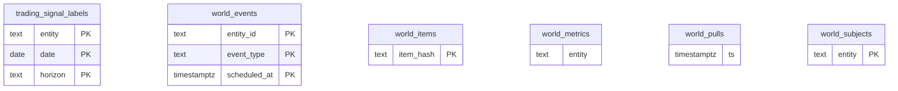

<!-- GENERATED by scripts/generate-schema-docs.js - do not edit by hand; regenerate instead. -->

# Time-series database (`oshal_ts`)

[Data model index](README.md) · TimescaleDB · schema `public` · 6 tables, 1 views

A separate TimescaleDB instance for high-volume time-series. It shares no foreign keys with the platform database.

The diagram shows key columns only: primary keys (PK), foreign keys (FK), single-column unique keys (UK) and the column an RLS policy scopes rows by ("owner"). A box with no columns is a table documented on another page. Every column is listed under Tables.

## Diagram

## Tables

### `trading_signal_labels`

Defined in `scripts/oshal-signal-label.js` · RLS **off**

| Column | Type | Null | Default | Notes |
|---|---|---|---|---|
| `entity` | text | no |  | PK |
| `sym` | text | no |  |  |
| `date` | date | no |  | PK |
| `horizon` | text | no |  | PK |
| `fwd_ret` | double precision | no |  |  |
| `base_close` | double precision | yes |  |  |
| `computed_at` | timestamp with time zone | no | now() |  |

### `world_events`

Defined in `src/features/world-data/world-intelligence-service.ts` · RLS **off**

| Column | Type | Null | Default | Notes |
|---|---|---|---|---|
| `entity_id` | text | no |  | PK |
| `event_type` | text | no |  | PK |
| `scheduled_at` | timestamp with time zone | no |  | PK |
| `title` | text | yes |  |  |
| `source` | text | yes |  |  |
| `ingested_at` | timestamp with time zone | no | now() |  |

### `world_items`

Defined in `src/features/world-data/world-intelligence-service.ts` · RLS **off**

| Column | Type | Null | Default | Notes |
|---|---|---|---|---|
| `item_hash` | text | no |  | PK |
| `entity_id` | text | no |  |  |
| `entity_label` | text | yes |  |  |
| `feed_id` | text | yes |  |  |
| `category` | text | yes |  |  |
| `query_variant` | text | yes |  |  |
| `outlet` | text | yes |  |  |
| `outlet_id` | text | yes |  |  |
| `lean` | double precision | yes |  |  |
| `reliability` | double precision | yes |  |  |
| `title` | text | yes |  |  |
| `description` | text | yes |  |  |
| `link` | text | yes |  |  |
| `pub_date` | timestamp with time zone | yes |  |  |
| `sentiment` | double precision | yes |  |  |
| `entities` | jsonb | yes |  |  |
| `classifier_model` | text | yes |  |  |
| `classifier_version` | text | yes |  |  |
| `used_llm` | boolean | yes |  |  |
| `first_seen_at` | timestamp with time zone | no | now() |  |
| `last_seen_at` | timestamp with time zone | no | now() |  |
| `seen_count` | integer | no | 1 |  |
| `event_type` | text | yes |  |  |
| `event_intensity` | double precision | yes |  |  |

### `world_metrics`

Defined in `src/features/world-data/world-intelligence-service.ts` · RLS **off** · TimescaleDB hypertable on `ts`

| Column | Type | Null | Default | Notes |
|---|---|---|---|---|
| `entity` | text | no |  |  |
| `metric` | text | no |  |  |
| `ts` | timestamp with time zone | no |  |  |
| `value` | double precision | no |  |  |
| `source` | text | yes |  |  |

### `world_pulls`

Defined in `src/features/world-data/world-intelligence-service.ts` · RLS **off** · TimescaleDB hypertable on `ts`

| Column | Type | Null | Default | Notes |
|---|---|---|---|---|
| `ts` | timestamp with time zone | no | now() |  |
| `entity_id` | text | no |  |  |
| `feed_id` | text | yes |  |  |
| `category` | text | yes |  |  |
| `fetched` | integer | yes |  |  |
| `unique_items` | integer | yes |  |  |
| `new_items` | integer | yes |  |  |
| `classified` | integer | yes |  |  |
| `used_llm` | boolean | yes |  |  |
| `variants` | jsonb | yes |  |  |

### `world_subjects`

Defined in `src/features/world-data/world-preaggregate.ts` · RLS **off**

| Column | Type | Null | Default | Notes |
|---|---|---|---|---|
| `entity` | text | no |  | PK |
| `label` | text | yes |  |  |
| `items` | bigint | no | 0 |  |
| `last_seen` | timestamp with time zone | yes |  |  |

## Views

### `world_metrics_daily`

View defined in `src/features/world-data/world-preaggregate.ts`

| Column | Type |
|---|---|
| `bucket` | timestamp with time zone |
| `entity` | text |
| `metric` | text |
| `source` | text |
| `sum_v` | double precision |
| `cnt` | bigint |
