<!-- GENERATED by scripts/generate-schema-docs.js - do not edit by hand; regenerate instead. -->

# Trading & markets

[Data model index](README.md) · database `oshal` · schema `public` · 29 tables

Trading accounts and books, orders, signals, decisions and predictions, risk guards, the strategy lab, market bars and the Kalshi forward test.

The diagram shows key columns only: primary keys (PK), foreign keys (FK), single-column unique keys (UK) and the column an RLS policy scopes rows by ("owner"). A box with no columns is a table documented on another page. Every column is listed under Tables.

## Diagram

```mermaid
erDiagram
  kalshi_forecast_log {
    bigint id PK
  }
  kalshi_orders {
    bigint id PK
    text client_order_id UK
  }
  kalshi_predictions {
    bigint id PK
  }
  market_bars {
    text symbol PK
    text timeframe PK
    timestamptz bar_ts PK
  }
  oshal_trading_accounts {
    uuid account_id PK
    text user_sub "owner"
  }
  oshal_trading_books {
    uuid book_id PK
    text user_sub FK "owner"
    uuid account_id FK
  }
  oshal_trading_daily_equity {
    text user_sub PK
    date et_day PK
    uuid book_id PK
  }
  oshal_trading_dated_orders {
    uuid dated_id PK
    text user_sub "owner"
  }
  oshal_trading_decisions {
    uuid decision_id PK
    text user_sub "owner"
  }
  oshal_trading_equity_hwm {
    text user_sub PK "owner"
    uuid book_id PK
  }
  oshal_trading_event_plans {
    uuid plan_id PK
    text user_sub "owner"
  }
  oshal_trading_event_reminders {
    uuid reminder_id PK
    text user_sub "owner"
  }
  oshal_trading_event_rules {
    uuid rule_id PK
    text user_sub "owner"
  }
  oshal_trading_gate_blocks {
    text user_sub PK "owner"
    text gate PK
    text symbol PK
    date et_day PK
    uuid book_id PK
  }
  oshal_trading_orders {
    uuid order_id PK
    text user_sub "owner"
    uuid decision_id FK
  }
  oshal_trading_param_recommendations {
    uuid rec_id PK
  }
  oshal_trading_params {
    text param PK
  }
  oshal_trading_peaks {
    text user_sub PK "owner"
    text symbol PK
    uuid book_id PK
  }
  oshal_trading_pinned_lots {
    uuid lot_id PK
    text user_sub "owner"
  }
  oshal_trading_predictions {
    uuid prediction_id PK
    text user_sub "owner"
  }
  oshal_trading_rotation_state {
    text user_sub PK "owner"
    uuid book_id PK
  }
  oshal_trading_signal_weights {
    text algo PK
  }
  oshal_trading_signals {
    uuid signal_id PK
    text user_sub "owner"
  }
  oshal_trading_strategy_journal {
    bigint id PK
  }
  trading_config_overrides {
    uuid id PK
    text user_sub "owner"
    uuid strategy_id FK
  }
  trading_strategies {
    uuid id PK
    text user_sub "owner"
  }
  trading_strategy_notes {
    uuid id PK
    uuid strategy_id FK
    text user_sub "owner"
  }
  trading_strategy_runs {
    uuid id PK
    uuid strategy_id FK
    text user_sub "owner"
  }
  trading_strategy_state {
    uuid strategy_id PK, FK
    text user_sub "owner"
  }
  oshal_trading_accounts |o--o{ oshal_trading_books : "user_sub, account_id"
  oshal_trading_decisions ||--o{ oshal_trading_orders : "decision_id"
  trading_strategies |o--o{ trading_config_overrides : "strategy_id"
  trading_strategies ||--o{ trading_strategy_notes : "strategy_id"
  trading_strategies ||--o{ trading_strategy_runs : "strategy_id"
  trading_strategies ||--o| trading_strategy_state : "strategy_id"
```

## Tables

### `kalshi_forecast_log`

Defined in `scripts/migrations/075-kalshi-forward-test.sql` · RLS **off**

| Column | Type | Null | Default | Notes |
|---|---|---|---|---|
| `id` | bigint | no | nextval('kalshi_forecast_log_id_seq') | PK |
| `series_ticker` | text | no |  |  |
| `target_date` | date | no |  |  |
| `lead_days` | integer | no |  |  |
| `enso_phase` | text | no |  |  |
| `oni` | numeric(4,2) | yes |  |  |
| `forecast_f` | numeric(5,1) | no |  |  |
| `actual_f` | numeric(5,1) | yes |  |  |
| `created_at` | timestamp with time zone | no | now() |  |

### `kalshi_orders`

Defined in `scripts/migrations/074-kalshi-orders.sql` · RLS **off**

| Column | Type | Null | Default | Notes |
|---|---|---|---|---|
| `id` | bigint | no | nextval('kalshi_orders_id_seq') | PK |
| `user_sub` | text | no |  |  |
| `env` | text | no |  |  |
| `ticker` | text | no |  |  |
| `side` | text | no |  |  |
| `action` | text | no |  |  |
| `count` | integer | no |  |  |
| `limit_price_cents` | integer | no |  |  |
| `client_order_id` | text | no |  | UK |
| `kalshi_order_id` | text | yes |  |  |
| `kalshi_status` | text | yes |  |  |
| `hand_snapshot` | jsonb | yes |  |  |
| `error` | text | yes |  |  |
| `created_at` | timestamp with time zone | no | now() |  |

### `kalshi_predictions`

Defined in `scripts/migrations/075-kalshi-forward-test.sql` · RLS **off**

| Column | Type | Null | Default | Notes |
|---|---|---|---|---|
| `id` | bigint | no | nextval('kalshi_predictions_id_seq') | PK |
| `strategy` | text | no |  |  |
| `ticker` | text | no |  |  |
| `event_ticker` | text | yes |  |  |
| `series_ticker` | text | yes |  |  |
| `predicted_prob` | numeric(6,5) | no |  |  |
| `market_prob` | numeric(6,5) | no |  |  |
| `edge_net` | numeric(6,5) | no |  |  |
| `stake_fraction` | numeric(6,5) | no | 0 |  |
| `side` | text | no |  |  |
| `rationale` | jsonb | yes |  |  |
| `paper_traded` | boolean | no | false |  |
| `kalshi_order_id` | text | yes |  |  |
| `settled` | boolean | no | false |  |
| `settled_yes` | boolean | yes |  |  |
| `brier` | numeric(8,6) | yes |  |  |
| `market_brier` | numeric(8,6) | yes |  |  |
| `pnl_per_contract` | numeric(8,4) | yes |  |  |
| `graded_at` | timestamp with time zone | yes |  |  |
| `close_time` | timestamp with time zone | yes |  |  |
| `created_at` | timestamp with time zone | no | now() |  |

### `market_bars`

Defined in `scripts/migrations/096-market-bars.sql`, `src/app/trading-bar-store.ts` · RLS **enabled** - all commands: unrestricted

| Column | Type | Null | Default | Notes |
|---|---|---|---|---|
| `symbol` | text | no |  | PK |
| `timeframe` | text | no |  | PK |
| `bar_ts` | timestamp with time zone | no |  | PK |
| `o` | double precision | no |  |  |
| `h` | double precision | no |  |  |
| `l` | double precision | no |  |  |
| `c` | double precision | no |  |  |
| `v` | double precision | no | 0 |  |
| `source` | text | no | '' |  |
| `ingested_at` | timestamp with time zone | no | now() |  |

### `oshal_trading_accounts`

Defined in `scripts/migrations/124-trading-books.sql`, `src/app/trading-accounts-store.ts` · RLS **forced** - owner `user_sub`

| Column | Type | Null | Default | Notes |
|---|---|---|---|---|
| `account_id` | uuid | no | gen_random_uuid() | PK |
| `user_sub` | text | no |  | owner |
| `broker` | text | no |  |  |
| `connection_key` | text | no | 'default' |  |
| `account_number_enc` | text | no |  |  |
| `account_digest` | text | no |  |  |
| `account_last4` | text | no |  |  |
| `account_hash` | text | yes |  |  |
| `account_type` | text | yes |  |  |
| `nickname` | text | yes |  |  |
| `discovered_at` | timestamp with time zone | no | now() |  |
| `last_seen_at` | timestamp with time zone | no | now() |  |

### `oshal_trading_books`

Defined in `scripts/migrations/124-trading-books.sql`, `src/app/trading-books-store.ts` · RLS **forced** - owner `user_sub`

| Column | Type | Null | Default | Notes |
|---|---|---|---|---|
| `book_id` | uuid | no |  | PK |
| `user_sub` | text | no |  | owner · FK → [`oshal_trading_accounts.user_sub`](trading.md#oshal_trading_accounts) |
| `ref` | text | no |  |  |
| `label` | text | no |  |  |
| `kind` | text | no |  |  |
| `broker` | text | yes |  |  |
| `account_id` | uuid | yes |  | FK → [`oshal_trading_accounts.account_id`](trading.md#oshal_trading_accounts) |
| `connection_key` | text | yes |  |  |
| `enabled` | boolean | no | true |  |
| `learn` | boolean | no | false |  |
| `capital_cap_usd` | numeric(18,2) | yes |  |  |
| `created_at` | timestamp with time zone | no | now() |  |
| `settlement_policy` | text | yes |  |  |

### `oshal_trading_daily_equity`

Defined in `src/app/trading-daily-equity-store.ts` · RLS **off**

| Column | Type | Null | Default | Notes |
|---|---|---|---|---|
| `user_sub` | text | no |  | PK |
| `mode` | text | no |  |  |
| `et_day` | date | no |  | PK |
| `equity` | numeric(18,2) | no |  |  |
| `updated_at` | timestamp with time zone | no | now() |  |
| `book_id` | uuid | no |  | PK |
| `book_ref` | text | yes |  |  |

### `oshal_trading_dated_orders`

Defined in `src/app/trading-dated-orders.ts` · RLS **forced** - owner `user_sub`

| Column | Type | Null | Default | Notes |
|---|---|---|---|---|
| `dated_id` | uuid | no | gen_random_uuid() | PK |
| `user_sub` | text | no |  | owner |
| `book_id` | uuid | no |  |  |
| `book_ref` | text | no |  |  |
| `decision_id` | uuid | no |  |  |
| `symbol` | text | no |  |  |
| `side` | text | no |  |  |
| `qty` | numeric(18,6) | no |  |  |
| `order_type` | text | no |  |  |
| `fire_at` | timestamp with time zone | no |  |  |
| `status` | text | no | 'pending' |  |
| `fired_order_id` | text | yes |  |  |
| `fired_status` | text | yes |  |  |
| `fired_at` | timestamp with time zone | yes |  |  |
| `error` | text | yes |  |  |
| `timeline` | jsonb | no | '[]' |  |
| `created_at` | timestamp with time zone | no | now() |  |
| `updated_at` | timestamp with time zone | no | now() |  |

### `oshal_trading_decisions`

Defined in `scripts/migrations/034-stock-trading.sql`, `src/app/trading-schema.ts` · RLS **forced** - owner `user_sub`

| Column | Type | Null | Default | Notes |
|---|---|---|---|---|
| `decision_id` | uuid | no | gen_random_uuid() | PK |
| `user_sub` | text | no |  | owner |
| `mode` | text | no |  |  |
| `signal_ids` | uuid[] | no |  |  |
| `agent_id` | text | yes |  |  |
| `action` | text | no |  |  |
| `symbol` | text | yes |  |  |
| `side` | text | yes |  |  |
| `qty` | numeric(18,6) | yes |  |  |
| `order_type` | text | yes |  |  |
| `limit_price` | numeric(18,4) | yes |  |  |
| `confidence` | numeric(5,4) | yes |  |  |
| `rationale` | text | no |  |  |
| `indicators` | jsonb | yes |  |  |
| `guardrails` | jsonb | yes |  |  |
| `created_at` | timestamp with time zone | no | now() |  |
| `stop_price` | numeric(18,4) | yes |  |  |
| `trail_price` | numeric(18,4) | yes |  |  |
| `trail_percent` | numeric(8,4) | yes |  |  |
| `time_in_force` | text | yes |  |  |
| `book_id` | uuid | yes |  |  |
| `extended_hours` | boolean | yes |  |  |

### `oshal_trading_equity_hwm`

Defined in `src/app/trading-equity-guard.ts` · RLS **forced** - owner `user_sub`

| Column | Type | Null | Default | Notes |
|---|---|---|---|---|
| `user_sub` | text | no |  | PK · owner |
| `mode` | text | no |  |  |
| `high_water_mark` | numeric(18,2) | no | 0 |  |
| `last_equity` | numeric(18,2) | no | 0 |  |
| `updated_at` | timestamp with time zone | no | now() |  |
| `book_id` | uuid | no |  | PK |

### `oshal_trading_event_plans`

Defined in `src/app/trading-event-plans.ts` · RLS **forced** - owner `user_sub`

| Column | Type | Null | Default | Notes |
|---|---|---|---|---|
| `plan_id` | uuid | no | gen_random_uuid() | PK |
| `user_sub` | text | no |  | owner |
| `book_id` | uuid | no |  |  |
| `book_ref` | text | no |  |  |
| `name` | text | no |  |  |
| `kind` | text | no | 'ipo' |  |
| `status` | text | no | 'draft' |  |
| `params` | jsonb | no |  |  |
| `hypothesis` | text | yes |  |  |
| `narration` | text | yes |  |  |
| `citations` | jsonb | no | '[]' |  |
| `filings` | jsonb | no | '{}' |  |
| `ipo_price` | numeric(18,4) | yes |  |  |
| `ticker` | text | yes |  |  |
| `entry` | jsonb | yes |  |  |
| `exits` | jsonb | yes |  |  |
| `result` | jsonb | yes |  |  |
| `timeline` | jsonb | no | '[]' |  |
| `created_at` | timestamp with time zone | no | now() |  |
| `updated_at` | timestamp with time zone | no | now() |  |

### `oshal_trading_event_reminders`

Defined in `src/app/trading-event-reminders.ts` · RLS **forced** - owner `user_sub`

| Column | Type | Null | Default | Notes |
|---|---|---|---|---|
| `reminder_id` | uuid | no | gen_random_uuid() | PK |
| `user_sub` | text | no |  | owner |
| `plan_id` | uuid | no |  |  |
| `key` | text | no |  |  |
| `due_at` | timestamp with time zone | no |  |  |
| `closes_at` | timestamp with time zone | no |  |  |
| `status` | text | no |  |  |
| `fired_at` | timestamp with time zone | no | now() |  |
| `detail` | text | yes |  |  |

### `oshal_trading_event_rules`

Defined in `src/app/trading-earnings-rules.ts` · RLS **forced** - owner `user_sub`

| Column | Type | Null | Default | Notes |
|---|---|---|---|---|
| `rule_id` | uuid | no | gen_random_uuid() | PK |
| `user_sub` | text | no |  | owner |
| `book_id` | uuid | no |  |  |
| `book_ref` | text | no |  |  |
| `symbol` | text | no |  |  |
| `event` | text | no | 'earnings' |  |
| `on_beat` | text | no |  |  |
| `on_miss` | text | no |  |  |
| `on_inline` | text | no |  |  |
| `sizing` | jsonb | no |  |  |
| `expected_at` | date | yes |  |  |
| `expires_at` | timestamp with time zone | no |  |  |
| `status` | text | no | 'armed' |  |
| `cik` | text | yes |  |  |
| `filing` | jsonb | yes |  |  |
| `classification` | jsonb | yes |  |  |
| `reaction` | jsonb | yes |  |  |
| `decision_id` | uuid | yes |  |  |
| `order` | jsonb | yes |  |  |
| `timeline` | jsonb | no | '[]' |  |
| `created_at` | timestamp with time zone | no | now() |  |
| `updated_at` | timestamp with time zone | no | now() |  |

### `oshal_trading_gate_blocks`

Defined in `src/app/trading-gate-block-store.ts` · RLS **forced** - owner `user_sub`

| Column | Type | Null | Default | Notes |
|---|---|---|---|---|
| `user_sub` | text | no |  | PK · owner |
| `mode` | text | no |  |  |
| `gate` | text | no |  | PK |
| `symbol` | text | no |  | PK |
| `et_day` | date | no |  | PK |
| `ref_price` | numeric(18,4) | yes |  |  |
| `first_blocked_at` | timestamp with time zone | no | now() |  |
| `book_id` | uuid | no |  | PK |

### `oshal_trading_orders`

Defined in `scripts/migrations/034-stock-trading.sql`, `src/app/trading-schema.ts` · RLS **forced** - owner `user_sub`

| Column | Type | Null | Default | Notes |
|---|---|---|---|---|
| `order_id` | uuid | no | gen_random_uuid() | PK |
| `user_sub` | text | no |  | owner |
| `mode` | text | no |  |  |
| `decision_id` | uuid | no |  | FK → [`oshal_trading_decisions.decision_id`](trading.md#oshal_trading_decisions) |
| `broker` | text | no |  |  |
| `broker_order_id` | text | yes |  |  |
| `client_order_id` | text | no |  |  |
| `symbol` | text | no |  |  |
| `side` | text | no |  |  |
| `qty` | numeric(18,6) | no |  |  |
| `order_type` | text | no |  |  |
| `limit_price` | numeric(18,4) | yes |  |  |
| `status` | text | no |  |  |
| `raw_status` | text | yes |  |  |
| `filled_qty` | numeric(18,6) | no | 0 |  |
| `filled_avg_price` | numeric(18,4) | yes |  |  |
| `realized_pnl` | numeric(18,4) | yes |  |  |
| `reject_reason` | text | yes |  |  |
| `submitted_at` | timestamp with time zone | yes |  |  |
| `created_at` | timestamp with time zone | no | now() |  |
| `updated_at` | timestamp with time zone | no | now() |  |
| `stop_price` | numeric(18,4) | yes |  |  |
| `trail_price` | numeric(18,4) | yes |  |  |
| `trail_percent` | numeric(8,4) | yes |  |  |
| `time_in_force` | text | yes |  |  |
| `cost_basis` | numeric(18,4) | yes |  |  |
| `book_id` | uuid | yes |  |  |

### `oshal_trading_param_recommendations`

Defined in `src/app/trading-optimize-dispatch.ts` · RLS **off**

| Column | Type | Null | Default | Notes |
|---|---|---|---|---|
| `rec_id` | uuid | no | gen_random_uuid() | PK |
| `mode` | text | no | 'paper' |  |
| `param` | text | no |  |  |
| `current_value` | numeric | no |  |  |
| `proposed_value` | numeric | no |  |  |
| `baseline_expectancy` | numeric | yes |  |  |
| `proposed_expectancy` | numeric | yes |  |  |
| `baseline_winrate` | numeric | yes |  |  |
| `proposed_winrate` | numeric | yes |  |  |
| `baseline_signals` | integer | yes |  |  |
| `proposed_signals` | integer | yes |  |  |
| `status` | text | no | 'pending' |  |
| `created_at` | timestamp with time zone | no | now() |  |
| `resolved_at` | timestamp with time zone | yes |  |  |

### `oshal_trading_params`

Defined in `src/app/trading-strategy-params.ts` · RLS **off**

| Column | Type | Null | Default | Notes |
|---|---|---|---|---|
| `param` | text | no |  | PK |
| `value` | numeric | no |  |  |
| `updated_at` | timestamp with time zone | no | now() |  |

### `oshal_trading_peaks`

Defined in `src/app/trading-peaks-store.ts` · RLS **forced** - owner `user_sub`

| Column | Type | Null | Default | Notes |
|---|---|---|---|---|
| `user_sub` | text | no |  | PK · owner |
| `mode` | text | no |  |  |
| `symbol` | text | no |  | PK |
| `peak_price` | numeric | no |  |  |
| `updated_at` | timestamp with time zone | no | now() |  |
| `book_id` | uuid | no |  | PK |

### `oshal_trading_pinned_lots`

Defined in `src/app/trading-pinned-lots.ts` · RLS **forced** - owner `user_sub`

| Column | Type | Null | Default | Notes |
|---|---|---|---|---|
| `lot_id` | uuid | no | gen_random_uuid() | PK |
| `user_sub` | text | no |  | owner |
| `book_id` | uuid | no |  |  |
| `book_ref` | text | no |  |  |
| `symbol` | text | no |  |  |
| `qty` | numeric(18,6) | no |  |  |
| `filled_qty` | numeric(18,6) | yes |  |  |
| `filled_avg_price` | numeric(18,4) | yes |  |  |
| `status` | text | no | 'pending_fill' |  |
| `rules` | jsonb | no | '{}' |  |
| `entry` | jsonb | yes |  |  |
| `exits` | jsonb | yes |  |  |
| `result` | jsonb | yes |  |  |
| `timeline` | jsonb | no | '[]' |  |
| `created_at` | timestamp with time zone | no | now() |  |
| `updated_at` | timestamp with time zone | no | now() |  |

### `oshal_trading_predictions`

Defined in `scripts/migrations/036-trading-predictions.sql`, `src/app/trading-schema.ts` · RLS **forced** - owner `user_sub`

| Column | Type | Null | Default | Notes |
|---|---|---|---|---|
| `prediction_id` | uuid | no | gen_random_uuid() | PK |
| `user_sub` | text | yes |  | owner |
| `mode` | text | no | 'paper' |  |
| `symbol` | text | no |  |  |
| `algo` | text | no |  |  |
| `pred_dir` | text | no |  |  |
| `confidence` | numeric(5,4) | yes |  |  |
| `price` | numeric(18,4) | no |  |  |
| `basis` | text | yes |  |  |
| `horizon_hrs` | integer | no | 24 |  |
| `resolved` | boolean | no | false |  |
| `actual_dir` | text | yes |  |  |
| `actual_price` | numeric(18,4) | yes |  |  |
| `hit` | boolean | yes |  |  |
| `created_at` | timestamp with time zone | no | now() |  |
| `resolved_at` | timestamp with time zone | yes |  |  |
| `book_id` | uuid | yes |  |  |

### `oshal_trading_rotation_state`

Defined in `src/app/trading-rotation-store.ts` · RLS **forced** - owner `user_sub`

| Column | Type | Null | Default | Notes |
|---|---|---|---|---|
| `user_sub` | text | no |  | PK · owner |
| `mode` | text | no |  |  |
| `last_rotated_at` | timestamp with time zone | no | now() |  |
| `book_id` | uuid | no |  | PK |

### `oshal_trading_signal_weights`

Defined in `src/app/trading-signal-weights.ts` · RLS **off**

| Column | Type | Null | Default | Notes |
|---|---|---|---|---|
| `algo` | text | no |  | PK |
| `mass` | numeric(6,3) | no | 1 |  |
| `proximity` | numeric(6,3) | no | 1 |  |
| `hit_rate` | numeric(6,4) | no | 0 |  |
| `samples` | integer | no | 0 |  |
| `updated_at` | timestamp with time zone | no | now() |  |
| `expectancy` | numeric(8,4) | no | 0 |  |

### `oshal_trading_signals`

Defined in `scripts/migrations/034-stock-trading.sql`, `src/app/trading-schema.ts` · RLS **forced** - owner `user_sub`

| Column | Type | Null | Default | Notes |
|---|---|---|---|---|
| `signal_id` | uuid | no | gen_random_uuid() | PK |
| `user_sub` | text | no |  | owner |
| `mode` | text | no |  |  |
| `source` | text | no |  |  |
| `external_id` | text | yes |  |  |
| `author` | text | yes |  |  |
| `url` | text | yes |  |  |
| `title` | text | yes |  |  |
| `body` | text | yes |  |  |
| `symbols` | text[] | yes |  |  |
| `indicators` | jsonb | yes |  |  |
| `content_hash` | text | no |  |  |
| `observed_at` | timestamp with time zone | no | now() |  |
| `book_id` | uuid | yes |  |  |

### `oshal_trading_strategy_journal`

Defined in `scripts/oshal-strategy-journal.js`, `src/app/trading-strategy-journal.ts` · RLS **off**

| Column | Type | Null | Default | Notes |
|---|---|---|---|---|
| `id` | bigint | no | nextval('oshal_trading_strategy_journal_id_seq') | PK |
| `user_sub` | text | no |  |  |
| `et_day` | date | no |  |  |
| `kind` | text | no |  |  |
| `summary` | text | no |  |  |
| `detail` | jsonb | yes |  |  |
| `source` | text | no |  |  |
| `created_at` | timestamp with time zone | no | now() |  |
| `book_ref` | text | yes |  |  |

### `trading_config_overrides`

Defined in `scripts/migrations/073-trading-lab-notes-overrides.sql`, `src/app/trading-config-overrides.ts` · RLS **forced** - owner `user_sub`

| Column | Type | Null | Default | Notes |
|---|---|---|---|---|
| `id` | uuid | no | gen_random_uuid() | PK |
| `user_sub` | text | no |  | owner |
| `strategy_id` | uuid | yes |  | FK → [`trading_strategies.id`](trading.md#trading_strategies) |
| `strategy_name` | text | no |  |  |
| `config` | jsonb | no |  |  |
| `apply_pct` | integer | no | 100 |  |
| `active` | boolean | no | true |  |
| `note` | text | no | '' |  |
| `created_at` | timestamp with time zone | no | now() |  |
| `deactivated_at` | timestamp with time zone | yes |  |  |
| `book_id` | uuid | yes |  |  |

### `trading_strategies`

Defined in `scripts/migrations/072-trading-strategy-lab.sql`, `src/app/trading-strategy-lab-store.ts` · RLS **forced** - owner `user_sub`

| Column | Type | Null | Default | Notes |
|---|---|---|---|---|
| `id` | uuid | no | gen_random_uuid() | PK |
| `user_sub` | text | no |  | owner |
| `name` | text | no |  |  |
| `description` | text | no | '' |  |
| `config` | jsonb | no |  |  |
| `status` | text | no | 'candidate' |  |
| `baseline_run_id` | uuid | yes |  |  |
| `created_at` | timestamp with time zone | no | now() |  |
| `updated_at` | timestamp with time zone | no | now() |  |

### `trading_strategy_notes`

Defined in `scripts/migrations/073-trading-lab-notes-overrides.sql`, `src/app/trading-strategy-lab-store.ts` · RLS **forced** - owner `user_sub`

| Column | Type | Null | Default | Notes |
|---|---|---|---|---|
| `id` | uuid | no | gen_random_uuid() | PK |
| `strategy_id` | uuid | no |  | FK → [`trading_strategies.id`](trading.md#trading_strategies) |
| `user_sub` | text | no |  | owner |
| `kind` | text | no | 'note' |  |
| `body` | text | no |  |  |
| `created_at` | timestamp with time zone | no | now() |  |

### `trading_strategy_runs`

Defined in `scripts/migrations/072-trading-strategy-lab.sql`, `src/app/trading-strategy-lab-store.ts` · RLS **forced** - owner `user_sub`

| Column | Type | Null | Default | Notes |
|---|---|---|---|---|
| `id` | uuid | no | gen_random_uuid() | PK |
| `strategy_id` | uuid | no |  | FK → [`trading_strategies.id`](trading.md#trading_strategies) |
| `user_sub` | text | no |  | owner |
| `kind` | text | no |  |  |
| `status` | text | no | 'ok' |  |
| `feed` | text | no | 'sip' |  |
| `git_sha` | text | no | '' |  |
| `window_start` | date | yes |  |  |
| `window_end` | date | yes |  |  |
| `bars` | integer | no | 0 |  |
| `config_snapshot` | jsonb | no |  |  |
| `metrics` | jsonb | no | '{}' |  |
| `equity_curve` | jsonb | no | '[]' |  |
| `error` | text | yes |  |  |
| `created_at` | timestamp with time zone | no | now() |  |

### `trading_strategy_state`

Defined in `scripts/migrations/072-trading-strategy-lab.sql`, `src/app/trading-strategy-lab-store.ts` · RLS **forced** - owner `user_sub`

| Column | Type | Null | Default | Notes |
|---|---|---|---|---|
| `strategy_id` | uuid | no |  | PK · FK → [`trading_strategies.id`](trading.md#trading_strategies) |
| `user_sub` | text | no |  | owner |
| `as_of` | date | no |  |  |
| `state` | jsonb | no |  |  |
| `equity_points` | jsonb | no | '[]' |  |
| `updated_at` | timestamp with time zone | no | now() |  |
