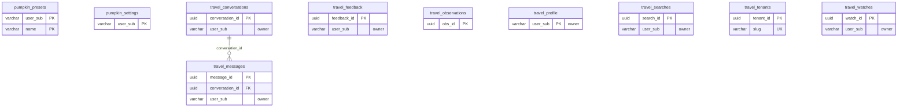

<!-- GENERATED by scripts/generate-schema-docs.js - do not edit by hand; regenerate instead. -->

# Travel & pumpkin prop

[Data model index](README.md) · database `oshal` · schema `public` · 10 tables

Tables for the travel experience (migration 050) and the pumpkin prop (migration 084) that core migrations create.

The diagram shows key columns only: primary keys (PK), foreign keys (FK), single-column unique keys (UK) and the column an RLS policy scopes rows by ("owner"). A box with no columns is a table documented on another page. Every column is listed under Tables.

## Diagram

## Tables

### `pumpkin_presets`

Defined in `scripts/migrations/084-pumpkin-platform.sql` · RLS **off**

| Column | Type | Null | Default | Notes |
|---|---|---|---|---|
| `user_sub` | character varying(255) | no |  | PK |
| `name` | character varying(64) | no |  | PK |
| `config` | jsonb | no |  |  |
| `created_at` | timestamp with time zone | no | now() |  |
| `updated_at` | timestamp with time zone | no | now() |  |

### `pumpkin_settings`

Defined in `scripts/migrations/084-pumpkin-platform.sql` · RLS **off**

| Column | Type | Null | Default | Notes |
|---|---|---|---|---|
| `user_sub` | character varying(255) | no |  | PK |
| `active_preset` | character varying(64) | no | 'inflatable' |  |
| `mode` | character varying(16) | no | 'mimic' |  |
| `updated_at` | timestamp with time zone | no | now() |  |
| `room_label` | character varying(40) | no | 'Main' |  |

### `travel_conversations`

Defined in `scripts/migrations/050-travel-platform.sql`, `src/app/routes/travel-farewatch.ts` · RLS **forced** - owner `user_sub`

| Column | Type | Null | Default | Notes |
|---|---|---|---|---|
| `conversation_id` | uuid | no | gen_random_uuid() | PK |
| `user_sub` | character varying(255) | no |  | owner |
| `title` | text | yes |  |  |
| `created_at` | timestamp with time zone | no | now() |  |
| `updated_at` | timestamp with time zone | no | now() |  |

### `travel_feedback`

Defined in `scripts/migrations/050-travel-platform.sql`, `src/app/routes/travel-farewatch.ts` · RLS **forced** - owner `user_sub`

| Column | Type | Null | Default | Notes |
|---|---|---|---|---|
| `feedback_id` | uuid | no | gen_random_uuid() | PK |
| `user_sub` | character varying(255) | no |  | owner |
| `note` | text | no |  |  |
| `created_at` | timestamp with time zone | no | now() |  |

### `travel_messages`

Defined in `scripts/migrations/050-travel-platform.sql`, `src/app/routes/travel-farewatch.ts` · RLS **forced** - owner `user_sub`

| Column | Type | Null | Default | Notes |
|---|---|---|---|---|
| `message_id` | uuid | no | gen_random_uuid() | PK |
| `conversation_id` | uuid | no |  | FK → [`travel_conversations.conversation_id`](travel-and-props.md#travel_conversations) |
| `user_sub` | character varying(255) | no |  | owner |
| `role` | character varying(16) | no |  |  |
| `content` | text | no |  |  |
| `created_at` | timestamp with time zone | no | now() |  |

### `travel_observations`

Defined in `scripts/migrations/050-travel-platform.sql`, `src/app/routes/travel-farewatch.ts` · RLS **off**

| Column | Type | Null | Default | Notes |
|---|---|---|---|---|
| `obs_id` | uuid | no | gen_random_uuid() | PK |
| `kind` | character varying(8) | no | 'flight' |  |
| `route_key` | character varying(160) | no |  |  |
| `origin` | character varying(8) | yes |  |  |
| `destination` | character varying(64) | yes |  |  |
| `depart_date` | date | yes |  |  |
| `return_date` | date | yes |  |  |
| `cabin` | character varying(16) | yes |  |  |
| `carrier` | character varying(64) | yes |  |  |
| `price` | numeric(10,2) | no |  |  |
| `currency` | character varying(8) | no | 'USD' |  |
| `source` | character varying(16) | no | 'duffel' |  |
| `observed_at` | timestamp with time zone | no | now() |  |

### `travel_profile`

Defined in `scripts/migrations/050-travel-platform.sql`, `src/app/routes/travel-farewatch.ts` · RLS **forced** - owner `user_sub`

| Column | Type | Null | Default | Notes |
|---|---|---|---|---|
| `user_sub` | character varying(255) | no |  | PK · owner |
| `tenant_id` | uuid | no | '00000000-0000-4000-8000-00000000c002' |  |
| `display_name` | text | yes |  |  |
| `home_airport` | character varying(8) | yes |  |  |
| `preferred_airlines` | text[] | no | '{}' |  |
| `preferred_cabin` | character varying(16) | no | 'economy' |  |
| `seat_pref` | character varying(16) | yes |  |  |
| `hotel_brands` | text[] | no | '{}' |  |
| `avoid` | text[] | no | '{}' |  |
| `budget_band` | character varying(16) | yes |  |  |
| `loyalty` | jsonb | no | '{}' |  |
| `notes` | text | yes |  |  |
| `onboarded` | boolean | no | false |  |
| `created_at` | timestamp with time zone | no | now() |  |
| `updated_at` | timestamp with time zone | no | now() |  |

### `travel_searches`

Defined in `scripts/migrations/050-travel-platform.sql`, `src/app/routes/travel-farewatch.ts` · RLS **forced** - owner `user_sub`

| Column | Type | Null | Default | Notes |
|---|---|---|---|---|
| `search_id` | uuid | no | gen_random_uuid() | PK |
| `user_sub` | character varying(255) | no |  | owner |
| `kind` | character varying(8) | no | 'flight' |  |
| `route_key` | character varying(160) | no |  |  |
| `query` | jsonb | no | '{}' |  |
| `best_price` | numeric(10,2) | yes |  |  |
| `currency` | character varying(8) | yes | 'USD' |  |
| `created_at` | timestamp with time zone | no | now() |  |

### `travel_tenants`

Defined in `scripts/migrations/050-travel-platform.sql` · RLS **forced** - custom policy `travel_tenants_tenant_member`

| Column | Type | Null | Default | Notes |
|---|---|---|---|---|
| `tenant_id` | uuid | no | gen_random_uuid() | PK |
| `slug` | character varying(64) | no |  | UK |
| `name` | text | no |  |  |
| `created_at` | timestamp with time zone | no | now() |  |

### `travel_watches`

Defined in `scripts/migrations/050-travel-platform.sql`, `src/app/routes/travel-farewatch.ts` · RLS **forced** - owner `user_sub`

| Column | Type | Null | Default | Notes |
|---|---|---|---|---|
| `watch_id` | uuid | no | gen_random_uuid() | PK |
| `user_sub` | character varying(255) | no |  | owner |
| `kind` | character varying(8) | no | 'flight' |  |
| `route_key` | character varying(160) | no |  |  |
| `query` | jsonb | no | '{}' |  |
| `target_price` | numeric(10,2) | yes |  |  |
| `last_price` | numeric(10,2) | yes |  |  |
| `currency` | character varying(8) | yes | 'USD' |  |
| `status` | character varying(16) | no | 'active' |  |
| `last_checked_at` | timestamp with time zone | yes |  |  |
| `created_at` | timestamp with time zone | no | now() |  |
| `updated_at` | timestamp with time zone | no | now() |  |
