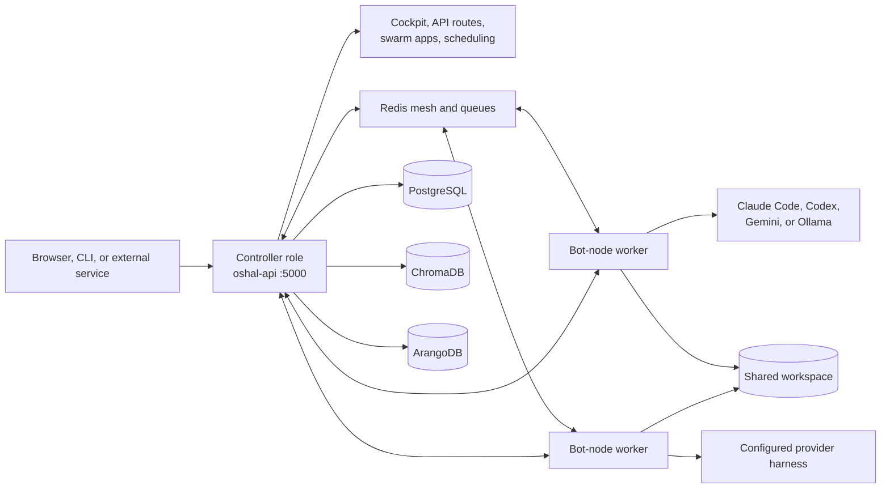
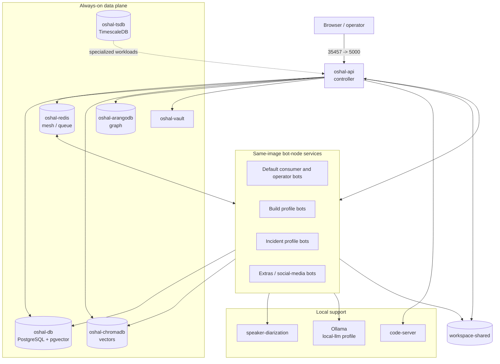
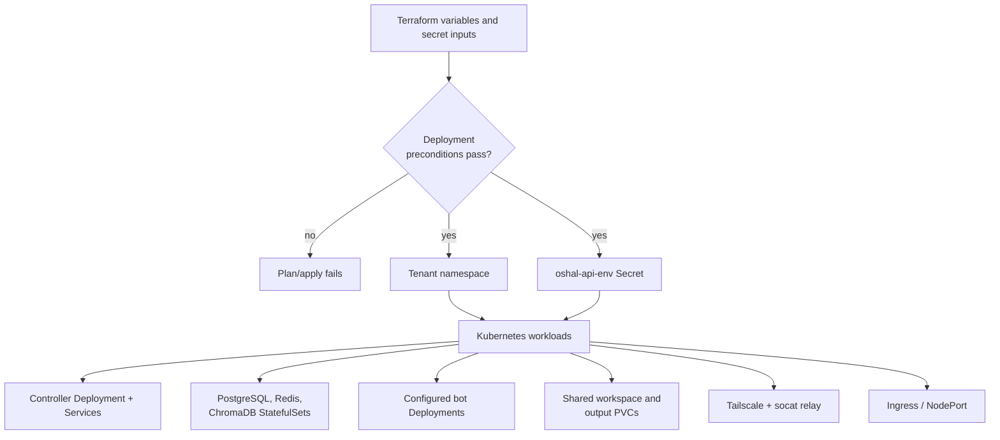
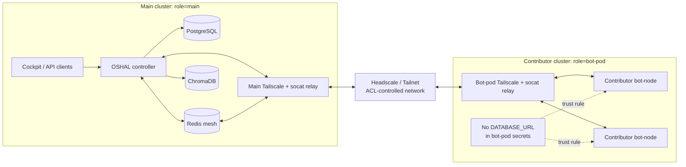
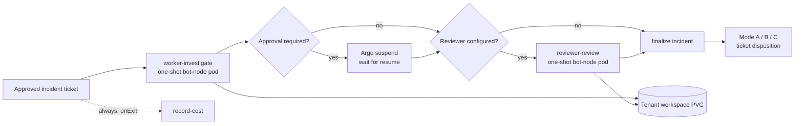
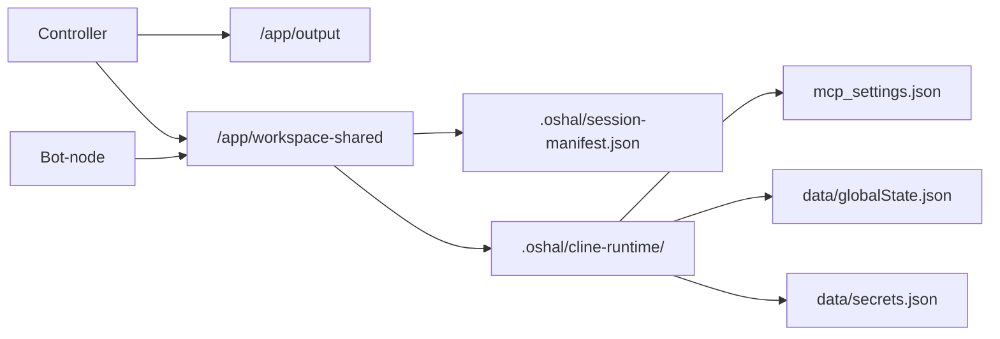

<!--
CHANGE LOG
-----------------------------------------------------------------------------
SEQ                 | AUTHOR                      | DESCRIPTION
-----------------------------------------------------------------------------
1 | maintainer@emeraldcoastsystemsgroup.com   | Added deployment/runtime topology doc for compose and Kubernetes aligned to any-bot deployment language
2 | maintainer@emeraldcoastsystemsgroup.com   | Reconciled the document with the canonical release image, current local Compose topology, Helm/Terraform deployment path, federated runtime, and Argo incident workflow
-->

# Deployment Runtime Topology

## Purpose and source-of-truth order

This document describes the deployer-facing topology that is implemented in the
repository. When deployment files disagree, use this order:

1. `Dockerfile.oshal` is the canonical production and hosted-cockpit image.
2. `docker-compose.oshal-local.yml` is the full current local topology. The
   registry-install `compose.dist.yml` is generated from it during the image
   build.
3. Terraform in `deploy/terraform/` provisions a Kubernetes tenant namespace
   and secrets for cluster deployments.
4. The root `Dockerfile`, root `docker-compose.yml`,
   `docker-compose.core.yml`, `docker-compose.swarm-local.yml`,
   `ops/deployment/docker-compose.platform.yml`, and monolithic manifests under
   `ops/deployment/kubernetes/` and `ops/any-bot-k8s/` are legacy, development,
   or manual alternatives. They are useful for their stated scenarios but do
   not define the public release topology.

Names such as `ghcr.io/OWNER/any-bot` in Helm example values and
`any-bot:latest` in the Argo template are operator-supplied placeholders. They
do not supersede the canonical local image name, `oshal-bot`.

## Canonical image and runtime roles

`Dockerfile.oshal` builds one Node 20 Alpine image containing the compiled
controller, the TypeScript bot-node worker, cockpit assets, personas, swarm app
manifests, selected runtime scripts, and the supported harness CLIs. Its runtime
defaults are port `5000`, callback port `1455`, `SWARM_MODE=container`, and
`node dist/app/server.js`.

The image is deployed in two long-running roles:

- The `oshal-api` service runs the controller and cockpit. It accepts user and
  service requests, owns orchestration, and exposes health and API routes.
- Bot services set `BOT_RUNTIME=bot-node`. `scripts/bot-entrypoint.sh` then
  executes `dist/app/bot-node-server.js`; the worker owns provider execution.

The same image does not mean the two roles have the same authority. In
particular, a federated bot-pod must not receive `DATABASE_URL`; it reaches
controller services through the authenticated service and relay boundary.

The JavaScript server at `any-bot/server/app.js` remains in the image for
compatibility surfaces. It is not the canonical trusted provider-execution
path; its own runtime rejects trusted provider intents in favor of the
TypeScript bot-node.

## Current local Docker Compose topology

`docker-compose.oshal-local.yml` declares 47 services. Twenty-eight have no
profile and are eligible in the default start. The other services are grouped
under `build`, `incident`, `extras`, `social-media`, `tunnel`, and
`local-llm` profiles, with some services belonging to more than one profile.

The core data and support services are:

- `oshal-db`: PostgreSQL 16 with pgvector, the durable operational store.
- `oshal-tsdb`: TimescaleDB for time-series workloads.
- `oshal-redis`: mesh transport, queues, and coordination.
- `oshal-chromadb`: vector/RAG storage.
- `oshal-arangodb`: graph storage.
- `oshal-vault`: local secret-management service.
- `code-server`: browser-accessible development workspace.
- `speaker-diarization`: locally built speech service.
- `oshal-ollama` and its pull job: optional `local-llm` profile.

The controller is published at host port `${OSHAL_API_PORT:-35457}` to
container port `5000`; the Codex callback is bound to loopback port `1455`.
Database and support ports are also loopback-bound by default. All services use
the `oshal` network.

Compose defaults are developer conveniences, not a public security posture:
mock OIDC is enabled and committed development secrets are used unless
overridden. A public deployment must use real OIDC, unique session/JWT/service
secrets, and externally managed credentials.

The Presentron HTTP sidecar shown in older Compose files is not part of the
current application request path. The `/api/presentations` proxy was retired;
presentation rendering is in-repository. A separately configured Presentron
MCP integration may still be used, but it must not be documented as a required
platform service.

## Kubernetes provisioning: Terraform-gated tenant setup

In a Kubernetes deployment, the `main` role runs the controller, PostgreSQL,
Redis, ChromaDB, shared workspace, bot deployments, and relay. A `bot-pod`
role creates contributor workers and their relay without granting database
credentials.

Terraform in `deploy/terraform/` creates the tenant namespace and optional
`oshal-api-env` Secret. Its deployment preconditions prevent:

- public `mock_oidc=false` deployments without complete OIDC and session
  configuration;
- public deployments without a non-development JWT secret;
- disabling in-cluster PostgreSQL without supplying an external database URL.

The static `ops/deployment/kubernetes/oshal-stack.yaml` instead deploys a
legacy `oshal-api-server:latest` topology on port `3456` with Keycloak and
in-cluster dependencies. `ops/any-bot-k8s/any-bot-stack.yaml` is another
manual compatibility topology with API, UI, gateway/Tailscale, and network
policies. Neither defines the public release topology unless an operator
has deliberately selected that alternative.

## Federated main and bot-pod clusters

The federated topology supports a main controller cluster and contributor
bot-pod clusters.
Each cluster runs a Tailscale client plus static `socat` forwards. The main
relay exposes the controller and Redis mesh to authorized contributors; the
contributor relay exposes explicitly configured bot ports back to the main
controller. Headscale/Tailnet ACLs, service credentials, and per-cluster
secrets form the trust boundary.

`infra/headscale/` contains standalone Docker Compose and Kubernetes resources
for operators who host the coordination server themselves. It is supporting
infrastructure, not an additional OSHAL controller.

## Argo incident RCA batch workflow

`ops/deployment/argo/incident-rca-workflowtemplate.yaml` maps the implemented
incident-RCA phase shape to an Argo DAG in a tenant namespace. A one-shot
`bot-node-batch.sh` pod investigates, an optional suspend node gates approval,
an optional reviewer pod reviews, and a finalizer records the Mode A/B/C
disposition. The workflow's `onExit` handler records cost even when the main
DAG fails, and TTL/pod GC removes completed execution pods. Deliverables live
on a workspace PVC so they outlive those pods.

The batch entrypoint and WorkflowTemplate are present. The conversion of
`QueueManagerService` into a thin Argo Workflow submitter is still identified
in the template as target-state. Do not claim automatic end-to-end Argo
submission until that controller integration is implemented and verified.

## Runtime artifacts and persistence

The container filesystem is ephemeral unless a Compose volume/PVC or bind mount
backs the path. In particular, worker handoffs and Argo batch outputs must be
written beneath the shared workspace, not only inside a worker container.

## Deploy-ready validation checklist

### Controller and access

- `/health` and `/api/health` return healthy responses.
- The cockpit loads through the selected host or Ingress.
- Login works with the configured OIDC mode; public deployments do not use
  mock OIDC or development secrets.

### Persistence and coordination

- PostgreSQL is reachable and task/agent history survives a restart.
- Redis is reachable and bot registration/mesh traffic is visible.
- ChromaDB upload/search paths work when RAG is enabled.
- ArangoDB is reachable for graph-backed features that are enabled.
- Shared-workspace artifacts survive a worker restart.

### Runtime execution

- The controller and workers use the intended immutable image tag.
- Bot containers report the `bot-node` runtime rather than the controller role.
- A task reaches the intended worker and returns real provider output.
- Provider credentials are supplied by secrets, not image layers or committed
  development defaults.
- Optional profiles and external integrations are enabled only when their
  dependencies and credentials are configured.

### Hosted and federated deployments

- Terraform security preconditions pass with real tenant values.
- Exactly one cockpit exposure path is enabled.
- Tailnet ACLs allow only the required relay ports and identities.
- Contributor bot-pods do not contain `DATABASE_URL`.
- If Argo is enabled, the tenant namespace, service account, database secret,
  workspace access mode, `onExit` ledger, and Workflow submission integration
  are verified independently.
