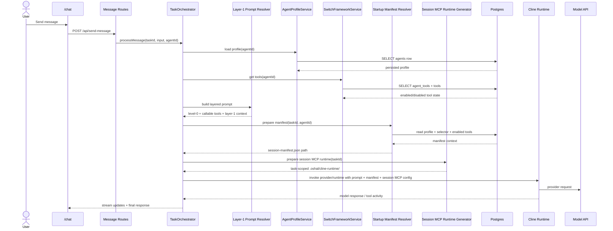
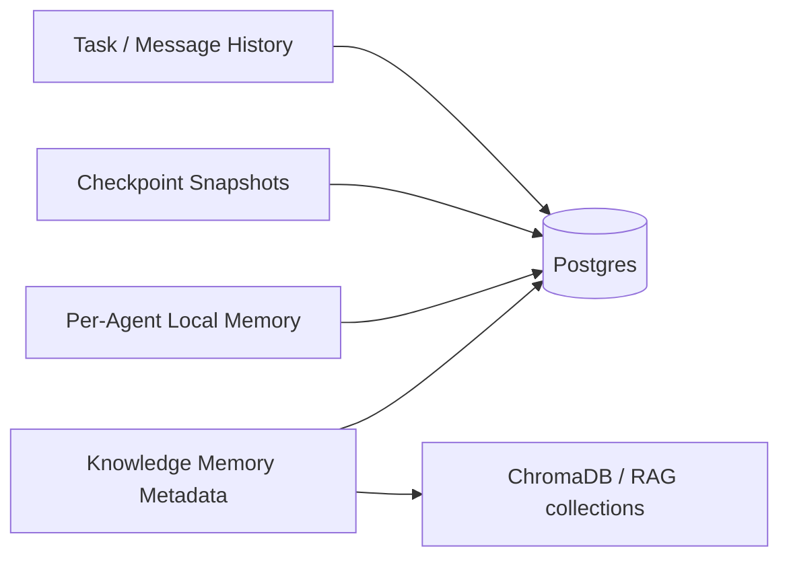
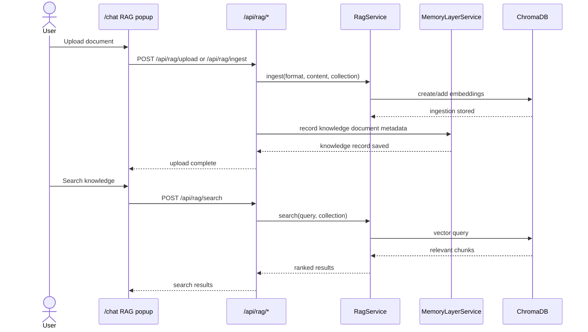
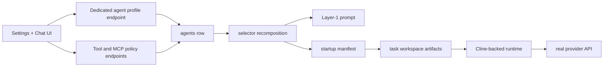

<!--
CHANGE LOG
-----------------------------------------------------------------------------
SEQ                 | AUTHOR                      | DESCRIPTION
-----------------------------------------------------------------------------
1 | maintainer@emeraldcoastsystemsgroup.com   | Added end-to-end OSHAL runtime architecture documentation aligned to any-bot control-plane and feature-flow patterns
-->

# End-To-End Runtime Architecture

## Purpose

This document explains the full OSHAL runtime as it exists today, using the same control-plane and feature-flow language used in the old any-bot architecture.

The key framing remains:
- OSHAL is the control plane
- the runtime adapter executes inside that shell
- provider, tool, MCP, memory, RAG, and profile state are framework-owned capabilities
- the UI configures and observes that state

## Executive Model

```mermaid
flowchart TB
    subgraph USER["User Surface"]
        CHAT["/chat"]
        COCKPIT["/cockpit"]
        APIUI["/ui provider config"]
    end

    subgraph API["OSHAL Control Plane API"]
        AUTH["OIDC / MOCK_OIDC"]
        MSG["/api send-message + tasks + stream"]
        CFG["/api/config + /api/providers"]
        AGENT["/api/agents/:agentId/profile"]
        TOOLS["/api/agents/:agentId/tools/*"]
        RAGAPI["/api/rag/*"]
        PRESENTRON["/api/presentations/*"]
        MEMORYAPI["/api/checkpoints + /api/memory"]
    end

    subgraph FEATURES["Feature Services"]
        ORCH["TaskOrchestrator"]
        PROVIDER["Provider Resolver"]
        PROMPT["Layer-1 Prompt Resolver"]
        MANIFEST["Startup Manifest Resolver"]
        MCPSESSION["Session MCP Runtime Generator"]
        PROFILE["AgentProfileService"]
        SWITCH["SwitchFrameworkService"]
        SELECTOR["SelectorCompositionService"]
        MEM["MemoryLayerService"]
        RAGSVC["RagService"]
    end

    subgraph DATA["Persistence + Runtime Artifacts"]
        PG[("Postgres")]
        REDIS[("Redis")]
        WORKSPACE["workspace/<taskId>/"]
        MANIFESTFILE["session-manifest.json"]
        CLINERUNTIME[".oshal/cline-runtime/"]
        GLOBALCFG["output/global-config.json + secrets"]
    end

    subgraph EXTERNAL["External Systems"]
        CLINE["Cline / Claude Code runtime"]
        LLM["LLM provider APIs"]
        MCP["MCP servers"]
        CHROMA["ChromaDB"]
        PRESENTER["Presentron"]
    end

    CHAT --> AUTH
    COCKPIT --> AUTH
    APIUI --> AUTH

    CHAT --> MSG
    CHAT --> AGENT
    CHAT --> TOOLS
    CHAT --> RAGAPI
    CHAT --> PRESENTRON
    APIUI --> CFG

    MSG --> ORCH
    CFG --> PROVIDER
    AGENT --> PROFILE
    TOOLS --> SWITCH
    TOOLS --> SELECTOR
    RAGAPI --> RAGSVC
    MEMORYAPI --> MEM

    PROFILE --> PG
    SWITCH --> PG
    SELECTOR --> PG
    MEM --> PG
    ORCH --> PG
    ORCH --> REDIS

    ORCH --> PROMPT
    ORCH --> MANIFEST
    ORCH --> MCPSESSION
    PROVIDER --> GLOBALCFG
    PROMPT --> PROFILE
    PROMPT --> SWITCH
    PROMPT --> GLOBALCFG
    MANIFEST --> PROFILE
    MANIFEST --> SWITCH
    MCPSESSION --> GLOBALCFG

    MANIFEST --> MANIFESTFILE
    MCPSESSION --> CLINERUNTIME
    MANIFESTFILE --> WORKSPACE
    CLINERUNTIME --> WORKSPACE

    ORCH --> CLINE
    CLINE --> LLM
    CLINE --> MCP
    RAGSVC --> CHROMA
    PRESENTRON --> PRESENTER
```

## Runtime Feature Flow

## Subsystems

## 1. Provider And Runtime Substrate

This is the Layer 0 path.

Responsibilities:
- provider catalog and model selection
- auth and provider-specific secrets
- runtime provider resolution
- syncing persisted provider/model into runtime-compatible Cline config
- token/cost tracking

### Runtime contract
- provider and model are selected from persisted config
- the active request receives:
  - resolved provider/model/mode
  - a task-scoped startup manifest
  - a task-scoped session MCP settings directory

## 2. Agent Profile And Personalization

This is the new dedicated profile path.

Responsibilities:
- bot display name
- avatar reference
- project URL
- selector skills text
- theme preference

### Persistence boundary
- scoped by `agentId`
- stored directly on the `agents` row
- no longer merged through broad `/api/config`

### Runtime impact
- prompt assembly reads the persisted profile
- startup manifest reads the persisted profile
- selector base fields are updated and recomputed after save

## 3. Tools And Selector Composition

This is the Layer 1 capability-control path.

Responsibilities:
- tool registry metadata
- enabled/off/ask/auto state per agent
- per-tool runtime config
- derived skills and routing tags
- selector recomposition

### Flow
1. tool state is read from `agent_tools`
2. enabled tools contribute skills and routing tags
3. selector-composition updates computed fields on the `agents` row
4. prompt and manifest consume the recomposed result

## 4. MCP Runtime

This is the governed MCP exposure path.

Responsibilities:
- merge persisted MCP settings with managed baseline servers
- materialize a task-scoped `mcp_settings.json`
- pass that runtime to the Cline-backed session

### Current managed baseline
- `filesystem`
- `fetch`
- `playwright`
- optional `context7`
- `chroma-mcp`
- `google-search-mcp`
- `presentron-mcp`
- optional `plane-mcp`

## 5. Memory Layers

The current non-swarm memory set includes four active layers.

### Active memory layers
1. durable task/message history
2. checkpoint persistence + restore
3. per-agent local memory keyed by `agentId + taskId`
4. knowledge-memory document records linked to RAG ingestion

### Not yet active
- cross-ticket swarm memory

## 6. RAG And Knowledge Flow

## 7. Presentron Flow

Presentron currently sits as a configured capability with UI workspace support and API integration.

### Current state
- operational popup exists in `/chat`
- server endpoint config persists
- MCP config can be exposed separately if needed
- runtime integration still needs further completion as a dedicated Phase 1 item

## 8. Workspace And Session Artifacts

Every live task now materializes real runtime artifacts.

### Session artifacts
- `workspace/<taskId>/.oshal/session-manifest.json`
- `workspace/<taskId>/.oshal/cline-runtime/`
  - `config.json`
  - `data/globalState.json`
  - `data/secrets.json`
  - `mcp_settings.json`

These artifacts are the bridge between the control plane and the runtime adapter.

## 9. End-To-End Update View

This shows where the recent architecture work landed.

## What Is Done vs Not Done

### Done
- provider/model config UI and runtime resolution
- task-scoped manifest assembly
- task-scoped MCP runtime generation
- dedicated agent-profile persistence
- switch-framework tool catalog and per-tool config
- RAG ingest/search with Chroma fallback
- non-swarm memory layers
- standalone chat history/cost visibility

### Not Done
- multi-tenant chat-agent provisioning/selection in UI
- full non-Cline MCP/browser execution parity
- secret-manager-backed tool credentials
- Presentron runtime completion as a fully separated API/MCP contract
- cross-ticket swarm memory

## Recommended Reading Order

1. [OSHAL-agent-runtime-design-and-implementation-plan.md](./OSHAL-agent-runtime-design-and-implementation-plan.md)
2. [layer0-provider-framework.md](./layer0-provider-framework.md)
3. [layer1-tools-framework.md](./layer1-tools-framework.md)
4. [chat-agent-profile-runtime-architecture.md](./chat-agent-profile-runtime-architecture.md)
5. this document
